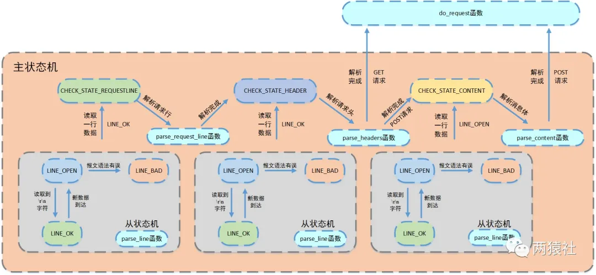
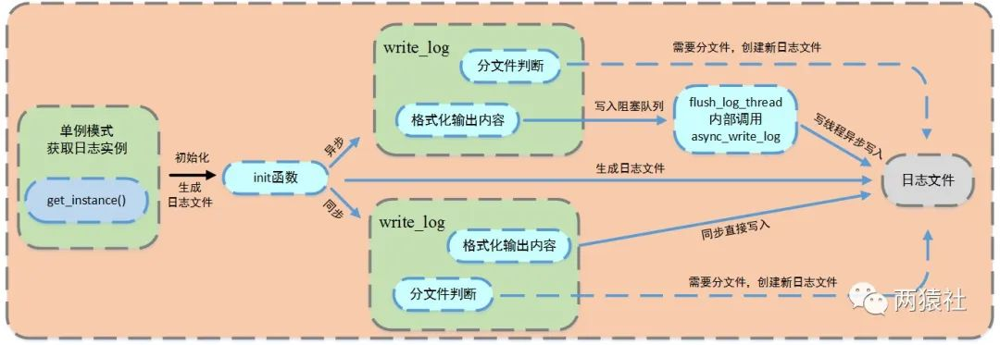

[(46条消息) C++ LinuxWebServer 2万7千字的面经长文（上）_项目与比赛经历-CSDN专栏](https://download.csdn.net/blog/column/10045005/129790945#11__1086)

# C++ LinuxWebServer 2万7千字的面经长文（上）


> ⭐️我叫忆_恒心，一名喜欢书写博客的在读研究生👨‍🎓。
> 如果觉得本文能帮到您，`麻烦点个赞`👍呗！

# 前言

`Linux Web Server`项目虽然是现在C++求职者的人手一个的项目，但是想要吃透这个项目，还是需要一定的基础的，以项目为导向，进行基础的学习。

涵盖了计算机网络(网络编程)常见的知识点和常见的操作系统知识。

参加过大大小小的**互联网厂和银行**的秋招和春招的笔试与面试，整理了的2万7千字的长文(😄都是干货，写作不易啊，分成了`上下两章`)，喜欢，觉得有帮助的，欢迎订阅专栏，后续有很多优质的文章进行更新，有任何疑问，欢迎留言！
参考资料放在

> 近期会不断在专栏里进行更新讲解博客~~~ 有什么问题的小伙伴 欢迎留言提问欧，喜欢的小伙伴给个三连支持一下呗。👍⭐️❤️
> `Qt5.9专栏`定期更新Qt的一些项目Demo
> `项目与比赛专栏`定期更新**比赛的一些心得**，**面试项目**常被问到的知识点。


### 2万7千字的面经长文（上）

- [前言](https://download.csdn.net/blog/column/10045005/129790945#_2)
- [一、基于Linux的轻量级服务器](https://download.csdn.net/blog/column/10045005/129790945#Linux_17)
- - [0 服务器的基本框架](https://download.csdn.net/blog/column/10045005/129790945#0__19)
  - - [项目的架构图](https://download.csdn.net/blog/column/10045005/129790945#_34)
    - [项目难点：](https://download.csdn.net/blog/column/10045005/129790945#_57)
  - [1、用户如何与你的Web服务器进行通信](https://download.csdn.net/blog/column/10045005/129790945#1Web_69)
  - [2、如何接收客户端发来的HTTP请求报文呢？](https://download.csdn.net/blog/column/10045005/129790945#2HTTP_79)
  - - [1 http连接请求处理](https://download.csdn.net/blog/column/10045005/129790945#1_http_93)
    - [:fire::fire:2 多路IO复用技术（Select、Poll与Epoll的区别）](https://download.csdn.net/blog/column/10045005/129790945#firefire2_IOSelectPollEpoll_103)
    - [3 ET、LT、EPOLLONESHOT](https://download.csdn.net/blog/column/10045005/129790945#3_ETLTEPOLLONESHOT_143)
    - [epoll 是如何实现的](https://download.csdn.net/blog/column/10045005/129790945#epoll__160)
    - [4 事件接收处理模式](https://download.csdn.net/blog/column/10045005/129790945#4___169)
    - [5 思考](https://download.csdn.net/blog/column/10045005/129790945#5__203)
    - - [1 主线程调用不同函数进行注册，两次注册是否没有必要，直接主线程循环读取然后封装放请求队列不就行了么？](https://download.csdn.net/blog/column/10045005/129790945#1__205)
      - [2 什么时候用ET，什么时候用LT？](https://download.csdn.net/blog/column/10045005/129790945#2_ETLT_228)
      - [3 怎么解决LT的缺点？](https://download.csdn.net/blog/column/10045005/129790945#3_LT_236)
      - [4 触发LT模式后，读一次还是循环读？](https://download.csdn.net/blog/column/10045005/129790945#4_LT_244)
      - [5 为什么ET模式下一定要设置非阻塞？](https://download.csdn.net/blog/column/10045005/129790945#5_ET_248)
      - [6 什么是零拷贝](https://download.csdn.net/blog/column/10045005/129790945#6___252)
    - [epoll 和 阻塞IO 还是非阻塞IO 搭配使用](https://download.csdn.net/blog/column/10045005/129790945#epoll__IO_IO__270)
    - [在读取数据的时候怎么知道读取完了呢](https://download.csdn.net/blog/column/10045005/129790945#_274)
  - [3. 如何处理HTTP请求报文的？](https://download.csdn.net/blog/column/10045005/129790945#3_HTTP_290)
  - - [3.1 线程池中的并发处理模式](https://download.csdn.net/blog/column/10045005/129790945#31__292)
    - [3.1 为什么使用线程池](https://download.csdn.net/blog/column/10045005/129790945#31__338)
    - [3.2 处理过程中，线程池线程的选择有哪几种方式](https://download.csdn.net/blog/column/10045005/129790945#32__342)
    - [3.3 线程池实现细节](https://download.csdn.net/blog/column/10045005/129790945#33__349)
    - [3.4 线程的同步机制有哪些？](https://download.csdn.net/blog/column/10045005/129790945#34__360)
    - [3.5 **线程池**具体做法](https://download.csdn.net/blog/column/10045005/129790945#35__375)
    - [3.6 介绍一下几种典型的锁？](https://download.csdn.net/blog/column/10045005/129790945#36__381)
    - - [读写锁](https://download.csdn.net/blog/column/10045005/129790945#_383)
      - [互斥锁](https://download.csdn.net/blog/column/10045005/129790945#_389)
      - [条件变量](https://download.csdn.net/blog/column/10045005/129790945#_395)
      - [自旋锁](https://download.csdn.net/blog/column/10045005/129790945#_401)
    - [3.7 线程数量的选择](https://download.csdn.net/blog/column/10045005/129790945#37__405)
    - [线程池中的工作线程是一直等待吗？](https://download.csdn.net/blog/column/10045005/129790945#_417)
    - [3.8 线程池工作线程处理完一个任务后的状态是什么？](https://download.csdn.net/blog/column/10045005/129790945#38__427)
    - [3.9 如果同时有1000个客户端进行访问请求，线程数不多，怎么能及时响应处理每一个呢？](https://download.csdn.net/blog/column/10045005/129790945#39_1000_437)
    - [3.10 如果一个客户请求需要占用线程很久的时间，会不会影响接下来的客户请求呢，有什么好的策略呢?](https://download.csdn.net/blog/column/10045005/129790945#310__445)
    - [3.11 **什么是虚假唤醒？**](https://download.csdn.net/blog/column/10045005/129790945#311__455)
    - [3.12 服务器支持HTTP长连接操作(细节点)](https://download.csdn.net/blog/column/10045005/129790945#312_HTTP_490)
  - [4 如何响应收到HTTP请求的报文](https://download.csdn.net/blog/column/10045005/129790945#4_HTTP_504)
  - - [http响应报文处理流程](https://download.csdn.net/blog/column/10045005/129790945#http_508)
    - [4.1 主从状态机的模式](https://download.csdn.net/blog/column/10045005/129790945#41__526)
    - [4.1.1 为什么要用状态机？](https://download.csdn.net/blog/column/10045005/129790945#411__528)
    - [4.1.2 有没有想过状态机会给项目带来哪些危害？](https://download.csdn.net/blog/column/10045005/129790945#412__532)
    - - [**主状态机**](https://download.csdn.net/blog/column/10045005/129790945#_540)
      - [**从状态机**](https://download.csdn.net/blog/column/10045005/129790945#_548)
    - [4.2 GET和POST的区别](https://download.csdn.net/blog/column/10045005/129790945#42_GETPOST_578)
    - [4.3 HTTP 状态码](https://download.csdn.net/blog/column/10045005/129790945#43_HTTP__585)
    - [4.4 你的项目http请求怎么做的？如何保证http请求完整解析](https://download.csdn.net/blog/column/10045005/129790945#44_httphttp_605)
  - [5. 数据库连接池是如何运行的](https://download.csdn.net/blog/column/10045005/129790945#5__633)
  - - [5.1 单个数据库连接是如何生成的](https://download.csdn.net/blog/column/10045005/129790945#51__641)
    - [5.2 连接池实现的细节](https://download.csdn.net/blog/column/10045005/129790945#52__654)
    - - [(1) 初始化](https://download.csdn.net/blog/column/10045005/129790945#1__662)
      - [(2) 获取与释放连接](https://download.csdn.net/blog/column/10045005/129790945#2__668)
      - [(3) 销毁连接](https://download.csdn.net/blog/column/10045005/129790945#3__672)
    - [5.3 大数据访问优化](https://download.csdn.net/blog/column/10045005/129790945#53__684)
  - [6 登录与注册](https://download.csdn.net/blog/column/10045005/129790945#6__692)
  - - [6.1 各页面请求跳转的流程](https://download.csdn.net/blog/column/10045005/129790945#61__725)
    - [6.2 载入数据库](https://download.csdn.net/blog/column/10045005/129790945#62__729)
    - [6.3 提取用户名和密码](https://download.csdn.net/blog/column/10045005/129790945#63__733)
    - [6.4 同步线程登录](https://download.csdn.net/blog/column/10045005/129790945#64__737)
    - [3.登录中的用户名和密码你是load到本地，然后使用map匹配的，如果有10亿数据，即使l0ad到本地后hash，也是很耗时的，你要怎么优化？](https://download.csdn.net/blog/column/10045005/129790945#3loadmap10l0adhash_747)
  - [7 服务器优化：定时器处理非活动链接](https://download.csdn.net/blog/column/10045005/129790945#7__757)
  - - [7.1 做法：](https://download.csdn.net/blog/column/10045005/129790945#71__767)
    - [7.2 模块设计](https://download.csdn.net/blog/column/10045005/129790945#72__773)
    - [7.3 信号通知机制](https://download.csdn.net/blog/column/10045005/129790945#73__777)
    - [7.4 定时器设计](https://download.csdn.net/blog/column/10045005/129790945#74__781)
    - [7.5 定时容器设计](https://download.csdn.net/blog/column/10045005/129790945#75__816)
  - [8. 服务器优化-日志系统](https://download.csdn.net/blog/column/10045005/129790945#8__830)
  - - [8.1 基础知识](https://download.csdn.net/blog/column/10045005/129790945#81__838)
    - [8.2 单例模式](https://download.csdn.net/blog/column/10045005/129790945#82__856)
    - [8.3 **`为什么要用双检测，只检测一次不行吗？`**](https://download.csdn.net/blog/column/10045005/129790945#83__866)
    - [8.4 **`为什么要把调用线程放入条件变量的请求队列后再解锁？`**](https://download.csdn.net/blog/column/10045005/129790945#84__876)
    - [8.5 **日志系统的运行机制**](https://download.csdn.net/blog/column/10045005/129790945#85__882)
    - [8.6 同步异步日志是怎么实现的？（CVTE）](https://download.csdn.net/blog/column/10045005/129790945#86_CVTE_922)
    - [8.7 日志的分级和分文件](https://download.csdn.net/blog/column/10045005/129790945#87__928)
  - [9. 压测](https://download.csdn.net/blog/column/10045005/129790945#9__941)
  - [10. 服务器的改进之处](https://download.csdn.net/blog/column/10045005/129790945#10__962)
  - [11. 其他问题](https://download.csdn.net/blog/column/10045005/129790945#11__998)
  - - [1.大文件传输问题](https://download.csdn.net/blog/column/10045005/129790945#1_1000)
    - [2.Linux 性能瓶颈检测工具](https://download.csdn.net/blog/column/10045005/129790945#2Linux__1026)
- [二、基础知识](https://download.csdn.net/blog/column/10045005/129790945#_1080)
- - [1 基本概念](https://download.csdn.net/blog/column/10045005/129790945#1__1082)
  - - [1.1 正确区分方式](https://download.csdn.net/blog/column/10045005/129790945#11__1086)
    - [1.2 同步和异步的概念](https://download.csdn.net/blog/column/10045005/129790945#12__1100)
    - [1.3 阻塞和非阻塞的概念](https://download.csdn.net/blog/column/10045005/129790945#13__1106)
  - [2 多路复用](https://download.csdn.net/blog/column/10045005/129790945#2__1138)
  - - [2.1 优点](https://download.csdn.net/blog/column/10045005/129790945#21__1162)
    - [2.2 缺点](https://download.csdn.net/blog/column/10045005/129790945#22__1169)
    - [2.3 select、poll、epoll的区别](https://download.csdn.net/blog/column/10045005/129790945#23_selectpollepoll_1199)
- [三、参考资料](https://download.csdn.net/blog/column/10045005/129790945#_1291)


# 一、基于Linux的轻量级服务器

## 0 服务器的基本框架


模块介绍：

| 模块         | 单个服务器程序             |
| :----------- | :------------------------- |
| I/O处理单元  | 处理客户连接，读写网络数据 |
| 逻辑单元     | 业务进程或线程             |
| 网络存储单元 | 本地数据库、文件或缓存     |
| 请求队列     | 各单元之间的通信方式       |

### 项目的架构图


[外链图片转存失败,源站可能有防盗链机制,建议将图片保存下来直接上传(img-HLqC1ma0-1679884509413)(null)]

- 项目框架主要分为I/O处理单元、逻辑处理单元和存储单元三个模块
  - I/O处理单元和逻辑处理单元对应**半同步/半反应堆线程池**
  - 逻辑处理单元和存储单元对应**数据库连接池和日志系统**
- **半同步/半反应堆线程池**将web端和服务器端建立通信
  - 实现http请求报文的处理与响应
  - 定时器完成非活动连接的处理
- **数据库连接池**避免频繁访问数据库，实现登录和校验功能
- **日志系统**实现同步和异步两种方式记录服务器运行状态

简单介绍一下web服务器

此项目是基于Linux的**轻量级多线程Web服务器**，应用层实现了一个简单的HTTP服务器，利用**多路IO复用**，可以同时监听多个请求，使用线程池处理请求，**使用模拟proactor模式，主线程负责监听**，监听有事件之后，从socket中循环读取数据，然后将读取到的数据封装成一个请求对象放入队列。睡眠在**请求队列上的工作线程被唤醒进行处理**，使用**状态机解析HTTP请求报文**，实现**同步/异步日志系统**，记录服务器运行状态，并**对系统进行了压力测试**。

### 项目难点：

1、如何提高服务器的并发能力

2、由于涉及到I/O操作，当单条日志比较大的时候，同步模式会阻塞整个处理流程

3、多线程并发的情况下，保证线程的同步。

## 1、用户如何与你的Web服务器进行通信

通常用户使用Web浏览器与相应服务器进行通信。

1. **解析域名**，找到主机 IP。
2. 浏览器利用 IP 直接与网站主机通信，**三次握手**，建立 TCP 连接。浏览器会以一个随机端口向服务端的 web 程序 80 端口发起 TCP 的连接。
3. 建立 TCP 连接后，浏览器向主机发起一个HTTP请求。
4. 服务器**响应请求**，返回响应数据。
5. 浏览器**解析响应内容，进行渲染**，呈现给用户。

## 2、如何接收客户端发来的HTTP请求报文呢？

事件驱动。

前言知识：

`epoll_create` 创建一个指示`epoll`内核事件表的文件描述符,内核除了帮我们在`epoll文件系统里`建了个红黑树用于存储以后`epoll_ctl`传来的fd外，还会再建立一个list链表，用于存储准备就绪的事件，当`epoll_wait`调用时，仅仅观察这个list链表里有没有数据即可。

`epoll_ctl`：该函数用于操作内核事件表监控的文件描述符上的事件：注册、修改、删除

`epoll_wait`：该函数用于等待所监控文件描述符上有事件的产生，返回就绪的文件描述符个数。

### 1 http连接请求处理

当浏览器端发出http连接请求，主线程**创建http类对象数组**用来接收请求并将所有数据读入各个对象对应buffer，然后将该对象插入任务队列；具体来说，通过内核事件表 如果是连接请求，那么就将他注册到内核事件表中（通过静态成员变量完成）。线程池中的工作线程从任务队列中取出一个任务进行处理（解析请求报文）。


Web服务器端通过`socket监听`来自用户的请求。

远端的很多用户会尝试去`connect()`这个Web Server正在`listen`的这个`port`，而监听到的这些连接会排队等待被`accept()`.由于用户连接请求是随机到达的异步时间，所以监听`socket(lisenfs)` lisen到的新的客户连接并且加入监听队列，当`accept`这个连接时候，会分配一个逻辑单元来处理这个用户请求。

### 🔥🔥2 多路IO复用技术（Select、Poll与Epoll的区别）

- 调用函数

  - select和poll都是一个函数，epoll是一组函数

- **文件描述符数量**

  - select通过**线性表**描述文件描述符集合，文件描述符有上限，一般是1024，但可以修改源码，重新编译内核，不推荐
  - poll是链表描述，突破了文件描述符上限，最大可以打开文件的数目
  - epoll通过红黑树描述，最大可以打开文件的数目，可以通过命令ulimit -n number修改，仅对当前终端有效

- 将文件描述符从用户传给内核

  - select和poll通过将所有文件描述符拷贝到内核态，每次调用都需要拷贝
  - epoll通过epoll_create建立一棵红黑树，通过epoll_ctl将要监听的文件描述符注册到红黑树上

- **内核判断就绪的文件描述符**

  - select 和 poll 每次调用都会对连接进行**线性遍历**，所以随着FD的增加会造成遍历速度慢的“线性下降性能问题”
  - epoll 因为epoll内核种实现是根据每个**fd上的callback函数来实现的**，只有活跃的socket才会主动调用callback,所以在活跃socket较少的情况下，使用epoll没有前面两者的线性下降的性能问题，但是所有socket都很活跃，可能有性能问题。

- **应用程序索引就绪文件描述符**

  - select/poll只返回发生了事件的文件描述符的个数，若知道是哪个发生了事件，同样需要遍历
  - epoll返回的发生了事件的个数和结构体数组，结构体包含socket的信息，因此直接处理返回的数组即可

- **工作模式**

  - select和poll都只能工作在相对低效的LT模式下
  - epoll则可以工作在ET高效模式，并且epoll还支持EPOLLONESHOT事件，该事件能进一步减少可读、可写和异常事件被触发的次数。

  > 一个socket连接在任一时刻都只被一个线程处理，可以使用 epoll 的 EPOLLONESHOT 事件实现。

- **应用场景**

  - 当所有的`fd`都是活跃连接，epoll需要建立文件系统，红黑树和链表对于此来说，效率反而不高，不如selece和poll
  - 当监测的fd数目较小，且各个fd都比较活跃，建议使用select或者poll
  - 当监测的fd数目非常大，成千上万，且单位时间只有其中的一部分fd处于就绪状态，这个时候使用epoll能够明显提升性能

### 3 ET、LT、EPOLLONESHOT

- LT水平触发模式
- - **epoll_wait**检测到文件描述符有事件发生，则将其通知给应用程序，应用程序可以不立即处理该事件。
  - 当下一次调用epoll_wait时，epoll_wait还会再次向应用程序报告此事件，直至被处理
- ET边缘触发模式
- - epoll_wait检测到文件描述符有事件发生，则将其通知给应用程序，应用程序必须立即处理该事件
  - 必须要一次性将数据读取完，使用非阻塞I/O，读取到出现`eagain`
- EPOLLONESHOT
- - 一个线程读取某个socket上的数据后开始处理数据，在处理过程中该socket上又有新数据可读，此时另一个线程被唤醒读取，此时出现两个线程处理同一个socket
  - 我们期望的是一个socket连接在任一时刻都只被一个线程处理，通过epoll_ctl对该文件描述符注册epolloneshot事件，一个线程处理socket时，其他线程将无法处理，**当该线程处理完后，需要通过epoll_ctl重置epolloneshot事件**

### epoll 是如何实现的

Linux epoll机制是通过红黑树和双向链表实现的。 首先通过epoll_create()系统调用在内核中创建一个eventpoll类型的句柄，其中包括红黑树根节点和双向链表头节点。然后通过epoll_ctl()系统调用，向epoll对象的红黑树结构中添加、删除、修改感兴趣的事件，返回0标识成功，返回-1表示失败。最后通过epoll_wait()系统调用判断双向链表是否为空，如果为空则阻塞。当文件描述符状态改变，fd上的回调函数被调用，该函数将fd加入到双向链表中，此时epoll_wait函数被唤醒，返回就绪好的事件。

### 4 事件接收处理模式

并发：在处理这个请求的同时，还需要继续监听其他客户的请求并分配其另一逻辑单元来处理。

- 通过epoll 这种I/O复用技术来实现对监听socket（`listenfd`）和连接socket（客户请求）的同时监听。

> 虽然I/O复用可以同时**监听多个文件描述符**，但是它本身是`阻塞`的，并且`多个文件描述符同时就绪`的时候，如果不采用额外措施，程序只能按照顺序 处理其中就绪的每个文件描述符。

因此可以通过多线程并发，用线程池来实现并发，为每个就绪的文件描述符分配一个逻辑单元(线程)来处理。

**服务器程序通常需要处理三类事件**：I/O事件、信号、定时事件

**有两种事件并发处理模式**

- `Reactor模式`：要求主线程（I/O处理单元）只负责监听文件描述符上是否有事件发生（可读、可写），若有，则立即通知工作线程（逻辑单元），将socket可读可写事件放入请求队列，交给工作线程处理。
- `Proactor模式`：将所有的I/O操作都交给主线程和内核来处理（进行读、写），工作线程仅负责处理逻辑，如主线程读完成后`users[sockfd].read()`，选择一个工作线程来处理客户请求`pool->append(users + sockfd)`

**模拟Proactor模式**

使用同步I/O方式模拟出Proactor模式的原理是：主线程执行数据读写操作，读写完成之后，主线程向工作线程通知这一“完成事件”。那么从工作线程的角度来看，它们就直接获得了数据读写的结果，接下来要做的只是对读写的结果进行逻辑处理。

通常使用同步I/O模型（如`epoll_wait`）实现Reactor，使用异步I/O（如`aio_read`和`aio_write`）实现Proactor。但在此项目中，我们使用的是**同步I/O模拟的Proactor**事件处理模式。

> 使用模拟`proactor`模式，主线程负责监听，监听有事件之后，从socket中循环读取数据，然后将读取到的数据封装成一个请求对象观察入队列

以epoll_wait为例子

> - 主线程往epoll内核事件表注册socket上的读就绪事件。
> - 主线程调用epoll_wait等待socket上有数据可读
> - 当socket上有数据可读，epoll_wait通知主线程,主线程从socket循环读取数据，直到没有更多数据可读，然后将读取到的数据封装成一个请求对象并插入请求队列。
> - 睡眠在请求队列上某个工作线程被唤醒，它获得请求对象并处理客户请求，然后往epoll内核事件表中注册该socket上的写就绪事件
> - 主线程调用epoll_wait等待socket可写。
> - 当socket上有数据可写，epoll_wait通知主线程。主线程往socket上写入服务器处理客户请求的结果。

### 5 思考

#### 1 主线程调用不同函数进行注册，两次注册是否没有必要，直接主线程循环读取然后封装放请求队列不就行了么？

不对，如果数据一直没来，直接进行循环读取就会持续在这里发生阻塞，这就是同步IO的特点，所以一定要注册一下然后等通知，这样就可以避免长期阻塞等候数据。同步：它主线程使用epoll向内核注册读事件。但是这里内核不会负责将数据从内核读到用户缓冲区，最后还是要靠主线程也就是用户程序read（）函数等负责将内核数据循环读到用户缓冲区。

Epoll对文件操作符的操作有两种模式: `LT`(电平触发)、`ET`(边缘触发)，二者的区别在于当你调用`epoll_wait`的时候内核里面发生了什么：

> sleep和wait的区别：
> 1、sleep是Thread的静态方法，wait是Object的方法，任何对象实例都能调用。
> 2、**sleep不会释放锁，它也不需要占用锁。wait会释放锁**，但调用它的前提是当前线程占有锁(即代码要在synchronized中)。当调用wait()方法的时候，线程会放弃对象锁，进入等待此对象的等待锁定池，只有针对此对象调用notify()方法后本线程才进入对象锁定池准备。
> 3、它们都可以被interrupted方法中断。

ET模式

缺点：应用层业务逻辑复杂，容易遗漏事件，很难用好。

优点：相对LT模式效率比较高。一触发立即处理事件。

LT模式：

优点：编程更符合用户直觉，业务层逻辑更简单。

缺点：效率比ET低。

#### 2 什么时候用ET，什么时候用LT？

LT适用于并发量小的情况，ET适用于并发量大的情况。

**为什么？**

ET在通知用户之后，就会将fd从就绪链表中删除，而LT不会，它会一直保留，这就会导致随着fd增多，就绪链表越大，每次都要从头开始遍历找到对应的fd，所以并发量越大效率越低。ET因为会删除所以效率比较高。

#### 3 怎么解决LT的缺点？

LT模式下，可写状态的fd会一直触发事件，该怎么处理这个问题

方法1：每次要写数据时，将fd绑定EPOLLOUT事件，写完后将fd同EPOLLOUT从epoll中移除。

方法2：方法一中每次写数据都要操作epoll。如果数据量很少，socket很容易将数据发送出去。可以考虑改成：数据量很少时直接send，数据量很多时在采用方法1.

#### 4 触发LT模式后，读一次还是循环读？

读一次。

#### 5 为什么ET模式下一定要设置非阻塞？

因为ET模式下是无限循环读，直到出现错误为EAGAIN或者EWOULDBLOCK，这两个错误表示socket为空，不用再读了，然后就停止循环了，如果是阻塞，循环读在socket为空的时候就会阻塞到那里，主线程的read（）函数一旦阻塞住，当再有其他监听事件过来就没办法读了，给其他事情造成了影响，所以必须要设置为非阻塞。

#### 6 什么是零拷贝

普通拷贝


零拷贝


**零拷贝（\*Zero-copy\*）技术，因为我们没有在内存层面去拷贝数据，也就是说全程没有通过 CPU 来搬运数据，所有的数据都是通过 DMA 来进行传输的。**。

零拷贝技术的文件传输方式相比传统文件传输的方式，减少了 2 次上下文切换和数据拷贝次数，**只需要 2 次上下文切换和数据拷贝次数，就可以完成文件的传输，而且 2 次的数据拷贝过程，都不需要通过 CPU，2 次都是由 DMA 来搬运。**

所以，总体来看，**零拷贝技术可以把文件传输的性能提高至少一倍以上**。

### epoll 和 阻塞IO 还是非阻塞IO 搭配使用

> http://t.zoukankan.com/lawliet12-p-13508057.html

### 在读取数据的时候怎么知道读取完了呢

> 非阻塞socket而言，EAGAIN不是一种错误。在VxWorks和Windows上，EAGAIN的名字叫做EWOULDBLOCK。

- LT水平触发模式
- - epoll_wait检测到文件描述符有事件发生，则将其通知给应用程序，应用程序可以不立即处理该事件。
  - 当下一次调用epoll_wait时，epoll_wait还会再次向应用程序报告此事件，直至被处理
- ET边缘触发模式
- - epoll_wait检测到文件描述符有事件发生，则将其通知给应用程序，应用程序必须立即处理该事件
  - **必须要一次性将数据读取完，使用非阻塞I/O，读取到出现eagain**

## 3. 如何处理HTTP请求报文的？

### 3.1 线程池中的并发处理模式

半异步：异步处理I/O事件，就是客户端向服务器端的请求的接收，是通过异步线程进行处理的，来请求触发处理，没有来的时候处理其他事情。

半同步：是指同步处理请求数据，异步线程接收完请求之后会封装一下插入队列，工作线程就依次同步从队列中取出请求对象进行处理。

半同步/半反应堆：它是半同步/半异步模式的变体，它核心在于，主线程充当异步线程，只负责监听客户端请求以及向内核注册读写事件，这和前面的rector（反应堆）事件处理模型类似，所以这样称呼。

并发编程方法的实现有多线程和多进程两种，但这里涉及的并发模式指I/O处理单元与逻辑单元的协同完成任务的方法。

- 半同步/半异步模式
- 领导者/追随者模式

并发模式中的同步和异步

> - 同步指的是程序完全按照代码序列的顺序执行
> - 异步指的是程序的执行需要由系统事件驱动

半同步/半异步模式工作流程

> - 同步线程用于处理客户逻辑
> - 异步线程用于处理I/O事件
> - 异步线程监听到客户请求后，就将其封装成请求对象并插入请求队列中
> - 请求队列将通知某个工作在**同步模式的工作线程**来读取并处理该请求对象

半同步/半反应堆工作流程（以Proactor模式为例）

> - **主线程充当异步线程**，负责监听所有socket上的事件
> - 若有新请求到来，**主线程接收之以得到新的连接socket，然后往epoll内核事件表中注册**该socket上的读写事件
> - 如果连接socket上**有读写事件发生**，主线程从socket上接收数据，并**将数据封装成请求对象插入到请求队列**中
> - 所有工作线程睡眠在请求队列上，当有任务到来时，通过竞争（如互斥锁）获得任务的接管权

该项目使用线程池（半同步半反应堆模式）并发处理用户请求，**主线程负责读写，工作线程（线程池中的线程）负责处理逻辑（HTTP请求报文的解析等等）**。

> 具体的，主线程为异步线程，负责监听文件描述符，接收socket新连接，若当前监听的socket发生了读写事件，然后将任务插入到请求队列。工作线程从请求队列中取出任务，完成读写数据的处理。

通过之前的代码，我们将`listenfd`上到达的`connection`通过 `accept()`接收，并返回一个新的socket文件描述符`connfd`用于和用户通信，并对用户请求返回响应，同时将这个`connfd`注册到内核事件表中，等用户发来请求报文。这个过程是：通过`epoll_wait`发现这个`connfd`上有可读事件了（`EPOLLIN`），主线程就将这个HTTP的请求报文读进这个连接socket的读缓存中`users[sockfd].read()`，然后将该任务对象（指针）插入线程池的请求队列中`pool->append(users + sockfd);`，线程池的实现还需要依靠**锁机制**以及**信号量**机制来实现线程同步，保证操作的原子性。

> 前提是保证所有客户请求都是无状态的，因为同一个连接上的不同请求可能会由不同的线程处理。

### 3.1 为什么使用线程池

当你需要**限制你应用程序中同时运行的线程数**时，线程池非常有用。因为启动**一个新线程会带来性能开销**，每个线程也会为其堆栈分配一些内存等。为了任务的并发执行，我们可以将这些任务传递到线程池，而不是为每个任务动态开启一个新的线程。

### 3.2 处理过程中，线程池线程的选择有哪几种方式

主线程选择哪个子线程来为新任务服务方式：

1. 随机算法和轮流选取算法。
2. 主进程和所有地子进程通过一个共享的工作队列(list 单链表)来同步，子进程都睡眠在该工作队列上。

### 3.3 线程池实现细节

- 所谓线程池，就是一个`pthread_t`类型的普通数组，通过`pthread_create()`函数创建`m_thread_number`个**线程**，用来执行`worker()`函数以执行每个请求处理函数（HTTP请求的`process`函数），通过`pthread_detach()`将线程设置成脱离态（detached）后，当这一线程运行结束时，它的资源会被系统自动回收，而不再需要在其它线程中对其进行 `pthread_join()` 操作。 消息队列的大小由机器硬件来决定，本实验环境选取`max_request = 10000`

两种高效的并发模式：并发其实适合于**``I/O`密集型**而不适合于计算密集型，比如经常读写文件，访问数据库等，由于I/O操作的速度远没有CPU计算速度快，所以让程序阻塞于I/O操作将浪费大量的CPU时间。

- 操作工作队列一定**要加锁**（`locker`），因为它被所有线程共享(与最大请求数做个判断，允许)。
- 我们用**信号量来标识请求队列中的请求数**，通过`m_queuestat.wait();`来等待一个请求队列中待处理的HTTP请求，然后交给线程池中的空闲线程来处理。

> 设置成脱离态的目的：为了在使用线程的时候，避免线程的资源得不到正确的释放，从而导致了内存泄漏的问题。所以要确保进程为可分离的的状态，否则要进行线程等待已回收他的资源。

### 3.4 线程的同步机制有哪些？

临界区，互斥对象，信号量，事件对象(条件变量的应用)。

其中**临界区和互斥对象**用于互斥控制；**信号量和事件对象**主要用于同步控制。

> 事件对象：通过通知操作的方式来保持线程的同步，还可以实现对多个线程的优先级比较的操作。

- POSIX信号量：可用于进程同步，也可用于线程同步。
- POSIX互斥锁 + 条件变量：只能用于线程同步。

> ps: 信号量、共享内存，以及消息队列等System V IPC三剑客主要关注进程间通信；
>
> 而条件变量、互斥锁，主要关注线程间通信。

### 3.5 **线程池**具体做法

通过epoll_wait 发现这个connfd上有可读事件了(EPOLLIN),主线程就将这个HTTP请求报文读进这个连接socket的读缓存中users.[sockfd].read(),讲后将任务对象(指针)插入线程池的请求队列中pool->append(users + sockfd);

> 线程池的实现还需要依靠锁机制以及信号量机制来实现线程同步，保证操作的原子性

### 3.6 介绍一下几种典型的锁？

#### 读写锁

- 多个读者可以同时进行读
- 写者必须互斥（只允许一个写者写，也不能读者写者同时进行）
- 写者优先于读者（一旦有写者，则后续读者必须等待，唤醒时优先考虑写者）

#### 互斥锁

一次只能一个线程拥有互斥锁，其他线程只有等待

互斥锁是在抢锁失败的情况下主动放弃CPU进入睡眠状态直到锁的状态改变时再唤醒，而操作系统负责线程调度，为了实现锁的状态发生改变时唤醒阻塞的线程或者进程，需要把锁交给操作系统管理，所以互斥锁在加锁操作时涉及上下文的切换。互斥锁实际的效率还是可以让人接受的，加锁的时间大概100ns左右，而实际上互斥锁的一种可能的实现是先自旋一段时间，当自旋的时间超过阀值之后再将线程投入睡眠中，因此在并发运算中使用互斥锁（每次占用锁的时间很短）的效果可能不亚于使用自旋锁

#### 条件变量

互斥锁一个明显的缺点是他只有两种状态：锁定和非锁定。而条件变量通过允许线程阻塞和等待另一个线程发送信号的方法弥补了互斥锁的不足，他常和互斥锁一起使用，以免出现竞态条件。当条件不满足时，线程往往解开相应的互斥锁并阻塞线程然后等待条件发生变化。一旦其他的某个线程改变了条件变量，他将通知相应的条件变量唤醒一个或多个正被此条件变量阻塞的线程。总的来说**互斥锁是线程间互斥的机制，条件变量则是同步机制。**

> 图解操作系统里面 妈妈叫孩子吃饭的例子

#### 自旋锁

如果进线程无法取得锁，进线程不会立刻放弃CPU时间片，而是一直循环尝试获取锁，直到获取为止。如果别的线程长时期占有锁，那么自旋就是在浪费CPU做无用功，但是自旋锁一般应用于加锁时间很短的场景，这个时候效率比较高。

### 3.7 线程数量的选择

最佳线程数 = CPU当前可使用的Cores数 * 当前CPU的利用率 * (1 + CPU等待时间 / CPU处理时间)

线程池中线程的数量如何确定：

> 针对不同的任务性质而言：CPU密集型任务应配置尽可能小的线程，如配置CPU个数+1的线程数，IO密集型任务应配置尽可能多的线程，因为IO操作不占用CPU，不要让CPU闲下来，应加大线程数量，如配置两倍CPU个数+1，而对于混合型的任务，如果可以拆分，拆分成IO密集型和CPU密集型分别处理，前提是两者运行的时间是差不多的，如果处理时间相差很大，则没必要拆分了。
>
> 任务对其他系统资源有依赖：如某个任务依赖数据库的连接返回的结果，这时候等待的时间越长，则CPU空闲的时间越长，那么线程数量应设置得越大，才能更好的利用CPU。

### 线程池中的工作线程是一直等待吗？

线程池中的工作线程是处于一直阻塞等待的模式下的。在run函数中，我们为了能够处理高并发的问题，将线程池中的工作线程都设置为阻塞等待在请求队列是否不为空的条件上，因此项目中线程池中的工作线程是处于一直阻塞等待的模式下的。

补：

五态之间的转换


### 3.8 线程池工作线程处理完一个任务后的状态是什么？

这里要分**两种**情况考虑

（1） 当处理完任务后如果请求队列为空时，则这个线程重新回到阻塞等待的状态

（2） 当处理完任务后如果请求队列不为空时，那么这个线程将处于与其他线程竞争资源的状态，谁获得锁谁就获得了处理事件的资格。

### 3.9 如果同时有1000个客户端进行访问请求，线程数不多，怎么能及时响应处理每一个呢？

本项目是通过对子线程循环调用来解决高并发的问题的。

首先在创建线程的同时就调用了`pthread_detach`将线程进行**分离**，不用单独对工作线程进行回收，资源自动回收。

我们通过子线程的run调用函数进行while循环，让每一个线程池中的线程**永远都不会停终止**，访问请求被封装到请求队列(`list`)中，如果没有任务线程就**一直阻塞等待**，有任务线程就抢占式进行处理，直到**请求队列为空**，表示任务全部处理完成。

### 3.10 如果一个客户请求需要占用线程很久的时间，会不会影响接下来的客户请求呢，有什么好的策略呢?

会影响接下来的客户请求，因为线程池内线程的数量时有限的，如果客户请求占用线程时间过久的话会影响到处理请求的效率，当请求处理过慢时会造成后续接受的请求只能在请求队列中等待被处理，从而影响接下来的客户请求。

**应对策略：**

我们可以为线程处理请求对象设置处理超时时间, 超过时间先发送信号告知线程处理超时，然后设定一个时间间隔再次检测，若此时这个请求还占用线程则直接将其断开连接。

### 3.11 **什么是虚假唤醒？**

举个例子，我们现在有一个生产者-消费者队列和三个线程。

**1）** 1号线程从队列中获取了一个元素，此时队列变为空。

**2）** 2号线程也想从队列中获取一个元素，但此时队列为空，2号线程便只能进入阻塞(cond.wait())，等待队列非空。

**3）** 这时，3号线程将一个元素入队，并调用cond.notify()唤醒条件变量。

**4）** 处于等待状态的2号线程接收到3号线程的唤醒信号，便准备解除阻塞状态，执行接下来的任务(获取队列中的元素)。

**5）** 然而可能出现这样的情况：当2号线程准备获得队列的锁，去获取队列中的元素时，此时1号线程刚好执行完之前的元素操作，返回再去请求队列中的元素，1号线程便获得队列的锁，检查到队列非空，就获取到了3号线程刚刚入队的元素，然后释放队列锁。

**6）** 等到2号线程获得队列锁，判断发现队列仍为空，1号线程“偷走了”这个元素，所以对于2号线程而言，这次唤醒就是“虚假”的，它需要再次等待队列非空。

这一问题：

在wait成功之后，资源就一定可以被使用么？答案是否定的，如果同时有两个或者两个以上的线程正在等待此资源，wait返回后，资源可能已经被使用了。

> 再具体点，有可能多个线程都在等待这个资源可用的信号，信号发出后只有一个资源可用，但是有A，B两个线程都在等待，B比较速度快，获得互斥锁，然后加锁，消耗资源，然后解锁，之后A获得互斥锁，但A回去发现资源已经被使用了，它便有两个选择，一个是去访问不存在的资源，另一个就是继续等待，那么继续等待下去的条件就是使用while，要不然使用if的话pthread_cond_wait返回后，就会顺序执行下去。
>
> 所以，在这种情况下，应该使用while而不是if:

```
while(resource == FALSE)
	pthread_cond_wait(&cond, &mutex);
```

不做处理可能会报错

### 3.12 服务器支持HTTP长连接操作(细节点)

通过解析http请求头中的信息，通过connection字段判断是否为长连接状态，如果是长连接，标记m_linger为true,在后续传输字节为0时，重新初始化http连接，不进行释放。

> - CHECK_STATE_HEADER
> - - 调用parse_headers函数解析请求头部信息
>   - 判断是空行还是请求头，若是空行，进而判断content-length是否为0，如果不是0，表明是POST请求，则状态转移到CHECK_STATE_CONTENT，否则说明是GET请求，则报文解析结束。
>   - 若解析的是请求头部字段，则主要分析connection字段，content-length字段，其他字段可以直接跳过，各位也可以根据需求继续分析。
>   - connection字段判断是keep-alive还是close，决定是长连接还是短连接
>   - content-length字段，这里用于读取post请求的消息体长度

## 4 如何响应收到HTTP请求的报文


### http响应报文处理流程

当上述报文解析完成后，服务器子线程调用process_write完成响应报文，响应报文包括

1.状态行：http/1.1 状态码 状态消息；

2.消息报头，内部调用add_content_length和add_linger函数

l content-length记录响应报文长度，用于浏览器端判断服务器是否发送完数据

l connection记录连接状态，用于告诉浏览器端保持长连接

3.空行

1. 响应正文

随后注册epollout事件。服务器主线程检测写事件，并调用http_conn::write函数将响应报文发送给浏览器端。至此整个http请求和响应全部完成。

### 4.1 主从状态机的模式

### 4.1.1 为什么要用状态机？

传统的控制流程都是按照顺序执行的，状态机能处理任意顺序的事件，并能提供有意义的响应—即使这些时间发生的顺序和预计的不同。

### 4.1.2 有没有想过状态机会给项目带来哪些危害？

缺点：状态机的缺点就是性能比较低，一般一个状态做一个事情，性能比较差，在追求高性能的场景下一般不用，高性能场景一般使用流水线设计。

项目中使用**主从状态机**的模式进行解析，从状态机（`parse_line`）负责读取报文的一行，主状态机负责对该行数据进行解析，主状态机内部调用从状态机，从状态机驱动主状态机。每解析一部分都会将整个请求的`m_check_state`状态改变，状态机也就是根据这个状态来进行不同部分的解析跳转的：



#### **主状态机**

三种状态，标识解析位置。

- CHECK_STATE_REQUESTLINE，解析请求行
- CHECK_STATE_HEADER，解析请求头
- CHECK_STATE_CONTENT，解析消息体，仅用于解析POST请求

#### **从状态机**

三种状态，标识解析一行的读取状态。

- LINE_OK，完整读取一行
- LINE_BAD，报文语法有误
- LINE_OPEN，读取的行不完整

```
void http_conn::process() {
    HTTP_CODE read_ret = process_read();
    if(read_ret == NO_REQUEST) {
        modfd(m_epollfd, m_sockfd, EPOLLIN);
        return;
    }
    bool write_ret = process_write(read_ret);
    if(!write_ret)
        close_conn();
    modfd(m_epollfd, m_sockfd, EPOLLOUT);
}
```

HTTP请求报文：请求行（request line）、请求头部（header）、空行和请求数据

响应报文:状态行、消息报头、空行和响应正文。

### 4.2 GET和POST的区别

- 最直观的区别就是GET把参数包含在URL中，POST通过request body传递参数。
- GET请求参数会被完整保留在浏览器历史记录里，而POST中的参数不会被保留。
- GET请求在URL中传送的参数是有长度限制。（大多数）浏览器通常都会限制url长度在2K个字节，而（大多数）服务器最多处理64K大小的url。
- GET产生一个TCP数据包；POST产生两个TCP数据包。对于GET方式的请求，浏览器会把http header和data一并发送出去，服务器响应200（返回数据）；而对于POST，浏览器先发送header，服务器响应100（指示信息—表示请求已接收，继续处理）continue，浏览器再发送data，服务器响应200 ok（返回数据）。

### 4.3 HTTP 状态码

- 1xx：指示信息–表示请求已接收，继续处理。
- 2xx：成功–表示请求正常处理完毕。
- - 200 OK：客户端请求被正常处理。
  - 206 Partial content：客户端进行了范围请求。
- 3xx：重定向–要完成请求必须进行更进一步的操作。
- - 301 Moved Permanently：永久重定向，该资源已被永久移动到新位置，将来任何对该资源的访问都要使用本响应返回的若干个URI之一。
  - 302 Found：临时重定向，请求的资源现在临时从不同的URI中获得。
- 4xx：客户端错误–请求有语法错误，服务器无法处理请求。
- - 400 Bad Request：请求报文存在语法错误。
  - 403 Forbidden：请求被服务器拒绝。
  - 404 Not Found：请求不存在，服务器上找不到请求的资源。
- 5xx：服务器端错误–服务器处理请求出错。
- - 500 Internal Server Error：服务器在执行请求时出现错误。

### 4.4 你的项目http请求怎么做的？如何保证http请求完整解析

该项目使用线程池（半同步半反应堆模式）并发处理用户请求，主线程负责读写，工作线程（线程池中的线程）负责处理逻辑（HTTP请求报文的解析等等）

在HTTP报文中，每一行的数据由\r\n作为结束字符，空行则是仅仅是字符\r\n。因此，可以通过查找\r\n将报文拆解成单独的行进行解析，项目中便是利用了这一点。

主从状态机可以保证完整解析。

具体来说：

> - (存储读取的请求报文数据)判断当前字节是否为\r
> - - 接下来的字符是\n，将\r\n修改成\0\0，将m_checked_idx指向下一行的开头，则返回LINE_OK
>   - 接下来达到了buffer末尾，表示buffer还需要继续接收，返回LINE_OPEN
>   - 否则，表示语法错误，返回LINE_BAD
> - 当前字节不是\r，判断是否是\n（**一般是上次读取到\r就到了buffer末尾，没有接收完整，再次接收时会出现这种情况**）
> - - 如果前一个字符是\r，则将\r\n修改成\0\0，将m_checked_idx指向下一行的开头，则返回LINE_OK
> - 当前字节既不是\r，也不是\n
> - - 表示接收不完整，需要继续接收，返回LINE_OPEN

如何响应


## 5. 数据库连接池是如何运行的

在处理用户注册，登录请求的时候，我们需要将这些用户的用户名和密码保存下载用于新用户的注册以及老用户的登录校验

若每次用户请求我们都需要新建一个数据库连接，请求结束后我们释放该数据库连接，当**`用户连接`**过多时，这种做法过于低效，所以类似**线程池**的做法，我们构建一个数据库连接池，预先生成一些数据库连接放在那里供用户请求使用。

作线程从数据库连接池取得一个连接，访问数据库中的数据，访问完毕后将连接交还连接池。

### 5.1 单个数据库连接是如何生成的

```
使用mysql_init()初始化连接
使用mysql_real_connect()建立一个到mysql数据库的连接
使用mysql_query()执行查询语句
使用result = mysql_store_result(mysql)获取结果集
使用mysql_num_fields(result)获取查询的列数，mysql_num_rows(result)获取结果集的行数
通过mysql_fetch_row(result)不断获取下一行，然后循环输出
使用mysql_free_result(result)释放结果集所占内存
使用mysql_close(conn)关闭连接
```

### 5.2 连接池实现的细节

对于一个数据库连接池来讲，就是预先生成多个这样的数据库连接，**然后放在一个链表中**，同时维护最大连接数`MAX_CONN`，当前可用连接数`FREE_CONN`和当前已用连接数`CUR_CONN`这三个变量。同样注意在对连接池操作时（获取，释放），要用到锁机制，因为它被所有线程共享。

**连接池的实现：**

初始化，获取连接、释放连接，销毁连接池。

#### (1) 初始化

将数据库连接的获取与释放通过RAII机制封装，避免手动释放。

使用信号量实现多线程争夺连接的同步机制，这里将信号量初始化为数据库的连接总数。(实验中设置的数量量为8，在main.c 中设计)

#### (2) 获取与释放连接

当线程数量大于数据库连接数量时，使用信号量进行同步，每次取出连接，信号量原子减1，释放连接原子加1，若连接池内没有连接了，则阻塞等待。另外，由于多线程操作连接池，会造成竞争，这里使用互斥锁完成同步。

#### (3) 销毁连接

销毁的时候没有直接被外部调用，而是通过RAII机制来完成自动释放；

通过迭代器遍历连接池链表，关闭对应数据库连接，清空链表并重置空闲连接和现有连接数量。

> RAII机制
>
> - RAII全称是“Resource Acquisition is Initialization”，直译过来是“资源获取即初始化”.
> - RAII的核心思想是将资源或者状态与对象的生命周期绑定，通过C++的语言机制，实现资源和状态的安全管理,智能指针是RAII最好的例子
> - 具体来说：构造函数的时候初始化获取资源，析构函数释放资源

### 5.3 大数据访问优化

登录中的用户名和密码你是load到本地，然后使用map匹配的，如果有10亿数据，即使load到本地后hash，也是很耗时的，你要怎么优化？

> 数据查询的优化：保证在实现功能的基础上，**尽量减少对数据库的访问次数**；通过搜索参数，尽量减少对表的访问行数,最小化结果集，从而减轻网络负担；能够分开的操作尽量分开处理，提高每次的响应速度；在数据窗口使用SQL时，尽量把使用的索引放在选择的首列；算法的结构尽量简单；

## 6 登录与注册

使用数据库连接池实现服务器访问数据库的功能，使用`POST`请求完成注册和登录的校验工作。

分为两

首先载入数据库表

**载入数据库表：**

将数据库总的用户名和密码载入到服务器的map中来，map中的key为用户名，value为密码。

**提取用户名和密码**

提取用户名和密码，服务器端解析浏览器的请求报文，当解析为POST请求时，`CGI`标志位设置为1，并将请求报文的消息体赋值给m_string，进而提取出用户名和密码。

**同步线程登录和注册**

通过m_url定位/所在位置，根据/后的第一个字符判断是登录还是注册校验。

- 2 — 登录校验
- 3 — 注册校验

**页面跳转**

通过m_url定位/所在位置，根据/后的第一个字符，使用分支语句实现页面跳转。具体的，

- 0 — 跳转注册页面，GET
- 1 — 跳转登录页面，GET
- 5 — 显示图片页面，POST
- 6 — 显示视频页面，POST
- 7 — 显示关注页面，POST

### 6.1 各页面请求跳转的流程


### 6.2 载入数据库

将数据库中的用户名和密码载入到服务器的map中来，map中的key为用户名，value为密码。

### 6.3 提取用户名和密码

服务器端解析浏览器的请求报文，当解析为POST请求时，cgi标志位设置为1，并将请求报文的消息体赋值给m_string，进而提取出用户名和密码。

### 6.4 同步线程登录

通过m_url定位/所在的位置，判断是登录还是注册校验

2 登录校验

3 注册校验

对数据库的操作需要通过锁来同步。

### 3.登录中的用户名和密码你是load到本地，然后使用map匹配的，如果有10亿数据，即使l0ad到本地后hash，也是很耗时的，你要怎么优化？

1.数据结构的优化：为了保证数据库的一致性和完整性，在逻辑设计的时候往往会设计过多的表间关联，尽可能的降低数据的冗余。

2.数据查询的优化：保证在实现功能的基础上，尽量减少对数据库的访问次数；通过搜索参数，尽量减少对表的访问行数,最小化结果集，从而减轻网络负担；能够分开的操作尽量分开处理，提高每次的响应速度；在数据窗口使用SQL时，尽量把使用的索引放在选择的首列；算法的结构尽量简单；

3.对算法那的优化：尽量避免使用游标，因为游标的效率较差，如果游标操作的数据超过1万行，那么就应该考虑改写。.使用基于游标的方法或临时表方法之前，应先寻找基于集的解决方案来解决问题，基于集的方法通常更有效。

4.建立高效的索引：

## 7 服务器优化：定时器处理非活动链接

具体的，利用`alarm`函数周期性地触发`SIGALRM`信号，**信号处理函数利用管道通知主循环**，主循环接收到该信号后对升序链表上所有定时器进行处理，若该段时间内没有交换数据，则将该连接关闭，释放所占用的资源。

目的：如果某一用户`connect()`到服务器之后，长时间不交换数据，一直占用服务器端的文件描述符，导致连接资源的浪费。这时候就应该利用定时器把这些超时的非活动连接释放掉，关闭其占用的文件描述符。

### 7.1 做法：

本项目中，服务器主循环为每一个连接创建一个定时器，并对每个连接进行定时。另外，利用升序时间链表容器将所有定时器串联起来，若主循环接收到定时通知，则在链表中依次执行定时任务。

用`alarm`函数周期性地触发`SIGALRM`信号，信号处理函数利用**管道通知主循环**，主循环接收到该信号后对升序链表上所有定时器进行处理，若该段时间内没有交换数据，则将该连接关闭，释放所占用的资源。

### 7.2 模块设计

主要分为两部分，其一为定时方法与信号通知流程，其二为定时器及容器设计与定时任务的处理

### 7.3 信号通知机制

信号处理函数仅仅发送信号通知程序主循环，将信号对应的处理逻辑放在程序主循环中，由主循环执行信号对应的逻辑代码。

### 7.4 定时器设计

是指利用结构体或其他形式，**将多种定时事件进行封装起来**。

项目中将连接资源、定时事件和超时时间封装为定时器类，具体的，

- 连接资源包括客户端套接字地址、文件描述符和定时器
- 定时事件为回调函数，将其封装起来由用户自定义，这里是删除非活动socket上的注册事件，并关闭
- 定时器超时时间 = 浏览器和服务器连接时刻 + 固定时间(TIMESLOT)，可以看出，定时器使用绝对时间作为超时值，这里alarm设置为5秒，连接超时为15秒。

```
class util_timer;
struct client_data
{
    sockaddr_in address;
    int sockfd;
    util_timer *timer;
};

class util_timer
{
public:
    util_timer() : prev(NULL), next(NULL) {}

public:
    time_t expire;
    void (*cb_func)(client_data *);
    client_data *user_data;
    util_timer *prev;
    util_timer *next;
};
```

### 7.5 定时容器设计

项目中的定时器容器为带头尾结点的升序双向链表，具体的为每个连接创建一个定时器，将其添加到链表中，并按照超时时间升序排列。执行定时任务时，将到期的定时器从链表中删除。

从实现上看，主要涉及双向链表的插入，删除操作，其中添加定时器的事件复杂度是O(n),删除定时器的事件复杂度是O(1)。

**为什么管道写端要非阻塞？**

send是将信息发送给**套接字缓冲区**，如果缓冲区满了，则会阻塞，这时候会进一步增加信号处理函数的执行时间，为此，将其修改为非阻塞。

## 8. 服务器优化-日志系统

参考：

- [最新版Web服务器项目详解 - 09 日志系统（上）](https://mp.weixin.qq.com/s/IWAlPzVDkR2ZRI5iirEfCg)
- [最新版Web服务器项目详解 - 10 日志系统（下）](https://mp.weixin.qq.com/s/f-ujwFyCe1LZa3EB561ehA)
- [muduo第五章：高效的多线程日志](https://github.com/chenshuo/muduo)

### 8.1 基础知识

`日志`，由服务器自动创建，并记录运行状态，错误信息，访问数据的文件。

**`同步日志`**，日志写入函数与工作线程串行执行，由于涉及到I/O操作，当单条日志比较大的时候，同步模式会阻塞整个处理流程，服务器所能处理的并发能力将有所下降，尤其是在峰值的时候，写日志可能成为系统的瓶颈。

**`生产者-消费者模型`**，并发编程中的经典模型。以多线程为例，为了实现线程间数据同步，生产者线程与消费者线程共享一个缓冲区，其中**生产者**线程往**缓冲区**中push消息，**消费者**线程从缓冲区中pop消息。

任何时刻，**只能有一个**生产者或消费者可以访问缓冲区

**`阻塞队列`**，将生产者-消费者模型进行封装，使用循环数组实现队列，作为两者共享的缓冲区。

push成员是生产者，pop成员是消费者。

**`异步日志`**，将所写的日志内容先存入阻塞队列，写线程从阻塞队列中取出内容，写入日志。

**`单例模式`**，最简单也是被问到最多的设计模式之一，保证一个类只创建一个实例，同时提供全局访问的方法

### 8.2 单例模式

保证一个类仅有一个实例，并提供一个访问它的全局访问点，该实例被所有程序模块共享。

> 单例模式有两种实现方法，分别是懒汉和饿汉模式。顾名思义，懒汉模式，即非常懒，不用的时候不去初始化，所以在第一次被使用时才进行初始化；饿汉模式，即迫不及待，在程序运行时立即初始化。

实现思路：私有化它的构造函数，以防止外界创建单例类的对象；使用类的私有静态指针变量指向类的唯一实例，并用一个公有的静态方法获取该实例.


### 8.3 **`为什么要用双检测，只检测一次不行吗？`**

如果只检测一次，在每次调用获取实例的方法时，都需要加锁，这将严重影响程序性能。双层检测可以有效避免这种情况，仅在第一次创建单例的时候加锁，其他时候都不再符合NULL == p的情况，直接返回已创建好的实例。

**局部静态变量之线程安全懒汉模式**

前面的双检测锁模式，写起来不太优雅，《Effective C++》（Item 04）中的提出另一种更优雅的单例模式实现，使用函数内的局部静态对象，这种方法不用加锁和解锁操作。


### 8.4 **`为什么要把调用线程放入条件变量的请求队列后再解锁？`**

线程是并发执行的，如果在把调用线程A放在等待队列之前，就释放了互斥锁，这就意味着其他线程比如线程B可以获得互斥锁去访问公有资源，这时候线程A所等待的条件改变了，但是它没有被放在等待队列上，导致A忽略了等待条件被满足的信号。

倘若在线程A调用pthread_cond_wait开始，到把A放在等待队列的过程中，都持有互斥锁，其他线程无法得到互斥锁，就不能改变公有资源。

### 8.5 **日志系统的运行机制**

步骤：

1：单例模式（局部静态变量懒汉方法）获取实例

**2：主程序一开始Log::get_instance()->init()初始化实例。初始化后：服务器启动按当前时刻创建日志（\**前缀为时间，后缀为自定义log文件名，并记录创建日志的时间day和行数count）\**。如果是异步**(通过是否设置队列大小判断是否异步，0为同步)**，工作线程将要写的内容放进阻塞队列，还创建了写线程用于在阻塞队列里取出一个内容(指针)，写入日志。**

3：其他功能模块调用write_log()函数写日志。（write_log：实现日志分级、分文件、按天分类，超行分类的格式化输出内容。）里面会根据异步、同步实现不同的写方式。

- 日志文件
  - 局部变量的懒汉模式获取实例
  - 生成日志文件，并判断同步和异步写入方式
- 同步
  - 判断是否分文件
  - 直接格式化输出内容，将信息写入日志文件
- 异步
  - 判断是否分文件(通过队列的大小来决定）
  - 格式化输出内容，将内容写入阻塞队列，创建一个写线程，从阻塞队列取出内容写入日志文件



同步和异步日志的处理代码

```
    // 若异步,则将日志信息加入阻塞队列,同步则加锁向文件中写
    if (m_is_async && !m_log_queue->full())
    {
        m_log_queue->push(log_str);
    }
    else
    {
        m_mutex.lock();
        fputs(log_str.c_str(), m_fp);
        m_mutex.unlock();
    }
```

### 8.6 同步异步日志是怎么实现的？（CVTE）

在C++编写服务器的时候，涉及到Io操作的时候，会阻塞整个线程，同步日志可能比较简单，但是异步日志的话就需要注意一下，我们将所写的内容存入阻塞队列，创建写线程从阻塞队列中读取出内容，写入日志。

将消费者和生产者模式封装成阻塞队列。

### 8.7 日志的分级和分文件

- Debug，调试代码时的输出，在系统实际运行时，一般不使用。
- Warn，这种警告与调试时终端的warning类似，同样是调试代码时使用。
- Info，报告系统当前的状态，当前执行的流程或接收的信息等。
- Erro，输出系统的错误信息

超行、按天分文件逻辑，具体的，

- 日志写入前会判断当前day是否为创建日志的时间，行数是否超过最大行限制
- - 若为创建日志时间，写入日志，否则按当前时间创建新log，更新创建时间和行数
  - 若行数超过最大行限制，在当前日志的末尾加count/max_lines为后缀创建新log

## 9. 压测

**Webbench是什么，介绍一下原理**
父进程fork若干个子进程，每个子进程在用户要求时间或默认的时间内对目标web循环发出实际访问请求，父子进程通过管道进行通信，子进程通过管道写端向父进程传递在若干次请求访问完毕后记录到的总信息，父进程通过管道读端读取子进程发来的相关信息，子进程在时间到后结束，父进程在所有子进程退出后统计并给用户显示最后的测试结果，然后退出。


压力测试的参数：

```
webbench -c 10500 -t 5 http://127.0.0.1 
```

客户端数量10500， 运行测试的时间。

```
webbench -c 1000 -t 60 http://192.168.80.157/phpinfo.php
每秒钟响应请求数：24525 pages/min，每秒钟传输数据量20794612 bytes/sec.
并发1000运行60秒后产生的TCP连接数12000多个,已经显示有87个连接failed了，说明超负荷了。
```

## 10. 服务器的改进之处

定时器建立在双向链表上的

| 位置         | 添加 | 删除 |
| :----------- | :--- | :--- |
| 刚好在头节点 | O(1) | O(1) |
| 刚好在尾节点 | O(n) | O(1) |
| 平均         | O(n) | O(1) |

**Notes**

添加在为节点时间复杂度为O(n)，因为项目的逻辑是先从头遍历新定时器在链表的位置，如果位置恰好在最后，则插入的时间复杂度O(N)

a.在双向链表的基础上优化：

添加在尾节点的时间复杂度可以优化：在添加新的定时器的时候，**除了检测新定时器是否在小于头节点定时器的时间外，再先检测新定时器是否在大于尾节点定时器的时间，都不符合再使用常规插入。**

b.不使用双向链表，使用最小堆结构可以进行优化。

**最小堆优化？说一下时间复杂度和工作原理**

时间复杂度：

添加：O(lgn)

删除：O(1)

工作原理：

将所有定时器中超时时间最小的一个定时器的超时值作为alarm函数的定时值。这样，一旦定时任务处理函数tick()被调用，超时时间最小的定时器必然到期，我们就可以在tick 函数中处理该定时器。然后，再次从剩余的定时器中找出超时时间最小的一个（堆），并将这段最小时间设置为下一次alarm函数的定时值。如此反复，就实现了较为精确的定时。

路由问题可以改进。

## 11. 其他问题

### 1.大文件传输问题

发送数据数据调用`writev`

小文件调用一次就可以将数据全部发送出去。

大文件，需要多次调用`writev`, 然而默认的函数调用不用自动偏移指针。

> writev以顺序iov[0]，iov[1]至iov[iovcnt-1]从缓冲区中聚集输出数据

iov[0]为存储报文状态行的缓冲区，iov[1]指向资源文件指针。

修改：

- 由于报文消息报头较小，第一次传输后，需要更新`m_iv[1]`.iov_base和iov_len，m_iv[0].iov_len置成0，只传输文件，不用传输响应消息头
- 每次传输后**都要更新下次传输的文件起始位置和长度**

补：

`write`和`writev` 的区别：

1. writev允许处理非连续的数据块。也就是说，缓冲区可以逐个单独分配，不用是一块连续的较大的地址空间。
2. writev 的I/O是“原子的”。例如，如果你执行一个writev操作，所有数据将在一个连续操作中被写入，不会被中断。
3. 如果使用write，则必须在以下两种情况下进行选择:使用memcpy(带来额外开销)将它们复制到一个内存块中，然后再执行一个write调用。
4. 进行三个独立的write调用(带来额外开销)。另外，来自其他进程的write调用可以分散在这些write之间(也就是整体上看不是原子操作)。

### 2.Linux 性能瓶颈检测工具

vmstat

vmstat提供了`processes, memory, paging, block I/O, traps`和CPU的活动状况.

下边是vmstat的输出样式

各输出列的含义：

Process

> – r: 等待runtime的进程数
>
> – b: 在不可打断的休眠状态下的进程数

Memory

> – swpd: 虚拟内存使用量（KB）
>
> – free: 闲置内存使用量（KB）
>
> – buff: 被当做buffer使用的内存量（KB）

Swap

> – si: swap到磁盘的内存量（KBps）
>
> – so: 从磁盘swap出去的内存量（KBps）

IO

> – bi: Blocks sent to a block device (blocks/s).
>
> – bo: Blocks received from a block device (blocks/s).

System

> – in: The number of interrupts per second, including the clock.
>
> – cs: The number of context switches per second.

CPU (these are percentages of total CPU time)

> – us: Time spent running non-kernel code (user time, including nice time).
>
> – sy: Time spent running kernel code (system time).
>
> – id: Time spent idle. Prior to Linux 2.5.41, this included IO-wait time.
>
> – wa: Time spent waiting for IO. Prior to Linux 2.5.41, this appeared as zero.

# 二、基础知识

## 1 基本概念

同步阻塞、异步阻塞、同步非阻塞、异步非阻塞。

### 1.1 正确区分方式

数据就绪: 根据系统IO操作的就绪状态

- 阻塞
- 非阻塞

数据读写：根据应用程序和内核的交互方式

- 同步
- 异步

陈硕：在处理IO的时候，阻塞和非阻塞都是同步IO，只有使用了特殊的API才是异步。

### 1.2 同步和异步的概念

**同步**是指用户线程发起IO请求后,需要等待或者[轮询](https://so.csdn.net/so/search?q=轮询&spm=1001.2101.3001.7020)内核IO操作完成后才能继续执行；

**异步**是指用户线程发起IO请求后仍继续执行，当内核IO操作完成后会通知用户线程或者调用用户线程注册的[回调](https://so.csdn.net/so/search?q=回调&spm=1001.2101.3001.7020)函数。

### 1.3 阻塞和非阻塞的概念

**阻塞**是指I/O操作需要测地完成后才返回到用户空间。

**非阻塞**是指IO操作被调用后立刻返回用户一个状态值，无需等到IO操作彻底完成。

I/O同步和异步的区别在于：将数据从内核复制到用户空间时，**用户是否会阻塞**

I/O阻塞和非阻塞的区别在于：进程发起系统调用后，是会被挂起直到收到数据后在返回、还是**立刻返回成功**或错误。

举个栗子📝

> 一般来讲一个IO分为两个阶段：
>
> 等待数据到达
> 把数据从内核空间拷贝到用户空间（数据的拷贝过程）
> 现在假设一个进程/线程A，试图进行一次IO操作。
> A发出IO请求，两种情况：
>
> 立即返回
> 由于数据未准备好，需要等待，让出CPU给别的线程，自己睡眠挂起（sleep）
> 第一种情况就是非阻塞，A为了知道数据是否准备好，需要不停的询问，而在轮询的空歇期，理论上是可以干点别的活，例如喝喝茶、泡个妞。
> 第二种情况就是阻塞，A除了等待就不能做任何事情。
>
> 数据终于准备好了，A现在要把数据取回去，有几种做法：
>
> A自己把数据从内核空间拷贝到用户空间。
> A创建一个新线程（或者直接使用内核线程），这个新线程把数据从内核空间拷贝到用户空间。
> 第一种情况，所有的事情都是同一个线程做，叫做同步，有同步阻塞（BIO）、同步非阻塞（NIO）
> 第二种情况，叫做异步，只有异步非阻塞（AIO）

## 2 多路复用

多路复用：为了实现一个服务器可以支持多个客户端连接。

复用与非复用


复用


服务器端引入复用技术可以减少所需进程数。下图是多进程服务端的模型：


下图是引入复用技术之后的模型：


select, poll， epoll 都是I/O多路复用机制

### 2.1 优点

select 的兼容性比较高，这样就可以支持很多的操作系统，不受平台的限制，使用 select 函数满足以下两个条件：

- 服务器接入者少
- 程序应该具有兼容性

### 2.2 缺点

select的I/O复用技术慢的原因

> 调用 select 函数后，并不是把发生变化的文件描述符单独集中在一起，而是通过作为监视对象的 fd_set 变量的变化，找出发生变化的文件描述符（54,56行），因此无法避免针对所有监视对象的循环语句。
>
> 而且，作为监视对象的 fd_set 会发生变化，所以调用 select 函数前应该复制并保存原有信息，并在每次调用 select 函数时传递新的监视对象信息。

因此：

仅向操作系统传递一次监视对象，监视范围或内容发生变化时只通知发生变化的事项

举个例子

> 高铁上，饭点时间到了。乘务员推着餐车出来从1号车厢走到8号车厢，一路上询问“啤酒饮料矿泉水,花生瓜子八宝粥～”。
>
> select和poll的调用复杂度是线性的，即O(n)。
>
> 如果把fd描述符看成是顾客，那么进程就是乘务员，她会不断轮询整个列车车厢，去查看是否有有I/O读写操作。轮询一次效率是挺低的。
>
> epoll 版就不一样了，时间复杂度O(1)。
>
> 广播通知“顾客如果有购餐需要，可以扫码座位右手边二维码下单，餐车会将热好的饭菜自动送到您的桌前”。（科技发展就是好）不用轮询效率且非常高，而且理论上可以监听无数个顾客fd。只要fd有I/O事件通知给进程就可以了。

### 2.3 select、poll、epoll的区别

1、支持一个进程所能打开的最大连接数

select 有最大连接数，通常只有3262kb，而poll对此进行改进，没有最大连接数的限制，因为是用链表来存储的

epoll 虽然有上线，但是很大，1G内存可以打开10W左右的连接

2、索引就绪文件的方式与时间复杂度

select 和 poll 每次调用都会对连接进行线性遍历，所以随着FD的增加会造成遍历速度慢的“线性下降性能问题”

epoll 因为epoll内核种实现是根据每个fd上的callback函数来实现的，只有活跃的socket才会主动调用callback,所以在活跃socket较少的情况下，使用epoll没有前面两者的线性下降的性能问题，但是所有socket都很活跃，可能有性能问题。

3、消息传递方式

select、poll 内核需要将消息传递到用户空间，都需要内核拷贝动作

epoll 通过内核和用户空间共享一块内存来实现。

select()多路复用


缺点:

1.每次调用 select ，都需要把 fd 集合从用户态拷贝到内核态，这个开销在 fd 很多时会很大
2.同时每次调用 select 都需要在内核遍历传递进来的所有 fd ，这个开销在 fd 很多时也很大
3.select支持的文件描述符数量太小了，默认是 1024
4.fds集合不能重用，每次都需要重置


**epoll（）多路复用**


**总结：**

（1）select，poll实现需要自己不断轮询所有fd集合，直到设备就绪，期间可能要睡眠和唤醒多次交替。而epoll其实也需要调用epoll_wait不断轮询就绪链表，期间也可能多次睡眠和唤醒交替，但是它是设备就绪时，调用回调函数，把就绪fd放入就绪链表中，并唤醒在epoll_wait中进入睡眠的进程。虽然都要睡眠和交替，但是select和poll在“醒着”的时候要遍历整个fd集合，而epoll在“醒着”的时候只要判断一下就绪链表是否为空就行了，这节省了大量的CPU时间。这就是回调机制带来的性能提升。

（2）select，poll每次调用都要把fd集合从用户态往内核态拷贝一次，并且要把current往设备等待队列中挂一次，而epoll只要一次拷贝，而且把current往等待队列上挂也只挂一次（在epoll_wait的开始，注意这里的等待队列并不是设备等待队列，只是一个epoll内部定义的等待队列）。这也能节省不少的开销。

注意：

**1、表面上看epoll的性能最好，但是在连接数少并且连接都十分活跃的情况下，select和poll的性能可能比epoll好，毕竟epoll的通知机制需要很多函数回调。**

**2、select低效是因为每次它都需要轮询。但低效也是相对的，视情况而定，也可通过良好的设计改善**

**epoll的LT与ET**

**LT条件触发的特性**：

> 条件触发方式中，只要输入缓冲有数据就会一直通知该事件

例如，服务器端输入缓冲收到 50 字节数据时，服务器端操作系统将通知该事件（注册到发生变化的文件描述符）。但是服务器端读取 20 字节后还剩下 30 字节的情况下，仍会注册事件。也就是说，条件触发方式中，只要输入缓冲中还剩有数据，就将以事件方式再次注册。

**ET边缘触发特性**：

边缘触发中输入缓冲收到数据时仅注册 1 次该事件。即使输入缓冲中还留有数据，也不会再进行注册。

默认是LT的方式

select模型是条件触发的方式工作的。

**实现边缘触发回声服务器端需要注意**

通过 errno 确认错误的原因是：边缘触发方式中，接收数据仅注册一次该事件。

因为这种特点，一旦发生输入相关事件时，就应该读取输入缓冲中的全部数据。因此需要验证输入缓冲是否为空。

> read 函数返回 -1，变量 errno 中的值变成 EAGAIN 时，说明没有数据可读。

既然如此，为什么要将套接字变成非阻塞模式？边缘触发条件下，以阻塞方式工作的 read & write 函数有可能引起服务端的长时间停顿。因此，边缘触发方式中一定要采用非阻塞 read & write 函数。

> 在使用ET模式时，必须要保证该文件描述符是非阻塞的（确保在没有数据可读时，该文件描述符不会一直阻塞）；并且每次调用`read`和`write`的时候都必须等到它们返回`EWOULDBLOCK`（确保所有数据都已读完或写完）。

边缘触发方式可以做到这点：

> 可以分离接收数据和处理数据的时间点！

**C++ LinuxWebServer 2万7千字的面经长文（下）会更新在评论中。**

# 三、参考资料

1. [web服务器项目部分问题汇总](https://zhuanlan.zhihu.com/p/269247362)
2. [关于操作系统的支持图片来源](https://xiaolincoding.com/)
3. [自己的代码仓库](https://github.com/YDLinStars/LinuxWebServer)
4. TCP/IP网络编程
5. Linux高性能服务器编程—游双
6. 社长的[WebServer](https://github.com/qinguoyi/TinyWebServer)
7. 牛客网LinuxWeb服务器 (😢这个写的比较简单，但是作为课程，过一过基础也是挺不错的。)
8. [常见的网络编程面试题](https://www.cnblogs.com/freebrid/p/4640748.html)