[C++ LinuxWebServer 2万7千字的面经长文（下）_51CTO博客_linux c++ 面试](https://blog.51cto.com/ydlin/6165601)


`Linux Web Server`项目虽然是现在C++求职者的人手一个的项目，但是想要吃透这个项目，还是需要一定的基础的，以项目为导向，进行基础的学习。

涵盖了计算机网络(网络编程)常见的知识点和常见的操作系统知识。

参加过大大小小的**互联网厂和银行**的秋招和春招的笔试与面试，整理了下面的2万7千字的长文(😄都是干货，写作不易啊)，喜欢，觉得有帮助的，欢迎订阅专栏，后续有很多优质的文章进行更新，有任何疑问，欢迎留言！

> 近期会不断在专栏里进行更新讲解博客~~~ 有什么问题的小伙伴 欢迎留言提问欧，喜欢的小伙伴给个三连支持一下呗。👍⭐️❤️  
> `Qt5.9专栏`定期更新Qt的一些项目Demo  
> `项目与比赛专栏`定期更新**比赛的一些心得**，**面试项目**常被问到的知识点。


#### C++ LinuxWebServer 2万7千字的面经长文（下）

-   三、网络编程的基础

-   GCC 工作流程
-   库文件
-   静态库的制作
-   动态库的制作
-   程序编译成可执行文件，动态库和静态库
-   静态库和动态库的优缺点
-   Makefile文件命名和规则

-   介绍一下make? 为什么使用make

-   GDB调试
-   Linux常用的命令：
-   文件IO
-   虚拟地址空间
-   进程、线程、协程的区别
-   进程控制块(PCB)
-   进程状态转换
-   \*\*查看进程\*\*
-   杀死进程
-   进程退出、孤儿进程、僵尸进程
-   IO 五种IO模型：
-   进程间的通讯方式

-   \*\*匿名管道\*\*
-   \*\*有名管道\*\*
-   两者的区别
-   内存映射
-   \*\*信号\*\*
-   消息队列：
-   共享内存
-   信号量
-   进程间通讯方式的小结

-   :fire::fire:Linux下进程间通信方式？

-   守护进程的创建步骤
-   线程

-   线程同步

-   四、几种典型的锁

-   读写锁
-   互斥锁
-   条件变量
-   自旋锁

-   五、易混点

-   互斥锁和条件变量锁通常一起使用
-   信号量

-   六、总结

-   IP地址转换函数
-   TCP通信流程
-   UDP通信
-   端口复用
-   查看网络相关信息的命令
-   管道读写特点

-   Linux上的五种IO模型

-   七、参考文献

## 三、网络编程的基础

### GCC 工作流程

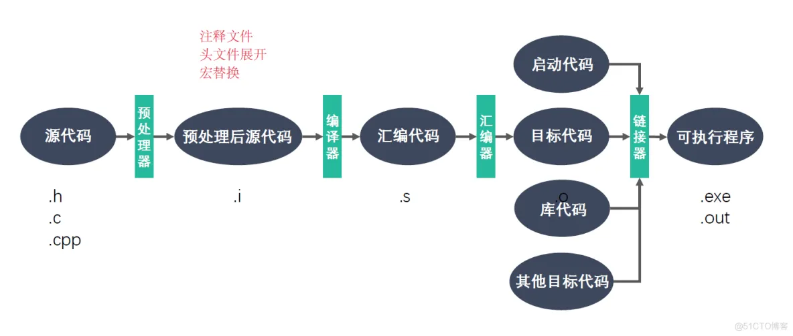

gcc 和g++的区别

`.c`为后缀的文件，`gcc`把它当作C程序，而`g++`帮它当作`c++`

编译阶段，g++会调用gcc， 对于C++代码，两者是等价的，但是因为gcc .命令不能自动和C++程序使用的库联接，所以通常用g++来完成链接，为了统一起见，干脆编译/链接统统用g++了，这就给人一种错觉，好像cpp程序只能用g++似的

### 库文件

库文件有两种，静态库和动态库(共享库)，区别是库文件有两种，静态库和动态库（共享库），区别是：静态库在程序的链接阶段被复制到了程序中；动态库在链接阶段没有被复制到程序中，而是程序在运行时由系统动态加  
载到内存中供程序调用。

### 静态库的制作

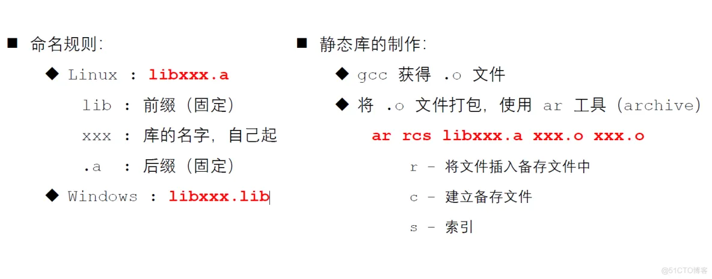

### 动态库的制作

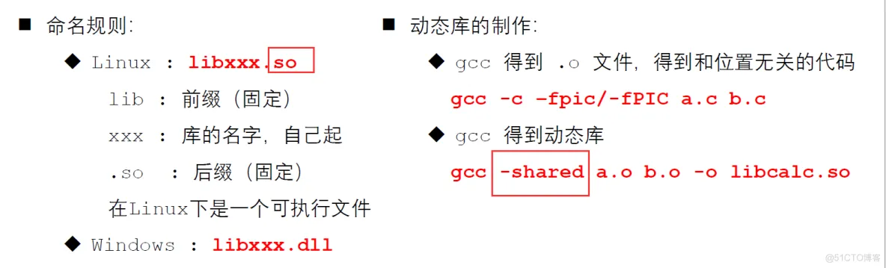

工作原理

静态库： GCC 进行链接时，会把静态库中代码打包到可执行程序中  
动态库： GCC 进行链接时，动态库的代码不会被打包到可执行程序中  
程序启动之后，动态库会被动态加载到内存中，通过 ldd list dynamic  
dependencies

### 程序编译成可执行文件，动态库和静态库

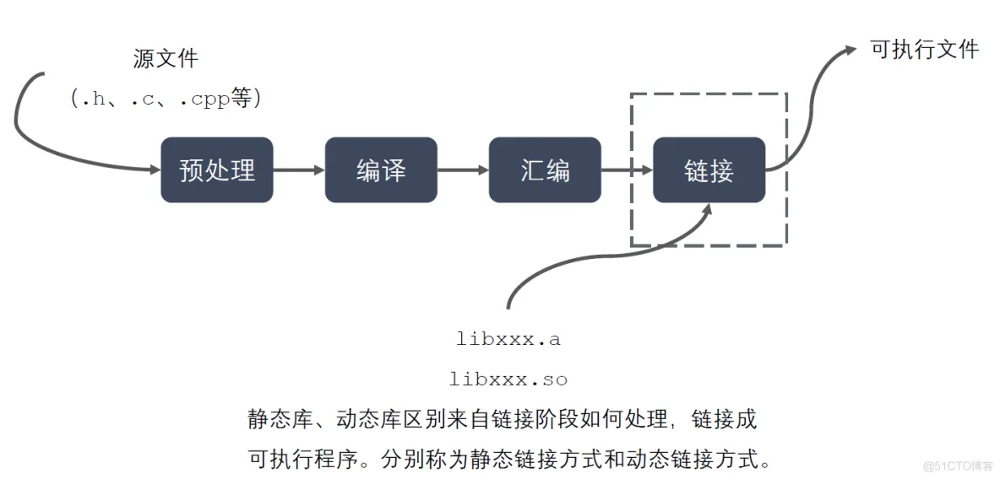

### 静态库和动态库的优缺点

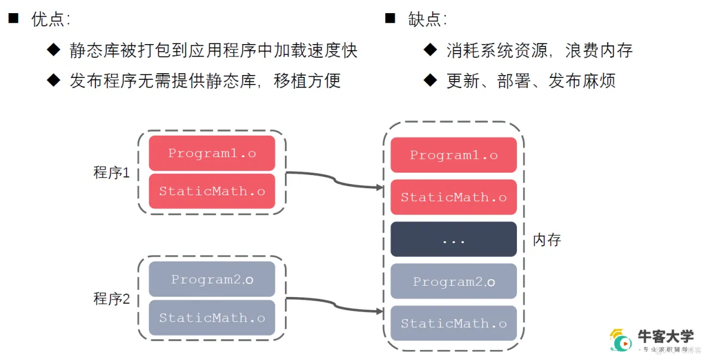

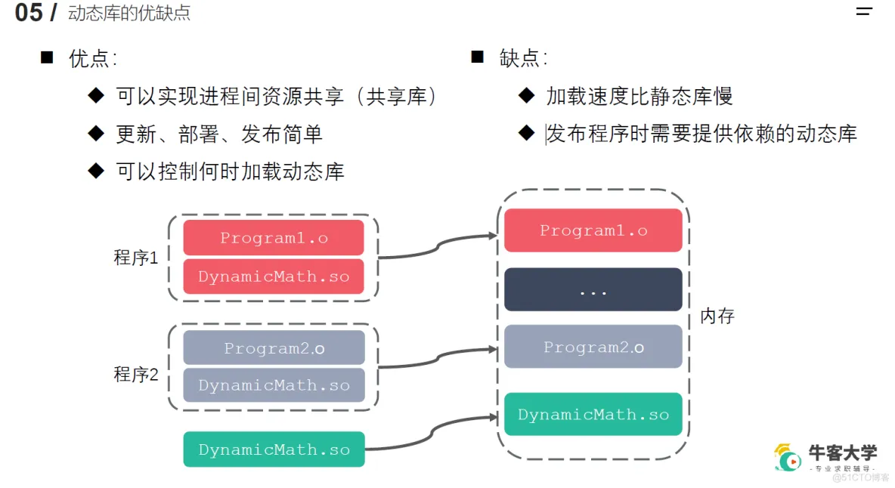

### Makefile文件命名和规则

#### 介绍一下make? 为什么使用make

1、包含多个源文件的项目在编译时有长而复杂的命令行，可以通过makefile保存这些命令行来简化该工作  
2、make可以减少重新编译所需要的时间，因为make可以识别出哪些文件是新修改的  
3、make维护了当前项目中各文件的相关关系，从而可以在编译前检查是否可以找到所有的文件

makefile：一个文本形式的文件，其中包含一些规则告诉make编译哪些文件以及怎样编译这些文件，每条规则包含以下内容：  
一个target，即最终创建的东西  
一个和多个dependencies列表，通常是编译目标文件所需要的其他文件  
需要执行的一系列commands，用于从指定的相关文件创建目标文件

make执行时按顺序查找名为GNUmakefile，makefile或者Makefile文件，通常，大多数人常用Makefile  
Makefile规则：

登录后复制

```plain
target: dependency dependency [..]    command    command    [..]
注意：command前面必须是制表符
```

例子：

登录后复制

```plain
editor: editor.o screen.o keyboard.o
gcc -o editor editor.o screen.o keyboard.o
editor.o : editor.c editor.h keyboard.h screen.h
gcc -c editor.c
screen.o: screen.c screen.h
gcc -c screen.c
keyboard.o : keyboard.c keyboard.h
gcc -c keyboard.c
clean:
rm editor *.o
```

**工作原理**

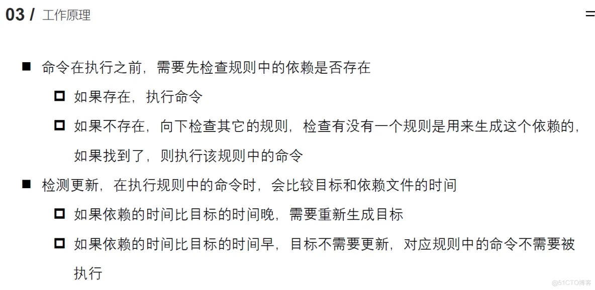

**变量**

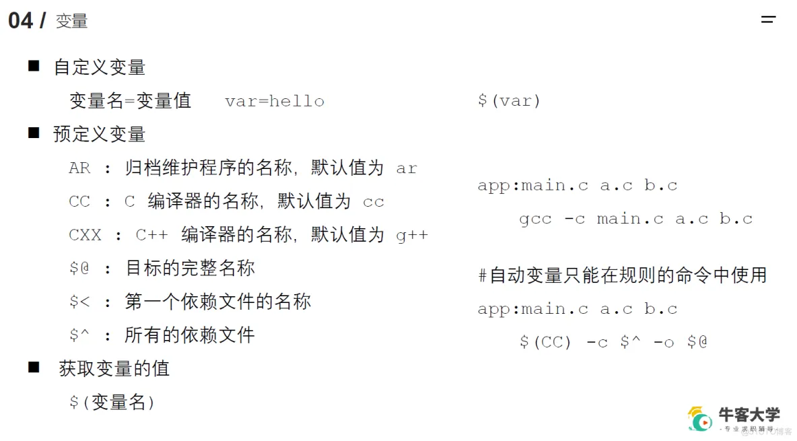

**模式匹配**

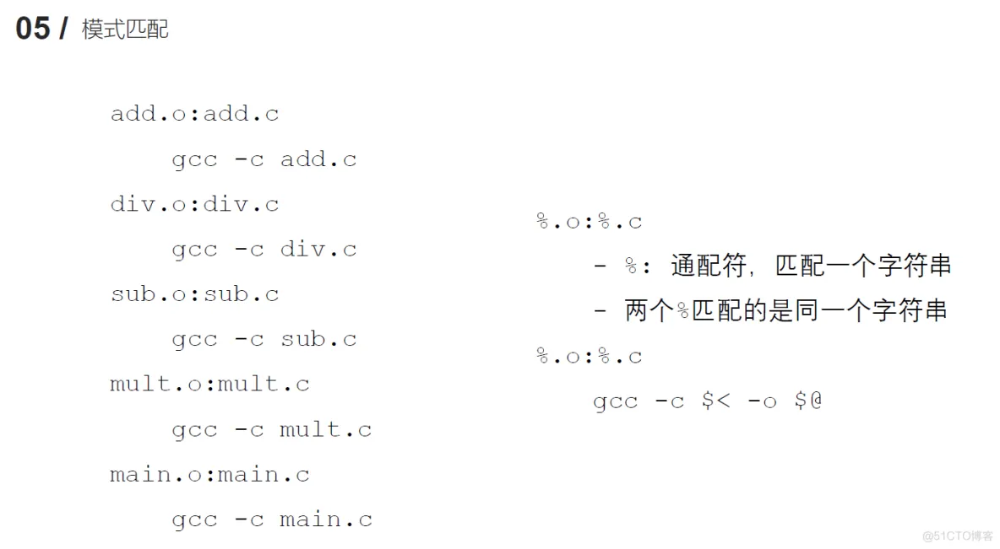

**函数**

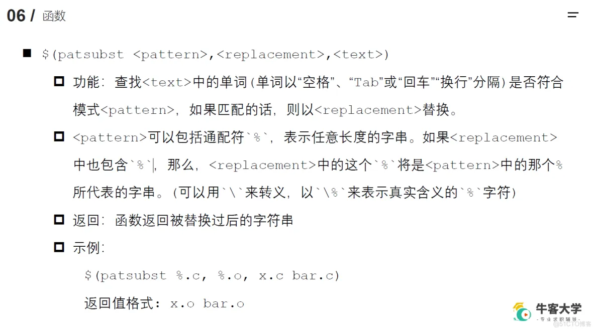

### GDB调试

登录后复制

```plain
gcc g Wall program.c o program
```

启动、退出、查看代码

启动和退出：`qdb`可执行程序,`quit`退出

给程序设置参数/获取参数: set args 10 20

show args

GDB 使用帮助: help

查看当前文件代码 list

设置显示的行数: show listsize

**GDB命令-调试**

运行GDB程序

start（程序停在第一行）

run（遇到断点才停）

`c` 继续运行，到下一个断点停

`n` 向下执行一行代码

`p` 变量名

`s` 向下单步调试

`finish` 跳出函数体

`break`断点

自动变量操作

> display 变量名(自动打印指定变量的值)
>
> i display
>
> undisplay 编号

其他操作

`set var` 变量名=变量值(循环中用的较多)

`until` 跳出循环

GDB**多进程调试**

默认只能跟踪一个进程，可以在`fork`函数调用之气，通过指令设置GDB调试工具跟中父进程或者子进程，默认父进程

登录后复制

```plain
set follow-fork-mode [parent|child]
```

设置调试模式: set detach-on-fork \[on | off\]

默认为on,表示调试当前进程的时候，其他的进程继续运行，如果为off,调试当前进程的时候，其他进程被GDB挂起

查看调试的进程: info inferiors

切换当前调试的进程: inferior id

使进程脱离GDB调试: detach inferiors id

用gdb调试多线程程序  
　　gdb有一组命令可辅助多线程程序的调试。

info threads

显示当前可调试的所有线程。gdb会为每个线程分配一个ID，我们可以使用这个ID来操作对应的线程。ID前面有“\*”的线程是当前被调试的线程。

thread ID

调试目标ID指定的线程。

set scheduler-locking\[off|on|step\]

调试多线程程序时，默认除了被调试的线程在执行外，其他线程也在继续执行，但有的时候我们希望只让被调试的线程运行。这可以通过这个命令来实现。  
　　该命令设置sceduler-locking的值：  
　　off表示不锁定任何线程，即所有线程都可以继续执行，这是默认值。  
　　on表示只有当前被调试的线程会继续执行。  
　　step表示在单步执行的时候，只有当前线程会执行。

登录后复制

```plain
（gdb) info threads
//查看线程信息，当前被调试的是那个线程
(gdb) set scheduler-locking on
//不执行其他线程，锁定调试对象
(gdb)thread 2
//将调试切换到子线程，其ID为2
```

> 关于调试进程池或线程池程序的一个不错的方法：  
> 　　　先将池中的进程个数或线程个数减少至一，以观察程序的逻辑是否正确，然后逐步增加进程或线程的数量，以调试进程或线程的同步是否正确。

### Linux常用的命令

查看内存的命令。

> free 查看当前内存的使用情况

查看进程的命令。

> ps 显示瞬间进程的动态

删除文件的命令。

> rm: 删除文件

杀死名字带特定字符串的进程命令。

一条命令，找出包含指定字符串的进程并杀死

> ps -ef | grep jmeter | grep -v grep | cut -c 9-15 | xargs kill -s 9

**vi编辑器常用的命令**

:n,m w path/filename 保存指定范围文档（ n表开始行，m表结束行）

:q! 对文件做过修改后，强制退出

:q 没有对文件做过修改退出

Wq或x 保存退出

dd 删除光标所在行

： set number 显示行号

：n 跳转到n行

：s 替换字符串 😒/test/test2/g /g全局替换 /也可以用%代替

/ 查找字符串

其他指令

Who：显示系统中有那些用户在使用。

\-ami 显示当前用户

\-u：显示使用者的动作/工作

\-s：使用简短的格式来显示

\-v：显示程序版本

Useradd/userdel:添加用户/删除用户

Uptime：显示系统运行了多长时间

### 文件IO

C 库函数

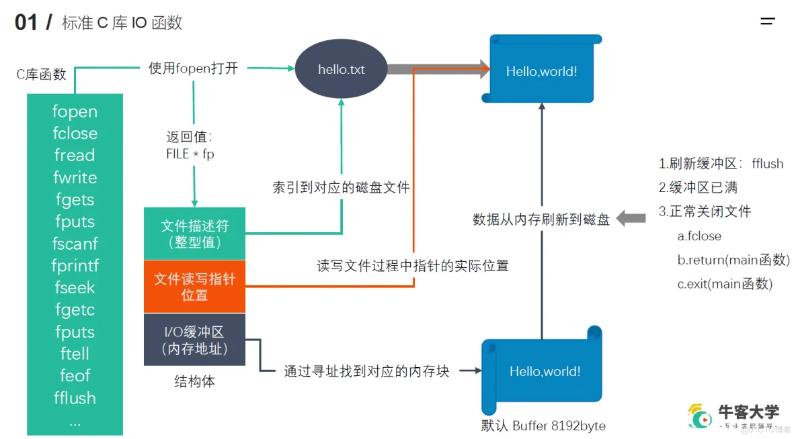

**标准C库IO和linux系统IO的关系**

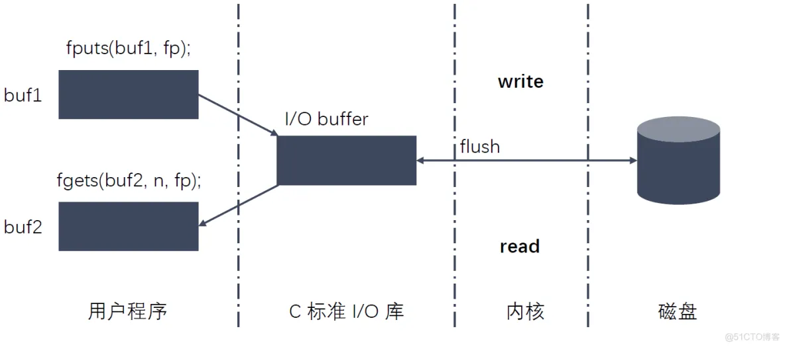

### 虚拟地址空间

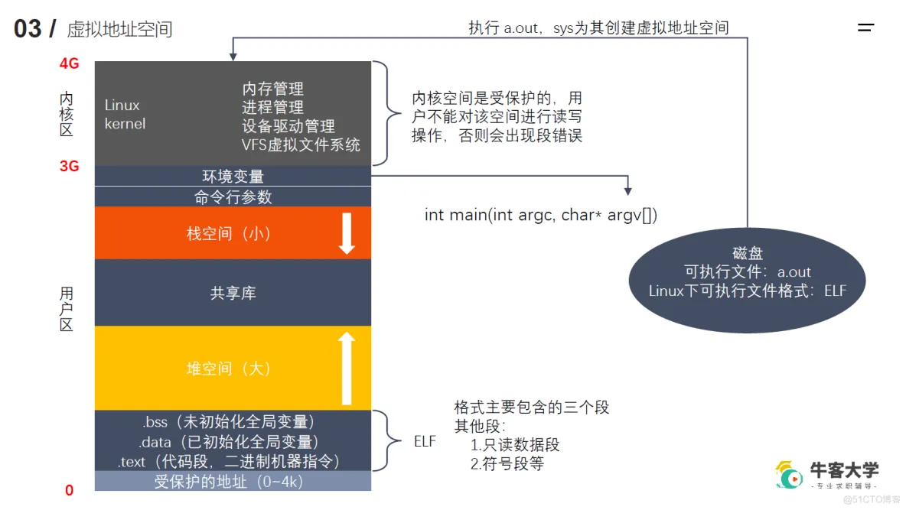

### 进程、线程、协程的区别

<table class="data-table" data-transient-attributes="class" style="width: 100%; outline: none; border-collapse: collapse;" data-width="1162px"><colgroup><col span="1" width="290"><col span="1" width="290"><col span="1" width="291"><col span="1" width="291"></colgroup><tbody><tr style="height: 30px;"><td data-transient-attributes="table-cell-selection" style="min-width: auto; word-wrap: break-word; margin: 4px 8px; border: 1px solid rgb(217, 217, 217); padding: 4px 8px; cursor: default; vertical-align: top;"></td><td data-transient-attributes="table-cell-selection" style="min-width: auto; word-wrap: break-word; margin: 4px 8px; border: 1px solid rgb(217, 217, 217); padding: 4px 8px; cursor: default; vertical-align: top;"><p>进程<br></p></td><td data-transient-attributes="table-cell-selection" style="min-width: auto; word-wrap: break-word; margin: 4px 8px; border: 1px solid rgb(217, 217, 217); padding: 4px 8px; cursor: default; vertical-align: top;"><p>线程<br></p></td><td data-transient-attributes="table-cell-selection" class="table-last-row" style="min-width: auto; word-wrap: break-word; margin: 4px 8px; border: 1px solid rgb(217, 217, 217); padding: 4px 8px; cursor: default; vertical-align: top;"><p>协程<br></p></td></tr><tr style="height: 30px;"><td data-transient-attributes="table-cell-selection" style="min-width: auto; word-wrap: break-word; margin: 4px 8px; border: 1px solid rgb(217, 217, 217); padding: 4px 8px; cursor: default; vertical-align: top;"><p>定义<br></p></td><td data-transient-attributes="table-cell-selection" style="min-width: auto; word-wrap: break-word; margin: 4px 8px; border: 1px solid rgb(217, 217, 217); padding: 4px 8px; cursor: default; vertical-align: top;"><p>资源分配和拥有的基本单位<br></p></td><td data-transient-attributes="table-cell-selection" style="min-width: auto; word-wrap: break-word; margin: 4px 8px; border: 1px solid rgb(217, 217, 217); padding: 4px 8px; cursor: default; vertical-align: top;"><p>程序执行的基本单位<br></p></td><td data-transient-attributes="table-cell-selection" class="table-last-row" style="min-width: auto; word-wrap: break-word; margin: 4px 8px; border: 1px solid rgb(217, 217, 217); padding: 4px 8px; cursor: default; vertical-align: top;"><p>用户态的轻量级线程，线程内部调度的基本单位<br></p></td></tr><tr style="height: 30px;"><td data-transient-attributes="table-cell-selection" style="min-width: auto; word-wrap: break-word; margin: 4px 8px; border: 1px solid rgb(217, 217, 217); padding: 4px 8px; cursor: default; vertical-align: top;"><p>切换情况<br></p></td><td data-transient-attributes="table-cell-selection" style="min-width: auto; word-wrap: break-word; margin: 4px 8px; border: 1px solid rgb(217, 217, 217); padding: 4px 8px; cursor: default; vertical-align: top;"><p>进程CPU环境(栈、寄存器、页表和文件句柄等)的保存以及新调度的进程CPU环境的设置<br></p></td><td data-transient-attributes="table-cell-selection" style="min-width: auto; word-wrap: break-word; margin: 4px 8px; border: 1px solid rgb(217, 217, 217); padding: 4px 8px; cursor: default; vertical-align: top;"><p>保存和设置程序计数器、少量寄存器和栈的内容<br></p></td><td data-transient-attributes="table-cell-selection" class="table-last-row" style="min-width: auto; word-wrap: break-word; margin: 4px 8px; border: 1px solid rgb(217, 217, 217); padding: 4px 8px; cursor: default; vertical-align: top;"><p>先将寄存器上下文和栈保存，等切换回来的时候再进行恢复<br></p></td></tr><tr style="height: 30px;"><td data-transient-attributes="table-cell-selection" style="min-width: auto; word-wrap: break-word; margin: 4px 8px; border: 1px solid rgb(217, 217, 217); padding: 4px 8px; cursor: default; vertical-align: top;"><p>切换者<br></p></td><td data-transient-attributes="table-cell-selection" style="min-width: auto; word-wrap: break-word; margin: 4px 8px; border: 1px solid rgb(217, 217, 217); padding: 4px 8px; cursor: default; vertical-align: top;"><p>操作系统<br></p></td><td data-transient-attributes="table-cell-selection" style="min-width: auto; word-wrap: break-word; margin: 4px 8px; border: 1px solid rgb(217, 217, 217); padding: 4px 8px; cursor: default; vertical-align: top;"><p>操作系统<br></p></td><td data-transient-attributes="table-cell-selection" class="table-last-row" style="min-width: auto; word-wrap: break-word; margin: 4px 8px; border: 1px solid rgb(217, 217, 217); padding: 4px 8px; cursor: default; vertical-align: top;"><p>用户<br></p></td></tr><tr style="height: 30px;"><td data-transient-attributes="table-cell-selection" style="min-width: auto; word-wrap: break-word; margin: 4px 8px; border: 1px solid rgb(217, 217, 217); padding: 4px 8px; cursor: default; vertical-align: top;"><p>切换过程<br></p></td><td data-transient-attributes="table-cell-selection" style="min-width: auto; word-wrap: break-word; margin: 4px 8px; border: 1px solid rgb(217, 217, 217); padding: 4px 8px; cursor: default; vertical-align: top;"><p>用户态-&gt;内核态-&gt;用户态<br></p></td><td data-transient-attributes="table-cell-selection" style="min-width: auto; word-wrap: break-word; margin: 4px 8px; border: 1px solid rgb(217, 217, 217); padding: 4px 8px; cursor: default; vertical-align: top;"><p>用户态-&gt;内核态-&gt;用户态<br></p></td><td data-transient-attributes="table-cell-selection" class="table-last-row" style="min-width: auto; word-wrap: break-word; margin: 4px 8px; border: 1px solid rgb(217, 217, 217); padding: 4px 8px; cursor: default; vertical-align: top;"><p>用户态(没有陷入内核)<br></p></td></tr><tr style="height: 30px;"><td data-transient-attributes="table-cell-selection" style="min-width: auto; word-wrap: break-word; margin: 4px 8px; border: 1px solid rgb(217, 217, 217); padding: 4px 8px; cursor: default; vertical-align: top;"><p>调用栈<br></p></td><td data-transient-attributes="table-cell-selection" style="min-width: auto; word-wrap: break-word; margin: 4px 8px; border: 1px solid rgb(217, 217, 217); padding: 4px 8px; cursor: default; vertical-align: top;"><p>内核栈<br></p></td><td data-transient-attributes="table-cell-selection" style="min-width: auto; word-wrap: break-word; margin: 4px 8px; border: 1px solid rgb(217, 217, 217); padding: 4px 8px; cursor: default; vertical-align: top;"><p>内核栈<br></p></td><td data-transient-attributes="table-cell-selection" class="table-last-row" style="min-width: auto; word-wrap: break-word; margin: 4px 8px; border: 1px solid rgb(217, 217, 217); padding: 4px 8px; cursor: default; vertical-align: top;"><p>用户栈<br></p></td></tr><tr style="height: 30px;"><td data-transient-attributes="table-cell-selection" style="min-width: auto; word-wrap: break-word; margin: 4px 8px; border: 1px solid rgb(217, 217, 217); padding: 4px 8px; cursor: default; vertical-align: top;"><p>拥有资源<br></p></td><td data-transient-attributes="table-cell-selection" style="min-width: auto; word-wrap: break-word; margin: 4px 8px; border: 1px solid rgb(217, 217, 217); padding: 4px 8px; cursor: default; vertical-align: top;"><p>CPU资源、内存资源、文件资源和句柄等<br></p></td><td data-transient-attributes="table-cell-selection" style="min-width: auto; word-wrap: break-word; margin: 4px 8px; border: 1px solid rgb(217, 217, 217); padding: 4px 8px; cursor: default; vertical-align: top;"><p>程序计数器、寄存器、栈和状态字<br></p></td><td data-transient-attributes="table-cell-selection" class="table-last-row" style="min-width: auto; word-wrap: break-word; margin: 4px 8px; border: 1px solid rgb(217, 217, 217); padding: 4px 8px; cursor: default; vertical-align: top;"><p>拥有自己的寄存器上下文和栈<br></p></td></tr><tr style="height: 30px;"><td data-transient-attributes="table-cell-selection" style="min-width: auto; word-wrap: break-word; margin: 4px 8px; border: 1px solid rgb(217, 217, 217); padding: 4px 8px; cursor: default; vertical-align: top;"><p>并发性<br></p></td><td data-transient-attributes="table-cell-selection" style="min-width: auto; word-wrap: break-word; margin: 4px 8px; border: 1px solid rgb(217, 217, 217); padding: 4px 8px; cursor: default; vertical-align: top;"><p>不同进程之间切换实现并发，各自占有CPU实现并行<br></p></td><td data-transient-attributes="table-cell-selection" style="min-width: auto; word-wrap: break-word; margin: 4px 8px; border: 1px solid rgb(217, 217, 217); padding: 4px 8px; cursor: default; vertical-align: top;"><p>一个进程内部的多个线程并发执行<br></p></td><td data-transient-attributes="table-cell-selection" class="table-last-row" style="min-width: auto; word-wrap: break-word; margin: 4px 8px; border: 1px solid rgb(217, 217, 217); padding: 4px 8px; cursor: default; vertical-align: top;"><p>同一时间只能执行一个协程，而其他协程处于休眠状态，适合对任务进行分时处理<br></p></td></tr><tr style="height: 30px;"><td data-transient-attributes="table-cell-selection" style="min-width: auto; word-wrap: break-word; margin: 4px 8px; border: 1px solid rgb(217, 217, 217); padding: 4px 8px; cursor: default; vertical-align: top;"><p>系统开销<br></p></td><td data-transient-attributes="table-cell-selection" style="min-width: auto; word-wrap: break-word; margin: 4px 8px; border: 1px solid rgb(217, 217, 217); padding: 4px 8px; cursor: default; vertical-align: top;"><p>切换虚拟地址空间，切换内核栈和硬件上下文，CPU高速缓存失效、页表切换，开销很大<br></p></td><td data-transient-attributes="table-cell-selection" style="min-width: auto; word-wrap: break-word; margin: 4px 8px; border: 1px solid rgb(217, 217, 217); padding: 4px 8px; cursor: default; vertical-align: top;"><p>切换时只需保存和设置少量寄存器内容，因此开销很小<br></p></td><td data-transient-attributes="table-cell-selection" class="table-last-row" style="min-width: auto; word-wrap: break-word; margin: 4px 8px; border: 1px solid rgb(217, 217, 217); padding: 4px 8px; cursor: default; vertical-align: top;"><p>直接操作栈则基本没有内核切换的开销，可以不加锁的访问全局变量，所以上下文的切换非常快<br></p></td></tr><tr style="height: 30px;"><td data-transient-attributes="table-cell-selection" class="table-last-column" style="min-width: auto; word-wrap: break-word; margin: 4px 8px; border: 1px solid rgb(217, 217, 217); padding: 4px 8px; cursor: default; vertical-align: top;"><p>通信方面<br></p></td><td data-transient-attributes="table-cell-selection" class="table-last-column" style="min-width: auto; word-wrap: break-word; margin: 4px 8px; border: 1px solid rgb(217, 217, 217); padding: 4px 8px; cursor: default; vertical-align: top;"><p>进程间通信需要借助操作系统<br></p></td><td data-transient-attributes="table-cell-selection" class="table-last-column" style="min-width: auto; word-wrap: break-word; margin: 4px 8px; border: 1px solid rgb(217, 217, 217); padding: 4px 8px; cursor: default; vertical-align: top;"><p>线程间可以直接读写进程数据段(如全局变量)来进行通信<br></p></td><td data-transient-attributes="table-cell-selection" class="table-last-column table-last-row" style="min-width: auto; word-wrap: break-word; margin: 4px 8px; border: 1px solid rgb(217, 217, 217); padding: 4px 8px; cursor: default; vertical-align: top;"><p>共享内存、消息队列<br></p></td></tr></tbody></table>

1、进程是资源调度的基本单位，运行一个可执行程序会创建一个或多个进程，进程就是运行起来的可执行程序

2、线程是程序执行的基本单位，是轻量级的进程。每个进程中都有唯一的主线程，且只能有一个，主线程和进程是相互依存的关系，主线程结束进程也会结束。多提一句：协程是用户态的轻量级线程，线程内部调度的基本单位

### 进程控制块(PCB)

为了管理进程，内核必须对每个继承所作的事情进行清楚的描述，内核为每个进程分配一个PCB进程控制快，维护进程先骨干的信息，`Linux`内核的进程控制块时`task_struct`结构体。

### 进程状态转换

**三态模型**

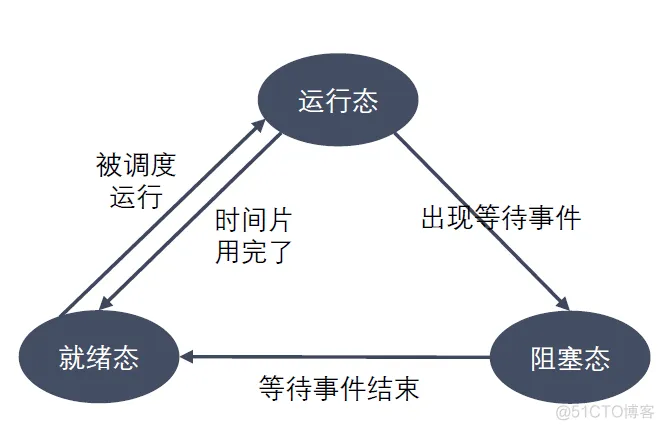

运行态: 进程占有处理器正在运行

就绪态: 进程具备运行条件，等待系统分配处理器以运行，在系统中处于就绪状态的进程可能有多个，通常将它们拍成一个队列，称为就绪队列。

阻塞态: 又称为wait等待态或睡眠sleep态，指进程不具备运行条件，正在等待某个事件完成。

**五态模型**

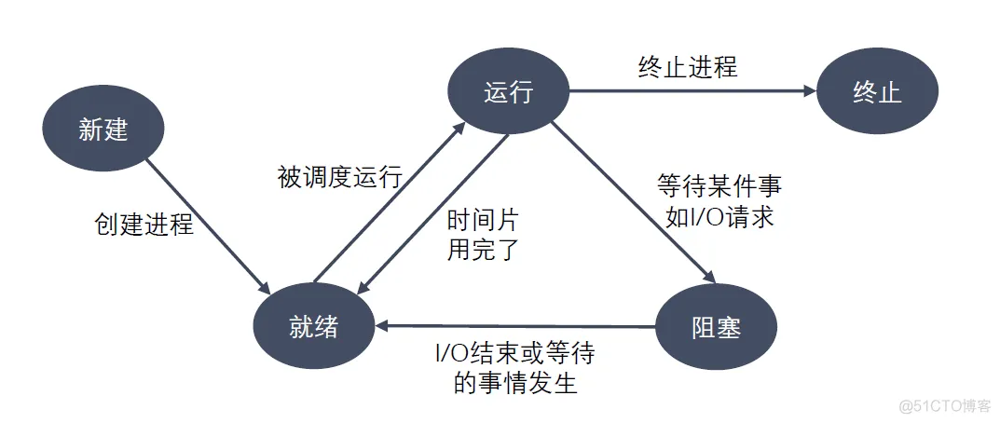

新建态：进程刚被创建时的状态，尚未进入就绪队列。

终止态: 进程完成任务到达正常结束点，或出现无法克服的错误而异常终止，或被操作系统及有终止权的进程所终止时所处的状态。进入终止态的进程以后不再执行，但依然保留在操作系统中等待善后。一旦其他进程完成了对终止态进程的信息抽取之后，操作系统将删除该进程。

### 查看进程

> ps aux/ ajx

a: 显示终端上的所有进程，包括其他用户的进程

u: 显示进程的详细信息

x: 显示没有控制终端的进程

j: 列出与作业控制相关的信息

> 实时显示进程动态 top

可以对显示结果排序

-   M 根据内存使用量排序
-   P 根据 CPU 占有率排序
-   T 根据进程运行时间长短排序
-   U 根据用户名来筛选进程
-   K 输入指定的 PID 杀死进程

### 杀死进程

> kill pid
>
> kill -l 列出所有信号
>
> kill -SIGKILL 进程ID
>
> kill -9 进程ID
>
> killall name 根据进程名杀死进程

### 进程退出、孤儿进程、僵尸进程

exit

**孤儿进程**

> 父进程运行结束，但子进程还在运行（未运行结束），这样的子进程就称为孤儿进程  
> Orphan Process ）。

每当出现一个孤儿进程的时候，内核就把孤儿进程的父进程设置为 init ，而 init  
进程会循环地 wait() 它的已经退出的子进程。这样，当一个孤儿进程凄凉地结束  
了其生命周期的时候， init 进程就会代表党和政府出面处理它的一切善后工作。  
因此`孤儿进程并不会有什么危害`。

**僵尸进程**

起因：每个进程结束之后，都会释放自己地址空间中的用户区数据，内核区的PCB没有办法自己释放，需要父进程释放。

进程终止时，父进程尚未回收，子进程残留资源(PCB)存放在内核中，编程僵尸进程。

危害性：

僵尸进程不能被 kill 9 杀死，这样就会导致一个问题，如果父进程不调用 wait()  
或 waitpid() 的话，那么保留的那段信息就不会释放，其进程号就会一直被占用，  
但是系统所能使用的进程号是有限的，如果大量的产生僵尸进程，将因为没有可用的进  
程号而导致系统不能产生新的进程，此即为僵尸进程的危害，应当避免。

### IO 五种IO模型：

### 进程间的通讯方式

重要的知识点


#### 匿名管道

又叫无名管道

比如

统计一个目录中文件的数目命令：`ls|wc -l` 为了执行这个条命令，`shell`创建了两个进程分别执行`ls`和`wc`.

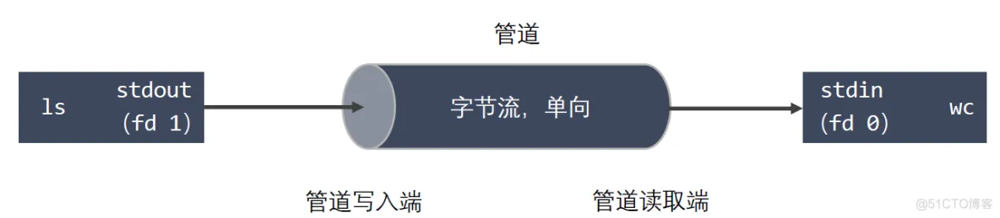

管道中的数据传递方向是单向的，一端用于写入，一端用于读取，管道是半双工的。

匿名管道只能在具有公共祖先的进程(父进程与子进程，或者两个兄弟进程，具有亲缘关系)之间使用，

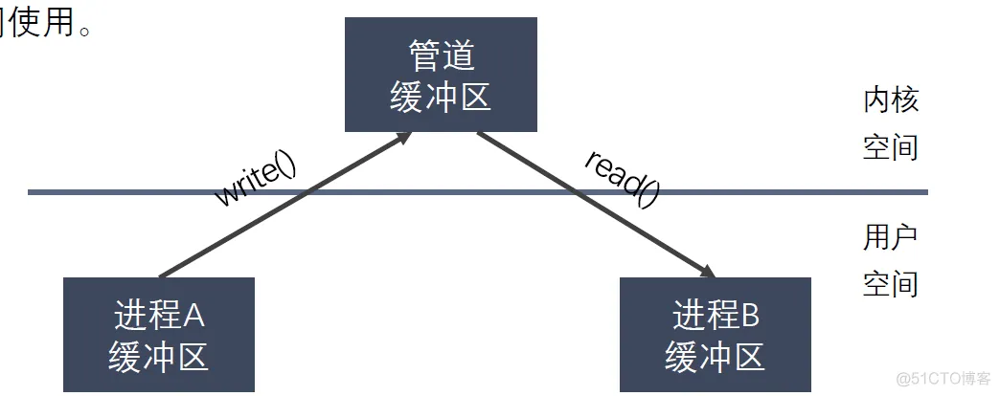

**匿名管道的使用**

查看管道缓冲区大小命令 `ulimit -a`

#### 有名管道

起因：由于匿名管道没有名字，只能用于亲缘关系的进程间通信。为了克服这个缺点，提出了有名管道(FIFO),也叫命名管道、FIFO文件，

它提供了一个`路径名`与之关联,以FIFO的文件形式存在与文件系统中。从管道中读取的顺序与写入顺序一样。

mkfifo 名字

#### 两者的区别

1.  FIFO 在文件系统中作为一个特殊文件存在，但 FIFO 中的`内容却存放在内存`中。
2.  当使用 FIFO 的进程退出后， `FIFO 文件将继续保存在文件系统中以便以后使用`。
3.  FIFO 有名字，`不相关的进程`可以通过打开有名管道进行通信。

#### 内存映射

用户通过修改内存就能修改磁盘文件。

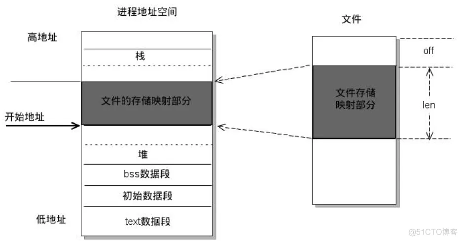

#### 信号

信号是时间发生时对进程的通知机制。

使用信号的两个主要的目的是：

1.  让进程知道已经发生了一个特定的时期。
2.  强迫进程执行它自己代码中的信号处理程序。

**信号的特点:**

简单

不能携带大量信息。

满足某个特定条件才发送。

信号中的几种状态: 产生、未决、递达

#### 消息队列：

消息队列是有消息的链表，存放在内核中并由消息队列标识符标识。消息队列克服了信号传递信息少、管道只能承载无格式字节流以及缓冲区大小受限等缺点。

#### 共享内存

共享内存就是映射一段能被其他进程所访问的内存，这段共享内存由一个进程创建，但多个进程都可以访问。共享内存是最快的IPC方式，它是针对其他进程间通信方式运行效率低而专门设计的。它往往与信号量，配合使用来实现进程间的同步和通信。(IPC进程间通信)

#### 信号量

信号量是一个计数器，可以用来控制多个进程对共享资源的访问。它常作为一种锁机制，实现进程、线程的对临界区的同步及互斥访问。

#### 进程间通讯方式的小结

##### 🔥🔥Linux下进程间通信方式？

-   管道：

-   无名管道（内存文件）：管道是一种半双工的通信方式，数据只能单向流动，而且只能在具有亲缘关系的进程之间使用。进程的亲缘关系通常是指父子进程关系。
-   有名管道（FIFO文件，借助文件系统）：有名管道也是半双工的通信方式，但是允许在没有亲缘关系的进程之间使用，管道是先进先出的通信方式。

-   共享内存：共享内存就是映射一段能被其他进程所访问的内存，这段共享内存由一个进程创建，但多个进程都可以访问。共享内存是最快的IPC方式，它是针对其他进程间通信方式运行效率低而专门设计的。它往往与信号量，配合使用来实现进程间的同步和通信。
-   消息队列：消息队列是有消息的链表，存放在内核中并由消息队列标识符标识。消息队列克服了信号传递信息少、管道只能承载无格式字节流以及缓冲区大小受限等缺点。
-   套接字：适用于不同机器间进程通信，在本地也可作为两个进程通信的方式。
-   信号：用于通知接收进程某个事件已经发生，比如按下ctrl + C就是信号。
-   信号量：信号量是一个计数器，可以用来控制多个进程对共享资源的访问。它常作为一种锁机制，实现进程、线程的对临界区的同步及互斥访问。

### 守护进程的创建步骤

（1）让程序在后台执行。方法是调用fork（）产生一个子进程，然后使父进程退出。

（2）调用setsid（）创建一个新对话期。控制终端、登录会话和进程组通常是从父进程继承下来的，守护进程要摆脱它们，不受它们的影响，方法是调用setsid（）使进程成为一个会话组长。setsid（）调用成功后，进程成为新的会话组长和进程组长，并与原来的登录会话、进程组和控制终端脱离。

（3）禁止进程重新打开控制终端。经过以上步骤，进程已经成为一个无终端的会话组长，但是它可以重新申请打开一个终端。为了避免这种情况发生，可以通过使进程不再是会话组长来实现。再一次通过fork（）创建新的子进程，使调用fork的进程退出。

（4）关闭不再需要的文件描述符。子进程从父进程继承打开的文件描述符。如不关闭，将会浪费系统资源，造成进程所在的文件系统无法卸下以及引起无法预料的错误。首先获得最高文件描述符值，然后用一个循环程序，关闭0到最高文件描述符值的所有文件描述符。

（5）将当前目录更改为根目录。

（6）子进程从父进程继承的文件创建屏蔽字可能会拒绝某些许可权。为防止这一点，使用unmask（0）将屏蔽字清零。

（7）处理SIGCHLD信号。对于服务器进程，在请求到来时往往生成子进程处理请求。如果子进程等待父进程捕获状态，则子进程将成为僵尸进程（zombie），从而占用系统资源。如果父进程等待子进程结束，将增加父进程的负担，影响服务器进程的并发性能。在Linux下可以简单地将SIGCHLD信号的操作设为SIG\_IGN。这样，子进程结束时不会产生僵尸进程。

### 线程

经典语句

> 进程是 CPU 分配资源的最小单位，线程是操作系统调度执行的最小单位。

#### 线程同步

-   线程的主要优势在于，能够通过全局变量来共享信息。不过需要注意的是：必须确保多个线程不会同时修改同一变量，或者某一线程不会读取正在由其他线程修改的变量。
-   临界区是指访问某一共享资源的代码片段，并且这段代码的执行应为原子操作，也就是同时访问同一共享资源的其他线程不应终端该片段的执行。
-   线程同步：即当有一个线程在对内存进行操作时，`其他线程都不可以对这个内存地址进行操作`，直到该线程完成操作，其他线程才能对该内存地址进行操作，而其他线程则处于等待状态。

条件变量互斥锁

**互斥量：**

-   为避免线程更新共享变量时出现问题，可以使用互斥量（ mutex 是 mutual exclusion的缩写）来确保同时仅有一个线程可以访问某项共享资源。可以使用互斥量来保证对任意共享资源的原子访问。
-   互斥量有两种状态：已锁定（ locked ）和未锁定 unlocked ）。任何时候，至多只有一个线程可以锁定该互斥量。试图对已经锁定的某一互斥量再次加锁，将可能阻塞线程或者报错失败，具体取决于加锁时使用的方法。
-   一旦线程锁定互斥量，随即成为该互斥量的所有者，只有所有者才能给互斥量解锁。一般情况下，对每一共享资源（可能由多个相关变量组成）会使用不同的互斥量，每一线程在访问同一资源时将采用如下协议：

1.  针对共享资源锁定互斥量
2.  访问共享资源
3.  对互斥量解锁

## 四、几种典型的锁

### 读写锁

-   多个读者可以同时进行读
-   写者必须互斥（只允许一个写者写，也不能读者写者同时进行）
-   写者优先于读者（一旦有写者，则后续读者必须等待，唤醒时优先考虑写者）

### 互斥锁

一次只能一个线程拥有互斥锁，其他线程只有等待

互斥锁是在抢锁失败的情况下主动放弃CPU进入睡眠状态直到锁的状态改变时再唤醒，而操作系统负责线程调度，为了实现锁的状态发生改变时唤醒阻塞的线程或者进程，需要把锁交给操作系统管理，所以互斥锁在加锁操作时涉及上下文的切换。互斥锁实际的效率还是可以让人接受的，加锁的时间大概100ns左右，而实际上互斥锁的一种可能的实现是先自旋一段时间，当自旋的时间超过阀值之后再将线程投入睡眠中，因此在并发运算中使用互斥锁（每次占用锁的时间很短）的效果可能不亚于使用自旋锁

### 条件变量

互斥锁一个明显的缺点是他只有两种状态：锁定和非锁定。而条件变量通过允许线程阻塞和等待另一个线程发送信号的方法弥补了互斥锁的不足，他常和互斥锁一起使用，以免出现竞态条件。当条件不满足时，线程往往解开相应的互斥锁并阻塞线程然后等待条件发生变化。一旦其他的某个线程改变了条件变量，他将通知相应的条件变量唤醒一个或多个正被此条件变量阻塞的线程。总的来说**互斥锁是线程间互斥的机制，条件变量则是同步机制。**

> 图解操作系统里面 妈妈叫孩子吃饭的例子

### 自旋锁

如果进线程无法取得锁，进线程不会立刻放弃CPU时间片，而是一直循环尝试获取锁，直到获取为止。如果别的线程长时期占有锁，那么自旋就是在浪费CPU做无用功，但是自旋锁一般应用于加锁时间很短的场景，这个时候效率比较高。

## 五、易混点

### 互斥锁和条件变量锁通常一起使用

**条件变量**

实现多个线程间的同步，当条件不满足时，相关线程一直被阻塞，直到某种条件出现，这些线程才会被唤醒

**互斥锁**

多个线程访问同一资源时，为了保证数据的一致性，最简单的方式就是使用 mutex（互斥锁）

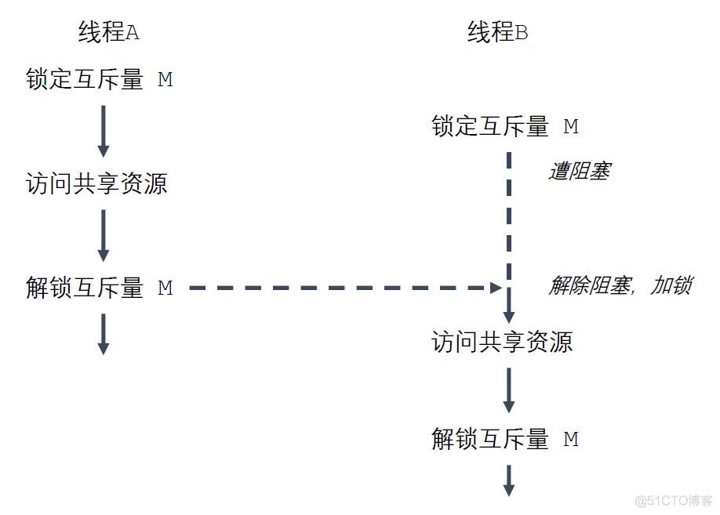

🔥简单的来说：

> 互斥锁是线程间互斥的机制，条件变量则是同步机制。

在C++的实现中

登录后复制

```plain
condition_variable cv;// 条件变量 
 mutex myMutex;// 互斥锁
```

举个🌰

采用三个线程交替打印ABC

> 知识储备
>
> `mutex` 实现互斥锁
>
> `unique_lock` 上独占互斥所
>
> `condition_variable` 条件变量
>
> **通知**
>
> `notify_one` 通知一个等待的线程
>
> `notify_all` 通知所有等待的线程
>
> **等待**
>
> `wait` 阻塞当前线程，直到条件变量被唤醒
>
> `wait_for` 阻塞当前线程，直到条件变量被唤醒，或到指定时长后
>
> `wait_until` 阻塞当前线程，直到条件变量被唤醒，或直到抵达指定时间点

登录后复制

```plain
#include<iostream>
 #include<thread>
 #include<mutex>
 #include<condition_variable>
 using namespace std;
 condition_variable cv;// 条件变量 
 mutex myMutex;// 互斥锁 
 int flag = 0;
void printA(){
//与 Mutex RAII 相关，方便线程对互斥量上锁，但提供了更好的上锁和解锁控制。 
 unique_lock<mutex> lk(myMutex); 
 for(int i = 0; i < 10; ++i){
 if(flag != 0){
 cv.wait(lk);
 }
flag = 1;
cout<<"线程一打印 "<<endl;
cout<<i<<endl;
cv.notify_all();
 }
 cout<<"线程一打印完毕"<<endl;
 }
 
void printB(){
unique_lock<mutex> lk(myMutex);
for(int i = 0; i< 10; ++i){
if(flag !=1){
cv.wait(lk);
}
flag = 2;
cout<<"线程二打印 "<<endl;
cout<<i<<endl;
cv.notify_all();
}
cout<<"线程二打印完毕"<<endl;
}

void printC(){
unique_lock<mutex> lk(myMutex);
for(int i = 0; i< 10; ++i){
if(flag !=2){
cv.wait(lk);
}
flag = 0;
cout<<"线程三打印 "<<endl;
cout<<i<<endl;
cv.notify_all();
}
cout<<"线程三打印完毕"<<endl;
}

int main(){
thread th1(printA);
thread th2(printB);
thread th3(printC);

th1.join();
th2.join();
th3.join();

cout<<"main thread"<<endl; 
return 0;
}
```

同时看到了小林的一篇好文 \[C++并发编程之互斥锁和条件变量的性能比较\](C++ 并发编程之互斥锁和条件变量的性能比较)

### 信号量

信号量其实是一个整形计数器，主要用于`实现进程间的互斥与同步`，而不是用于缓存进程间通信的数据。

信号量也可以在线程间实现互斥同步：

互斥的方式：可保证任意时刻只有一个线程访问共享资源。

同步的方式：可保证线程A应在线程B之前执行。

**信号量** 通常也表示资源的数量，对应的变量是一个`sem`型。

由两个院子操作的系统函数来控制信号量

分别是：

`P操作`:将`sem`减`1`，相减后，如果`sem<0`,则进程/线程进入阻塞等待，否则继续，表明P操作可能会阻塞。

`V操作`:将`sem`加`1`，相加后，如果`sem<=0`，唤醒一个等待中的线程/进程，表明V操作不会阻塞。

举个栗子🌰：

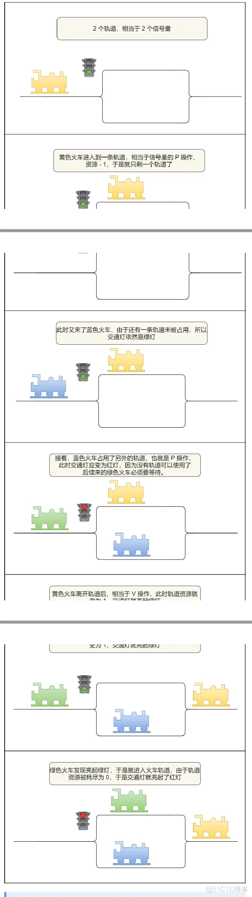

对于两个并发线程，互斥信号量的值仅取1. 0和-1三个值，分别表示:

-   如果互斥信号量为1,表示没有线程进入临界区;
-   如果互斥信号量为0, 表示有-个线程进入临界区;
-   如果互斥信号量为-1,表示一个线程进入临界区，另一个线程等待进入。

## 六、总结

在并发编程中，如果资源数量比较少，采用条件变量和互斥量的情况比较多，值得注意的是`条件变量一般用于同步问题，互斥量用于用于线程间互斥的机制`。比如要保证一个资源一次只能被一个线程使用，用`互斥量`，而完成了使用需要执行某种顺序时候采用`条件变量`。

生产者和消费者模型

#### IP地址转换函数

登录后复制

```plain
#include <arpa/inet.h>
in_addr_t inet_addr(const char *cp);
int inet_aton(const char *cp, struct in_addr *inp);
char *inet_ntoa(struct in_addr in);
```

#### TCP通信流程

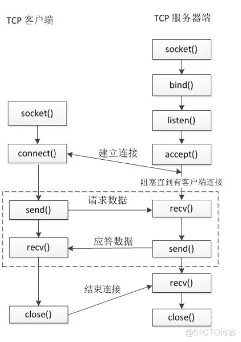

服务器端

登录后复制

```plain
// TCP 通信的流程
// 服务器端 （被动接受连接的角色）
1. 创建一个用于监听的套接字
- 监听：监听有客户端的连接
- 套接字：这个套接字其实就是一个文件描述符
2. 将这个监听文件描述符和本地的IP和端口绑定（IP和端口就是服务器的地址信息）
- 客户端连接服务器的时候使用的就是这个IP和端口
3. 设置监听，监听的fd开始工作
4. 阻塞等待，当有客户端发起连接，解除阻塞，接受客户端的连接，会得到一个和客户端通信的套接字
（fd）
5. 通信
- 接收数据
- 发送数据
6. 通信结束，断开连接
```

客户端

登录后复制

```plain
1. 创建一个用于通信的套接字（fd）
2. 连接服务器，需要指定连接的服务器的 IP 和 端口
3. 连接成功了，客户端可以直接和服务器通信
- 接收数据
- 发送数据
4. 通信结束，断开连接
```

#### UDP通信

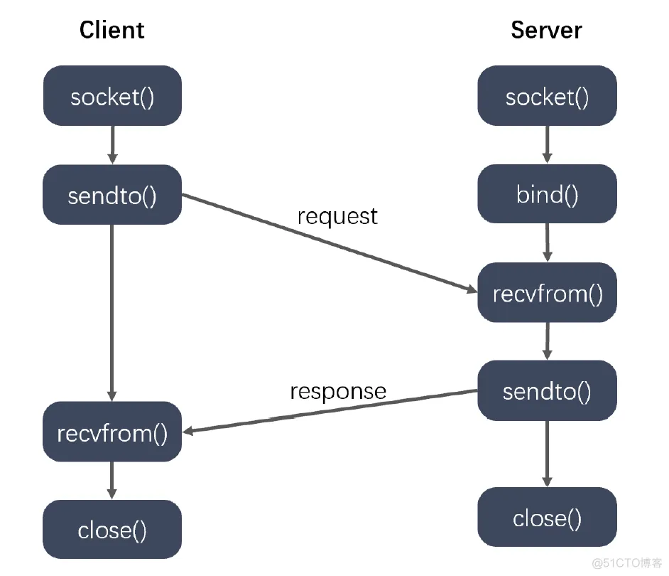

#### 端口复用

> 端口复用最常用的用途是:
>
> 1.  防止服务器重启时之前绑定的端口还未释放
> 2.  程序突然退出而系统没有释放端口

#### 查看网络相关信息的命令

netstat

\-a 所有的socket

\-p 显示正在使用socket的程序的名称

\-n 直接使用IP地址，而不通过域名服务器

#### 管道读写特点

总结：  
读管道：  
管道中有数据，read返回实际读到的字节数。  
管道中无数据：  
写端被全部关闭，read返回0（相当于读到文件的末尾）  
写端没有完全关闭，read阻塞等待

登录后复制

```plain
写管道：
    管道读端全部被关闭，进程异常终止（进程收到SIGPIPE信号）
    管道读端没有全部关闭：
        管道已满，write阻塞
        管道没有满，write将数据写入，并返回实际写入的字节数
```

### Linux上的五种IO模型

**阻塞 blocking**

**非阻塞 no blocking**

**IO复用(IO multiplexing)**

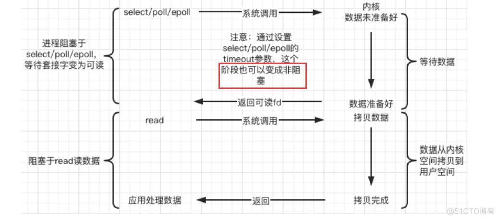

**信号驱动**

Linux 用套接口进行信号驱动 IO，安装一个信号处理函数，进程继续运行并不阻塞，当IO事件就绪，进  
程收到SIGIO 信号，然后处理 IO 事件。

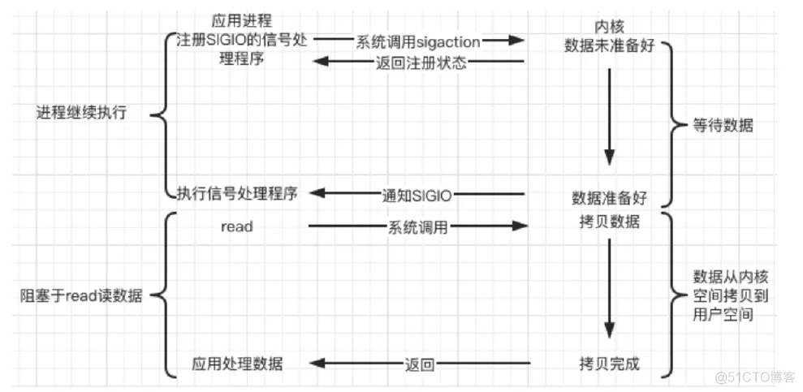

内核在第一个阶段是异步，在第二个阶段是同步；与非阻塞IO的区别在于它提供了消息通知机制，不需  
要用户进程不断的轮询检查，减少了系统API的调用次数，提高了效率。

**异步**

可以调用 aio\_read 函数告诉内核描述字缓冲区指针和缓冲区的大小、文件偏移及通知的方  
式，然后立即返回，当内核将数据拷贝到缓冲区后，再通知应用程序。

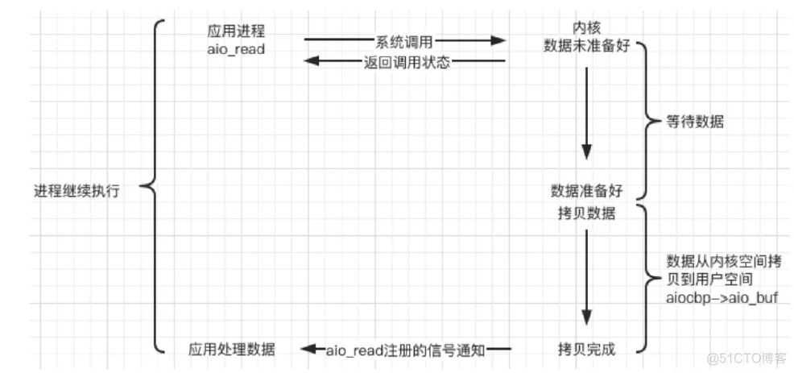

## 七、参考文献

1.   [web服务器项目部分问题汇总](https://zhuanlan.zhihu.com/p/269247362)
2.   [关于操作系统的支持图片来源](https://xiaolincoding.com/)
3.   [自己的代码仓库](https://github.com/YDLinStars/LinuxWebServer)
4.  TCP/IP网络编程
5.  Linux高性能服务器编程—游双
6.  社长的 [WebServer](https://github.com/qinguoyi/TinyWebServer)
7.  牛客网LinuxWeb服务器 (😢这个写的比较简单，但是作为课程，过一过基础也是挺不错的。)
