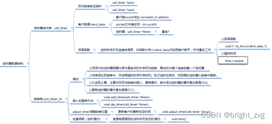

### TinyWebserver中定时器的具体运行工作过程

-   [文章主要内容](https://blog.csdn.net/weixin_42259204/article/details/124904058#_2)
-   -   [定时器节点类和定时器链表类](https://blog.csdn.net/weixin_42259204/article/details/124904058#_6)
    -   [具体执行过程](https://blog.csdn.net/weixin_42259204/article/details/124904058#_12)
    -   [参考](https://blog.csdn.net/weixin_42259204/article/details/124904058#_28)

# 文章主要内容

在阅读TinyWebserver源码过程中，对于定时器部分具体运行工作过程进行了梳理。需要结合源码观看本篇文章，希望对阅读定时器部分却思路很混乱的同学以帮助。

## 定时器节点类和定时器链表类

节点类和链表类的具体结构和作用  

## 具体执行过程

（1） 首先使用socketpair创建管道。  
（2） 设置写端为非阻塞，是为了减少信号处理的时间，即使定时事件失效也没关系，并不严格。  
（3） 设置读端为ET非阻塞，向epoll树上挂读管道事件。  
（4） 执行信号函数addsig，把信号添加到信号集当中，并把信号默认处理方式改成sig\_handler函数(函数内容是向管道写入信号值)  
（5） 设置bool值timeout和stop\_server，后面需要使用他们判断是否执行信号对应的处理逻辑。  
（6） 开始alarm函数，设定时间。  
（7） 监听文件描述符epoll\_wait。  
（8） 监听到以后读出信号。  
（9） 执行处理逻辑，如果信号是SIGALRM，timeout=true;如果是SIGTERM（ctrl+c）stop\_server=true;  
（10） 在server.eventloop（）（就是epoll树上监听到事件后的处理函数）中如果timeout==true,执行time\_handler函数。  
（11） time\_handler函数(Util类中的)，首先执行tick()函数（定时器链表类中的），然后再次执行alarm()，相当于再次开始定时，一个alarm函数只能触发一次信号;  
（12） tick()函数首先遍历定时器链表，找到到期的定时器（判断现在时间是否>expire，expire是定时器节点类中设定的超时时间），就是每过一段时间检查是否超时。即利用alarm函数周期性地触发SIGALRM信号,该信号的信号处理函数利用管道通知主循环执行定时器链表上的定时任务.  
（13） 如果超时了就执行cb\_func函数，删除epoll树上对应的通信fd，关闭通信fd,http\_conn连接数-1；  
（14） 项目中TIMESLOT值为5，expire初始值设置为 现有时间+3\*TIMESLOT，每有读写事件发生，该通信fd对应的expire就加3个TIMESLOT，同时调整定时器链表类中该节点的位置，通过util类对象使用adjust\_timer函数。

## 参考

1.项目源码地址https://github.com/qinguoyi/TinyWebServer