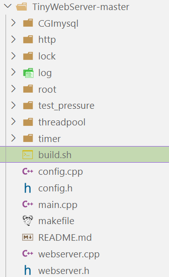

[(49条消息) Linux项目实战C++轻量级Web服务器源码分析TinyWebServer_BingeBlog的博客-CSDN博客](https://blog.csdn.net/BinBinCome/article/details/130000863)

### 目录

-   [文章简介](https://blog.csdn.net/BinBinCome/article/details/130000863#_2)
-   [一、 先跑起来项目](https://blog.csdn.net/BinBinCome/article/details/130000863#__5)
-   [二、再看项目核心](https://blog.csdn.net/BinBinCome/article/details/130000863#_14)
-   [三、逐个击破！立下flag](https://blog.csdn.net/BinBinCome/article/details/130000863#flag_28)

# 文章简介

TinyWebServer是Linux下C++轻量级Web服务器，助力初学者快速实践网络编程，搭建属于自己的服务器.作为新手拿它练手入门再好不过的不二之选，项目开发者社长也写了一些文章帮助初学者理解，但是，非学习总结的总是容易忘，这里记录一下学习过程。

# 一、 先跑起来项目

clone下来源码打开目录如下：  
  
按照readmd文档，  
1、打开MySQL数据库，建立项目相应数据库  
2、修改main文件代码中的数据库信息为个人的  
3、通过别人写好的脚本调用makefie进行编译  
4、运行编程出的文件  
OK，项目已经成功的跑起来了，阅读别人的项目文档，安装项目所需软件是必不可少的能力！

# 二、再看项目核心

对照项目文件目录可得，项目主要内容如下：  
1、lock锁机制  
2、threadpool封装线程池  
3、http解析get和post请求  
4、CGImysql数据库连接池  
5、timer定时器机制  
6、log日志机制  
其他内容如下：  
1、主函数以及webserver  
2、root静态资源页面  
3、test\_pressure压力测试  
4、config项目配置

# 三、逐个击破！立下flag

-   [C++轻量级Web服务器TinyWebServer源码分析之lock篇](https://blog.csdn.net/BinBinCome/article/details/130001263) (已更新)
-   [C++轻量级Web服务器TinyWebServer源码分析之threadpool篇](https://editor.csdn.net/md/?articleId=130001918)(已更新)
-   [C++轻量级Web服务器TinyWebServer源码分析之http篇](https://blog.csdn.net/BinBinCome/article/details/130009978?csdn_share_tail=%7B%22type%22:%22blog%22,%22rType%22:%22article%22,%22rId%22:%22130009978%22,%22source%22:%22BinBinCome%22%7D)(已更新)
-   C++轻量级Web服务器TinyWebServer源码分析之CGImysql篇
-   C++轻量级Web服务器TinyWebServer源码分析之timer篇
-   [C++轻量级Web服务器TinyWebServer源码分析之log篇](https://blog.csdn.net/BinBinCome/article/details/130014765?csdn_share_tail=%7B%22type%22:%22blog%22,%22rType%22:%22article%22,%22rId%22:%22130014765%22,%22source%22:%22BinBinCome%22%7D)（已更新）
-   C++轻量级Web服务器TinyWebServer源码分析之其他篇

以上列表的文章立下flag，都要更新完毕！每更新一篇文章就会修改上面的文字为具体链接，希望不要又被打脸了，不要啦！！！