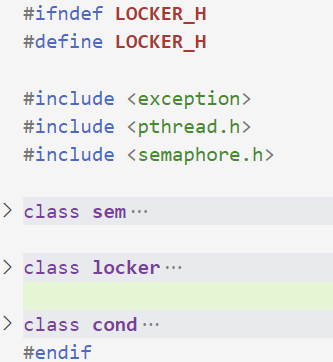

# lock篇简介

由于C++轻量级Web服务器不可避免的会有**多线程同步问题**，所以封装经常使用的锁机制，`确保任一时刻只能有一个线程能进入关键代码段.`

封装**lock类**使用**RAII机制**，将锁的创建和销毁函数封装在类的构造与析构函数中，将重复使用的代码封装为函数，减少代码的重复，使其更简洁。

> 社长原文：  
> 在构造函数中申请分配资源，在析构函数中释放资源。因为C++的语言机制保证了，当一个对象创建的时候，自动调用构造函数，当对象超出作用域的时候会自动调用析构函数。所以，在RAII的指导下，我们应该使用类来管理资源，将资源和对象的生命周期绑定  
> RAII的核心思想是将资源或者状态与对象的生命周期绑定，通过C++的语言机制，实现资源和状态的安全管理,智能指针是RAII最好的例子

  
lock头文件主要封装三个类分别是`sem信号量`、`locker互斥锁`、`cond条件变量`,这个三个类都遵循了RALL机制在构造函数中创建，在析构函数中释放.

# 一、sem信号量

信号量是一种特殊的变量，它只能取自然数值并且只支持两种操作：等待(P )和信号(V).假设有信号量SV，对其的P、V操作如下：

```
    P，如果SV的值大于0，则将其减一；若SV的值为0，则挂起执行
    V，如果有其他进行因为等待SV而挂起，则唤醒；若没有，则将SV值加一
```

具体[源码](https://so.csdn.net/so/search?q=%E6%BA%90%E7%A0%81&spm=1001.2101.3001.7020)分析如下：

```cpp
class sem
{
public:
    sem()
    {//sem_init() 初始化一个未命名的信号量,成功返回 0 代表信号量在进程的线程之间共享，并且位于所有线程中都可见的某个地址，失败返回error
        if (sem_init(&m_sem, 0, 0) != 0) 
        {
            throw std::exception();
        }
    }
    sem(int num)
    {
        if (sem_init(&m_sem, 0, num) != 0)
        {
            throw std::exception();
        }
    }
    ~sem()
    {//sem_destory函数用于销毁信号量
        sem_destroy(&m_sem);
    }
    bool wait()
    {//sem_wait函数将以原子操作方式将信号量减一,信号量为0时,sem_wait阻塞
        return sem_wait(&m_sem) == 0;
    }
    bool post()
    {//sem_post函数以原子操作方式将信号量加一,信号量大于0时,唤醒调用sem_post的线程
        return sem_post(&m_sem) == 0;
    }

private:
    sem_t m_sem;
};
```

# 二、locker互斥锁

互斥锁,也叫互斥量,可以保护关键代码段,以确保独占式访问.  
当进入关键代码段,获得互斥锁将其加锁;当离开关键代码段,唤醒等待该互斥锁的线程.

```cpp
class locker
{
public:
    locker()
    {//pthread_mutex_init函数用于初始化互斥锁
        if (pthread_mutex_init(&m_mutex, NULL) != 0)
        {
            throw std::exception();
        }
    }
    ~locker()
    {//pthread_mutex_destory函数用于销毁互斥锁
        pthread_mutex_destroy(&m_mutex);
    }
    bool lock()
    {//pthread_mutex_lock函数以原子操作方式给互斥锁加锁
        return pthread_mutex_lock(&m_mutex) == 0;
    }
    bool unlock()
    {//pthread_mutex_unlock函数以原子操作方式给互斥锁解锁
        return pthread_mutex_unlock(&m_mutex) == 0;
    }
    pthread_mutex_t *get()
    {
        return &m_mutex;
    }

private:
    pthread_mutex_t m_mutex;
};
```

# 三、条件变量cond

当某个共享数据达到某个条件时,唤醒等待这个共享数据的线程.

```cpp
class cond
{
public:
    cond()
    {//pthread_cond_init函数用于初始化条件变量
        if (pthread_cond_init(&m_cond, NULL) != 0)
        {
            //pthread_mutex_destroy(&m_mutex);
            throw std::exception();
        }
    }
    ~cond()
    {//pthread_cond_destory函数销毁条件变量
        pthread_cond_destroy(&m_cond);
    }
    bool wait(pthread_mutex_t *m_mutex)
    {//pthread_cond_wait函数用于等待目标条件变量
        int ret = 0;
        //pthread_mutex_lock(&m_mutex);
        ret = pthread_cond_wait(&m_cond, m_mutex);
        //pthread_mutex_unlock(&m_mutex);
        return ret == 0;
    }
    bool timewait(pthread_mutex_t *m_mutex, struct timespec t)
    {
        int ret = 0;
        //pthread_mutex_lock(&m_mutex);
        ret = pthread_cond_timedwait(&m_cond, m_mutex, &t);
        //pthread_mutex_unlock(&m_mutex);
        return ret == 0;
    }
    bool signal()
    {
        return pthread_cond_signal(&m_cond) == 0;
    }
    bool broadcast()
    {//pthread_cond_broadcast函数以广播的方式唤醒所有等待目标条件变量的线程
        return pthread_cond_broadcast(&m_cond) == 0;
    }

private:
    //static pthread_mutex_t m_mutex;
    pthread_cond_t m_cond;
};
```

# 总结

> https://mp.weixin.qq.com/s?\_\_biz=MzAxNzU2MzcwMw==&mid=2649274278&idx=3&sn=5840ff698e3f963c7855d702e842ec47&chksm=83ffbefeb48837e86fed9754986bca6db364a6fe2e2923549a378e8e5dec6e3cf732cdb198e2&scene=178&cur\_album\_id=1339230165934882817#rd

本文参考自社长的文章，初看时觉得社长文章讲的很好，简明扼要的讲了项目重点，但是总觉得少了点什么，之后会慢慢的填充这篇文章，文章原文如上侵必删，分享学习这个优质项目的笔记，如有不对欢迎指出；