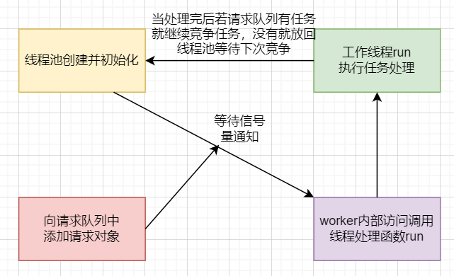

### 文章目录

-   [threadpool线程池篇简介](https://blog.csdn.net/BinBinCome/article/details/130001918#threadpool_2)
-   [一、线程池的创建与回收](https://blog.csdn.net/BinBinCome/article/details/130001918#_64)
-   [二、向请求队列添加请求任务](https://blog.csdn.net/BinBinCome/article/details/130001918#_93)
-   [三、worker函数内部访问run函数，完成线程处理](https://blog.csdn.net/BinBinCome/article/details/130001918#workerrun_114)
-   [四、run函数执行任务](https://blog.csdn.net/BinBinCome/article/details/130001918#run_126)
-   [原文链接](https://blog.csdn.net/BinBinCome/article/details/130001918#_184)

# threadpool线程池篇简介

空间换时间,浪费服务器的硬件资源,换取运行效率.

池是一组资源的集合,这组资源在服务器启动之初就被完全创建好并初始化,这称为静态资源.

当服务器进入正式运行阶段,开始处理客户请求的时候,如果它需要相关的资源,可以直接从池中获取,无需动态分配.

当服务器处理完一个客户连接后,可以把相关的资源放回池中,无需执行系统调用释放资源.



线程池的设计模式为半同步/半反应堆，其中反应堆具体为Proactor事件处理模式。

具体的，主线程为异步线程，负责监听文件描述符，接收socket新连接，若当前监听的socket发生了读写事件，然后将任务插入到请求队列。工作线程从请求队列中取出任务，完成读写数据的处理。以下为具体类的定义源码：

```cpp
class threadpool
{
public:
    /*thread_number是线程池中线程的数量，max_requests是请求队列中最多允许的、等待处理的请求的数量*/
    threadpool(int actor_model, connection_pool *connPool, int thread_number = 8, int max_request = 10000);
    ~threadpool();
    bool append(T *request, int state);
    bool append_p(T *request);

private:
    /*工作线程运行的函数，它不断从工作队列中取出任务并执行之*/
    static void *worker(void *arg);
    void run();

private:
    int m_thread_number;        //线程池中的线程数
    int m_max_requests;         //请求队列中允许的最大请求数
    pthread_t *m_threads;       //描述线程池的数组，其大小为m_thread_number
    std::list<T *> m_workqueue; //请求队列
    locker m_queuelocker;       //保护请求队列的互斥锁
    sem m_queuestat;            //是否有任务需要处理
    connection_pool *m_connPool;//数据库
    int m_actor_model;          //模型切换
};
```

**需要注意的问题：**  
threadpool也是采用RALL机制，并且是类内声明，类外初始化；  
线程处理函数和运行函数设置为私有属性；

1、worker为啥要采用静态成员函数的方法？

```bash
理由一、pthread_create的函数原型中第三个参数的类型为函数指针，指向处理线程函数的地址。
该函数，要求为静态函数。如果处理线程函数为类成员函数时，需要将其设置为静态成员函数。（或者可以采用强制类型转换？）

理由二、pthread_create的函数原型中第三个参数的类型为函数指针，指向的线程处理函数参数类型为(void *),
若线程函数为类成员函数，则this指针会作为默认的参数被传进函数中，从而和线程函数参数(void*)不能匹配，不能通过编译。
静态成员函数就没有这个问题，里面没有this指针。
```

2、为啥要定义worker函数调用run，不能直接run吗？

# 一、线程池的创建与回收

构造函数中[创建线程池](https://so.csdn.net/so/search?q=%E5%88%9B%E5%BB%BA%E7%BA%BF%E7%A8%8B%E6%B1%A0&spm=1001.2101.3001.7020),pthread\_create函数中将类的对象作为参数传递给静态函数(worker),在静态函数中引用这个对象,并调用其动态方法(run)。

具体的，类对象传递时用this指针，传递给静态函数后，将其转换为线程池类，并调用私有成员函数run。

```cpp
template <typename T>
threadpool<T>::threadpool( int actor_model, connection_pool *connPool, int thread_number, int max_requests) : m_actor_model(actor_model),m_thread_number(thread_number), m_max_requests(max_requests), m_threads(NULL),m_connPool(connPool)
{
    if (thread_number <= 0 || max_requests <= 0)
        throw std::exception();
    m_threads = new pthread_t[m_thread_number];
    if (!m_threads)
        throw std::exception();
    for (int i = 0; i < thread_number; ++i)
    {
        if (pthread_create(m_threads + i, NULL, worker, this) != 0)
        {
            delete[] m_threads;
            throw std::exception();
        }
        if (pthread_detach(m_threads[i]))
        {
            delete[] m_threads;
            throw std::exception();
        }
    }
}
```

# 二、向请求队列添加请求任务

通过list容器创建请求队列，向队列中添加时，通过互斥锁保证线程安全，添加完成后通过信号量提醒有任务要处理，最后注意线程同步。

```cpp
template <typename T>
bool threadpool<T>::append(T *request, int state)
{
    m_queuelocker.lock();//加锁保证线程安全
    if (m_workqueue.size() >= m_max_requests)//根据硬件，预设请求队列最大值
    {
        m_queuelocker.unlock();//超出请求队列最大值就解锁返回false
        return false;
    }
    request->m_state = state;
    m_workqueue.push_back(request);//添加任务
    m_queuelocker.unlock();
    m_queuestat.post();//信号量提醒线程池有任务要处理
    return true;
}
```

# 三、worker函数内部访问run函数，完成线程处理

内部访问私有成员函数run，完成线程处理要求。

```cpp
template <typename T>
void *threadpool<T>::worker(void *arg)
{
    threadpool *pool = (threadpool *)arg;将参数强转为线程池类，调用成员方法
    pool->run();
    return pool;
}
```

# 四、run函数执行任务

从请求队列中取出任务进行具体的业务逻辑处理

```cpp
void threadpool<T>::run()
{
    while (true)
    {
        m_queuestat.wait();//信号量等待
        m_queuelocker.lock();//被唤醒后先加互斥锁
        if (m_workqueue.empty())
        {
            m_queuelocker.unlock();
            continue;
        }
        T *request = m_workqueue.front();//从请求队列中取出第一个任务   
        m_workqueue.pop_front();//将任务从请求队列删除
        m_queuelocker.unlock();
        if (!request)
            continue;
        if (1 == m_actor_model)//模式判断
        {
            if (0 == request->m_state)
            {
                if (request->read_once())
                {
                    request->improv = 1;
                    connectionRAII mysqlcon(&request->mysql, m_connPool);//从连接池中取出一个数据库连接
                    request->process();//process(模板类中的方法,这里是http类)进行处理
                }
                else
                {
                    request->improv = 1;
                    request->timer_flag = 1;
                }
            }
            else
            {
                if (request->write())
                {
                    request->improv = 1;
                }
                else
                {
                    request->improv = 1;
                    request->timer_flag = 1;
                }
            }
        }
        else
        {
            connectionRAII mysqlcon(&request->mysql, m_connPool);
            request->process();
        }
    }
}
```

# 原文链接

> https://mp.weixin.qq.com/s?\_\_biz=MzAxNzU2MzcwMw==&mid=2649274278&idx=5&sn=87470bb3ade0150bb94fcbf33c43c2f8&chksm=83ffbefeb48837e843cfc8258248a1e1b69b48ed993c51861ec63e3b0541fa4714a3846adf90&scene=178&cur\_album\_id=1339230165934882817#rd