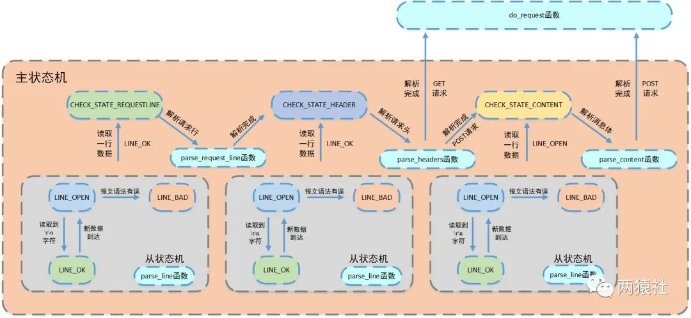
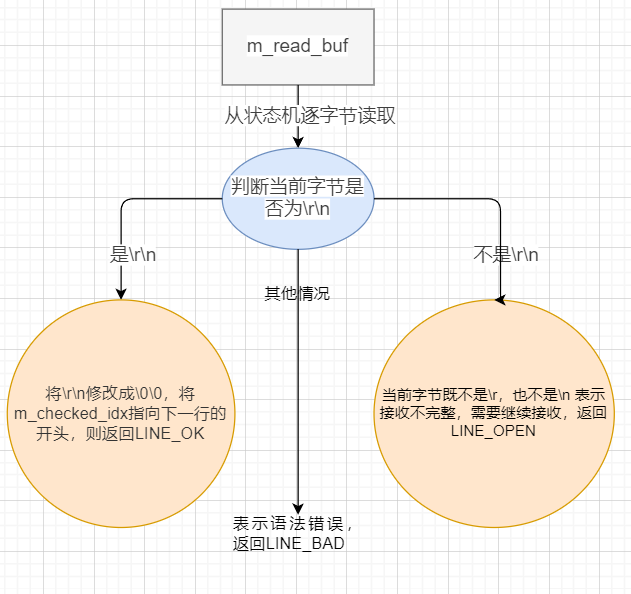
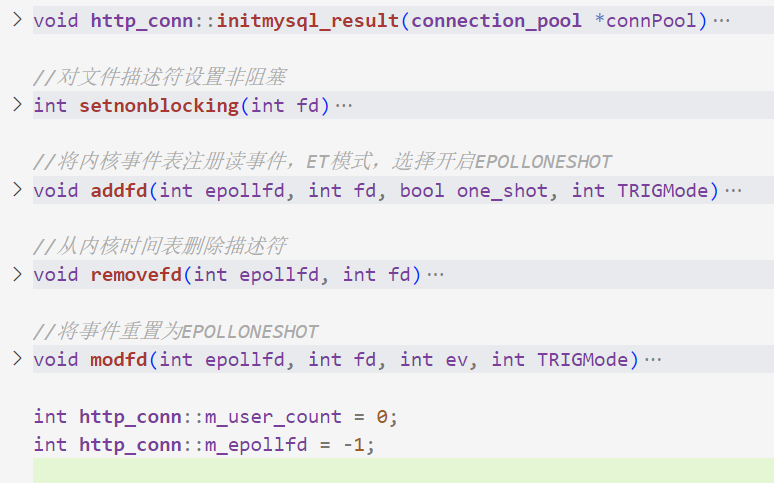
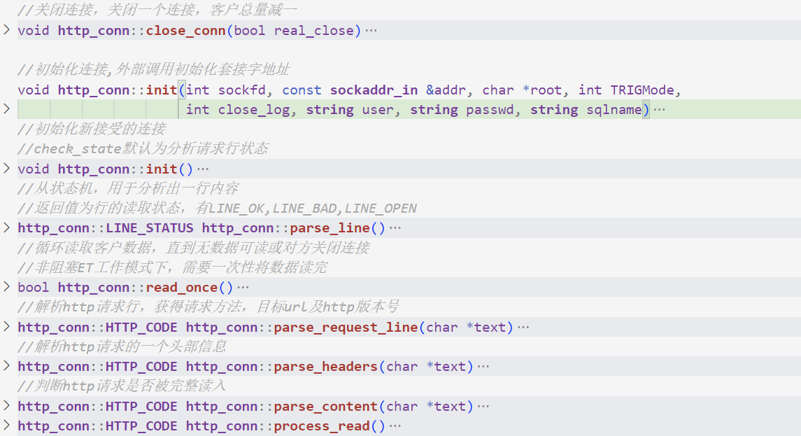
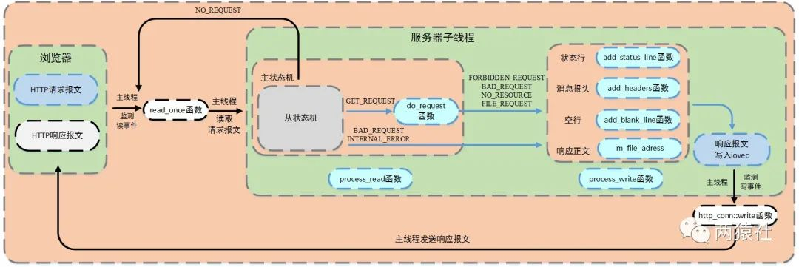
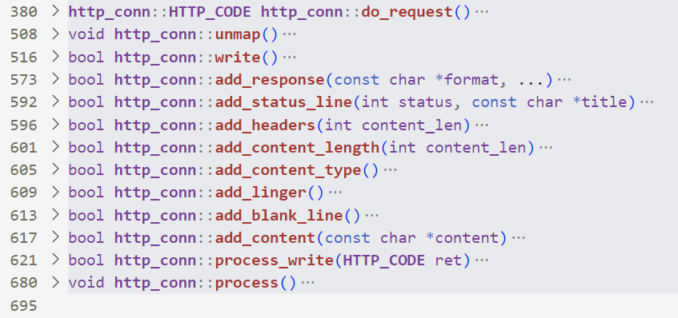

### 文章目录

-   [http篇简介](https://blog.csdn.net/BinBinCome/article/details/130009978#http_3)
-   [一、服务器接收http请求和http报文解析](https://blog.csdn.net/BinBinCome/article/details/130009978#httphttp_119)
-   -   [解析报文整体流程](https://blog.csdn.net/BinBinCome/article/details/130009978#_153)
    -   [从状态机逻辑](https://blog.csdn.net/BinBinCome/article/details/130009978#_172)
    -   [主状态机逻辑](https://blog.csdn.net/BinBinCome/article/details/130009978#_175)
-   [二、服务器响应请求报文](https://blog.csdn.net/BinBinCome/article/details/130009978#_218)

# http篇简介

> http类这篇个人觉得是最难同时也是最繁琐的一篇，本篇在基础知识方面，包括[epoll](https://so.csdn.net/so/search?q=epoll&spm=1001.2101.3001.7020)、HTTP报文格式、状态码和有限状态机，不做赘述，所有源码分析的篇章基础知识会做单开一篇或者读者可以看**小白一文看懂社长服务器**来补基础知识。真的佩服那个叫社长的男人，我读代码且困难，他是自己手敲的啊！

**http报文处理流程**  
1、浏览器端发出http连接请求，主线程创建http对象接收请求并将所有数据读入对应buffer，将该对象插入任务队列，工作线程从任务队列中取出一个任务进行处理。

2、工作线程取出任务后，调用process\_read函数，通过主、从状态机对请求报文进行解析。

3、解析完之后，跳转do\_request函数生成响应报文，通过process\_write写入buffer，返回给浏览器端。

**http类头文件源码如下：**

```bash
class http_conn
{
public:
    static const int FILENAME_LEN = 200;//设置读取文件的名称m_real_file大小
    static const int READ_BUFFER_SIZE = 2048;//设置读缓冲区m_read_buf大小
    static const int WRITE_BUFFER_SIZE = 1024;//设置写缓冲区m_write_buf大小
    //报文的请求方法，本项目只用到GET和POST
    enum METHOD{GET=0,POST,HEAD,PUT,DELETE,TRACE,OPTIONS,CONNECT,PATH};
    //主状态机的状态
    enum CHECK_STATE{CHECK_STATE_REQUESTLINE=0,CHECK_STATE_HEADER,CHECK_STATE_CONTENT};
    //报文解析的结果
    enum HTTP_CODE{NO_REQUEST,GET_REQUEST,BAD_REQUEST,NO_RESOURCE,FORBIDDEN_REQUEST,FILE_REQUEST,INTERNAL_ERROR,CLOSED_CONNECTION};
    //从状态机的状态  
    enum LINE_STATUS{LINE_OK=0,LINE_BAD,LINE_OPEN};
public:
    http_conn() {}
    ~http_conn() {}

public:
//初始化套接字地址，函数内部会调用私有方法init
    void init(int sockfd, const sockaddr_in &addr, char *, int, int, string user, string passwd, string sqlname);
    void close_conn(bool real_close = true);    //关闭http连接
    void process();
    bool read_once();//读取浏览器端发来的全部数据
    bool write();//响应报文写入函数
    sockaddr_in *get_address(){return &m_address;}//获取套接字地址
    void initmysql_result(connection_pool *connPool);//同步线程初始化数据库读取表
    int timer_flag;
    int improv;
//原文中使用线程池初始化数据库表的函数initresultFileCGI()头文件中没找到，但是具体实现文件中找到了;

private:
    void init();
    HTTP_CODE process_read();//从m_read_buf读取，并处理请求报文
    bool process_write(HTTP_CODE ret);//向m_write_buf写入响应报文数据
    HTTP_CODE parse_request_line(char *text);//主状态机解析报文中的请求行数据
    HTTP_CODE parse_headers(char *text);//主状态机解析报文中的请求头数据
    HTTP_CODE parse_content(char *text); //主状态机解析报文中的请求内容
    
    HTTP_CODE do_request();//生成响应报文
    char *get_line() { return m_read_buf + m_start_line; };//m_start_line是已经解析的字符，get_line用于将指针向后偏移，指向未处理的字符
    LINE_STATUS parse_line();//从状态机读取一行，分析是请求报文的哪一部分
    void unmap();//释放共享内存空间资源

//根据响应报文格式，生成对应8个部分，以下函数均由do_request调用
    bool add_response(const char *format, ...);
    bool add_content(const char *content);
    bool add_status_line(int status, const char *title);
    bool add_headers(int content_length);
    bool add_content_type();
    bool add_content_length(int content_length);
    bool add_linger();
    bool add_blank_line();

public:
    static int m_epollfd;
    static int m_user_count;
    MYSQL *mysql;
    int m_state;  //读为0, 写为1

private:
    int m_sockfd;
    sockaddr_in m_address;
    char m_read_buf[READ_BUFFER_SIZE];//存储读取的请求报文数据
    long m_read_idx;//缓冲区中m_read_buf中数据的最后一个字节的下一个位置
    long m_checked_idx;//m_read_buf读取的位置m_checked_idx
    int m_start_line;//m_read_buf中已经解析的字符个数
    char m_write_buf[WRITE_BUFFER_SIZE];//存储发出的响应报文数据
    int m_write_idx;//指示buffer中的长度
    
    CHECK_STATE m_check_state;//主状态机的状态
    METHOD m_method;//请求方法

//以下为解析请求报文中对应的6个变量//存储读取文件的名称
    char m_real_file[FILENAME_LEN];
    char *m_url;
    char *m_version;
    char *m_host;
    long m_content_length;
    bool m_linger;


    char *m_file_address;//读取服务器上的文件地址
    struct stat m_file_stat;
    struct iovec m_iv[2];//io向量机制iovec
    int m_iv_count;
    int cgi;        //是否启用的POST
    char *m_string; //存储请求头数据
    int bytes_to_send;//剩余发送字节数
    int bytes_have_send;//已发送字节数
    char *doc_root;//网站根目录，文件夹内存放请求的资源和跳转的html文件

    map<string, string> m_users;
    int m_TRIGMode;
    int m_close_log;

    char sql_user[100];
    char sql_passwd[100];
    char sql_name[100];
};
```

# 一、服务器接收http请求和http报文解析

浏览器端发出http连接请求，主线程创建http对象接收请求并将所有数据读入对应buffer，将该对象插入任务队列，工作线程从任务队列中取出一个任务进行处理。

各子线程通过process函数对任务进行处理，调用process\_read函数和process\_write函数分别完成报文解析与报文响应两个任务。

以下主从状态机解析报文流程图和解释来自社长原文：  
  
**主状态机**  
三种状态，标识解析位置。

-   CHECK\_STATE\_REQUESTLINE，解析请求行
    
-   CHECK\_STATE\_HEADER，解析请求头
    
-   CHECK\_STATE\_CONTENT，解析消息体，仅用于解析POST请求
    

**从状态机**  
三种状态，标识解析一行的读取状态。

-   LINE\_OK，完整读取一行
    
-   LINE\_BAD，报文语法有误
    
-   LINE\_OPEN，读取的行不完整
    

对于主从状态机解析的结果定义为**HTTP\_CODE**，分别为

-   NO\_REQUEST//请求不完整，需要继续读取请求报文数据
    
-   GET\_REQUEST//获得了完整的HTTP请求
    
-   BAD\_REQUEST //HTTP请求报文有语法错误
    
-   INTERNAL\_ERROR//服务器内部错误，该结果在主状态机逻辑switch的default下，一般不会触发
    

## 解析报文整体流程

process\_read通过while循环，将主从状态机进行封装，对报文的每一行进行循环处理。  
**在HTTP报文中，每一行的数据由\\r\\n作为结束字符，空行则是仅仅是字符\\r\\n。因此，可以通过查找\\r\\n将报文拆解成单独的行进行解析。**  
判断条件

-   主状态机转移到CHECK\_STATE\_CONTENT，该条件涉及解析消息体
    
-   从状态机转移到LINE\_OK，该条件涉及解析请求行和请求头部
    
-   两者为或关系，当条件为真则继续循环，否则退出
    

循环体

-   从状态机读取数据
    
-   调用get\_line函数，通过m\_start\_line将从状态机读取数据间接赋给text
    
-   主状态机解析text
    

## 从状态机逻辑

从状态机负责读取buffer中的数据，将每行数据末尾的\\r\\n置为\\0\\0，并更新从状态机在buffer中读取的位置m\_checked\_idx，以此来驱动主状态机解析。  


## 主状态机逻辑

主状态机初始状态是CHECK\_STATE\_REQUESTLINE，通过调用从状态机来驱动主状态机，在主状态机进行解析前，从状态机已经将每一行的末尾\\r\\n符号改为\\0\\0，以便于主状态机直接取出对应字符串进行处理。

CHECK\_STATE\_REQUESTLINE

-   主状态机的初始状态，调用parse\_request\_line函数解析请求行
    
-   解析函数从m\_read\_buf中解析HTTP请求行，获得请求方法、目标URL及HTTP版本号
    
-   解析完成后主状态机的状态变为CHECK\_STATE\_HEADER
    

解析完请求行后，主状态机继续分析请求头。在报文中，请求头和空行的处理使用的同一个函数，这里通过判断当前的text首位是不是\\0字符，若是，则表示当前处理的是空行，若不是，则表示当前处理的是请求头。

CHECK\_STATE\_HEADER

-   调用parse\_headers函数解析请求头部信息
    
-   判断是空行还是请求头，若是空行，进而判断content-length是否为0，如果不是0，表明是POST请求，则状态转移到CHECK\_STATE\_CONTENT，否则说明是GET请求，则报文解析结束。
    
-   若解析的是请求头部字段，则主要分析connection字段，content-length字段，其他字段可以直接跳过，各位也可以根据需求继续分析。
    
-   connection字段判断是keep-alive还是close，决定是长连接还是短连接
    
-   content-length字段，这里用于读取post请求的消息体长度
    

解析完消息体后，报文的完整解析就完成了，但此时主状态机的状态还是CHECK\_STATE\_CONTENT，也就是说，符合循环入口条件，还会再次进入循环，这并不是我们所希望的。

为此，增加了`&& line_status==LINE_OK`，并在完成消息体解析后，将line\_status变量更改为LINE\_OPEN，此时可以跳出循环，完成报文解析任务。

CHECK\_STATE\_CONTENT

-   仅用于解析POST请求，调用parse\_content函数解析消息体
    
-   用于保存post请求消息体，为后面的登录和注册做准备
    

下面是**源码函数截图**（代码太多了…）：  
initmysql\_result函数是对数据库的操作封装  
而 addfd 、removefd 、modfd 、setnonblocking  
这几个函数都是epoll常用操作的封装，具体作用如社长源码中注释所示：  


read\_once读取浏览器端发送来的请求报文，直到无数据可读或对方关闭连接，读取到m\_read\_buffer中，并更新m\_read\_idx。  


# 二、服务器响应请求报文

浏览器端发出HTTP请求报文，服务器端接收该报文并调用process\_read对其进行解析，根据解析结果HTTP\_CODE，进入相应的逻辑和模块。

其中，服务器子线程完成报文的解析与响应；主线程监测读写事件，调用read\_once和http\_conn::write完成数据的读取与发送。





 

文章知识点与官方知识档案匹配，可进一步学习相关知识