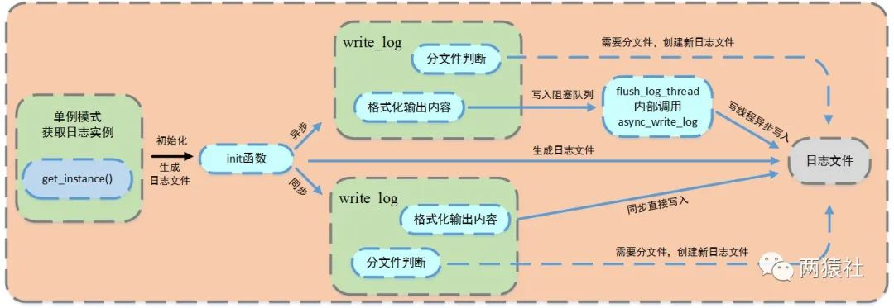
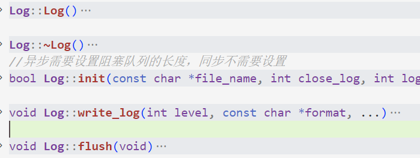

### 文章目录

-   [log日志篇简介](https://blog.csdn.net/BinBinCome/article/details/130014765#log_1)
-   [一、日志类的定义与使用](https://blog.csdn.net/BinBinCome/article/details/130014765#_14)
-   [二、单例模式与阻塞队列的定义](https://blog.csdn.net/BinBinCome/article/details/130014765#_119)
-   -   [1、单例模式](https://blog.csdn.net/BinBinCome/article/details/130014765#1_121)
    -   [2、阻塞队列](https://blog.csdn.net/BinBinCome/article/details/130014765#2_168)

# log日志篇简介

使用**单例模式**创建日志系统，对服务器运行状态、错误信息和访问数据进行记录，该系统可以实现按天分类，超行分类功能。其中**异步写入**方式，将**生产者-消费者模型**封装为**阻塞队列**，创建一个写线程，工作线程将要写的内容push进队列，写线程从队列中取出内容，写入日志文件。

> **日志**，由服务器自动创建，并记录运行状态，错误信息，访问数据的文件  
> **异步日志**，将所写的日志内容先存入[阻塞队列](https://so.csdn.net/so/search?q=%E9%98%BB%E5%A1%9E%E9%98%9F%E5%88%97&spm=1001.2101.3001.7020)，写线程从阻塞队列中取出内容，写入日志。  
> **同步日志**，日志写入函数与工作线程串行执行  
> **生产者-消费者模型**，生产者线程与消费者线程共享一个缓冲区，生产者线程往缓冲区中push消息，消费者线程从缓冲区中pop消息。  
> **阻塞队列**，将生产者-消费者模型进行封装，使用[循环数组](https://so.csdn.net/so/search?q=%E5%BE%AA%E7%8E%AF%E6%95%B0%E7%BB%84&spm=1001.2101.3001.7020)实现队列，作为两者共享的缓冲区。  
> **单例模式**，保证一个类只创建一个实例，同时提供全局访问的方法。



# 一、日志类的定义与使用

通过局部变量的懒汉单例模式创建日志实例，对其进行初始化生成日志文件后，[格式化输出](https://so.csdn.net/so/search?q=%E6%A0%BC%E5%BC%8F%E5%8C%96%E8%BE%93%E5%87%BA&spm=1001.2101.3001.7020)内容，并根据不同的写入方式，完成对应逻辑，写入日志文件。

**类头文件源码如下：**

```bash
#include <stdio.h>
#include <iostream>
#include <string>
#include <stdarg.h>
#include <pthread.h>
#include "block_queue.h"

using namespace std;

class Log
{
public:
    //C++11以后,使用局部变量懒汉不用加锁
    static Log *get_instance()
    {
        static Log instance;
        return &instance;
    }

    static void *flush_log_thread(void *args)
    {//异步写日志公有方法，调用私有方法async_write_log
        Log::get_instance()->async_write_log();
    }
    //可选择的参数有日志文件、日志缓冲区大小、最大行数以及最长日志条队列
    bool init(const char *file_name, int close_log, int log_buf_size = 8192, int split_lines = 5000000, int max_queue_size = 0);

    void write_log(int level, const char *format, ...);//将输出内容按照标准格式整理

    void flush(void);//强制刷新缓冲区

private:
    Log();
    virtual ~Log();
    void *async_write_log()
    {//异步写日志方法
        string single_log;
        
        while (m_log_queue->pop(single_log))
        {//从阻塞队列中取出一个日志string，写入文件
            m_mutex.lock();
            fputs(single_log.c_str(), m_fp);
            m_mutex.unlock();
        }
    }

private:
    char dir_name[128]; //路径名
    char log_name[128]; //log文件名
    int m_split_lines;  //日志最大行数
    int m_log_buf_size; //日志缓冲区大小
    long long m_count;  //日志行数记录
    int m_today;        //因为按天分类,记录当前时间是那一天
    FILE *m_fp;         //打开log的文件指针
    char *m_buf;//要输出的内容
    block_queue<string> *m_log_queue; //阻塞队列
    bool m_is_async;                  //是否同步标志位
    locker m_mutex;  //同步类
    int m_close_log;   //关闭日志
};

//这四个宏定义在其他文件中使用，主要用于不同类型的日志输出对日志等级进行分类，包括DEBUG，INFO，WARN和ERROR四种级别的日志
#define LOG_DEBUG(format, ...) if(0 == m_close_log) {Log::get_instance()->write_log(0, format, ##__VA_ARGS__); Log::get_instance()->flush();}
#define LOG_INFO(format, ...) if(0 == m_close_log) {Log::get_instance()->write_log(1, format, ##__VA_ARGS__); Log::get_instance()->flush();}
#define LOG_WARN(format, ...) if(0 == m_close_log) {Log::get_instance()->write_log(2, format, ##__VA_ARGS__); Log::get_instance()->flush();}
#define LOG_ERROR(format, ...) if(0 == m_close_log) {Log::get_instance()->write_log(3, format, ##__VA_ARGS__); Log::get_instance()->flush();}

```

日志分级的实现大同小异，一般的会提供五种级别，具体的，

Debug，调试代码时的输出，在系统实际运行时，一般不使用。

Warn，这种警告与调试时终端的warning类似，同样是调试代码时使用。

Info，报告系统当前的状态，当前执行的流程或接收的信息等。

Error和Fatal，输出系统的错误信息。

本项目中给出了除Fatal外的四种分级，实际使用了Debug，Info和Error三种。

超行、按天分文件逻辑，具体的，

日志写入前会判断当前day是否为创建日志的时间，行数是否超过最大行限制

若为创建日志时间，写入日志，否则按当前时间创建新log，更新创建时间和行数

若行数超过最大行限制，在当前日志的末尾加count/max\_lines为后缀创建新log

将系统信息格式化后输出，具体为：格式化时间 + 格式化内容

**类具体实现源码如下：**  
  
init函数实现日志创建、写入方式的判断。

write\_log函数完成写入日志文件中的具体内容，主要实现日志分级、分文件、格式化输出内容。

生成日志文件 && 判断写入方式  
通过单例模式获取唯一的日志类，调用init方法，初始化生成日志文件，服务器启动按当前时刻创建日志，前缀为时间，后缀为自定义log文件名，并记录创建日志的时间day和行数count。

写入方式通过初始化时是否设置队列大小（表示在队列中可以放几条数据）来判断，若队列大小为0，则为同步，否则为异步。

# 二、单例模式与阻塞队列的定义

## 1、单例模式

实现思路：私有化它的构造函数，以防止外界创建单例类的对象；使用类的私有静态指针变量指向类的唯一实例，并用一个公有的静态方法获取该实例。

单例模式有两种实现方法，分别是懒汉和饿汉模式。顾名思义，懒汉模式，即非常懒，不用的时候不去初始化，所以在第一次被使用时才进行初始化；饿汉模式，即迫不及待，在程序运行时立即初始化。

**经典的懒汉模式使用双重检查锁创建，然鹅也可以使用函数内的局部静态对象创建**

> 如果只检测一次，在每次调用获取实例的方法时，都需要加锁，这将严重影响程序性能。双层检测可以有效避免这种情况，仅在第一次创建单例的时候加锁，其他时候都不再符合NULL == p的情况，直接返回已创建好的实例。

```bash
class single{
private:
    single(){}
    ~single(){}
public:
     static single* getinstance();
};

single* single::getinstance(){
    static single obj;
    return &obj;
}
```

C++0X以后由编译器保证内部静态变量的线程安全性，C++0X之前仍然需要加锁

```bash
class single{
private:
    static pthread_mutex_t lock;
    single(){
        pthread_mutex_init(&lock, NULL);
    }
    ~single(){}

public:
    static single* getinstance();

};
pthread_mutex_t single::lock;
single* single::getinstance(){
    pthread_mutex_lock(&lock);
    static single obj;
    pthread_mutex_unlock(&lock);
    return &obj;
}
```

饿汉模式不需要用锁，就可以实现线程安全。原因在于，在程序运行时就定义了对象，并对其初始化。之后，不管哪个线程调用成员函数getinstance()，都只不过是返回一个对象的指针而已。所以是线程安全的，不需要在获取实例的成员函数中加锁。  
饿汉模式虽好，但其存在隐藏的问题，在于非静态对象（函数外的static对象）在不同编译单元中的初始化顺序是未定义的。如果在初始化完成之前调用 getInstance() 方法会返回一个未定义的实例。

## 2、阻塞队列

阻塞队列主要是用于生产者消费者模型，可以使用queue也可以自定义，这里采用的自定义的方式；

条件变量提供了一种线程间的通知机制，当某个共享数据达到某个值时,唤醒等待这个共享数据的线程。  
**重点一**：

```bash
pthread _mutex_lock(&mutex)
while(线程执行的条件是否成立){
    pthread_cond_wait(&cond, &mutex);
}
pthread_mutex_unlock(&mutex);
```

pthread\_cond\_wait执行后的内部操作分为以下几步：

1、将线程放在条件变量的请求队列后，内部解锁

2、线程等待被pthread\_cond\_broadcast信号唤醒或者pthread\_cond\_signal信号唤醒，唤醒后去竞争锁

3、若竞争到互斥锁，内部再次加锁

使用前加锁是为了避免资源竞争，让每个线程互斥的访问公有资源；  
内部解锁是因为当前线程执行pthread\_cond\_wait时，一定是处于某个临界区，正在访问共享资源，存在一个mutex与该临界区相关联。因此，在阻塞前，必须释放mutex；  
被唤醒后，仍然处于临界区，因此需要再次获得mutex。

**重点二**  
为什么判断线程执行的条件用while而不是if？  
一般来说，在多线程资源竞争的时候，在一个使用资源的线程里面（消费者）判断资源是否可用，不可用，便调用pthread\_cond\_wait，在另一个线程里面（生产者）如果判断资源可用的话，则调用pthread\_cond\_signal发送一个资源可用信号。

在wait成功之后，资源就一定可以被使用么？答案是否定的，如果同时有两个或者两个以上的线程正在等待此资源，wait返回后，资源可能已经被使用了。

再具体点，有可能多个线程都在等待这个资源可用的信号，信号发出后只有一个资源可用，但是有A，B两个线程都在等待，B比较速度快，获得互斥锁，然后加锁，消耗资源，然后解锁，之后A获得互斥锁，但A回去发现资源已经被使用了，它便有两个选择，一个是去访问不存在的资源，另一个就是继续等待，那么继续等待下去的条件就是使用while，要不然使用if的话pthread\_cond\_wait返回后，就会顺序执行下去。

所以，在这种情况下，应该使用while而不是if:

**自定义队列源码分析：**  
阻塞队列类中封装了生产者-消费者模型，其中push成员是生产者，pop成员是消费者。  
阻塞队列中，使用了循环数组实现了队列，作为两者共享缓冲区，当然了，队列也可以使用STL中的queue。

当队列为空时，从队列中获取元素的线程将会被挂起；当队列是满时，往队列里添加元素的线程将会挂起。

```bash
/*************************************************************
*循环数组实现的阻塞队列，m_back = (m_back + 1) % m_max_size;  
*线程安全，每个操作前都要先加互斥锁，操作完后，再解锁
**************************************************************/

#ifndef BLOCK_QUEUE_H
#define BLOCK_QUEUE_H

#include <iostream>
#include <stdlib.h>
#include <pthread.h>
#include <sys/time.h>
#include "../lock/locker.h"
using namespace std;

template <class T>
class block_queue
{
public:
    block_queue(int max_size = 1000)
    {
        if (max_size <= 0)
        {
            exit(-1);
        }

        m_max_size = max_size;
        m_array = new T[max_size];
        m_size = 0;
        m_front = -1;
        m_back = -1;
    }

    void clear()
    {
        m_mutex.lock();
        m_size = 0;
        m_front = -1;
        m_back = -1;
        m_mutex.unlock();
    }

    ~block_queue()
    {
        m_mutex.lock();
        if (m_array != NULL)
            delete [] m_array;

        m_mutex.unlock();
    }
    //判断队列是否满了
    bool full() 
    {
        m_mutex.lock();
        if (m_size >= m_max_size)
        {

            m_mutex.unlock();
            return true;
        }
        m_mutex.unlock();
        return false;
    }
    //判断队列是否为空
    bool empty() 
    {
        m_mutex.lock();
        if (0 == m_size)
        {
            m_mutex.unlock();
            return true;
        }
        m_mutex.unlock();
        return false;
    }
    //返回队首元素
    bool front(T &value) 
    {
        m_mutex.lock();
        if (0 == m_size)
        {
            m_mutex.unlock();
            return false;
        }
        value = m_array[m_front];
        m_mutex.unlock();
        return true;
    }
    //返回队尾元素
    bool back(T &value) 
    {
        m_mutex.lock();
        if (0 == m_size)
        {
            m_mutex.unlock();
            return false;
        }
        value = m_array[m_back];
        m_mutex.unlock();
        return true;
    }

    int size() 
    {
        int tmp = 0;

        m_mutex.lock();
        tmp = m_size;

        m_mutex.unlock();
        return tmp;
    }

    int max_size()
    {
        int tmp = 0;

        m_mutex.lock();
        tmp = m_max_size;

        m_mutex.unlock();
        return tmp;
    }
    //往队列添加元素，需要将所有使用队列的线程先唤醒
    //当有元素push进队列,相当于生产者生产了一个元素
    //若当前没有线程等待条件变量,则唤醒无意义
    bool push(const T &item)
    {

        m_mutex.lock();
        if (m_size >= m_max_size)
        {

            m_cond.broadcast();
            m_mutex.unlock();
            return false;
        }

        m_back = (m_back + 1) % m_max_size;
        m_array[m_back] = item;

        m_size++;

        m_cond.broadcast();
        m_mutex.unlock();
        return true;
    }
    //pop时,如果当前队列没有元素,将会等待条件变量
    bool pop(T &item)
    {

        m_mutex.lock();
        while (m_size <= 0)
        {
            
            if (!m_cond.wait(m_mutex.get()))
            {
                m_mutex.unlock();
                return false;
            }
        }

        m_front = (m_front + 1) % m_max_size;
        item = m_array[m_front];
        m_size--;
        m_mutex.unlock();
        return true;
    }

    //增加了超时处理
    bool pop(T &item, int ms_timeout)
    {
        struct timespec t = {0, 0};
        struct timeval now = {0, 0};
        gettimeofday(&now, NULL);
        m_mutex.lock();
        if (m_size <= 0)
        {
            t.tv_sec = now.tv_sec + ms_timeout / 1000;
            t.tv_nsec = (ms_timeout % 1000) * 1000;
            if (!m_cond.timewait(m_mutex.get(), t))
            {
                m_mutex.unlock();
                return false;
            }
        }

        if (m_size <= 0)
        {
            m_mutex.unlock();
            return false;
        }

        m_front = (m_front + 1) % m_max_size;
        item = m_array[m_front];
        m_size--;
        m_mutex.unlock();
        return true;
    }

private:
    locker m_mutex;
    cond m_cond;

    T *m_array;
    int m_size;
    int m_max_size;
    int m_front;
    int m_back;
};

#endif

```