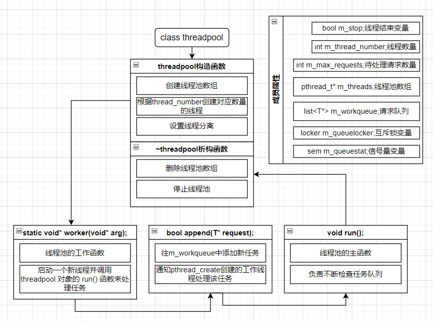

## 线程池

> 参考：
>
> 1、游双[Linux高性能服务器编程](http://www.baidu.com/link?url=r-mQW_6e8k96qt-5rOxLjoBaET_W8t20oEWuInB6izQLf5GYkRlKyf4muPJNWTj7FgLy8qf103Whkgib_hqHXa)
>
> 2、[TinyWebServer](https://github.com/qinguoyi/TinyWebServer)

注：虽然是"从0开始"，但最好对（多）线程、线程同步等知识点有所了解再看，不然可能有些地方会理解不到位（但也有可能是我没说明到位，水平有限，见谅）

### Web服务器与线程池的关系

Web服务器需要**同时处理多个客户端请求**，并且每个请求可能需要花费很长时间来处理，如数据库查询、文件读写等操作。

因此**Web服务器不太可能是单线程的**，要实现并发操作就必须引入多线程技术

使用线程池的服务器属于多线程服务器。**线程池本质上是一种多线程技术**，通过在程序启动时创建一定数量的工作线程，并将所有请求任务加入到任务队列中，以便线程池中的多个工作线程可以同时处理请求任务。

在Web服务器中，线程池的作用是**有效地处理并发请求，提高服务器的并发能力和性能**。

具体地，Web服务器通过线程池实现以下几个方面的功能：

1.  **提高并发性能**：线程池可以在同一时刻处理多个请求，从而提高服务器的并发处理能力，减少请求响应时间。
2.  **控制线程数量**：线程池可以控制同时执行的线程数量，从而避免线程数目过多导致系统资源耗尽。
3.  **管理线程状态**：线程池可以对工作线程进行管理，并监测工作线程的状态，如是否空闲、是否存活等。
4.  **避免线程创建销毁开销**：使用线程池可以避免频繁地创建和销毁线程，从而减少系统开销，提高服务器的性能。

### 实现一个线程池

> 前置知识：互斥锁、信号量、C++模板编程
>
> （注：代码中使用的）

线程池在代码实现上是一个模板类，使用模板的原因是方便进行复用



线程池模板类，**主要用于管理多个线程并处理任务**。其中包含以下主要成员变量和函数：

-   **成员变量**：线程数量（m\_thread\_number）、最大请求数（m\_max\_requests）、线程池数组（m\_threads）、请求队列（m\_workqueue）、互斥锁（m\_queuelocker）、信号量（m\_queuestat）和是否停止标志（m\_stop）。
-   **成员函数**：构造函数（threadpool()）、析构函数（~threadpool()）、添加任务（append()）、子线程中要执行的工作函数（worker()）和启动线程池中的一个或多个线程进行任务处理的函数（run()）。

下面是该代码的工作流程和原理：

 1、**创建线程池**

创建时，会先判断线程数和最大请求数是否小于等于0。之后，会创建一个大小为 m\_thread\_number 的线程池数组，并将其设置为线程脱离状态，即在创建完线程之后就可以将其与当前的进程分离，避免线程阻塞主线程和其他相关线程的运行。如果创建时失败，则抛出异常。

 2、**添加任务**

往任务队列中添加请求时，会先加锁（使用互斥锁），以确保多个进程不会争抢。之后，会判断任务队列中的请求数是否超过 m\_max\_requests，如果队列大小大于最大请求数，则解锁并返回 false。否则，将请求添加到队列中，解锁并增加信号量，通知线程池中的线程，有新任务需要处理。最终返回 true。

 3、**线程工作函数**

当收到信号量后，线程会先上锁（使用互斥锁），以确保多个线程不会同时访问队列。之后，会判断任务队列是否为空。如果队列为空，则解锁并继续等待下一次信号量的到来。否则，取出队列顶部的请求，并将其弹出队列。最后，解锁，并调用任务函数（request->process()）。

 4、**析构函数**

执行析构函数时，将 m\_stop 设置为 true，供线程判断是否要停止。

#### 定义线程池类

先来定义一下线程池类

```c++
template<typename T> threadpool {
private:
    int m_thread_number;//线程数
    int m_max_requests;//最大请求数
    bool m_stop;//停止符
    pthread_t* m_thread;//线程池数组
    std::list<T*> m_workqueue;//任务队列
    locker queuelocker;//互斥锁，locker是对系统提供的mutex方法的封装，位于locker.h中
    sem m_queuestat;//信号量
private:
    static void* worker(void* arg);//工作函数
    void run();//线程池的主函数，用于检查任务队列中的请求
    
public:
    threadpool(int m_thread_number = 8, int m_max_requests = 1000);//构造
    ~threadpool();//析构
    bool append();//将请求加入m_workqueue中   
}
```

其实也没有很复杂，但是有以下几个点需要注意：

##### 1、线程池数组m\_thread和任务队列m\_workqueue是没有直接联系的

在线程池类初始化时，线程池数组就会根据指定的 线程数m\_thread\_number 来**创建对应数量的线程**

这些线程会**被阻塞**（一直调用 run函数 检查 m\_workqueue 中有无请求），直到 \*\*外部调用线程池对象的代码 \*\*通过调用`threadpool<T>`类的对象的`append()`方法 **向任务队列中添加新的任务**

这时，`append()`才会定义模板类中声明的 任务队列m\_workqueue（也就是往队列中push请求任务）

此时，之前被创建的某个线程检查到队列中有任务，于是其获取到了锁

将队列中的请求弹出，调用对应的任务函数进行处理

综上，虽然线程池数组和任务队列没有直接联系，但是他们具有协作关系，**实现服务器对于请求的监听和处理操作**

##### 2、工作函数为什么要定义为静态的，并且其返回值为什么是`void*`？

在C语言中，函数的返回值只能是一个类型。但是有些时候，我们需要从一个函数中**返回多个值**或者**不同类型的值**。

在这种情况下，我们可以使用指针或者void指针来达到这个目的。

在这里，worker被定义为`static void*`，其中`void*`表示一个指向内存地址的指针，但是它没有指定具体的数据类型。

这意味着**worker函数可以返回任何类型的指针**，这使得worker函数具有更大的灵活性，并且**可以处理各种不同类型的数据**。

同时，通过将worker函数声明为static，它只能在当前文件中使用，可以**避免与其他文件**中的函数**名称重复**的问题。

好了，线程池模板类定义完了，现在需要在类外分别实现各个成员函数

按顺序来：构造函数->析构函数->...

#### 实现线程池构造函数

构造函数负责根据给定的thread\_number来创建线程

首先，我们需要判断所给的参数范围是否合法

然后创建线程池数组，大小为thread\_number，最后调用pthread\_create函数创建线程，使用pthread\_detach函数将线程设置为**脱离状态**

```c++
template<typename T> //通过参数列表进行初始化
threadpool<T>::threadpool(int thread_number, int max_requests):m_thread_number(thread_number),m_max_requests(max_requests),
    m_stop(false), m_threads(NULL){
    //异常判断，线程数和最大请求数小于0，报错
        if((thread_number <= 0) || (max_requests <= 0)){
            throw std:: exception();
        }
        m_threads = new pthread_t[m_thread_number];//创建线程池数组
        if(!m_threads){
            throw std:: exception();
        }
        for(int i = 0; i < thread_number; ++i){
            printf("创建第 %d 个线程\n", i);
            if(pthread_create(m_threads + i, NULL, worker, this) != 0){
                delete[] m_threads;
                throw std::exception();//创建失败
            }
            if(pthread_detach(m_threads[i])){//在调用pthread_detach()函数之后，线程将进入“分离”状态，这意味着它不能再被其他线程或主线程等待和加入。
            }
        }     
} 
```

从构造函数可知，线程是在线程池创建时就被创建的，并且数量是固定的

有以下注意点：

##### 1、pthread\_create函数的传入参数

pthread\_create()函数需要四个输入参数，分别是：

1.**线程标识符指针**（pthread\_t \*），用于存储新创建线程的标识符；

2.**线程属性指针**（const pthread\_attr\_t \*），用于设置新线程的属性。如果不需要设置，则可以将该参数设置为NULL；

3.**指向函数的指针**（void _(_start\_routine) (void \*)），用于作为新线程的入口点。新线程开始执行时会从该函数开始执行；

4.**传递给新线程入口点函数的参数指针**（void \*），该参数可以是任意类型的指针，它会被传递给新线程入口点函数。

在本代码中，pthread\_create()函数的第一个参数是一个pthread\_t类型的指针，该指针用于存储新创建线程的标识符。

第二个参数设置为NULL，因为我们不需要设置新线程的属性。

第三个参数是一个指向worker函数的指针，作为新线程的入口点。

最后一个参数是一个指向当前threadpool对象的指针，它被传递给worker函数作为参数，让worker函数能够访问到threadpool对象的所有

成员。

**m\_threads + i** 表示将 m\_threads指针 向后偏移 i 个 pthread\_t类型的长度，即**指向线程池中第i个工作线程**的标识符。

m\_threads 是一个指向pthread\_t类型的数组，当使用 m\_threads\[i\] 时，实际上是**对m\_threads数组中第i个元素进行访问**。

因此，**m\_threads + i** 表示对 m\_threads数组 进行偏移，使其指向第i个元素的地址。

在`pthread_create()`函数中，需要传递一个指向线程标识符的指针作为参数，来保存新建线程的标识符。

因此，可以使用 **m\_threads + i** 作为该参数，表示将指向第i个工作线程的标识符的地址传递给`pthread_create()`函数。

**worker**是一个**静态成员函数**，它作为线程执行的入口点，**用于处理任务队列中的请求**。

**this指针**是一个**指向当前threadpool对象的指针**，它被传递给worker函数作为参数。

由于worker函数是静态的，因此无法访问threadpool对象的非静态成员。

> （为了防止重名所以设为静态）

因此，需要将threadpool对象的指针作为参数传递给worker函数，以便让worker函数能够访问threadpool对象的所有成员。

在pthread\_create()函数中，需要将worker函数的指针作为参数传递，而this指针则用于向worker函数传递threadpool对象的指针。

通过这种方式，就可以让worker函数访问到threadpool对象的所有成员变量和成员函数。

#### 析构函数

主要作用就是停止线程池。删除线程池数组，并回收资源

```c++
//实现析构函数  
template<typename T>
threadpool<T>::~threadpool(){
    delete[] m_threads;//用完之后就把线程池数组删除
    m_stop = true;//执行析构函数时将其置为true，供线程判断是否要停止
}
```

#### 实现工作函数worker

从上面的分析可知，worker函数 会在线程池初始化时被构造函数调用

```c++
template<typename T>
void* threadpool<T>::worker(void* arg){
    threadpool* pool = (threadpool* )arg;
    pool->run();
    return pool;
}
```

该函数主要做的事情就是就是接收一个线程池对象

具体来说， worker函数 从 pthread\_create()函数 中得到了一个void类型的指针作为输入参数。

这个指针可以通过 pthread\_create() 的**最后一个参数**（也就是 this ）进行传递，即线程创建时调用的arg参数。

什么意思呢？

我们要调用pthread\_create()函数创建一个线程，此时我们需要提供**线程的存储位置**、**线程属性参数**、**新线程的入口函数**以及**该入口函数所需的参数的指针**

在创建线程时，需要传入一个入口函数的指针，用于告诉操作系统新线程应该从哪里开始执行程序代码。在这里，我们将worker函数作为入口函数，以便启动一个新线程，并且让该线程执行线程池的工作函数run()。

> 也就是说，我们在实例化一个线程池类的时候（假设为A），同时也把一个指向A的指针作为参数传给了worker函数（通过pthread\_create()函数），worker函数再调用A中的成员函数run（）用于处理任务

由于run()函数被定义为非静态成员函数，无法直接作为入口函数使用，因此我们选择了worker函数作为入口函数，并在其中调用run()函数。在C++中，**可以将任何函数作为新线程的入口函数**，只要它符合线程函数的格式要求（即返回值为`void*`类型，参数为`void*`类型）。在实际编程中，通常会选择一个适当的函数作为入口函数，以实现所需的功能。

#### 实现任务处理函数run

新线程以worker函数为入口进行执行后，会通过指针去调用run()函数，通过循环不断检查任务队列来获取任务（如果有的话）

取到任务之后会调用相应的处理函数进行处理（这里是process()，还没定义）

```c++
template<typename T>
void threadpool<T>::run(){
    while(!m_stop){
        //阻塞等待捕获sem信号量
        m_queuestat.wait();
        
        //拿到信号量之后上锁
        m_queuelocker.lock();
        
        if(m_workqueue.empty()){
            m_queuelocker.unlock();//若队列为空就解锁
            continue;
        }
        //取出队列头部的请求
        T* request = m_workqueue.front();
        m_workqueue.pop_front();
        m_queuelocker.unlock();//解锁
        
        if(!request) continue;//没有东西就继续循环
        request->process();//有就调用对应的处理函数
    }
}
```

这里用到了互斥锁与信号量

上锁是为了保证在多线程的情况下，不会出现资源争夺的情况，保证线程安全

信号量的使用则涉及到了服务器整体的设计结构，后面再说（**面试重点**）

#### 实现添加任务函数append

到目前为止，一个所谓的"线程池"已经基本完工

这个"池"可以创建一个数组存放创建好的线程对象，并维护一个任务队列，从队列中不断检查是否有新任务（外界对服务器的请求）到来

从代码来看，run函数只有在收到信号量时才会去检查队列

那么是谁负责发送（改变）信号量呢？那肯定是负责将任务加入队列的那个部分，也就是append函数了

```c++
template<typename T>
void threadpool::append(T* request){
    //触发append就意味着有新请求来了，此时需要有线程来处理，所以为了安全要上锁
    m_queuelocker.lock();
    //判断当前队列中的任务是否已经达到最大请求上限
    if(m_workqeue.size() > m_max_requests){
        m_queuelocker.unlock();//是就解锁
        return false;//添加失败
    }
    m_workqueue.push_back(request);//往任务队列添加一个请求
    m_queuelocker.unlock();
    
    m_queuestat.post();//修改信号量
    return true;
    
}
```

在向队列添加任务后，append修改了信号量m\_queuestat，使得阻塞在wait()处的run函数开始检查队列，获取刚被加入到队列中的任务

至此，线程池的全部功能实现完毕

#### 完整代码

##### threadpool.h

```c++
#ifndef THREADPOOL_H 
#define THREADPOOL_H

#include <pthread.h>
#include <list>
#include <stdio.h>
#include "locker.h"

//线程池类，将其定义为模板类是为了代码的复用
//模板参数T就是任务类
template<typename T>
class threadpool {
private:
    //线程数量
    int m_thread_number;
    //线程池数组，大小为m_thread_number
    pthread_t * m_threads;//使用pthread_t一是为了性能，二是为了线程安全（相对于vector来说）
    //请求队列中最多允许的待处理请求数
    int m_max_requests;
    //请求队列
    std::list<T*> m_workqueue;
    //互斥锁
    locker m_queuelocker;
    //信号量，用于判断是否有任务需要处理
    sem m_queuestat;
    //是否结束线程
    bool m_stop;

private:
    //子线程中要执行的代码
    static void* worker(void* arg);
    void run();

public:
    threadpool(int thread_number = 8, int max_request = 10000);
    ~threadpool();

    bool append(T* request);
};
//模板外实现线程池构造函数
template<typename T>//参数列表初始化
threadpool<T>::threadpool(int thread_number, int max_requests):
    m_thread_number(thread_number),m_max_requests(max_requests),
    m_stop(false), m_threads(NULL){
        //异常判断，线程数和最大请求数小于0，报错
        if((thread_number <= 0) || (max_requests <= 0)){
            throw std:: exception();
        }

        m_threads = new pthread_t[m_thread_number];//创建线程池数组
        if(!m_threads){
            throw std:: exception();
        }
        //创建thread_number个线程，并将它们设置为线程脱离
        //线程脱离指的是在一个多线程程序中，某个线程完成了它原本需要执行的任务之后，
        //并不立即结束自己的执行，而是继续保持运行状态，直到其他线程也完成了它们的任务之后才退出。
        //这种情况下，该线程被称为“脱离线程”（detached thread）
        /*线程脱离通常用于需要长时间运行的后台任务，通过将这些任务单独分配给脱离线程来处理，可以避免阻塞主线程和其他相关线程的运行。*/
        for(int i = 0; i < thread_number; ++i){
            printf("创建第 %d 个线程\n", i);
            //C++里面的woker是静态的，所以要传入this来访问类里变量
            /*在C++中，对指针进行加减操作会根据指针类型的大小进行调整。
            因此，m_threads + i表示将m_threads指针向后偏移i个pthread_t类型的长度，即指向线程池中第i个工作线程的标识符。
            m_threads是一个指向pthread_t类型的数组，当使用m_threads[i]时，实际上是对m_threads数组中第i个元素进行访问。
            m_threads + i表示对m_threads数组进行偏移，使其指向第i个元素的地址。
            在pthread_create()函数中，需要传递一个指向线程标识符的指针作为参数，来保存新建线程的标识符。
            因此，可以使用m_threads + i作为该参数，表示将指向第i个工作线程的标识符的地址传递给pthread_create()函数。*/
            if(pthread_create(m_threads + i, NULL, worker, this) != 0){//为了让worker访问非静态成员，传入this
                delete[] m_threads;
                throw std::exception();//创建失败
            }
            if(pthread_detach(m_threads[i])){//在调用pthread_detach()函数之后，线程将进入“分离”状态，这意味着它不能再被其他线程或主线程等待和加入。
            }
        }
    }

//实现析构函数  
template<typename T>
threadpool<T>::~threadpool(){
    delete[] m_threads;//用完之后就把线程池数组删除
    m_stop = true;//执行析构函数时将其置为true，供线程判断是否要停止
}

//实现append
template<typename T>
bool threadpool<T>::append(T* request){//往队列中添加任务，要保证线程同步
    m_queuelocker.lock();//添加互斥锁
    if(m_workqueue.size() > m_max_requests){//任务队列大小大于最大请求数
        m_queuelocker.unlock();//解锁并报错，此时的任务数已经超出上限
        return false;
    }

    m_workqueue.push_back(request);//往队列中增加一个请求
    m_queuelocker.unlock();//解锁
    //将请求加入工作队列的操作是需要保证其原子性的，因此需要互斥锁保证多个进程不会争抢
    m_queuestat.post();//增加信号量，通知线程池中的线程，有新任务需要处理
    return true;
    /*当一个新的任务被添加到队列中时，会调用 m_queuestat.post() 增加信号量。
    在线程池初始化时，每个工作线程都被创建并阻塞在 m_queuestat.wait() 上等待信号量的触发。
    一旦 m_queuestat 的值大于 0，其中的一个线程就会从阻塞状态唤醒并开始处理队列中的请求。*/
}

template<typename T>//线程池的工作函数，其中模板参数T未被使用。该函数是作为新线程启动时调用的入口函数
void* threadpool<T>::worker(void* arg){
    // 传入void 类型指针 arg 
    /*arg 是在启动线程时传递给该线程函数的参数。
    以下代码中，它被转换为 threadpool* 类型，因为它实际上是一个指向 threadpool 结构体的指针。
    然后，将这个指针赋值给名为 pool 的变量，以便在该函数中访问和操作 threadpool 结构体的成员。*/
    threadpool* pool = (threadpool* ) arg;//在pthread_create中传入worker
    pool->run();//启动线程池中的一个或多个线程，并将待处理任务提交给线程池进行处理
    return pool;
}

template<typename T>
void threadpool<T>::run(){
    while(!m_stop){
        m_queuestat.wait();//等待append函数传过来的信号量，收到表示需要运行线程池，使用其中的线程处理来处理任务
        //可能有数据到了，上锁
        /*关于为什么这里要上锁：
            收到信号量时，任务队列 m_workqueue 可能为空，也可能不为空，这取决于在等待信号量之前是否有新任务被添加到了队列中。
            如果没有新任务被添加，那么 m_workqueue 仍然为空。如果有新任务被添加，那么 m_workqueue 将不为空。
            需要注意的是，在多线程编程中，一个线程在等待信号量时，另一个线程可能会往任务队列中添加新任务，因此需要通过加锁（比如互斥锁）来保证对任务队列的访问是线程安全的。
            这样可以避免出现竞态条件（race condition，也就是线程不同步），从而确保程序的正确性。
        */
        m_queuelocker.lock();
        /*在等待信号量的线程执行之前，如果没有任何其他线程向任务队列中添加新的任务，那么收到信号量时 m_workqueue 可能为空。这种情况可以出现在以下几种情况下：
            在初始化程序时，创建了一个空的任务队列并等待信号量，此时 m_workqueue 为空。
            所有的任务都已经被处理完毕，并且等待信号量的线程尚未收到新的任务添加进来。
            等待信号量的线程刚刚完成了处理该任务队列中的所有任务，然后又立即等待信号量，此时 m_workqueue 为空。
        */
        if(m_workqueue.empty()){
            m_queuelocker.unlock();//解锁
            continue;//继续循环，查看队列中是否有数据
        }
        //取出队列顶部的请求，并将其弹出队列
        T* request = m_workqueue.front();
        m_workqueue.pop_front();
        //取完请求后，解锁
        m_queuelocker.unlock();

        if(!request){
            continue;//没获取到就继续循环
        }
        //调用任务函数
        request->process();
    }
}
#endif
```

##### locker.h

```c++
#ifndef LOCKER_H //没定义就定义一个LOCKER_H
#define LOCKER_H

#include <pthread.h>//互斥锁相关
#include <exception>
#include <semaphore.h>//信号量相关
//线程头部机制的封装类
//互斥锁类
class locker{
private:
    pthread_mutex_t m_mutex;//创建一个互斥锁
public:
    locker(){//构造函数
        if(pthread_mutex_init(&m_mutex, NULL) != 0){//初始化一个互斥锁，默认属性
            throw std::exception();//抛出异常
        }
    }
    ~locker(){//析构函数，销毁
        pthread_mutex_destroy(&m_mutex);
    }
    
    bool lock(){//上锁
        return pthread_mutex_lock(&m_mutex) == 0;//判断当前线程是否成功获取到了互斥锁 m_mutex。如果返回值为0，则表示当前线程已经成功获取到了该互斥锁；如果返回值不为0，则表示当前线程未能获取到该互斥锁。
    }
    bool unlock(){
        return pthread_mutex_unlock(&m_mutex) == 0;
    }
    pthread_mutex_t * get(){//获取互斥量
        return &m_mutex;
    }
};
//条件变量类
//判断队列中有无数据，没有就让线程停着，有就唤醒线程
class cond {
private:
    pthread_cond_t m_cond;//创建一个条件变量
public:
    cond(){//构造函数
        if (pthread_cond_init(&m_cond, NULL) != 0) {
            throw std::exception();
        }
    }
    ~cond() {//析构函数
        pthread_cond_destroy(&m_cond);
    }
    
    bool wait(pthread_mutex_t *m_mutex) {
        int ret = 0;
        ret = pthread_cond_wait(&m_cond, m_mutex);
        return ret == 0;
    }
    bool timewait(pthread_mutex_t *m_mutex, struct timespec t) {//超时
        int ret = 0;
        ret = pthread_cond_timedwait(&m_cond, m_mutex, &t);
        return ret == 0;
    }
    bool signal() {//唤醒一个或多个线程
        return pthread_cond_signal(&m_cond) == 0;
    }
    bool broadcast() {//唤醒所有线程
        return pthread_cond_broadcast(&m_cond) == 0;
    }
};
//信号量类
class sem{
private:
    sem_t m_sem;
public:
    sem(){
        if(sem_init(&m_sem, 0, 0) != 0){
            throw std:: exception();
        }
    }
    ~sem(){
        sem_destroy(&m_sem);
    }
    //等待信号量
    bool wait(){
        return sem_wait(&m_sem) == 0;
    }
    //增加信号量
    bool post(){
        return sem_post(&m_sem) == 0;
    }
};
#endif
```