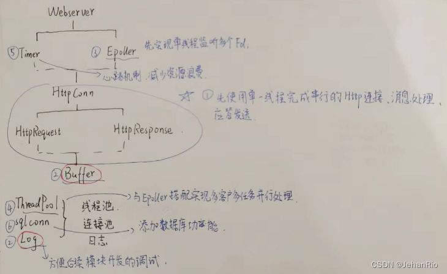

### 文章目录

-   [前言](https://blog.csdn.net/weixin_51322383/article/details/130470806#_1)
-   [什么是WebServer](https://blog.csdn.net/weixin_51322383/article/details/130470806#WebServer_7)
-   [如何实现一个高并发的WebServer](https://blog.csdn.net/weixin_51322383/article/details/130470806#WebServer_19)
-   [项目框架](https://blog.csdn.net/weixin_51322383/article/details/130470806#_44)
-   [总结](https://blog.csdn.net/weixin_51322383/article/details/130470806#_49)

# 前言

**发愁啊，万事开头难，我第一篇该怎么开头呢？总不能一上来就甩源码吧。思来想去，决定先讲一下什么是Web Server，然后再讲下整个项目的组成，各个板块分别是什么的吧。**

**导航：**[从零开始实现C++ TinyWebServer 全过程记录](https://blog.csdn.net/weixin_51322383/article/details/130464403)

___

# 什么是WebServer

**来自GPT的回答：Web服务器是一种软件程序，它在Internet上提供Web服务。它接收来自Web浏览器的HTTP请求，并从服务器上提供响应。Web服务器通常用于托管网站、应用程序和服务，它们可以处理动态和静态内容，并提供访问控制、安全性和其他功能。常见的Web服务器包括Apache、Nginx和Microsoft IIS。**

用我的话来说就是，首先，他是一个B/S架构，即浏览器扮演客户端，WebServer就是服务器程序，或者说是运行这个服务器软件的计算机。其主要的功能就是通过HTTP写一与客户端（Browser）进行通信，来接收、存储、处理来自客户端的HTTP请求，并对其请求做出HTTP响应，这个响应是指发送响应报文（文件、网页等）或者是一个Error信息。

一个WebServer如何和用户进行通信，就需要在浏览器输入**域名或者IP地址:端口号**，浏览器会先将你的域名解析成响应的IP地址(DNS)或者直接根据你的IP:Port向对应的[Web服务](https://so.csdn.net/so/search?q=Web%E6%9C%8D%E5%8A%A1&spm=1001.2101.3001.7020)器发送一个HTTP请求。这个过程需要TCP协议的三次握手建立和目标Web服务器的连接，然后HTTP协议生成针对该Web服务器的HTTP请求报文，这个报文里面包括了请求行、请求头部、空行和请求数据四个部分（后面再细讲），通过TCP/IP协议发送到Web服务器上。

___

# 如何实现一个高并发的WebServer

如何实现一个高并发的WebServer，肯定要涉及到I/O多路复用技术。

Web服务器端通过`socket`监听来自用户的请求。远端的很多用户会尝试去connect()这个`Web Server`上正在listen的这个port，而监听到的这些连接会排队等待被accept()。由于用户连接请求是随机到达的异步事件，每当监听socket（listenfd）listen到新的客户连接并且放入监听队列，我们都需要告诉我们的Web服务器有连接来了，accept这个连接，并分配一个逻辑单元来处理这个用户请求。而且，我们在处理这个请求的同时，还需要继续监听其他客户的请求并分配其另一逻辑单元来处理（并发，同时处理多个事件，后面会提到使用线程池实现并发）。

这里，服务器通过`epoll`这种I/O复用技术（还有select和poll）来实现对监听socket（listenfd）和连接socket（客户请求）的同时监听。注意I/O复用虽然可以同时监听多个文件描述符，但是它本身是阻塞的，并且当有多个文件描述符同时就绪的时候，如果不采取额外措施，程序则只能按顺序处理其中就绪的每一个文件描述符，所以为提高效率，我们将在这部分通过线程池来实现并发（多线程并发），为每个就绪的文件描述符分配一个逻辑单元（线程）来处理。

服务器程序通常需要处理三类事件：I/O事件，信号及定时事件。有两种事件处理模式：

-   `Reactor`模式：要求主线程（I/O处理单元）只负责监听文件描述符上是否有事件发生（可读、可写），若有，则立即通知工作线程（逻辑单元），将socket可读可写事件放入请求队列，交给工作线程处理。**这个过程是同步的，读取完数据后应用进程才能处理数据。**
-   `Proactor`模式：**将所有的I/O操作都交给主线程和内核来处理**（进行读、写），工作线程仅负责处理逻辑，如主线程读完成后users\[sockfd\].read()，选择一个工作线程来处理客户请求pool->append(users + sockfd)。

**所以，Reactor 可以理解为「来了事件操作系统直接通知，自己啥也不干，让子线程来处理读写」，而 Proactor 可以理解为「来了事件操作系统来处理，处理完再通知主线程」。这里的「事件」就是有新连接、有数据可读、有数据可写的这些 I/O 事件。这里的「处理」包含从驱动读取到内核以及从内核读取到用户空间。**

举个实际生活中的例子，Reactor 模式就是快递员在楼下，给你打电话告诉你快递到你家小区了，你需要自己下楼来拿快递。而在 Proactor 模式下，快递员直接将快递送到你家门口，然后通知你。

无论是 Reactor，还是 Proactor，都是一种基于「事件分发」的网络编程模式，区别在于 Reactor 模式是基于「待完成」的 I/O 事件，而 Proactor 模式则是基于「已完成」的 I/O 事件。

理论上来说Proactor是更快的。由于Proactor模式需要异步I/O的一套接口，而在Linux环境下，没有异步AIO接口，想要实现只有用同步I/O模拟实现Proactor，即主线程完成读写后通知工作线程。但意义不大，所以大部分都是采用`Reactor`。

___

**到这里，就要牵扯到这个项目的很多技术了。首先，一个完整的WebServer肯定得包括日志系统，无论是在代码调试还是服务器运行记录上，都是必不可少的一部分；数据库的登录注册功能也要有吧，这里就少不了数据库的连接与断开。服务器的能力是有限的，Socket的连接与断开、线程的不断创建与释放等这些都会造成一定的性能损失，这个时候就需要线程池与数据库连接池了。**

**还能进行进一步优化，用定时器对一些非活动连接关闭掉，如果某一用户connect()到服务器之后，长时间不交换数据，一直占用服务器端的文件描述符，导致连接资源的浪费。这时候就应该利用定时器把这些超时的非活动连接释放掉，关闭其占用的文件描述符。这种情况也很常见，当你登录一个网站后长时间没有操作该网站的网页，再次访问的时候你会发现需要重新登录。**

# 项目框架

这里手绘了一个框架，感觉很多看不明白的东西，自己写一遍，就懂了很多。当时在学这个项目的时候也是采用的这种方法，因为很多代码跳来跳去就把我绕晕了。这个方法还是满凑效的哈哈哈。

___

# 总结

**第一篇好像只是把很多东西泛泛而谈了一下，没代码，讲的也不详细。后面到每一部分每一篇张的时候再详细讲吧，这篇就先到这里了。**