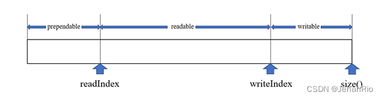

### 文章目录

-   [前言](https://blog.csdn.net/weixin_51322383/article/details/130472317#_1)
-   [1\. 纵观Buffer类](https://blog.csdn.net/weixin_51322383/article/details/130472317#1_Buffer_6)
-   [2\. 开始写代码](https://blog.csdn.net/weixin_51322383/article/details/130472317#2__14)
-   -   [buffer.h](https://blog.csdn.net/weixin_51322383/article/details/130472317#bufferh_17)
    -   [buffer.cpp](https://blog.csdn.net/weixin_51322383/article/details/130472317#buffercpp_70)
-   [3\. 主要实现方法](https://blog.csdn.net/weixin_51322383/article/details/130472317#3__222)
-   [4\. 创新点](https://blog.csdn.net/weixin_51322383/article/details/130472317#4__251)
-   [结束语](https://blog.csdn.net/weixin_51322383/article/details/130472317#_264)

# 前言

思来想去，不知起什么题目给这篇文章。我是准备自底向下来写这个专栏的，于是就想到了这句话（好吧其实后半句是我自己加的，不是很押韵，读着非常难受）。这句话前半句原处是出自侯捷老师的《深入浅出MFC》，引申义为做什么事都要脚踏实地，打好基础，同时做事要选择自己所擅长的和所感兴趣的方面，侯捷老师开篇第一句就告诉了我们。项目如同建筑一般，每下一层必须比上一层坚固，否则会崩塌。所以前期的选择很重要，地基很重要。

**导航：**[从零开始实现C++ TinyWebServer 全过程记录](https://blog.csdn.net/weixin_51322383/article/details/130464403)

___

# 1\. 纵观Buffer类

纵观全项目，最让我眼前一亮的地方就是`Buffer`类的设计。我下去搜了一下，这个类的设计源自陈硕大佬的[muduo](https://so.csdn.net/so/search?q=muduo&spm=1001.2101.3001.7020)网络库。由于muduo库使用的是非阻塞I/O模型，即每次`send()`不一定会发送完，没发完的数据要用一个容器进行接收，所以必须要实现应用层缓冲区。  
  
这里贴一张我对这个类的总结，其中`ReadFd`和`WriteFd`应该是重点，外部调用接口也是会调用这两个。

另外就是几个下标之间的关系，根据这个图来好好看一下，一定不要弄混了，写是往`writeIndex`的指针写，读取则是从`readIndex`的指针读。当外部写入fd的时候，是将buffer中的`readable`写入fd；当需要读取fd的内容时，则是读到`writable`的位置，注意区分写和读，这里我最开始绕了好久都没理请。可以结合源码和我画的图来看一下，这里就不细讲了。

# 2\. 开始写代码

之前都是看了源码理解后，copy一遍，但是我觉得这样对自己的提升还是太少了，你看源码5遍都没有自己亲手写一遍强，过程非常痛苦，但是总得跨出自己的舒适圈嘛，我这次就尽量自己实现，先把.h文件给定义好，自己实现，实在想不起来了再去看源码，然后再把源码关了，继续自己写，相信这样对自己提升会非常大。

## buffer.h

```cpp
#ifndef BUFFER_H
#define BUFFER_H
#include <cstring>   //perror
#include <iostream>
#include <unistd.h>  // write
#include <sys/uio.h> //readv
#include <vector> //readv
#include <atomic>
#include <assert.h>
class Buffer {
public:
    Buffer(int initBuffSize = 1024);
    ~Buffer() = default;

    size_t WritableBytes() const;       
    size_t ReadableBytes() const ;
    size_t PrependableBytes() const;

    const char* Peek() const;
    void EnsureWriteable(size_t len);
    void HasWritten(size_t len);

    void Retrieve(size_t len);
    void RetrieveUntil(const char* end);

    void RetrieveAll();
    std::string RetrieveAllToStr();

    const char* BeginWriteConst() const;
    char* BeginWrite();

    void Append(const std::string& str);
    void Append(const char* str, size_t len);
    void Append(const void* data, size_t len);
    void Append(const Buffer& buff);

    ssize_t ReadFd(int fd, int* Errno);
    ssize_t WriteFd(int fd, int* Errno);

private:
    char* BeginPtr_();  // buffer开头
    const char* BeginPtr_() const;
    void MakeSpace_(size_t len);

    std::vector<char> buffer_;  
    std::atomic<std::size_t> readPos_;  // 读的下标
    std::atomic<std::size_t> writePos_; // 写的下标
};

#endif //BUFFER_H
```

## buffer.cpp

```cpp
#include "buffer.h"

// 读写下标初始化，vector<char>初始化
Buffer::Buffer(int initBuffSize) : buffer_(initBuffSize), readPos_(0), writePos_(0)  {}  

// 可写的数量：buffer大小 - 写下标
size_t Buffer::WritableBytes() const {
    return buffer_.size() - writePos_;
}

// 可读的数量：写下标 - 读下标
size_t Buffer::ReadableBytes() const {
    return writePos_ - readPos_;
}

// 可预留空间：已经读过的就没用了，等于读下标
size_t Buffer::PrependableBytes() const {
    return readPos_;
}

const char* Buffer::Peek() const {
    
    return &buffer_[readPos_];
}

// 确保可写的长度
void Buffer::EnsureWriteable(size_t len) {
    if(len > WritableBytes()) {
        MakeSpace_(len);
    }
    assert(len <= WritableBytes());
}

// 移动写下标，在Append中使用
void Buffer::HasWritten(size_t len) {
    writePos_ += len;
}

// 读取len长度，移动读下标
void Buffer::Retrieve(size_t len) {
    readPos_ += len;
}

// 读取到end位置
void Buffer::RetrieveUntil(const char* end) {
    assert(Peek() <= end );
    Retrieve(end - Peek()); // end指针 - 读指针 长度
}

// 取出所有数据，buffer归零，读写下标归零,在别的函数中会用到
void Buffer::RetrieveAll() {
    bzero(&buffer_[0], buffer_.size()); // 覆盖原本数据
    readPos_ = writePos_ = 0;
}

// 取出剩余可读的str
std::string Buffer::RetrieveAllToStr() {
    std::string str(Peek(), ReadableBytes());
    RetrieveAll();
    return str;
}

// 写指针的位置
const char* Buffer::BeginWriteConst() const {
    return &buffer_[writePos_];
}

char* Buffer::BeginWrite() {
    return &buffer_[writePos_];
}

// 添加str到缓冲区
void Buffer::Append(const char* str, size_t len) {
    assert(str);
    EnsureWriteable(len);   // 确保可写的长度
    std::copy(str, str + len, BeginWrite());    // 将str放到写下标开始的地方
    HasWritten(len);    // 移动写下标
}

void Buffer::Append(const std::string& str) {
    Append(str.c_str(), str.size());
}

void Append(const void* data, size_t len) {
    Append(static_cast<const char*>(data), len);
}

// 将buffer中的读下标的地方放到该buffer中的写下标位置
void Append(const Buffer& buff) {
    Append(buff.Peek(), buff.ReadableBytes());
}

// 将fd的内容读到缓冲区，即writable的位置
ssize_t Buffer::ReadFd(int fd, int* Errno) {
    char buff[65535];   // 栈区
    struct iovec iov[2];
    size_t writeable = WritableBytes(); // 先记录能写多少
    // 分散读， 保证数据全部读完
    iov[0].iov_base = BeginWrite();
    iov[0].iov_len = writeable;
    iov[1].iov_base = buff;
    iov[1].iov_len = sizeof(buff);

    ssize_t len = readv(fd, iov, 2);
    if(len < 0) {
        *Errno = errno;
    } else if(static_cast<size_t>(len) <= writeable) {   // 若len小于writable，说明写区可以容纳len
        writePos_ += len;   // 直接移动写下标
    } else {    
        writePos_ = buffer_.size(); // 写区写满了,下标移到最后
        Append(buff, static_cast<size_t>(len - writeable)); // 剩余的长度
    }
    return len;
}

// 将buffer中可读的区域写入fd中
ssize_t Buffer::WriteFd(int fd, int* Errno) {
    ssize_t len = write(fd, Peek(), ReadableBytes());
    if(len < 0) {
        *Errno = errno;
        return len;
    } 
    Retrieve(len);
    return len;
}

char* Buffer::BeginPtr_() {
    return &buffer_[0];
}

const char* Buffer::BeginPtr_() const{
    return &buffer_[0];
}

// 扩展空间
void Buffer::MakeSpace_(size_t len) {
    if(WritableBytes() + PrependableBytes() < len) {
        buffer_.resize(writePos_ + len + 1);
    } else {
        size_t readable = ReadableBytes();
        std::copy(BeginPtr_() + readPos_, BeginPtr_() + writePos_, BeginPtr_());
        readPos_ = 0;
        writePos_ = readable;
        assert(readable == ReadableBytes());
    }
}
```

这里的BUFFER，仿照的是陈硕老师的muduo库,具体可看文档底部的博客连接，讲的非常通透。这里主要讲以下他的主要实现步骤和创新点。

# 3\. 主要实现方法

在[WebServer](https://so.csdn.net/so/search?q=WebServer&spm=1001.2101.3001.7020)中，客户端连接发来的HTTP请求（放到conn的读缓冲区）以及回复给客户端所请求的响应报文（放到conn的写缓冲区），都需要通过缓冲区来进行。我们以vector容器作为底层实体，在它的上面封装自己所需要的方法来实现一个自己的buffer缓冲区，满足读写的需要。  


-   **buffer的存储实体**  
    缓冲区的最主要需要是读写数据的存储，也就是需要一个存储的实体。自己去写太繁琐了，直接用vector来完成。也就是buffer缓冲区里面需要一个：

```cpp
std::vector<char>buffer_;
```

-   **buffer所需要的变量**  
    由于buffer缓冲区既要作为读缓冲区，也要作为写缓冲区，所以我们既需要指示当前读到哪里了，也需要指示当前写到哪里了。所以在buffer缓冲区里面设置变量：

```cpp
std::atomic<std::size_t>readPos_;
std::atomic<std::size_t>writePos_;
```

分别指示当前读写位置的下标。其中atomic是一种原子类型，可以保证在多线的情况下，安全高性能得执行程序，更新变量。

-   **buffer所需要的方法**

读写接口

缓冲区最重要的就是读写接口，主要可以分为与客户端直接IO交互所需要的读写接口，以及收到客户端HTTP请求后，我们在处理过程中需要对缓冲区的读写接口。

与客户端直接I/O得读写接口（httpconn中就是调用的该接口。）：

```cpp
ssize_t ReadFd();
ssize_t WriteFd();
```

这个功能直接用read()/write()、readv()/writev()函数来实现。从某个连接接受数据的时候，有可能会超过vector的容量，所以我们用readv()来分散接受来的数据。

# 4\. 创新点

**问题的提出**：在非阻塞网络编程中，如何设计并使用缓冲区？一方面我们希望减少系统调用，一次读的数据越多越划算，那么似乎应该准备一个大的缓冲区。另一方面，我们系统减少内存占用。如果有 10k 个连接，每个连接一建立就分配 64k 的读缓冲的话，将占用 640M 内存，而大多数时候这些缓冲区的使用率很低。muduo 用 readv 结合栈上空间巧妙地解决了这个问题。

在栈上准备一个 65536 字节的 stackbuf，然后利用 readv() 来读取数据，iovec 有两块，第一块指向 muduo Buffer 中的 writable 字节，另一块指向栈上的 stackbuf。这样如果读入的数据不多，那么全部都读到 Buffer 中去了；如果长度超过 Buffer 的 writable 字节数，就会读到栈上的 stackbuf 里，然后程序再把 stackbuf 里的数据 append 到 Buffer 中。

这么做利用了临时栈上空间，避免开巨大 Buffer 造成的内存浪费，也避免反复调用 read() 的系统开销（通常一次 readv() 系统调用就能读完全部数据）。

> 参考博客：
>
> https://blog.csdn.net/Solstice/article/details/6329080
>
> https://blog.csdn.net/wanggao\_1990/article/details/119426351

# 结束语

在写完`buffer.cpp`的时候，正准备上传到github，但是怎样都上传不了，好像出了点小问题，可能是我前一两天修改仓库tag和branch的时候出了点小状况，具体咋做我也不知道。当时学git的时候，只是想能够上传到github上，方便备份，至于每一步是干啥的我也不知道，看来还得花时间重新好好学一下这个工具。太痛苦了我。

anyway，算是开了个好头吧，下篇见（捣鼓我的git去了）