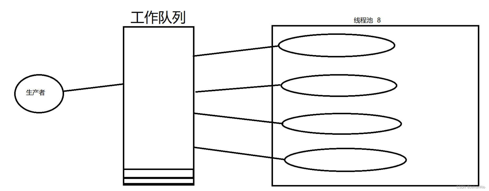
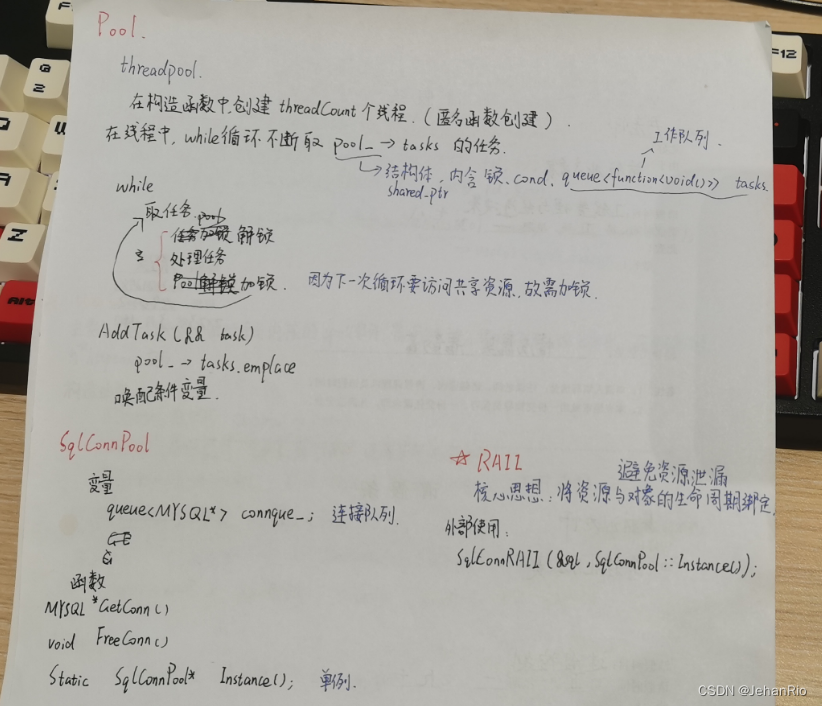
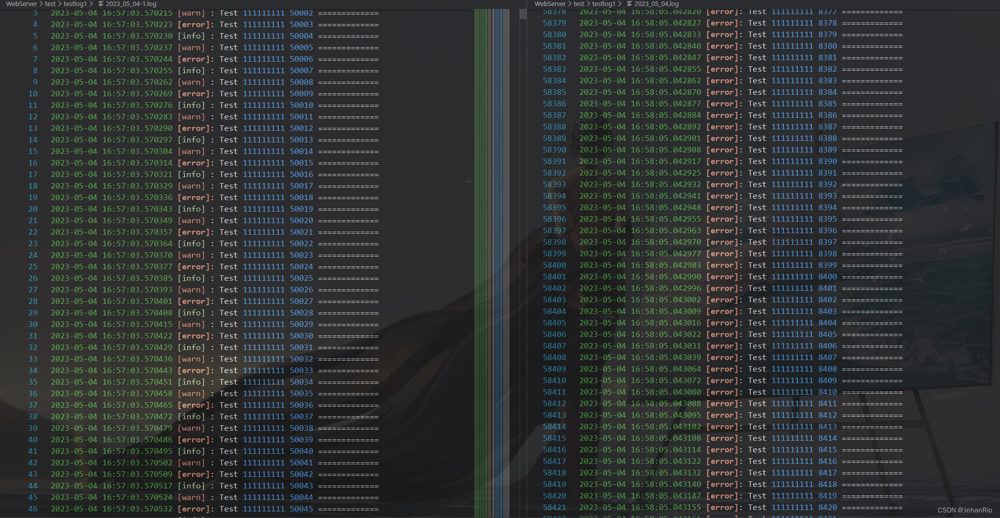

### 文章目录

-   [前言](https://blog.csdn.net/weixin_51322383/article/details/130486156#_1)
-   [1\. 线程池](https://blog.csdn.net/weixin_51322383/article/details/130486156#1__14)
-   -   [1.1 定义](https://blog.csdn.net/weixin_51322383/article/details/130486156#11__15)
    -   [1.2 线程同步问题](https://blog.csdn.net/weixin_51322383/article/details/130486156#12__20)
-   [2\. 连接池](https://blog.csdn.net/weixin_51322383/article/details/130486156#2__27)
-   -   [2.1 RAII](https://blog.csdn.net/weixin_51322383/article/details/130486156#21_RAII_28)
    -   [2.2 连接池底层实现](https://blog.csdn.net/weixin_51322383/article/details/130486156#22__47)
-   [4\. 流程图](https://blog.csdn.net/weixin_51322383/article/details/130486156#4__58)
-   [5\. C++11的一些细节](https://blog.csdn.net/weixin_51322383/article/details/130486156#5_C11_62)
-   [6\. 代码](https://blog.csdn.net/weixin_51322383/article/details/130486156#6__67)
-   -   [threadpool.h](https://blog.csdn.net/weixin_51322383/article/details/130486156#threadpoolh_68)
    -   [sqlconnpool.h](https://blog.csdn.net/weixin_51322383/article/details/130486156#sqlconnpoolh_138)
    -   [sqlconnpool.cpp](https://blog.csdn.net/weixin_51322383/article/details/130486156#sqlconnpoolcpp_197)
    -   [test.cpp](https://blog.csdn.net/weixin_51322383/article/details/130486156#testcpp_265)
-   [结束语](https://blog.csdn.net/weixin_51322383/article/details/130486156#_323)

# 前言

好吧，我承认有点标题党的成分所在。可能是最近干啥都比较急功近利，写博客也有种完成任务的感觉所在。我觉得我的大脑只能够单进程执行，[多进程](https://so.csdn.net/so/search?q=%E5%A4%9A%E8%BF%9B%E7%A8%8B&spm=1001.2101.3001.7020)并发一起做不是我的风格，玩就是玩，学就是学，我最讨厌一边学一边玩了。我们总能在网上看到一些人告诫后人，要学会平衡生活和工作，但是根本不存在平衡，我们只能在某一个阶段聚焦于某一件事情。

今天上午刚把一本很喜欢的书给还回去了，只看了三分之一，还是蛮舍不得的，而让我退回去的原因也是我深谙自己最近不会怎么花时间在阅读上面了，因为我还有很多事情要做，光每天写博客记录，刷力扣就占据了我白天整天的时间，晚上还要去健身，毕竟坐一天还是需要运动量的，不然我觉得我的身体撑不到35岁。我跟老友见面，经常谈论的一个话题就是，你最近看书了吗。每次都能得到不一样的答案，但大都是没有。在我看来，这是件特别可悲的事情。但其实渐渐发现，其实错过的，是对于阅读的耐心。身边的人宁愿花十分钟去看一步电影解说，也不愿意去看原片；宁愿花时间在[短视频](https://so.csdn.net/so/search?q=%E7%9F%AD%E8%A7%86%E9%A2%91&spm=1001.2101.3001.7020)上，重复着无意义的bullshit和无意义的梗，也不愿意静下心来去阅读一本好书。我们在感动、猎奇、调笑中纵览天下事，真正回想起来，身过千般浮云，什么也不曾留下。

有时候真觉得时间不够用，感叹效率太低。最近一直在刷力扣，看到网上一个学长的保研PAT帖子，在想要不要去刷一刷，还是蛮想冲击C9的。有时候后悔大一大二没有看清前方的路，折腾了太多时间在没用的东西上，如果重来一次，我还是蛮想去打acm的，毕竟这玩意儿是大学里面为数不多有意义并且锻炼人能力的比赛了。

___

all right，今天要讲的线程池和连接池算是老生常谈的东西了，要做到高并发就少不了这两个东西。

**导航：**[从零开始实现C++ TinyWebServer 全过程记录](https://blog.csdn.net/weixin_51322383/article/details/130464403)

___

# 1\. 线程池

## 1.1 定义

**使用线程池可以减少线程的销毁，而且如果不使用线程池的话，来一个客户端就创建一个线程。比如有1000，这样线程的创建、线程之间的调度也会耗费很多的系统资源，所以采用线程池使程序的效率更高。 线程池就是项目启动的时候，就先把线程池准备好。**

**一般线程池的实现是通过生产者消费者模型来的：**  


## 1.2 线程同步问题

线程同步问题涉及到了互斥量、条件变量。 在代码中，将互斥锁、条件变量、关闭状态、工作队列封装到了一起，通过一个共享智能指针来管理这些条件。

鉴于本人对匿名函数不是很熟悉，所以在写的时候又去学习了一遍匿名函数。关于匿名函数的使用，参考这篇博客：[实例讲解C++中lambda表达式](https://blog.csdn.net/huangshanchun/article/details/47155859)

在匿名函数中还用到了move，也是C++11的一个新特性，该函数的作用是将左值转换为右值，资产转移，该函数是为性能而生的。具体看下方的代码就知道了。

# 2\. 连接池

## 2.1 RAII

-   **什么是RAII？**
    
    RAII是Resource Acquisition Is Initialization（wiki上面翻译成 “资源获取就是初始化”）的简称，是C++语言的一种管理资源、避免泄漏的惯用法。利用的就是C++构造的对象最终会被销毁的原则。RAII的做法是使用一个对象，在其构造时获取对应的资源，在对象生命期内控制对资源的访问，使之始终保持有效，最后在对象析构的时候，释放构造时获取的资源。
    
-   **为什么要使用RAII？**
    
    上面说到RAII是用来管理资源、避免资源泄漏的方法。那么，用了这么久了，也写了这么多程序了，口头上经常会说资源，那么资源是如何定义的？在计算机系统中，资源是数量有限且对系统正常运行具有一定作用的元素。比如：网络套接字、互斥锁、文件句柄和内存等等，它们属于系统资源。由于系统的资源是有限的，就好比自然界的石油，铁矿一样，不是取之不尽，用之不竭的，所以，我们在编程使用系统资源时，都必须遵循一个步骤：  
    1 申请资源；  
    2 使用资源；  
    3 释放资源。  
    第一步和第三步缺一不可，因为资源必须要申请才能使用的，使用完成以后，必须要释放，如果不释放的话，就会造成资源泄漏。
    

我们常用的智能指针如`unique_ptr`、锁`lock_guard`就是采用了RAII的机制。

在使用多线程时，经常会涉及到共享数据的问题，C++中通过实例化std::mutex创建互斥量，通过调用成员函数lock()进行上锁，unlock()进行解锁。不过这意味着必须记住在每个函数出口都要去调用unlock()，也包括异常的情况，这非常麻烦，而且不易管理。C++标准库为互斥量提供了一个RAII语法的模板类std::lock\_guard，其会在构造函数的时候提供已锁的互斥量，并在析构的时候进行解锁，从而保证了一个已锁的互斥量总是会被正确的解锁。

这些都是C++11的新特性，所以采用Modern C++可以大大减少代码量，毕竟都21世纪了，现在的语言都有只能垃圾回收机制，C++作为一门古老的语言，要是再不与时俱进，真的就没人用了。

## 2.2 连接池底层实现

我见过的连接池有用std::list写的，也有用std::queue写的，我个人还是比较倾向于用queue写。

-   为什么要使用连接池？
    -   由于服务器需要频繁地访问数据库，即需要频繁创建和断开数据库连接，该过程是一个很耗时的操作，也会对数据库造成安全隐患。
    -   在程序初始化的时候，集中创建并管理多个数据库连接，可以保证较快的数据库读写速度，更加安全可靠。

**在连接池的实现中，使用到了信号量来管理资源的数量；而锁的使用则是为了在访问公共资源的时候使用。所以说，无论是条件变量还是信号量，都需要锁。**

**不同的是，信号量的使用要先使用信号量sem\_wait再上锁，而条件变量的使用要先上锁再使用条件变量wait。**

> 具体可看这篇博客：[Linux条件变量pthread\_condition细节](https://blog.csdn.net/modi000/article/details/104779937)

# 4\. 流程图

**还是先照例来一张我自己总结的流程图，自己写的时候，真的能够疏通整个代码的执行步骤，尤其是面对代码量多的项目时，非常管用。**  


# 5\. C++11的一些细节

这里还是有很多地方用到了C++11新特性的，记录一下。

-   尽量用make\_shared代替new去配合shared\_ptr使用，因为如果通过new再传递给shared\_ptr，内存是不连续的，会造成内存碎片化
-   `function<void()>`是一个可调用对象。他可以取代函数指针的作用，因为它可以延迟函数的执行，特别适合作为回调函数使用。它比普通函数指针更加的灵活和便利。

___

# 6\. 代码

## threadpool.h

```cpp
#ifndef THREADPOOL_H
#define THREADPOOL_H

#include <queue>
#include <mutex>
#include <condition_variable>
#include <functional>
#include <thread>
#include <assert.h>


class ThreadPool {
public:
    ThreadPool() = default;
    ThreadPool(ThreadPool&&) = default;
    // 尽量用make_shared代替new，如果通过new再传递给shared_ptr，内存是不连续的，会造成内存碎片化
    explicit ThreadPool(int threadCount = 8) : pool_(std::make_shared<Pool>()) { // make_shared:传递右值，功能是在动态内存中分配一个对象并初始化它，返回指向此对象的shared_ptr
        assert(threadCount > 0);
        for(int i = 0; i < threadCount; i++) {
            std::thread([this]() {
                std::unique_lock<std::mutex> locker(pool_->mtx_);
                while(true) {
                    if(!pool_->tasks.empty()) {
                        auto task = std::move(pool_->tasks.front());    // 左值变右值,资产转移
                        pool_->tasks.pop();
                        locker.unlock();    // 因为已经把任务取出来了，所以可以提前解锁了
                        task();
                        locker.lock();      // 马上又要取任务了，上锁
                    } else if(pool_->isClosed) {
                        break;
                    } else {
                        pool_->cond_.wait(locker);    // 等待,如果任务来了就notify的
                    }
                    
                }
            }).detach();
        }
    }

    ~ThreadPool() {
        if(pool_) {
            std::unique_lock<std::mutex> locker(pool_->mtx_);
            pool_->isClosed = true;
        }
        pool_->cond_.notify_all();  // 唤醒所有的线程
    }

    template<typename T>
    void AddTask(T&& task) {
        std::unique_lock<std::mutex> locker(pool_->mtx_);
        pool_->tasks.emplace(std::forward<T>(task));
        pool_->cond_.notify_one();
    }

private:
    // 用一个结构体封装起来，方便调用
    struct Pool {
        std::mutex mtx_;
        std::condition_variable cond_;
        bool isClosed;
        std::queue<std::function<void()>> tasks; // 任务队列，函数类型为void()
    };
    std::shared_ptr<Pool> pool_;
};

#endif
```

## sqlconnpool.h

```cpp
#ifndef SQLCONNPOOL_H
#define SQLCONNPOOL_H

#include <mysql/mysql.h>
#include <string>
#include <queue>
#include <mutex>
#include <semaphore.h>
#include <thread>
#include "../log/log.h"

class SqlConnPool {
public:
    static SqlConnPool *Instance();

    MYSQL *GetConn();
    void FreeConn(MYSQL * conn);
    int GetFreeConnCount();

    void Init(const char* host, int port,
              const char* user,const char* pwd, 
              const char* dbName, int connSize);
    void ClosePool();

private:
    SqlConnPool() = default;
    ~SqlConnPool() { ClosePool(); }

    int MAX_CONN_;

    std::queue<MYSQL *> connQue_;
    std::mutex mtx_;
    sem_t semId_;
};

/* 资源在对象构造初始化 资源在对象析构时释放*/
class SqlConnRAII {
public:
    SqlConnRAII(MYSQL** sql, SqlConnPool *connpool) {
        assert(connpool);
        *sql = connpool->GetConn();
        sql_ = *sql;
        connpool_ = connpool;
    }
    
    ~SqlConnRAII() {
        if(sql_) { connpool_->FreeConn(sql_); }
    }
    
private:
    MYSQL *sql_;
    SqlConnPool* connpool_;
};

#endif // SQLCONNPOOL_H
```

## sqlconnpool.cpp

```cpp
#include "sqlconnpool.h"

SqlConnPool* SqlConnPool::Instance() {
    static SqlConnPool pool;
    return &pool;
}

// 初始化
void SqlConnPool::Init(const char* host, int port,
              const char* user,const char* pwd, 
              const char* dbName, int connSize = 10) {
    assert(connSize > 0);
    for(int i = 0; i < connSize; i++) {
        MYSQL* conn = nullptr;
        conn = mysql_init(conn);
        if(!conn) {
            LOG_ERROR("MySql init error!");
            assert(conn);
        }
        conn = mysql_real_connect(conn, host, user, pwd, dbName, port, nullptr, 0);
        if (!conn) {
            LOG_ERROR("MySql Connect error!");
        }
        connQue_.emplace(conn);
    }
    MAX_CONN_ = connSize;
    sem_init(&semId_, 0, MAX_CONN_);
}

MYSQL* SqlConnPool::GetConn() {
    MYSQL* conn = nullptr;
    if(connQue_.empty()) {
        LOG_WARN("SqlConnPool busy!");
        return nullptr;
    }
    sem_wait(&semId_);  // -1
    lock_guard<mutex> locker(mtx_);
    conn = connQue_.front();
    connQue_.pop();
    return conn;
}

// 存入连接池，实际上没有关闭
void SqlConnPool::FreeConn(MYSQL* conn) {
    assert(conn);
    lock_guard<mutex> locker(mtx_);
    connQue_.push(conn);
    sem_post(&semId_);  // +1
}

void SqlConnPool::ClosePool() {
    lock_guard<mutex> locker(mtx_);
    while(!connQue_.empty()) {
        auto conn = connQue_.front();
        connQue_.pop();
        mysql_close(conn);
    }
    mysql_library_end();
}

int SqlConnPool::GetFreeConnCount() {
    lock_guard<mutex> locker(mtx_);
    return connQue_.size();
}
```

## test.cpp

一个测试文件

```cpp
#include "../code/log/log.h"
#include "../code/pool/threadpool.h"
#include <features.h>

#if __GLIBC__ == 2 && __GLIBC_MINOR__ < 30
#include <sys/syscall.h>
#define gettid() syscall(SYS_gettid)
#endif

void TestLog() {
    int cnt = 0, level = 0;
    Log::Instance()->init(level, "./testlog1", ".log", 0);
    for(level = 3; level >= 0; level--) {
        Log::Instance()->SetLevel(level);
        for(int j = 0; j < 10000; j++ ){
            for(int i = 0; i < 4; i++) {
                LOG_BASE(i,"%s 111111111 %d ============= ", "Test", cnt++);
            }
        }
    }
    cnt = 0;
    Log::Instance()->init(level, "./testlog2", ".log", 5000);
    for(level = 0; level < 4; level++) {
        Log::Instance()->SetLevel(level);
        for(int j = 0; j < 10000; j++ ){
            for(int i = 0; i < 4; i++) {
                LOG_BASE(i,"%s 222222222 %d ============= ", "Test", cnt++);
            }
        }
    }
}

void ThreadLogTask(int i, int cnt) {
    for(int j = 0; j < 10000; j++ ){
        LOG_BASE(i,"PID:[%04d]======= %05d ========= ", gettid(), cnt++);
    }
}

void TestThreadPool() {
    Log::Instance()->init(0, "./testThreadpool", ".log", 5000);
    ThreadPool threadpool(6);
    for(int i = 0; i < 18; i++) {
        threadpool.AddTask(std::bind(ThreadLogTask, i % 4, i * 10000));
    }
    getchar();
}

int main() {
    TestLog();
    // TestThreadPool();
}
```



# 结束语

还是比较简单的，可能是我写过很多次连接池和线程池了吧，熟能生巧，每一次重写都能加深我的理解，并且这一次又更加熟悉C++11了呢。