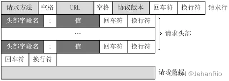

### 文章目录

-   [前言](https://blog.csdn.net/weixin_51322383/article/details/130492785#_1)
-   [1\. HTTP请求报文](https://blog.csdn.net/weixin_51322383/article/details/130492785#1_HTTP_6)
-   [2\. 终于迎来有限状态机](https://blog.csdn.net/weixin_51322383/article/details/130492785#2__30)
-   [3\. 简单学习一下正则表达式](https://blog.csdn.net/weixin_51322383/article/details/130492785#3__46)
-   [4\. 代码](https://blog.csdn.net/weixin_51322383/article/details/130492785#4__71)
-   -   [httprequest.h](https://blog.csdn.net/weixin_51322383/article/details/130492785#httprequesth_72)
    -   [httprequest.cpp](https://blog.csdn.net/weixin_51322383/article/details/130492785#httprequestcpp_137)
-   [结束语](https://blog.csdn.net/weixin_51322383/article/details/130492785#_417)

# 前言

好激动，今晚上要去看银河护卫队3。作为一个资深Marvel迷，自从高二那年去电影院看了end game和[spider](https://so.csdn.net/so/search?q=spider&spm=1001.2101.3001.7020) 2过后，再也没有去看过Marvel电影了，期间出的电影口碑也非常糟糕。但这次不一样，银护系列电影的口碑一直都非常好，从之前的剧透已经知道小浣熊要离去了，这也是这个系列的终章，呜呜呜。狠狠期待一手今晚的电影。因为要去看电影，写代码都有点心不在焉的哈哈哈。

今天在写这篇博客的时候，花了整个白天的时间去学了下正则表达式，还去调试了一个小bug，但很遗憾，这个bug还是没找出来，哎。就是注册登录后，日志系统的输出总是在下一次才输出，我想应该跟我buffer残留数据有关系吧，还是太菜了，没找出来。

___

# 1\. [HTTP请求报文](https://so.csdn.net/so/search?q=HTTP%E8%AF%B7%E6%B1%82%E6%8A%A5%E6%96%87&spm=1001.2101.3001.7020)

**HTTP请求报文包括请求行、请求头部、空行和请求数据四个部分。**

  
以下是百度的请求包

> GET / HTTP/1.1  
> Accept:text/html,application/xhtml+xml,application/xml;q=0.9,image/[webp](https://so.csdn.net/so/search?q=webp&spm=1001.2101.3001.7020),image/apng,/;q=0.8,application/signed-exchange;v=b3;q=0.9  
> Accept-Encoding: gzip, deflate, br  
> Accept-Language: zh-CN,zh;q=0.9,en;q=0.8,en-GB;q=0.7,en-US;q=0.6  
> Connection: keep-alive  
> Host: www.baidu.com  
> Sec-Fetch-Dest: document  
> Sec-Fetch-Mode: navigate  
> Sec-Fetch-Site: none  
> Sec-Fetch-User: ?1  
> Upgrade-Insecure-Requests: 1  
> User-Agent: Mozilla/5.0 (Windows NT 10.0; Win64; x64) AppleWebKit/537.36 (KHTML, like Gecko) Chrome/101.0.4951.41 Safari/537.36 Edg/101.0.1210.32  
> sec-ch-ua: " Not A;Brand";v=“99”, “Chromium”;v=“101”, “Microsoft Edge”;v=“101”  
> sec-ch-ua-mobile: ?0  
> sec-ch-ua-platform: “Windows”

**上面只包括请求行、请求头和空行，请求数据为空。请求方法是GET，协议版本是HTTP/1.1；请求头是键值对的形式。**

# 2\. 终于迎来有限状态机

解析过程由`parse()`函数完成；函数根据状态分别调用了

```cpp
ParseRequestLine_();//解析请求行
ParseHeader_();//解析请求头
ParseBody_();//解析请求体
```

三个函数对请求行、请求头和数据体进行解析。当然解析请求体的函数还会调用`ParsePost_()`，因为Post请求会携带请求体。  


___

附上一张简要流程图  


# 3\. 简单学习一下正则表达式

因为在解析行的时候，会有正则表达式的运用，我之前也没学过，就先看了个视频简单做了下笔记。之后如果有需要再具体去学吧。

-   `used?`  
    `?`代表前面的一个字符可以出现**0次或1次**，说简单点就是`d`可有可无。
-   `ab*c`  
    `*`代表前面的一个字符可以出现**0次或多次**
-   `ab+c`  
    `+`会匹配出现1次以上的字符
-   `ab{6}c`  
    指定出现的次数，比如这里就是`abbbbbbc`，同理还有`ab{2,6}c`：限定出现次数为2~6次；`ab{2,}c`为出现2次以上
-   `(ab)+`  
    这里的括号会将ab一起括起来当成整体来匹配

___

-   `a (cat|dog)`  
    **或运算**：括号必不可少，可以匹配`a cat`和`a dog`
-   `[abc]+`  
    **或运算**：要求匹配的字符只能是`[]`里面的内容；`[a-z]`匹配小写字符；`[a-zA-Z]`：匹配所有字母；`a-zA-Z0-9`：匹配所有字母和数字
-   `.*`  
    . 表示 匹配除换行符 \\n 之外的任何单字符，`*`表示零次或多次。所以`.*`在一起就表示任意字符出现零次或多次。
-   `^`限定开头；取反：`[^a]`表示“匹配除了a的任意字符”，只要不是在\[\]里面都是限定开头
-   `$`匹配行尾。如`^a`只会匹配行首的`a`，`a$`只会匹配行尾的`a`

___

-   `?`  
    表示将贪婪匹配->懒惰匹配。就是匹配尽可能少的字符。就意味着匹配任意数量的重复，但是在能使整个匹配成功的前提下使用最少的重复。

# 4\. 代码

## httprequest.h

```cpp
#ifndef HTTP_REQUEST_H
#define HTTP_REQUEST_H

#include <unordered_map>
#include <unordered_set>
#include <string>
#include <regex>    // 正则表达式
#include <errno.h>     
#include <mysql/mysql.h>  //mysql

#include "../buffer/buffer.h"
#include "../log/log.h"
#include "../pool/sqlconnpool.h"

class HttpRequest {
public:
    enum PARSE_STATE {
        REQUEST_LINE,
        HEADERS,
        BODY,
        FINISH,        
    };
    
    HttpRequest() { Init(); }
    ~HttpRequest() = default;

    void Init();
    bool parse(Buffer& buff);   

    std::string path() const;
    std::string& path();
    std::string method() const;
    std::string version() const;
    std::string GetPost(const std::string& key) const;
    std::string GetPost(const char* key) const;

    bool IsKeepAlive() const;

private:
    bool ParseRequestLine_(const std::string& line);    // 处理请求行
    void ParseHeader_(const std::string& line);         // 处理请求头
    void ParseBody_(const std::string& line);           // 处理请求体

    void ParsePath_();                                  // 处理请求路径
    void ParsePost_();                                  // 处理Post事件
    void ParseFromUrlencoded_();                        // 从url种解析编码

    static bool UserVerify(const std::string& name, const std::string& pwd, bool isLogin);  // 用户验证

    PARSE_STATE state_;
    std::string method_, path_, version_, body_;
    std::unordered_map<std::string, std::string> header_;
    std::unordered_map<std::string, std::string> post_;

    static const std::unordered_set<std::string> DEFAULT_HTML;
    static const std::unordered_map<std::string, int> DEFAULT_HTML_TAG;
    static int ConverHex(char ch);  // 16进制转换为10进制
};

#endif
```

## httprequest.cpp

```cpp
#include "httprequest.h"
using namespace std;

const unordered_set<string> HttpRequest::DEFAULT_HTML{
            "/index", "/register", "/login",
             "/welcome", "/video", "/picture", };

const unordered_map<string, int> HttpRequest::DEFAULT_HTML_TAG {
            {"/register.html", 0}, {"/login.html", 1},  };

void HttpRequest::Init() {
    method_ = path_ = version_ = body_ = "";
    state_ = REQUEST_LINE;
    header_.clear();
    post_.clear();
}

bool HttpRequest::IsKeepAlive() const {
    if(header_.count("Connection") == 1) {
        return header_.find("Connection")->second == "keep-alive" && version_ == "1.1";
    }
    return false;
}

// 解析处理
bool HttpRequest::parse(Buffer& buff) {
    const char CRLF[] = "\r\n";      // 行结束符标志(回车换行)
    if(buff.ReadableBytes() <= 0) { // 没有可读的字节
        return false;
    }
    // 读取数据
    while(buff.ReadableBytes() && state_ != FINISH) {
        // 从buff中的读指针开始到读指针结束，这块区域是未读取得数据并去处"\r\n"，返回有效数据得行末指针
        const char* lineEnd = search(buff.Peek(), buff.BeginWriteConst(), CRLF, CRLF + 2);
        // 转化为string类型
        std::string line(buff.Peek(), lineEnd);
        switch(state_)
        {
        /*
            有限状态机，从请求行开始，每处理完后会自动转入到下一个状态    
        */
        case REQUEST_LINE:
            if(!ParseRequestLine_(line)) {
                return false;
            }
            ParsePath_();   // 解析路径
            break;    
        case HEADERS:
            ParseHeader_(line);
            if(buff.ReadableBytes() <= 2) { 
                state_ = FINISH;
            }
            break;
        case BODY:
            ParseBody_(line);
            break;
        default:
            break;
        }
        if(lineEnd == buff.BeginWrite()) { break; } // 读完了
        buff.RetrieveUntil(lineEnd + 2);        // 跳过回车换行
    }
    LOG_DEBUG("[%s], [%s], [%s]", method_.c_str(), path_.c_str(), version_.c_str());
    return true;
}

// 解析路径
void HttpRequest::ParsePath_() {
    if(path_ == "/") {
        path_ = "/index.html"; 
    }
    else {
        for(auto &item: DEFAULT_HTML) {
            if(item == path_) {
                path_ += ".html";
                break;
            }
        }
    }
}

bool HttpRequest::ParseRequestLine_(const string& line) {
    regex patten("^([^ ]*) ([^ ]*) HTTP/([^ ]*)$"); 
    smatch subMatch;
    // 在匹配规则中，以括号()的方式来划分组别 一共三个括号 [0]表示整体
    if(regex_match(line, subMatch, patten)) {      // 匹配指定字符串整体是否符合
        method_ = subMatch[1];
        path_ = subMatch[2];
        version_ = subMatch[3];
        state_ = HEADERS;   // 状态转换为下一个状态
        return true;
    }
    LOG_ERROR("RequestLine Error");
    return false;
}

void HttpRequest::ParseHeader_(const string& line) {
    regex patten("^([^:]*): ?(.*)$");
    smatch subMatch;
    if(regex_match(line, subMatch, patten)) {
        header_[subMatch[1]] = subMatch[2];
    }
    else {
        state_ = BODY;  // 状态转换为下一个状态
    }
}

void HttpRequest::ParseBody_(const string& line) {
    body_ = line;
    ParsePost_();
    state_ = FINISH;    // 状态转换为下一个状态
    LOG_DEBUG("Body:%s, len:%d", line.c_str(), line.size());
}

// 16进制转化为10进制
int HttpRequest::ConverHex(char ch) {
    if(ch >= 'A' && ch <= 'F') return ch -'A' + 10;
    if(ch >= 'a' && ch <= 'f') return ch -'a' + 10;
    return ch;
}

// 处理post请求
void HttpRequest::ParsePost_() {
    if(method_ == "POST" && header_["Content-Type"] == "application/x-www-form-urlencoded") {
        ParseFromUrlencoded_();     // POST请求体示例
        if(DEFAULT_HTML_TAG.count(path_)) { // 如果是登录/注册的path
            int tag = DEFAULT_HTML_TAG.find(path_)->second; 
            LOG_DEBUG("Tag:%d", tag);
            if(tag == 0 || tag == 1) {
                bool isLogin = (tag == 1);  // 为1则是登录
                if(UserVerify(post_["username"], post_["password"], isLogin)) {
                    path_ = "/welcome.html";
                } 
                else {
                    path_ = "/error.html";
                }
            }
        }
    }   
}

// 从url中解析编码
void HttpRequest::ParseFromUrlencoded_() {
    if(body_.size() == 0) { return; }

    string key, value;
    int num = 0;
    int n = body_.size();
    int i = 0, j = 0;

    for(; i < n; i++) {
        char ch = body_[i];
        switch (ch) {
        // key
        case '=':
            key = body_.substr(j, i - j);
            j = i + 1;
            break;
        // 键值对中的空格换为+或者%20
        case '+':
            body_[i] = ' ';
            break;
        case '%':
            num = ConverHex(body_[i + 1]) * 16 + ConverHex(body_[i + 2]);
            body_[i + 2] = num % 10 + '0';
            body_[i + 1] = num / 10 + '0';
            i += 2;
            break;
        // 键值对连接符
        case '&':
            value = body_.substr(j, i - j);
            j = i + 1;
            post_[key] = value;
            LOG_DEBUG("%s = %s", key.c_str(), value.c_str());
            break;
        default:
            break;
        }
    }
    assert(j <= i);
    if(post_.count(key) == 0 && j < i) {
        value = body_.substr(j, i - j);
        post_[key] = value;
    }
}

bool HttpRequest::UserVerify(const string &name, const string &pwd, bool isLogin) {
    if(name == "" || pwd == "") { return false; }
    LOG_INFO("Verify name:%s pwd:%s", name.c_str(), pwd.c_str());
    MYSQL* sql;
    SqlConnRAII(&sql,  SqlConnPool::Instance());
    assert(sql);
    
    bool flag = false;
    unsigned int j = 0;
    char order[256] = { 0 };
    MYSQL_FIELD *fields = nullptr;
    MYSQL_RES *res = nullptr;
    
    if(!isLogin) { flag = true; }
    /* 查询用户及密码 */
    snprintf(order, 256, "SELECT username, password FROM user WHERE username='%s' LIMIT 1", name.c_str());
    LOG_DEBUG("%s", order);

    if(mysql_query(sql, order)) { 
        mysql_free_result(res);
        return false; 
    }
    res = mysql_store_result(sql);
    j = mysql_num_fields(res);
    fields = mysql_fetch_fields(res);

    while(MYSQL_ROW row = mysql_fetch_row(res)) {
        LOG_DEBUG("MYSQL ROW: %s %s", row[0], row[1]);
        string password(row[1]);
        /* 注册行为 且 用户名未被使用*/
        if(isLogin) {
            if(pwd == password) { flag = true; }
            else {
                flag = false;
                LOG_INFO("pwd error!");
            }
        } 
        else { 
            flag = false; 
            LOG_INFO("user used!");
        }
    }
    mysql_free_result(res);

    /* 注册行为 且 用户名未被使用*/
    if(!isLogin && flag == true) {
        LOG_DEBUG("regirster!");
        bzero(order, 256);
        snprintf(order, 256,"INSERT INTO user(username, password) VALUES('%s','%s')", name.c_str(), pwd.c_str());
        LOG_DEBUG( "%s", order);
        if(mysql_query(sql, order)) { 
            LOG_DEBUG( "Insert error!");
            flag = false; 
        }
        flag = true;
    }
    // SqlConnPool::Instance()->FreeConn(sql);
    LOG_DEBUG( "UserVerify success!!");
    return flag;
}

std::string HttpRequest::path() const{
    return path_;
}

std::string& HttpRequest::path(){
    return path_;
}
std::string HttpRequest::method() const {
    return method_;
}

std::string HttpRequest::version() const {
    return version_;
}

std::string HttpRequest::GetPost(const std::string& key) const {
    assert(key != "");
    if(post_.count(key) == 1) {
        return post_.find(key)->second;
    }
    return "";
}

std::string HttpRequest::GetPost(const char* key) const {
    assert(key != nullptr);
    if(post_.count(key) == 1) {
        return post_.find(key)->second;
    }
    return "";
}
```

# 结束语

bug解决不了真的浑身难受，虽然他可以运行，但是仍然有瑕疵，对于有强迫症的人来说太痛苦了。anyway，赶在6点前写完，看银河护卫队去了~