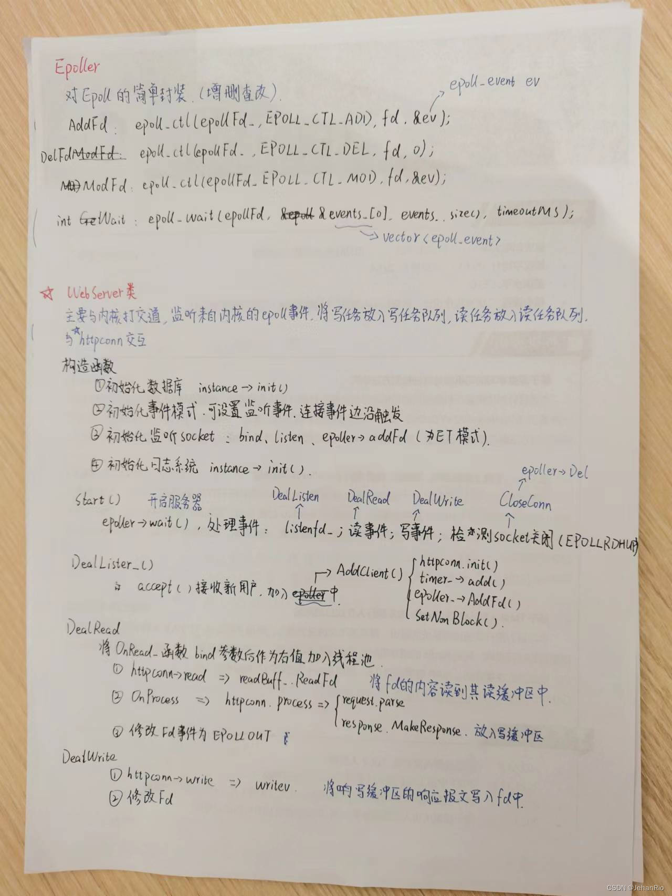
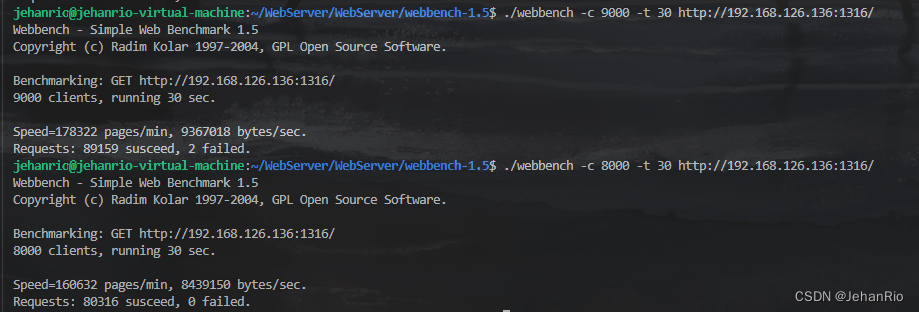

### 文章目录

-   [前言](https://blog.csdn.net/weixin_51322383/article/details/130545172#_1)
-   [1\. Epoller](https://blog.csdn.net/weixin_51322383/article/details/130545172#1_Epoller_5)
-   [2\. WebServer的设计](https://blog.csdn.net/weixin_51322383/article/details/130545172#2_WebServer_69)
-   -   [2.1 设计](https://blog.csdn.net/weixin_51322383/article/details/130545172#21__73)
    -   [2.2 WebServer类详解](https://blog.csdn.net/weixin_51322383/article/details/130545172#22_WebServer_102)
    -   -   [2.2.1 初始化](https://blog.csdn.net/weixin_51322383/article/details/130545172#221__103)
        -   [2.2.2 启动WebServer](https://blog.csdn.net/weixin_51322383/article/details/130545172#222_WebServer_121)
        -   [2.2.3 I/O处理的具体流程](https://blog.csdn.net/weixin_51322383/article/details/130545172#223__IO_132)
-   [代码](https://blog.csdn.net/weixin_51322383/article/details/130545172#_154)
-   -   [epoller.h](https://blog.csdn.net/weixin_51322383/article/details/130545172#epollerh_155)
    -   [epoller.cpp](https://blog.csdn.net/weixin_51322383/article/details/130545172#epollercpp_186)
    -   [webserver.h](https://blog.csdn.net/weixin_51322383/article/details/130545172#webserverh_238)
    -   [webserver.cpp](https://blog.csdn.net/weixin_51322383/article/details/130545172#webservercpp_337)
    -   [main.cpp](https://blog.csdn.net/weixin_51322383/article/details/130545172#maincpp_633)
    -   [Makefile](https://blog.csdn.net/weixin_51322383/article/details/130545172#Makefile_649)
-   [压测](https://blog.csdn.net/weixin_51322383/article/details/130545172#_666)
-   [结束语](https://blog.csdn.net/weixin_51322383/article/details/130545172#_672)

# 前言

这一部分应该算是项目甚至面试的重点之重点，许多知识点都需要掌握通透，我后面打算再写一篇关于项目知识点的博客。

___

# 1\. Epoller

`Epoll`的API接口其实也就这么几个，我这里罗列一下。

```cpp
#include <sys/epoll.h>
// 创建一个新的epoll实例。在内核中创建了一个数据，这个数据中有两个比较重要的数据，一个是需要检测的文件描述符的信息（红黑树），还有一个是就绪列表，存放检测到数据发送改变的文件描述符信息（双向链表）。
int epoll_create(int size);
- 参数：
size : 目前没有意义了。随便写一个数，必须大于0
- 返回值：
-1 : 失败
> 0 : 文件描述符，操作epoll实例的
            
typedef union epoll_data {
void *ptr;
int fd;
uint32_t u32;
uint64_t u64;
} epoll_data_t;

struct epoll_event {
uint32_t events; /* Epoll events */
epoll_data_t data; /* User data variable */
};
    
// 对epoll实例进行管理：添加文件描述符信息，删除信息，修改信息
int epoll_ctl(int epfd, int op, int fd, struct epoll_event *event);
- 参数：
- epfd : epoll实例对应的文件描述符
- op : 要进行什么操作
EPOLL_CTL_ADD: 添加
EPOLL_CTL_MOD: 修改
EPOLL_CTL_DEL: 删除
- fd : 要检测的文件描述符
- event : 检测文件描述符什么事情
            
// 检测函数
int epoll_wait(int epfd, struct epoll_event *events, int maxevents, int timeout);
- 参数：
- epfd : epoll实例对应的文件描述符
- events : 传出参数，保存了发生了变化的文件描述符的信息
- maxevents : 第二个参数结构体数组的大小
- timeout : 阻塞时间
- 0 : 不阻塞
- -1 : 阻塞，直到检测到fd数据发生变化，解除阻塞
- > 0 : 阻塞的时长（毫秒）
- 返回值：
- 成功，返回发送变化的文件描述符的个数 > 0
- 失败 -1
```

常见的[Epoll](https://so.csdn.net/so/search?q=Epoll&spm=1001.2101.3001.7020)检测事件：  
EAGAIN: 我们时常会用一个while(true)死循环去接收缓冲区中客户端socket的连接，如果这个时候我们设置socket状态为非阻塞，那么accept如果在某个时间段没有接收到客户端的连接，因为是非阻塞的IO，[accept函数](https://so.csdn.net/so/search?q=accept%E5%87%BD%E6%95%B0&spm=1001.2101.3001.7020)会立即返回，并将errno设置为EAGAIN。关于EAGAIN可以看一下这篇博文：[【Linux Socket C++】为什么IO复用需要用到非阻塞IO？EAGAIN的简单介绍与应用](https://blog.csdn.net/qq_52572621/article/details/127792861)

**下面是一些检测事件：**

> POLLIN ：表示对应的文件描述符可以读（包括对端 SOCKET 正常关闭）；  
> EPOLLOUT：表示对应的文件描述符可以写；  
> EPOLLPRI：表示对应的文件描述符有紧急的数据可读（这里应该表示有带外数据到来）；  
> EPOLLERR：表示对应的文件描述符发生错误；  
> EPOLLHUP：表示对应的文件描述符被挂断；  
> EPOLLET：将EPOLL设为边缘触发(Edge Triggered)模式，这是相对于水平触发(Level Triggered)来说的。  
> EPOLLONESHOT：只监听一次事件，当监听完这次事件之后，如果还需要继续监听这个socket的话，需要再次把这个socket加入到EPOLL队列里。  
> 1\. 客户端直接调用close，会触犯EPOLLRDHUP事件  
> 2\. 通过EPOLLRDHUP属性，来判断是否对端已经关闭，这样可以减少一次系统调用。

# 2\. [WebServer](https://so.csdn.net/so/search?q=WebServer&spm=1001.2101.3001.7020)的设计

**照例先上一张图**



## 2.1 设计

按照软件分层设计的草图，WebServer设计目标为：

-   监听IO事件
    -   读事件
    -   写事件
-   处理超时连接 数据： int port\_; 　　　　//端口

```cpp
int timeoutMS_; 　　　　//毫秒MS,定时器的默认过期时间

bool isClose_; 　　　//服务启动标志

int listenFd_; 　　//监听文件描述符

bool openLinger_;　　//优雅关闭选项

char* srcDir_;　　　//需要获取的路径

uint32_t listenEvent_;　//初始监听描述符监听设置

uint32_t connectionEvent_;//初始连接描述符监听设置

std::unique_ptr timer_;　 //定时器
std::unique_ptr threadpool_; //线程池
std::unique_ptr epoller_; //反应堆
std::unordered_map<int, HTTPconnection> users_;//连接队列
```

最下面几行参数就是我们实现的几大功能。

___

## 2.2 WebServer类详解

### 2.2.1 初始化

```cpp
threadpool_(new ThreadPool(threadNum))
InitSocket_();//初始化Socket连接
InitEventMode_(trigMode);//初始化事件模式
SqlConnPool::Instance()->Init();//初始化数据库连接池
Log::Instance()->init(logLevel, "./log", ".log", logQueSize);   
```

**创建线程池**：线程池的构造函数中会创建线程并且detach()

**初始化Socket的函数`InitSocket_();`**：C/S中，服务器套接字的初始化无非就是socket - bind - listen - accept - 发送接收数据这几个过程；函数执行到listen后，把前面得到的listenfd添加到epoller模型中，即把accept()和接收数据的操作交给epoller处理了。并且把该监听描述符设置为非阻塞。

**初始化事件模式函数**：InitEventMode\_(trigMode);，将listenEvent\_ 和 connEvent\_都设置为EPOLLET模式。

**初始化数据库连接池**：SqlConnPool::Instance()->Init();创造单例连接池，执行初始化函数。

**初始化日志系统**：在初始化函数中，创建阻塞队列和写线程，并创建日志。

### 2.2.2 启动WebServer

接下来启动WebServer，首先需要设定`epoll_wait()`等待的时间，这里我们选择调用定时器的`GetNextTick()`函数，这个函数的作用是返回最小堆堆顶的连接设定的过期时间与现在时间的差值。这个时间的选择可以保证服务器等待事件的时间不至于太短也不至于太长。接着调用epoll\_wait()函数，返回需要已经就绪事件的数目。这里的就绪事件分为两类：收到新的http请求和其他的读写事件。 这里设置两个变量fd和events分别用来存储就绪事件的文件描述符和事件类型。

1.收到新的HTTP请求的情况  
在fd==listenFd\_的时候，也就是收到新的HTTP请求的时候，调用函数`DealListen_();`处理监听，接受客户端连接；

2.已经建立连接的HTTP发来IO请求的情况  
在events& EPOLLIN 或events & EPOLLOUT为真时，需要进行读写的处理。分别调用 `DealRead_(&users_[fd])`和`DealWrite_(&users_[fd])` 函数。这里需要说明：`DealListen_()`函数并没有调用线程池中的线程，而`DealRead_(&users_[fd])`和`DealWrite_(&users_[fd])` 则都交由线程池中的线程进行处理了。

**这就是Reactor，读写事件交给了工作线程处理。**

### 2.2.3 I/O处理的具体流程

`DealRead_(&users_[fd])`和`DealWrite_(&users_[fd])` 通过调用

```cpp
threadpool_->AddTask(std::bind(&WebServer::OnRead_, this, client));     //读
threadpool_->AddTask(std::bind(&WebServer::OnWrite_, this, client));    //写
```

函数来取出线程池中的线程继续进行读写，而主进程这时可以继续监听新来的就绪事件了。

> 注意此处用`std:;bind`将参数绑定，他可以将可调用对象将参数绑定为一个仿函数，绑定后的结果可以使用std::function保存，而且**bind绑定类成员函数时，第一个参数表示对象的成员函数的指针（所以上面的函数用的是`&WebServer::OnRead_`），第二个参数表示对象的地址。**

`OnRead_()`函数首先把数据从缓冲区中读出来(调用HttpConn的`read`,`read`调用`ReadFd`读取到读缓冲区BUFFER)，然后交由逻辑函数`OnProcess()`处理。这里多说一句，`process()`函数在解析请求报文后随即就生成了响应报文等待`OnWrite_()`函数发送，这一点我们前面谈到过的。

**这里必须说清楚OnRead\_()和OnWrite\_()函数进行读写的方法，那就是：分散读和集中写**

> 分散读（scatter read）和集中写（gatherwrite）具体来说是来自读操作的输入数据被分散到多个应用缓冲区中，而来自应用缓冲区的输出数据则被集中提供给单个写操作。 这样做的好处是：它们只需一次系统调用就可以实现在文件和进程的多个缓冲区之间传送数据，免除了多次系统调用或复制数据的开销。

OnWrite\_()函数首先把之前根据请求报文生成的响应报文从缓冲区交给fd，传输完成后修改该fd的`events`.

OnProcess()就是进行业务逻辑处理（解析请求报文、生成响应报文）的函数了。

**这里我要提一嘴我之前犯的思想错误，一定要记住：“如果没有数据到来，epoll是不会被触发的”。当浏览器向服务器发出request的时候，epoll会接收到EPOLL\_IN读事件，此时调用OnRead去解析，将fd(浏览器)的request内容放到读缓冲区，并且把响应报文写到写缓冲区，这个时候调用OnProcess()是为了把该事件变为EPOLL\_OUT，让epoll下一次检测到写事件，把写缓冲区的内容写到fd。当EPOLL\_OUT写完后，整个流程就结束了，此时需要再次把他置回原来的EPOLL\_IN去检测新的读事件到来。**

以上这段话是我整理的整个WebServer的核心中的核心，一定要理解通透！！！

# 代码

## epoller.h

```cpp
#ifndef EPOLLER_H
#define EPOLLER_H

#include <sys/epoll.h> //epoll_ctl()
#include <unistd.h> // close()
#include <assert.h> // close()
#include <vector>
#include <errno.h>

class Epoller {
public:
    explicit Epoller(int maxEvent = 1024);
    ~Epoller();

    bool AddFd(int fd, uint32_t events);
    bool ModFd(int fd, uint32_t events);
    bool DelFd(int fd);
    int Wait(int timeoutMs = -1);
    int GetEventFd(size_t i) const;
    uint32_t GetEvents(size_t i) const;
        
private:
    int epollFd_;
    std::vector<struct epoll_event> events_;    
};

#endif //EPOLLER_H
```

## epoller.cpp

```cpp
#include "epoller.h"

Epoller::Epoller(int maxEvent):epollFd_(epoll_create(512)), events_(maxEvent){
    assert(epollFd_ >= 0 && events_.size() > 0);
}

Epoller::~Epoller() {
    close(epollFd_);
}

bool Epoller::AddFd(int fd, uint32_t events) {
    if(fd < 0) return false;
    epoll_event ev = {0};
    ev.data.fd = fd;
    ev.events = events;
    return 0 == epoll_ctl(epollFd_, EPOLL_CTL_ADD, fd, &ev);
}

bool Epoller::ModFd(int fd, uint32_t events) {
    if(fd < 0) return false;
    epoll_event ev = {0};
    ev.data.fd = fd;
    ev.events = events;
    return 0 == epoll_ctl(epollFd_, EPOLL_CTL_MOD, fd, &ev);
}

bool Epoller::DelFd(int fd) {
    if(fd < 0) return false;
    return 0 == epoll_ctl(epollFd_, EPOLL_CTL_DEL, fd, 0);
}

// 返回事件数量
int Epoller::Wait(int timeoutMs) {
    return epoll_wait(epollFd_, &events_[0], static_cast<int>(events_.size()), timeoutMs);
}

// 获取事件的fd
int Epoller::GetEventFd(size_t i) const {
    assert(i < events_.size() && i >= 0);
    return events_[i].data.fd;
}

// 获取事件属性
uint32_t Epoller::GetEvents(size_t i) const {
    assert(i < events_.size() && i >= 0);
    return events_[i].events;
}
```

## webserver.h

函数：

-   构造函数: 设置服务器参数　＋　初始化定时器／线程池／反应堆／连接队列
    
-   析构函数: 关闭listenFd\_，　销毁　连接队列/定时器／线程池／反应堆
    
-   主函数start()
    
    -   创建端口，绑定端口，监听端口，　创建epoll反应堆，　将监听描述符加入反应堆
        
    -   等待事件就绪
        
        -   连接事件－－＞DealListen()
            
        -   写事件－－＞DealWrite()
            
        -   读事件－－＞DealRead()
        
    -   事件处理完毕，修改反应堆，再跳到２处循环执行
    
-   DealListen: 新初始化一个ＨttpConnection对象
    
-   DealWrite：　对应连接对象进行处理－－＞若处理成功，则监听事件转换成　读　事件
    
-   DealRead：　 对应连接对象进行处理－－＞若处理成功，则监听事件转换成　写　事件
    

```cpp
#ifndef WEBSERVER_H
#define WEBSERVER_H

#include <unordered_map>
#include <fcntl.h>       // fcntl()
#include <unistd.h>      // close()
#include <assert.h>
#include <errno.h>
#include <sys/socket.h>
#include <netinet/in.h>
#include <arpa/inet.h>

#include "epoller.h"
#include "../timer/heaptimer.h"

#include "../log/log.h"
#include "../pool/sqlconnpool.h"
#include "../pool/threadpool.h"

#include "../http/httpconn.h"

class WebServer {
public:
    WebServer(
        int port, int trigMode, int timeoutMS, bool OptLinger, 
        int sqlPort, const char* sqlUser, const  char* sqlPwd, 
        const char* dbName, int connPoolNum, int threadNum,
        bool openLog, int logLevel, int logQueSize);

    ~WebServer();
    void Start();

private:
    bool InitSocket_(); 
    void InitEventMode_(int trigMode);
    void AddClient_(int fd, sockaddr_in addr);
  
    void DealListen_();
    void DealWrite_(HttpConn* client);
    void DealRead_(HttpConn* client);

    void SendError_(int fd, const char*info);
    void ExtentTime_(HttpConn* client);
    void CloseConn_(HttpConn* client);

    void OnRead_(HttpConn* client);
    void OnWrite_(HttpConn* client);
    void OnProcess(HttpConn* client);

    static const int MAX_FD = 65536;

    static int SetFdNonblock(int fd);

    int port_;
    bool openLinger_;
    int timeoutMS_;  /* 毫秒MS */
    bool isClose_;
    int listenFd_;
    char* srcDir_;
    
    uint32_t listenEvent_;  // 监听事件
    uint32_t connEvent_;    // 连接事件
   
    std::unique_ptr<HeapTimer> timer_;
    std::unique_ptr<ThreadPool> threadpool_;
    std::unique_ptr<Epoller> epoller_;
    std::unordered_map<int, HttpConn> users_;
};

#endif //WEBSERVER_H
```

## webserver.cpp

```cpp
#include "webserver.h"

using namespace std;

WebServer::WebServer(
            int port, int trigMode, int timeoutMS, bool OptLinger,
            int sqlPort, const char* sqlUser, const  char* sqlPwd,
            const char* dbName, int connPoolNum, int threadNum,
            bool openLog, int logLevel, int logQueSize):
            port_(port), openLinger_(OptLinger), timeoutMS_(timeoutMS), isClose_(false),
            timer_(new HeapTimer()), threadpool_(new ThreadPool(threadNum)), epoller_(new Epoller())
    {
    srcDir_ = getcwd(nullptr, 256);
    assert(srcDir_);
    strcat(srcDir_, "/resources/");
    HttpConn::userCount = 0;
    HttpConn::srcDir = srcDir_;

    // 初始化操作
    SqlConnPool::Instance()->Init("localhost", sqlPort, sqlUser, sqlPwd, dbName, connPoolNum);  // 连接池单例的初始化
    // 初始化事件和初始化socket(监听)
    InitEventMode_(trigMode);
    if(!InitSocket_()) { isClose_ = true;}

    // 是否打开日志标志
    if(openLog) {
        Log::Instance()->init(logLevel, "./log", ".log", logQueSize);
        if(isClose_) { LOG_ERROR("========== Server init error!=========="); }
        else {
            LOG_INFO("========== Server init ==========");
            LOG_INFO("Port:%d, OpenLinger: %s", port_, OptLinger? "true":"false");
            LOG_INFO("Listen Mode: %s, OpenConn Mode: %s",
                            (listenEvent_ & EPOLLET ? "ET": "LT"),
                            (connEvent_ & EPOLLET ? "ET": "LT"));
            LOG_INFO("LogSys level: %d", logLevel);
            LOG_INFO("srcDir: %s", HttpConn::srcDir);
            LOG_INFO("SqlConnPool num: %d, ThreadPool num: %d", connPoolNum, threadNum);
        }
    }
}

WebServer::~WebServer() {
    close(listenFd_);
    isClose_ = true;
    free(srcDir_);
    SqlConnPool::Instance()->ClosePool();
}

void WebServer::InitEventMode_(int trigMode) {
    listenEvent_ = EPOLLRDHUP;    // 检测socket关闭
    connEvent_ = EPOLLONESHOT | EPOLLRDHUP;     // EPOLLONESHOT由一个线程处理
    switch (trigMode)
    {
    case 0:
        break;
    case 1:
        connEvent_ |= EPOLLET;
        break;
    case 2:
        listenEvent_ |= EPOLLET;
        break;
    case 3:
        listenEvent_ |= EPOLLET;
        connEvent_ |= EPOLLET;
        break;
    default:
        listenEvent_ |= EPOLLET;
        connEvent_ |= EPOLLET;
        break;
    }
    HttpConn::isET = (connEvent_ & EPOLLET);
}

void WebServer::Start() {
    int timeMS = -1;  /* epoll wait timeout == -1 无事件将阻塞 */
    if(!isClose_) { LOG_INFO("========== Server start =========="); }
    while(!isClose_) {
        if(timeoutMS_ > 0) {
            timeMS = timer_->GetNextTick();     // 获取下一次的超时等待事件(至少这个时间才会有用户过期，每次关闭超时连接则需要有新的请求进来)
        }
        int eventCnt = epoller_->Wait(timeMS);
        for(int i = 0; i < eventCnt; i++) {
            /* 处理事件 */
            int fd = epoller_->GetEventFd(i);
            uint32_t events = epoller_->GetEvents(i);
            if(fd == listenFd_) {
                DealListen_();
            }
            else if(events & (EPOLLRDHUP | EPOLLHUP | EPOLLERR)) {
                assert(users_.count(fd) > 0);
                CloseConn_(&users_[fd]);
            }
            else if(events & EPOLLIN) {
                assert(users_.count(fd) > 0);
                DealRead_(&users_[fd]);
            }
            else if(events & EPOLLOUT) {
                assert(users_.count(fd) > 0);
                DealWrite_(&users_[fd]);
            } else {
                LOG_ERROR("Unexpected event");
            }
        }
    }
}

void WebServer::SendError_(int fd, const char*info) {
    assert(fd > 0);
    int ret = send(fd, info, strlen(info), 0);
    if(ret < 0) {
        LOG_WARN("send error to client[%d] error!", fd);
    }
    close(fd);
}

void WebServer::CloseConn_(HttpConn* client) {
    assert(client);
    LOG_INFO("Client[%d] quit!", client->GetFd());
    epoller_->DelFd(client->GetFd());
    client->Close();
}

void WebServer::AddClient_(int fd, sockaddr_in addr) {
    assert(fd > 0);
    users_[fd].init(fd, addr);
    if(timeoutMS_ > 0) {
        timer_->add(fd, timeoutMS_, std::bind(&WebServer::CloseConn_, this, &users_[fd]));
    }
    epoller_->AddFd(fd, EPOLLIN | connEvent_);
    SetFdNonblock(fd);
    LOG_INFO("Client[%d] in!", users_[fd].GetFd());
}

// 处理监听套接字，主要逻辑是accept新的套接字，并加入timer和epoller中
void WebServer::DealListen_() {
    struct sockaddr_in addr;
    socklen_t len = sizeof(addr);
    do {
        int fd = accept(listenFd_, (struct sockaddr *)&addr, &len);
        if(fd <= 0) { return;}
        else if(HttpConn::userCount >= MAX_FD) {
            SendError_(fd, "Server busy!");
            LOG_WARN("Clients is full!");
            return;
        }
        AddClient_(fd, addr);
    } while(listenEvent_ & EPOLLET);
}

// 处理读事件，主要逻辑是将OnRead加入线程池的任务队列中
void WebServer::DealRead_(HttpConn* client) {
    assert(client);
    ExtentTime_(client);
    threadpool_->AddTask(std::bind(&WebServer::OnRead_, this, client)); // 这是一个右值，bind将参数和函数绑定
}

// 处理写事件，主要逻辑是将OnWrite加入线程池的任务队列中
void WebServer::DealWrite_(HttpConn* client) {
    assert(client);
    ExtentTime_(client);
    threadpool_->AddTask(std::bind(&WebServer::OnWrite_, this, client));
}

void WebServer::ExtentTime_(HttpConn* client) {
    assert(client);
    if(timeoutMS_ > 0) { timer_->adjust(client->GetFd(), timeoutMS_); }
}

void WebServer::OnRead_(HttpConn* client) {
    assert(client);
    int ret = -1;
    int readErrno = 0;
    ret = client->read(&readErrno);         // 读取客户端套接字的数据，读到httpconn的读缓存区
    if(ret <= 0 && readErrno != EAGAIN) {   // 读异常就关闭客户端
        CloseConn_(client);
        return;
    }
    // 业务逻辑的处理（先读后处理）
    OnProcess(client);
}

/* 处理读（请求）数据的函数 */
void WebServer::OnProcess(HttpConn* client) {
    // 首先调用process()进行逻辑处理
    if(client->process()) { // 根据返回的信息重新将fd置为EPOLLOUT（写）或EPOLLIN（读）
    //读完事件就跟内核说可以写了
        epoller_->ModFd(client->GetFd(), connEvent_ | EPOLLOUT);    // 响应成功，修改监听事件为写,等待OnWrite_()发送
    } else {
    //写完事件就跟内核说可以读了
        epoller_->ModFd(client->GetFd(), connEvent_ | EPOLLIN);
    }
}

void WebServer::OnWrite_(HttpConn* client) {
    assert(client);
    int ret = -1;
    int writeErrno = 0;
    ret = client->write(&writeErrno);
    if(client->ToWriteBytes() == 0) {
        /* 传输完成 */
        if(client->IsKeepAlive()) {
            // OnProcess(client);
            epoller_->ModFd(client->GetFd(), connEvent_ | EPOLLIN); // 回归换成监测读事件
            return;
        }
    }
    else if(ret < 0) {
        if(writeErrno == EAGAIN) {  // 缓冲区满了 
            /* 继续传输 */
            epoller_->ModFd(client->GetFd(), connEvent_ | EPOLLOUT);
            return;
        }
    }
    CloseConn_(client);
}

/* Create listenFd */
bool WebServer::InitSocket_() {
    int ret;
    struct sockaddr_in addr;
    if(port_ > 65535 || port_ < 1024) {
        LOG_ERROR("Port:%d error!",  port_);
        return false;
    }
    addr.sin_family = AF_INET;
    addr.sin_addr.s_addr = htonl(INADDR_ANY);
    addr.sin_port = htons(port_);

    // 优雅关闭
    {
    struct linger optLinger = { 0 };
    if(openLinger_) {
        /* 优雅关闭: 直到所剩数据发送完毕或超时 */
        optLinger.l_onoff = 1;
        optLinger.l_linger = 1;
    }

    listenFd_ = socket(AF_INET, SOCK_STREAM, 0);
    if(listenFd_ < 0) {
        LOG_ERROR("Create socket error!", port_);
        return false;
    }

    ret = setsockopt(listenFd_, SOL_SOCKET, SO_LINGER, &optLinger, sizeof(optLinger));
    if(ret < 0) {
        close(listenFd_);
        LOG_ERROR("Init linger error!", port_);
        return false;
    }
    }

    int optval = 1;
    /* 端口复用 */
    /* 只有最后一个套接字会正常接收数据。 */
    ret = setsockopt(listenFd_, SOL_SOCKET, SO_REUSEADDR, (const void*)&optval, sizeof(int));
    if(ret == -1) {
        LOG_ERROR("set socket setsockopt error !");
        close(listenFd_);
        return false;
    }

    // 绑定
    ret = bind(listenFd_, (struct sockaddr *)&addr, sizeof(addr));
    if(ret < 0) {
        LOG_ERROR("Bind Port:%d error!", port_);
        close(listenFd_);
        return false;
    }

    // 监听
    ret = listen(listenFd_, 6);
    if(ret < 0) {
        LOG_ERROR("Listen port:%d error!", port_);
        close(listenFd_);
        return false;
    }
    ret = epoller_->AddFd(listenFd_,  listenEvent_ | EPOLLIN);  // 将监听套接字加入epoller
    if(ret == 0) {
        LOG_ERROR("Add listen error!");
        close(listenFd_);
        return false;
    }
    SetFdNonblock(listenFd_);   
    LOG_INFO("Server port:%d", port_);
    return true;
}

// 设置非阻塞
int WebServer::SetFdNonblock(int fd) {
    assert(fd > 0);
    return fcntl(fd, F_SETFL, fcntl(fd, F_GETFD, 0) | O_NONBLOCK);
}
```

## main.cpp

```cpp
#include <unistd.h>
#include "server/webserver.h"

int main() {
    // 守护进程 后台运行 
    WebServer server(
        1316, 3, 60000, false,             /* 端口 ET模式 timeoutMs 优雅退出  */
        3306, "root", "123456", "webserver", /* Mysql配置 */
        12, 6, true, 1, 1024);             /* 连接池数量 线程池数量 日志开关 日志等级 日志异步队列容量 */
    server.Start();
} 

```

## Makefile

```makefile
CXX = g++
CFLAGS = -std=c++14 -O2 -Wall -g 

TARGET = server
OBJS = ../code/log/*.cpp ../code/pool/*.cpp ../code/timer/*.cpp \
       ../code/http/*.cpp ../code/server/*.cpp \
       ../code/buffer/*.cpp ../code/main.cpp

all: $(OBJS)
$(CXX) $(CFLAGS) $(OBJS) -o ../bin/$(TARGET)  -pthread -lmysqlclient

clean:
rm -rf ../bin/$(OBJS) $(TARGET)
```

# 压测

  
内存：4G，CPU：i5  
Ubuntu:18

我想，没有上1W的原因应该是电脑性能太糟糕

# 结束语

**写到这，整个项目也就接近尾声啦！还有些收尾的工作没做。到最后我应该会再出一篇文章来总结一下知识点，想必在面试中会很有帮助。在这里就不多说了。**

**还是蛮开心的，这个专栏也终于要完结了哈哈哈~**