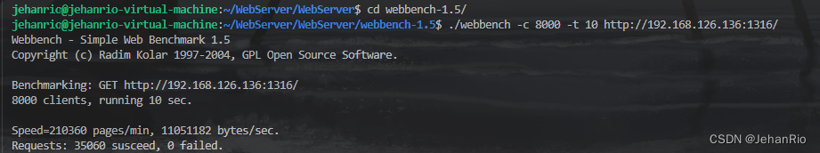

### 文章目录

-   [前言](https://blog.csdn.net/weixin_51322383/article/details/130583104#_1)
-   [项目介绍](https://blog.csdn.net/weixin_51322383/article/details/130583104#_12)
-   -   [为什么要做这样一个项目？](https://blog.csdn.net/weixin_51322383/article/details/130583104#_13)
    -   [项目背景](https://blog.csdn.net/weixin_51322383/article/details/130583104#_15)
    -   [项目描述](https://blog.csdn.net/weixin_51322383/article/details/130583104#_20)
    -   [项目功能](https://blog.csdn.net/weixin_51322383/article/details/130583104#_23)
    -   [项目流程](https://blog.csdn.net/weixin_51322383/article/details/130583104#_36)
    -   [项目重难点](https://blog.csdn.net/weixin_51322383/article/details/130583104#_63)
    -   [项目效果](https://blog.csdn.net/weixin_51322383/article/details/130583104#_68)
    -   [解决方案](https://blog.csdn.net/weixin_51322383/article/details/130583104#_72)
    -   [个人收获](https://blog.csdn.net/weixin_51322383/article/details/130583104#_88)
-   [线程池](https://blog.csdn.net/weixin_51322383/article/details/130583104#_91)
-   -   [线程的同步机制有哪些？](https://blog.csdn.net/weixin_51322383/article/details/130583104#_92)
    -   [线程池中的工作线程是一直等待的吗？](https://blog.csdn.net/weixin_51322383/article/details/130583104#_94)
    -   [如果同时1000个客户端进行访问请求，线程数不多，怎么能及时响应处理每一个呢？](https://blog.csdn.net/weixin_51322383/article/details/130583104#1000_96)
    -   [如果一个客户请求需要占用线程很久的时间，会不会影响接下来的客户请求呢，有什么好的策略呢?](https://blog.csdn.net/weixin_51322383/article/details/130583104#_101)
-   [定时器](https://blog.csdn.net/weixin_51322383/article/details/130583104#_105)
-   -   [为什么手动实现小根堆？](https://blog.csdn.net/weixin_51322383/article/details/130583104#_106)
    -   [常用的定时器结构和它们的差异？](https://blog.csdn.net/weixin_51322383/article/details/130583104#_108)
-   [日志系统](https://blog.csdn.net/weixin_51322383/article/details/130583104#_115)
-   -   [日志系统记录的内容及作用？](https://blog.csdn.net/weixin_51322383/article/details/130583104#_116)
    -   [日志系统的实现需要考虑什么？](https://blog.csdn.net/weixin_51322383/article/details/130583104#_121)
-   [网络设计模式](https://blog.csdn.net/weixin_51322383/article/details/130583104#_127)
-   -   [简单说一下服务器使用的并发模型？](https://blog.csdn.net/weixin_51322383/article/details/130583104#_128)
    -   [Reactor和Proactor的区别？](https://blog.csdn.net/weixin_51322383/article/details/130583104#ReactorProactor_130)
    -   [同步I/O和异步I/O的区别](https://blog.csdn.net/weixin_51322383/article/details/130583104#IOIO_138)
    -   [为什么采用Reactor？](https://blog.csdn.net/weixin_51322383/article/details/130583104#Reactor_145)
    -   [有什么优化方案？](https://blog.csdn.net/weixin_51322383/article/details/130583104#_148)
-   [I/O多路复用](https://blog.csdn.net/weixin_51322383/article/details/130583104#IO_151)
-   -   [select、poll、epoll的区别](https://blog.csdn.net/weixin_51322383/article/details/130583104#selectpollepoll_152)
    -   [epoll为什么高效？](https://blog.csdn.net/weixin_51322383/article/details/130583104#epoll_158)
    -   [ET、LT模式的区别](https://blog.csdn.net/weixin_51322383/article/details/130583104#ETLT_163)
-   [HTTP](https://blog.csdn.net/weixin_51322383/article/details/130583104#HTTP_167)
-   -   [为什么要用状态机？](https://blog.csdn.net/weixin_51322383/article/details/130583104#_168)
    -   [GET和POST的区别](https://blog.csdn.net/weixin_51322383/article/details/130583104#GETPOST_173)

# 前言

这一两天效率感觉挺低的，我发现这个项目还有挺多小问题的，很多代码的逻辑判断有点冗余。我去除了一些没必要的判断，东捣鼓一下西捣鼓一下，昨天进行[压测](https://so.csdn.net/so/search?q=%E5%8E%8B%E6%B5%8B&spm=1001.2101.3001.7020)的时候居然能达到8K并发量了，算是一个小进步了吧。哦对了，平时说的QPS就是最后的`Requests/running time`，这一点别和并发量搞混淆了。

学了一下午的CMake，最终放弃了，我也不知道这是第几次放弃学CMake了，现在做项目的时候，makefile感觉还要比CMake用着简单点，嘶~

**然后呢，这一篇打算用来将一下整个项目的一些问题和知识点进行总结，无论是当作最后的总结，或者面经也好，亦或者未来要修改的方向，都是可以的。如有不对，烦请指正！这篇硬核干货内容较多，直接开始吧。**

**导航：**[从零开始实现C++ TinyWebServer 全过程记录](https://blog.csdn.net/weixin_51322383/article/details/130464403)

___

# 项目介绍

## 为什么要做这样一个项目？

平时的学习都是偏向于深度学习，感觉自身对于后台开发的知识有点薄弱，故此想学习有关服务器后台开发的相关知识，同时还能巩固C++11新特性、操作系统、网络编程、epoll等知识点。

## 项目背景

该项目是在学习过程中一个实践练手的项目，设计的知识由Modern C++、网络编程、多线程编程、Linux库函数等。参考了高性能服务器和Linux多线程服务器这两本书籍，以及一些开源代码进行开发。

代码量约2K行。

## 项目描述

该项目总体框架采用的是**单Reactor多线程模型**，在主线程里面通过I/O多路复用监听多个文件描述符上的事件。主线程负责连接的建立和断开、把读写和逻辑处理函数加入线程池的任务队列，由**线程池**的子线程完成相应的读写操作，实现任务的高并发处理。在最底层实现了自动增长的**Buffer缓冲区**。在应用层方面实现心跳机制，通过**定时器**清楚掉不活跃的连接以减少高并发场景下不必要的系统资源的占用（文件描述符的占用、维护TCP连接所需要的资源等）。对于**HTTP请求报文**，采用分散读进行读取，使用有限状态机和正则表达式进行解析；并通过集中写和内存映射的方式对**响应报文**进行传输。应用层还实现了**数据库**功能，采用RAII机制实现连接池，可以实现基本的注册和登录功能。最后还加入了**日志模块**帮助工程项目开发和实现服务器的日常运行情况的记录。

## 项目功能

-   利用I/O复用技术epoll与线程池实现多线程的Reactor高并发模型；
    
-   利用正则表达式与状态机解析HTTP请求报文，实现处理静态资源的请求，并发送响应报文；
    
-   利用标准库容器封装char，实现自动增长的缓冲区；
    
-   基于小根堆实现的定时器，关闭超时的非活动连接；
    
-   利用单例模式与阻塞队列实现异步的日志系统，记录服务器运行状态；
    
-   利用RAII机制实现了数据库连接池，减少数据库连接建立与关闭的开销，同时实现了用户注册登录功能。
    

## 项目流程

-   首先是服务器的一个参数初始化操作。

通过构造WebServer这个对象传递参数进行服务器相关参数的设定，主要参数有设置定时器超时时间、设置Epoll触发模式、设置日志系统的开启、日志路径以及异步开关、设置线程池的线程数量。

-   然后是通过设定的参数对服务器的各个模块进行初始化。主要有日志、线程池、数据库连接池、IO复用、HTTP对象、缓冲区、阻塞队列等模块。

日志模块的初始化是先建立一个日志文件，通过一个变量按照天数去划分不同的日志文件。线程池采用RAII手法，在构造时创建线程，折构时唤醒所有睡眠的线程使其退出循环。IO复用是对epoll函数调用的一个封装。HTTP对象主要设置文件存放的相关路径。缓冲区和阻塞队列主要完成指定大小的参数设定。

-   服务器各个模块初始化完成之后就是主线程里I/O复用监听事件的循环。

监听事件有新连接到达、读事件和写事件和异常事件。根据不同的事件进行一个任务处理。

当新连接到达的时候，通过调用accept取出新连接（ET模式下需要循环操作），将新连接的文件描述符用来初始化HTTP连接（套接字地址和文件描述符绑定到一个HTTP对象），完成绑定定时器的初始化，同时添加监听读事件，设置其文件描述符为非阻塞。

当有异常事件发生的时候，关闭该连接同时移除监听事件和定时器。

当触发读事件的时候，调整定时器的定时时间，将读任务放入线程池的任务队列当中去。这个时候线程池对象里的多个线程，处于一个睡眠或者竞争任务并执行的过程，任务加入到任务队列当中去时会发送一个唤醒信号，如果有睡眠的线程则会被唤醒，进入循环里探测任务队列是否为空，取出任务并执行或者队列为空继续睡眠。

线程执行读任务函数主要是完成一个非阻塞读取调用直到读完，将数据缓存在用户缓冲区中，接着执行一个消息解析的操作，根据HTTP解析是否成功的判断来决定重新注册写事件还是读事件。如果解析失败那么重新注册读事件等待下次读取更多数据直到一个完整的HTTP请求。如果是解析成功的话就制作响应报文并且注册写事件，等待内核缓冲区可写触发事件时，将其写入内核缓冲区。

同时，基于心跳机制，每过一段时间会检测时间堆，去除掉长时间非活跃的连接。

**这部分的重点是逻辑处理的过程，也就是HTTP解析和HTTP报文的制作。**

解析采用的是状态机和正则表达式，每次都读取以`\r\n`结尾的一段字符串，通过状态机来判定获取的字符串是属于HTTP请求的哪一部分，再跳转到相应的函数进行解析，如果读取的字符串没有以`\r\n`结尾则认为此次数据获取不完整，返回解析失败重新注册读事件。解析的时候判断是否是POST请求，如果是的话，还要解析POST的数据，里面包含了登录注册的用户信息，需要通过数据库连接池获取连接去进行一个业务逻辑的判断。这部分是在数据体BODY部分，如果是GET请求的话，那么BODY是空的。如果解析完成之后则根据解析过程中保存的相应信息，制作响应报文，通过集中写将资源文件和响应报文分别发送回客户端。

## 项目重难点

-   **HTTP报文的解析**
-   **顶层整个项目的框架搭建和规划设计**
-   **各种线程安全问题、资源保护问题等（锁）**

## 项目效果

在CPU i5，内存4G，双ET模式下，虚拟机上实现了8K的并发量,[QPS](https://so.csdn.net/so/search?q=QPS&spm=1001.2101.3001.7020)为3506，未来就以这个为指标进行优化了。（说实话这个数据真的很烂，最基本的并发量都没达到1W）

## 解决方案

通过局部、自底向下的设计思想。

以下是别人的，我觉得这个说的很好，下次也这样做项目了。

-   通过采用从局部到整体的设计思想。先使用单一线程完成串行的**HTTP连接建立、HTTP消息处理和HTTP应答发送**，然后**围绕高并发这个核心扩展多个模块**。
    
-   首先就是**日志模块和缓冲区**模块的一个设计，这里优先实现是为了下面各个模块的调试方便，记录各个模块运行的状况和打印输出模块运作情况来排除明显的BUG。
    
-   然后是引入**I/O多路复用**实现单线程下也能在一次系统调用中同时监听多个文件描述符，再进一步搭配**线程池**实现多客户多任务并行处理，这是高并发的核心部分。
    
-   在这个基础上做一点优化，在应用层实现了**心跳机制**，通过定时器实现非活跃连接的一个检测和中断，减少系统资源（内存）不必要的浪费。最后将所有模块整合起来，实现一个单Reactor多线程的网络设计模式，将多个模块串联起来实现完整高并发的服务器程序。
    
-   **线程安全**这块是通过不断将锁的粒度降低，平衡性能和安全。一开始采用粒度较粗的锁实现互斥（通常是整个操作），然后慢慢分析将一些不共享的代码移出临界区，慢慢调整慢慢优化。
    
-   最后加入**数据库**部分，因为这一部分比较独立，采用RAII机制创建连接池，拿出连接来使用。在HTTP中加入数据库信息验证的功能。
    

## 个人收获

学习了基本的网络编程和多线程编程。进一步熟悉C++语法还有一些常用的新特性，了解常用的设计模式还有网络设计模式。了解一个项目框架和模块的设计方法。

# 线程池

## 线程的同步机制有哪些？

信号量、条件变量、互斥量等。

## 线程池中的工作线程是一直等待的吗？

对，等待新任务来了之后，条件变量将其唤醒，防止他一直遍历循环，耗费计算机资源。

## 如果同时1000个客户端进行访问请求，线程数不多，怎么能及时响应处理每一个呢？

该项目是基于IO复用的并发模式。但需要注意的是，**不是一个客户连接就对应一个线程**！如果真是如此，淘宝双11服务器早就崩了！因为那么多的用户，不可能一人一个线程。

当客户连接有事件需要处理的时，epoll会进行事件提醒，然后将其对应的任务加入请求队列，等待工作线程竞争执行。**如果速度还是慢，那就只能够增大线程池容量，或者考虑集群分布式的做法**。

## 如果一个客户请求需要占用线程很久的时间，会不会影响接下来的客户请求呢，有什么好的策略呢?

会影响，因为线程的数量是固定的，如果一个客户请求长时间占用线程资源，就会影响服务器对外部整体的响应速度。解决的策略可以是给每一个线程处理任务设定一个时间阈值，当某一个客户请求时间过长，则将其置于任务请求最后，或断开连接。

# 定时器

## 为什么手动实现小根堆？

学以致用，为了更好的熟悉堆这一数据结构。

## 常用的定时器结构和它们的差异？

除了小根堆实现之外，还有使用时间轮和基于升序链表实现的定时器结构。

基于升序链表实现的定时器结构按照超时时间作为升序做排序，每个结点都链接到下一个结点，由于链表的有序性以及不支持随机访问的特性，每次插入定时器都需要遍历寻找合适的位置，而且每次定时器调整超时时间时也需要往后遍历寻找合适的位置进行挪动，遍历操作效率较低。

小根堆实现的定时器结构，每次取堆头都是最短超时时间，能够利用IO复用的超时选项，每次的计时间隔动态调整为最短超时时间，确保每次调用IO复用系统调用返回时都至少有一个定时事件的超时发生或者监听事件的到达，有效地减少了多余的计时中断（利用信号中断进行计时）。最主要是确保每次定时器插入、更新、删除都能实现稳定的logn时间复杂度。

# 日志系统

## 日志系统记录的内容及作用？

在开发其他模块的时候主要用来记录模块的信息，通过日志判断模块功能是否正常。

在服务器运行期间主要记录服务器设定的参数、新客户的建立与断开、异常事件的发生（并发数量达到上限、套接字初始化失败等）。便于对服务器运行过程中一些不明情况的分析。

## 日志系统的实现需要考虑什么？

**线程安全性还有效率问题。**

首先是线程安全方面，日志系统需要记录多个连接运行的情况，也就是说日志系统被多个线程拥有，这个时候需要考虑线程安全的问题，通过内部关键操作（涉及临界区资源的部分）进行加锁，实现每个线程对日志对象的访问不会产生冲突，避免日志写入的混乱。

另一个方面的话是效率问题，为了实现线程安全人为地加锁，而日志系统又需要进行IO操作，这样会导致线程持锁阻塞其他线程对锁地争用，同时大量地IO读写也会使当前调用日志对象的线程被阻塞在IO操作上，颠倒了事件处理优先级的顺序。效率这一块可以通过采用异步线程加双缓冲区写入的方式优化，调用日志对象的线程只需要完成两次内存拷贝，通过空间换时间的手法【双缓冲区是为了缓解内存读写速度和磁盘读写速度的差异导致部分数据丢失】，将磁盘IO操作交给单独的线程去处理，这样调用日志对象的线程能够保证尽可能地持锁时间短而且不会阻塞在IO操作上。

# 网络设计模式

## 简单说一下服务器使用的并发模型？

该项目采用的是Reactor网络设计模型。主线程主负责监听文件描述符上是否有事件发生，若有，则立即通知工作线程，将socket可读可写事件放入请求队列，**读写数据均在工作线程中完成。(需要区别读和写事件)**

## Reactor和Proactor的区别？

**Reactor**采用的是同步IO，多路复用监听事件，对于到达的事件根据类型进行任务分发，交给线程池处理。换个说法就是他感知到的是读，然后需要应用进程主动调用 read方法来完成数据的读取，也就是要应用进程主动将 socket 接收缓存中的数据读到应用进程内存中，这个过程是同步的，读取完数据后应用进程才能处理数据。

**Proactor**采用的是异步IO，只负责发起IO操作，真正的IO实现由操作系统处理。然后任务池从指定的缓冲区中取出数据进行操作，只考虑逻辑处理不需要处理IO操作。换个说法就是他感知到的是已经完成的读写事件。这里的读写工作全程由操作系统来做，并不需要像 Reactor 那样还需要应用进程主动发起 read/write 来读写数据，操作系统完成读写工作后，就会通知应用进程直接处理数据。

举个实际生活中的例子，Reactor 模式就是快递员在楼下，给你打电话告诉你快递到你家小区了，你需要自己下楼来拿快递。而在 Proactor 模式下，快递员直接将快递送到你家门口，然后通知你。

**无论是 Reactor，还是 Proactor，都是一种基于「事件分发」的网络编程模式，区别在于 Reactor 模式是基于「待完成」的 I/O 事件，而 Proactor 模式则是基于「已完成」的 I/O 事件。**

## 同步I/O和异步I/O的区别

**同步IO和异步IO的区别主要在于获取数据的方式不同。或者说将数据从内核复制到用户空间时，用户进程是否会阻塞。**

同步IO是内核通知用户可以进行读写操作，需要用户手动使用函数进行系统调用陷入内核，将内核数据拷贝到用户缓冲区。

而异步IO则是通过系统调用向内核发起通知，告知要进行的IO操作并指明存放的缓冲区，当内核完成IO操作时再通知用户（通常是回调函数实现），此时用户得到的是已经准备好的数据，没有中间阻塞的IO操作。

## 为什么采用Reactor？

Proactor模式是针对异步I/O设计的，而Linux上没有相关的异步I/O系统调用，只能通过主线程进行同步I/O进行模拟，实现的意义不大，所以便直接采用了Reactor模型。

## 有什么优化方案？

**采用多Reactor模型**，主线程只负责新连接到达的监听以及新连接的建立，对于新到达的连接通过生产者消费者模型分发给子Reactor（另起线程），由子Reactor完成已建立连接的读写事件监听任务。这样当有瞬间的高并发连接时，也不会出现新连接丢失的情况。

# I/O多路复用

## select、poll、epoll的区别

1.  当有事件触发时，select和poll需要用户自己去遍历文件描述符找出触发的事件，而epoll能够直接返回所有的触发事件；
2.  每次调用select和poll都需要将文件描述符集合拷贝到内核空间，返回时再拷贝一次。而epoll只需要拷贝需要修改的文件描述符而不需要集体的拷贝；
3.  select支持的文件描述符数量有上限（1024），而poll和epoll没有此限制；
4.  select、poll 和 epoll 底层数据结构实现各不相同。select 使用**数组**；poll 采用**链表**；epoll 底层使用的是**红黑树**，能够有效的提升效率。
5.  select和poll都只能工作**在相对低效的LT模式下**，而epoll同时支持LT和ET模式。

## epoll为什么高效？

相对于`select`，`epoll`能够监听的文件描述符没有上限；poll和select一样，每次调用都要将文件描述符集合在内核和用户之间进行拷贝；每次由事件触发的时候，需要遍历所有文件描述符找到触发的事件；**而epoll只需要往内核空间里的红黑树添加修改或者删除指定的文件描述符和事件，不需要每次都拷贝所有的文件描述符集合到内核当中去，同时也能够直接返回就绪事件，无需重复遍历文件描述符集合。**

所以在需要监听多个文件描述符上的事件的时候，选用epoll更有效率，内核直接返回触发事件。**但是当需要监听的文件描述符数量少且较为活跃的情况下，select和poll相比epoll更有效率，因为其省去了触发感兴趣事件时的函数回调操作（将数据从红黑树上添加到就绪链表中）。**

## ET、LT模式的区别

-   **LT模式**：即水平触发模式，只要内核缓冲区还有数据就会提醒（哪怕已经提醒过，针对同一事件可以多次提醒）
-   **ET模式**：即边沿触发模式，每一次事件到来只通知一次（针对一个事件只提醒一次而不是提醒多次），没有及时读取完，该部分剩余数据直到下次触发，才能被读取（有可能永远也读不到，如果没有再次触发文件描述符上的该事件）

# HTTP

## 为什么要用状态机？

有限状态机，是一种抽象的理论模型，它能够把有限个变量描述的状态变化过程，以可构造可验证的方式呈现出来。比如，封闭的有向图。

有限状态机可以通过if-else,switch-case和函数指针来实现，从软件工程的角度看，主要是为了封装逻辑。有限状态机一种逻辑单元内部的一种高效编程方法，在服务器编程中，服务器可以根据不同状态或者消息类型进行相应的处理逻辑，使得程序逻辑清晰易懂。

## GET和POST的区别

-   **url可见性**
    -   get：参数url可见
    -   post：参数url不可见
-   **缓存性**
    -   get请求可以缓存
    -   post请求不可缓存
-   **安全性**  
    post更安全一点
-   **数据包**  
    对于GET方式的请求，浏览器会把http header和data一并发送出去，服务器响应200（返回数据）；

而对于POST，浏览器先发送header，服务器响应100 continue，浏览器再发送data，服务器响应200 ok（返回数据）。

