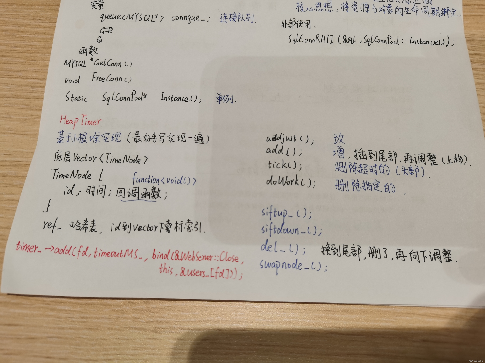

### 文章目录

-   [前言](https://blog.csdn.net/weixin_51322383/article/details/130541205#_1)
-   -   [free talk](https://blog.csdn.net/weixin_51322383/article/details/130541205#free_talk_2)
    -   [前言正片](https://blog.csdn.net/weixin_51322383/article/details/130541205#_11)
-   [时间堆](https://blog.csdn.net/weixin_51322383/article/details/130541205#_15)
-   -   [小根堆详解](https://blog.csdn.net/weixin_51322383/article/details/130541205#_27)
    -   [定时器的管理](https://blog.csdn.net/weixin_51322383/article/details/130541205#_70)
-   [代码](https://blog.csdn.net/weixin_51322383/article/details/130541205#_80)
-   -   [heaptimer.h](https://blog.csdn.net/weixin_51322383/article/details/130541205#heaptimerh_81)
    -   [heaptimer.cpp](https://blog.csdn.net/weixin_51322383/article/details/130541205#heaptimercpp_139)
-   [结束语](https://blog.csdn.net/weixin_51322383/article/details/130541205#_276)

# 前言

## free talk

昨天晚上失眠了，到2点估计才睡着，我想这估计和下午那杯咖啡没消化完和我看巅峰说唱看到0:40有关系吧（太兴奋了）导致我今天早上9点半才出寝室，做了几个[算法题](https://so.csdn.net/so/search?q=%E7%AE%97%E6%B3%95%E9%A2%98&spm=1001.2101.3001.7020)，一上午就过去了。

我已经基本习惯把前言部分当成我的free talk部分了，每次开启一篇新的篇章的时候，就总想说点心里话，释放自己压力也好，给后人说说听也好。但我想我的初衷其实并不是写出多么高质量高阅读量的文章，这一条路想必有比我更优秀的人在写，如果你觉得我的文章写的烂，可以点击网页的右上角了。我是一个喜欢思考的人，我也很喜欢和有思考有深度的人交朋友，那些浮于表面superficial的人，和他们交谈起来就像是对牛弹琴，但我很庆幸，在大学我身边还是有这样的些许人的。所以我写的一些东西，包括我的一些生活杂事，对待一些事情的看法，我的一些对于这个学校、社会的一些讨论，也只有懂我的人才明白。

最近巅峰说唱又开始了，每年夏天，都会有我最爱的rapper们出现在荧幕上。我特别喜欢羊和苏，他的歌曲能带给我力量，每当我跑步跑不动、举铁举不动的时候，我就会切到他的歌曲，就像是打了氮泵一样。不仅仅是他的作品，他对待比赛、对待生活的态度也一样，时刻保持愤怒，因为只有保持愤怒，才能不安于现状，才能在如今这个下行的大环境夺得一席之地。保持愤怒，继续前行吧，威武~

___

## 前言正片

可能这才是前言正片哈哈。今天准备把时间堆给实现了，时间堆也是服务器优化的一个很重要部分，底层基于堆，最好是手写一遍，还能复习一遍数据结构、[堆排序](https://so.csdn.net/so/search?q=%E5%A0%86%E6%8E%92%E5%BA%8F&spm=1001.2101.3001.7020)，挺有帮助的。时间堆写完，所有功能就实现了，就可以去实现最上层的WebServer了。

___

# 时间堆

网络编程中除了处理IO事件之外，定时事件也同样不可或缺，如定期检测一个客户连接的活动状态、游戏中的技能冷却倒计时以及其他需要使用超时机制的功能。我们的服务器程序中往往需要处理众多的定时事件，因此有效的组织定时事件，使之能在预期时间内被触发且不影响服务器主要逻辑，对我们的服务器性能影响特别大。

我们的web服务器也需要这样一个时间堆，定时剔除掉长时间不动的空闲用户，避免他们占着茅坑不拉屎，耗费服务器资源。

一般的做法是将每个定时事件封装成定时器，并使用某种容器类数据结构将所有的定时器保存好，实现对定时事件的统一管理。常用方法有排序链表、红黑树、时间堆和时间轮。这里使用的是时间堆。

时间堆的底层实现是由小根堆实现的。小根堆可以保证堆顶元素为最小的。  


___

## 小根堆详解

传统的定时方案是以固定频率调用起搏函数tick，进而执行定时器上的回调函数。而时间堆的做法则是将所有定时器中超时时间最小的一个定时器的超时值作为心搏间隔，当超时时间到达时，处理超时事件，然后再次从剩余定时器中找出超时时间最小的一个，依次反复即可。

当前系统时间：8:00

1号定时器超时时间：8:05

2号定时器超时时间：8:08

设置心搏间隔：8:05-8:00=5

5分钟到达后处理1号定时器事件，再根据2号超时时间设定心搏间隔.

为了后面处理过期连接的方便，我们给每一个定时器里面放置一个回调函数，用来关闭过期连接。

为了便于定时器结点的比较，主要是后续堆结构的实现方便，我们还需要重载比较运算符。

这里还用到了几个C++11的时间新特性，讲一下

-   `std::chrono::high_resolution_clock`
    -   `duration`（一段时间）
    -   `time_point`（时间点）

一般获取时间点是通过clock时钟获得的，一共有3个：  
①、high\_resolution\_clock  
②、system\_clock  
③、steady\_clock

-   `high_resolution_clock`  
    他有一个now()方法，可以获取当前时间。注意：std::chrono::high\_resolution\_clock返回的时间点是按秒为单位的。
    
-   `std::chrono::milliseconds`表示毫秒，可用于`duration<>`的模板类，举例：`chrono::duration_cast<milliseconds>`
    

```cpp
struct TimerNode{
public:
    int id;             //用来标记定时器
    TimeStamp expire;   //设置过期时间
    TimeoutCallBack cb; //设置一个回调函数用来方便删除定时器时将对应的HTTP连接关闭
    bool operator<(const TimerNode& t)
    {
        return expire<t.expire;
    }
};
```

添加方法：timer\_->add(fd, timeoutMS\_, std::bind(&[WebServer](https://so.csdn.net/so/search?q=WebServer&spm=1001.2101.3001.7020)::CloseConn\_, this, &users\_\[fd\])); 由于TimeoutCallBack的类型是std::function<void()>，所以这里采用bind绑定参数。

## 定时器的管理

主要有对堆节点进行增删和调整的操作。

```cpp
void addTimer(int id,int timeout,const TimeoutCallBack& cb);//添加一个定时器
void del_(size_t i);//删除指定定时器
void siftup_(size_t i);//向上调整
bool siftdown_(size_t index,size_t n);//向下调整,若不能向下则返回false
void swapNode_(size_t i,size_t j);//交换两个结点位置
```

# 代码

## heaptimer.h

```cpp
#ifndef HEAP_TIMER_H
#define HEAP_TIMER_H

#include <queue>
#include <unordered_map>
#include <time.h>
#include <algorithm>
#include <arpa/inet.h> 
#include <functional> 
#include <assert.h> 
#include <chrono>
#include "../log/log.h"

typedef std::function<void()> TimeoutCallBack;
typedef std::chrono::high_resolution_clock Clock;
typedef std::chrono::milliseconds MS;
typedef Clock::time_point TimeStamp;

struct TimerNode {
    int id;
    TimeStamp expires;  // 超时时间点
    TimeoutCallBack cb; // 回调function<void()>
    bool operator<(const TimerNode& t) {    // 重载比较运算符
        return expires < t.expires;
    }
    bool operator>(const TimerNode& t) {    // 重载比较运算符
        return expires > t.expires;
    }
};
class HeapTimer {
public:
    HeapTimer() { heap_.reserve(64); }  // 保留（扩充）容量
    ~HeapTimer() { clear(); }
    
    void adjust(int id, int newExpires);
    void add(int id, int timeOut, const TimeoutCallBack& cb);
    void doWork(int id);
    void clear();
    void tick();
    void pop();
    int GetNextTick();

private:
    void del_(size_t i);
    void siftup_(size_t i);
    bool siftdown_(size_t i, size_t n);
    void SwapNode_(size_t i, size_t j);

    std::vector<TimerNode> heap_;
    // key:id value:vector的下标
    std::unordered_map<int, size_t> ref_;   // id对应的在heap_中的下标，方便用heap_的时候查找
};

#endif //HEAP_TIMER_H
```

## heaptimer.cpp

```cpp
#include "heaptimer.h"

void HeapTimer::SwapNode_(size_t i, size_t j) {
    assert(i >= 0 && i <heap_.size());
    assert(j >= 0 && j <heap_.size());
    swap(heap_[i], heap_[j]);
    ref_[heap_[i].id] = i;    // 结点内部id所在索引位置也要变化
    ref_[heap_[j].id] = j;    
}

void HeapTimer::siftup_(size_t i) {
    assert(i >= 0 && i < heap_.size());
    size_t parent = (i-1) / 2;
    while(parent >= 0) {
        if(heap_[parent] > heap_[i]) {
            SwapNode_(i, parent);
            i = parent;
            parent = (i-1)/2;
        } else {
            break;
        }
    }
}

// false：不需要下滑  true：下滑成功
bool HeapTimer::siftdown_(size_t i, size_t n) {
    assert(i >= 0 && i < heap_.size());
    assert(n >= 0 && n <= heap_.size());    // n:共几个结点
    auto index = i;
    auto child = 2*index+1;
    while(child < n) {
        if(child+1 < n && heap_[child+1] < heap_[child]) {
            child++;
        }
        if(heap_[child] < heap_[index]) {
            SwapNode_(index, child);
            index = child;
            child = 2*child+1;
        }
        break;  // 需要跳出循环
    }
    return index > i;
}

// 删除指定位置的结点
void HeapTimer::del_(size_t index) {
    assert(index >= 0 && index < heap_.size());
    // 将要删除的结点换到队尾，然后调整堆
    size_t tmp = index;
    size_t n = heap_.size() - 1;
    assert(tmp <= n);
    // 如果就在队尾，就不用移动了
    if(index < heap_.size()-1) {
        SwapNode_(tmp, heap_.size()-1);
        if(!siftdown_(tmp, n)) {
            siftup_(tmp);
        }
    }
    ref_.erase(heap_.back().id);
    heap_.pop_back();
}

// 调整指定id的结点
void HeapTimer::adjust(int id, int newExpires) {
    assert(!heap_.empty() && ref_.count(id));
    heap_[ref_[id]].expires = Clock::now() + MS(newExpires);
    siftdown_(ref_[id], heap_.size());
}

void HeapTimer::add(int id, int timeOut, const TimeoutCallBack& cb) {
    assert(id >= 0);
    // 如果有，则调整
    if(ref_.count(id)) {
        int tmp = ref_[id];
        heap_[tmp].expires = Clock::now() + MS(timeOut);
        heap_[tmp].cb = cb;
        if(!siftdown_(tmp, heap_.size())) {
            siftup_(tmp);
        }
    } else {
        size_t n = heap_.size();
        ref_[id] = n;
        // 这里应该算是结构体的默认构造？
        heap_.push_back({id, Clock::now() + MS(timeOut), cb});  // 右值
        siftup_(n);
    }
}

// 删除指定id，并触发回调函数
void HeapTimer::doWork(int id) {
    if(heap_.empty() || ref_.count(id) == 0) {
        return;
    }
    size_t i = ref_[id];
    auto node = heap_[i];
    node.cb();  // 触发回调函数
    del_(i);
}

void HeapTimer::tick() {
    /* 清除超时结点 */
    if(heap_.empty()) {
        return;
    }
    while(!heap_.empty()) {
        TimerNode node = heap_.front();
        if(std::chrono::duration_cast<MS>(node.expires - Clock::now()).count() > 0) { 
            break; 
        }
        node.cb();
        pop();
    }
}

void HeapTimer::pop() {
    assert(!heap_.empty());
    del_(0);
}

void HeapTimer::clear() {
    ref_.clear();
    heap_.clear();
}

int HeapTimer::GetNextTick() {
    tick();
    size_t res = -1;
    if(!heap_.empty()) {
        res = std::chrono::duration_cast<MS>(heap_.front().expires - Clock::now()).count();
        if(res < 0) { res = 0; }
    }
    return res;
}
```

# 结束语

虽然这块简单，但是好多小细节还是要注意下，稍不容易就写错了，找了好久的bug。好啦，下一章该到最顶层搭建了，之前所有的努力都是为了下一章的使用。