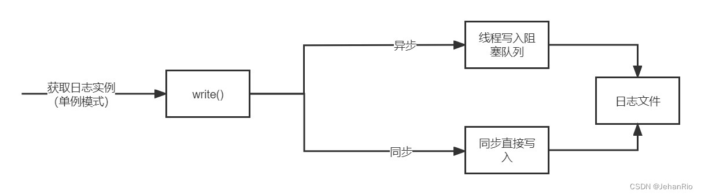

### 文章目录

-   [前言](https://blog.csdn.net/weixin_51322383/article/details/130474753#_1)
-   [1\. 知识点](https://blog.csdn.net/weixin_51322383/article/details/130474753#1__6)
-   -   [1.1 单例模式](https://blog.csdn.net/weixin_51322383/article/details/130474753#11__7)
    -   [1.2 异步日志](https://blog.csdn.net/weixin_51322383/article/details/130474753#12__15)
-   [2\. 日志的运行流程](https://blog.csdn.net/weixin_51322383/article/details/130474753#2__24)
-   [3\. blockqueue](https://blog.csdn.net/weixin_51322383/article/details/130474753#3_blockqueue_50)
-   [4\. 日志的分级与分文件](https://blog.csdn.net/weixin_51322383/article/details/130474753#4__58)
-   [5\. 实现代码](https://blog.csdn.net/weixin_51322383/article/details/130474753#5__72)
-   -   [blockqueue.h](https://blog.csdn.net/weixin_51322383/article/details/130474753#blockqueueh_73)
    -   [log.h](https://blog.csdn.net/weixin_51322383/article/details/130474753#logh_235)
    -   [log.cpp](https://blog.csdn.net/weixin_51322383/article/details/130474753#logcpp_319)
-   [结束语](https://blog.csdn.net/weixin_51322383/article/details/130474753#_513)

# 前言

一个合格的Web服务器当然少不了日志系统了。正如标题所言，日志系统在整个项目中能够帮助调试、错误定位、数据分析。我们想设计一个日志模块，他能顺利写日志但是又不要占用主线程时间去写，所以我们设计异步写日志的模块。

**导航：**[从零开始实现C++ TinyWebServer 全过程记录](https://blog.csdn.net/weixin_51322383/article/details/130464403)

___

# 1\. 知识点

## 1.1 单例模式

**单例模式是最常用的设计模式之一，目的是保证一个类只有一个实例，并提供一个他的全局访问点，该实例被所有程序模块共享。此时需要把该类的构造和析构函数放入private中。**

单例模式有两种实现方法，一种是懒汉模式，另一种是饿汉模式。

-   **懒汉模式：** 顾名思义，非常的懒，只有当调用getInstance的时候，才会去初始化这个单例。**其中在C++11后，不需要加锁，直接使用函数内局部静态对象即可。**
-   **饿汉模式：** 即迫不及待，在程序运行时立即初始化。**饿汉模式不需要加锁，就可以实现线程安全**，原因在于，在程序运行时就定义了对象，并对其初始化。之后，不管哪个线程调用成员函数getinstance()，都只不过是返回一个对象的指针而已。所以是线程安全的，不需要在获取实例的成员函数中加锁。

## 1.2 异步日志

-   同步日志：日志写入函数与工作线程串行执行，由于涉及到I/O操作，当单条日志比较大的时候，同步模式会阻塞整个处理流程，服务器所能处理的并发能力将有所下降，尤其是在峰值的时候，写日志可能成为系统的瓶颈。
    
-   异步日志：将所写的日志内容先存入[阻塞队列](https://so.csdn.net/so/search?q=%E9%98%BB%E5%A1%9E%E9%98%9F%E5%88%97&spm=1001.2101.3001.7020)中，写线程从阻塞队列中取出内容，写入日志。
    

考虑到文件IO操作是非常慢的，所以采用异步日志就是先将内容存放在内存里，然后日志线程有空的时候再写到文件里。

日志队列是什么呢？他的需求就是时不时会有一段日志放到队列里面，时不时又会被取出来一段，这不就是经典的生产者消费者模型吗？所以还需要加锁、条件变量等来帮助这个队列实现。

# 2\. 日志的运行流程

1、使用单例模式（局部静态变量方法）获取实例Log::getInstance()。

2、通过实例调用Log::getInstance()->init()函数完成初始化，若设置阻塞队列大小大于0则选择异步日志，等于0则选择同步日志，更新isAysnc变量。

3、通过实例调用write\_log()函数写日志，首先根据当前时刻创建日志（前缀为时间，后缀为".log"，并更新日期today和当前行数lineCount。

4、在write\_log()函数内部，通过isAsync变量判断写日志的方法：如果是异步，工作线程将要写的内容放进阻塞队列中，由写线程在阻塞队列中取出数据，然后写入日志；如果是同步，直接写入日志文件中。

> 该函数采用了不定参数的形式，具体使用步骤如下：
>
> ```cpp
> va_list vaList;
> va_start(vaList, format);
> int m = vsnprintf(buff_.BeginWrite(), buff_.WritableBytes(), format, vaList);
> va_end(vaList);
> ```

关于unique\_ptr的移动拷贝构造： [C++新特性（五）- unique\_ptr](https://blog.csdn.net/tongyi04/article/details/123405806)



这里再附上一张我自己写的步骤图


# 3\. blockqueue

阻塞队列采用deque实现。  
若`MaxCapacity`为0，则为同步日志，不需要阻塞队列。

内部有生产者消费者模型，搭配锁、条件变量使用。

其中，消费者防止任务队列为空，生产者防止任务队列满。

# 4\. 日志的分级与分文件

**分级情况：**

-   Debug，调试代码时的输出，在系统实际运行时，一般不使用。
-   Warn，这种警告与调试时终端的warning类似，同样是调试代码时使用。
-   Info，报告系统当前的状态，当前执行的流程或接收的信息等。
-   Erro，输出系统的错误信息

**分文件情况：**

1.  按天分，日志写入前会判断当前today是否为创建日志的时间，若为创建日志时间，则写入日志，否则按当前时间创建新的log文件，更新创建时间和行数。
2.  按行分，日志写入前会判断行数是否超过最大行限制，若超过，则在当前日志的末尾加lineCount / MAX\_LOG\_LINES为后缀创建新的log文件。

> Linux时间相关的可以看这篇博文：[Linux时间相关知识小结](https://blog.csdn.net/u012351051/article/details/122802787)

___

# 5\. 实现代码

## blockqueue.h

```cpp
# ifndef BLOCKQUEUE_H
# define BLOCKQUEUE_H

#include <deque>
#include <condition_variable>
#include <mutex>
#include <sys/time.h>
using namespace std;

template<typename T>
class BlockQueue {
public:
    explicit BlockQueue(size_t maxsize = 1000);
    ~BlockQueue();
    bool empty();
    bool full();
    void push_back(const T& item);
    void push_front(const T& item); 
    bool pop(T& item);  // 弹出的任务放入item
    bool pop(T& item, int timeout);  // 等待时间
    void clear();
    T front();
    T back();
    size_t capacity();
    size_t size();

    void flush();
    void Close();

private:
    deque<T> deq_;                      // 底层数据结构
    mutex mtx_;                         // 锁
    bool isClose_;                      // 关闭标志
    size_t capacity_;                   // 容量
    condition_variable condConsumer_;   // 消费者条件变量
    condition_variable condProducer_;   // 生产者条件变量
};

template<typename T>
BlockQueue<T>::BlockQueue(size_t maxsize) : capacity_(maxsize) {
    assert(maxsize > 0);
    isClose_ = false;
}

template<typename T>
BlockQueue<T>::~BlockQueue() {
    Close();
}

template<typename T>
void BlockQueue<T>::Close() {
    // lock_guard<mutex> locker(mtx_); // 操控队列之前，都需要上锁
    // deq_.clear();                   // 清空队列
    clear();
    isClose_ = true;
    condConsumer_.notify_all();
    condProducer_.notify_all();
}

template<typename T>
void BlockQueue<T>::clear() {
    lock_guard<mutex> locker(mtx_);
    deq_.clear();
}

template<typename T>
bool BlockQueue<T>::empty() {
    lock_guard<mutex> locker(mtx_);
    return deq_.empty();
}

template<typename T>
bool BlockQueue<T>::full() {
    lock_guard<mutex> locker(mtx_);
    return deq_.size() >= capacity_;
}

template<typename T>
void BlockQueue<T>::push_back(const T& item) {
    // 注意，条件变量需要搭配unique_lock
    unique_lock<mutex> locker(mtx_);    
    while(deq_.size() >= capacity_) {   // 队列满了，需要等待
        condProducer_.wait(locker);     // 暂停生产，等待消费者唤醒生产条件变量
    }
    deq_.push_back(item);
    condConsumer_.notify_one();         // 唤醒消费者
}

template<typename T>
void BlockQueue<T>::push_front(const T& item) {
    unique_lock<mutex> locker(mtx_);
    while(deq_.size() >= capacity_) {   // 队列满了，需要等待
        condProducer_.wait(locker);     // 暂停生产，等待消费者唤醒生产条件变量
    }
    deq_.push_front(item);
    condConsumer_.notify_one();         // 唤醒消费者
}

template<typename T>
bool BlockQueue<T>::pop(T& item) {
    unique_lock<mutex> locker(mtx_);
    while(deq_.empty()) {
        condConsumer_.wait(locker);     // 队列空了，需要等待
    }
    item = deq_.front();
    deq_.pop_front();
    condProducer_.notify_one();         // 唤醒生产者
    return true;
}

template<typename T>
bool BlockQueue<T>::pop(T &item, int timeout) {
    unique_lock<std::mutex> locker(mtx_);
    while(deq_.empty()){
        if(condConsumer_.wait_for(locker, std::chrono::seconds(timeout)) 
                == std::cv_status::timeout){
            return false;
        }
        if(isClose_){
            return false;
        }
    }
    item = deq_.front();
    deq_.pop_front();
    condProducer_.notify_one();
    return true;
}

template<typename T>
T BlockQueue<T>::front() {
    lock_guard<std::mutex> locker(mtx_);
    return deq_.front();
}

template<typename T>
T BlockQueue<T>::back() {
    lock_guard<std::mutex> locker(mtx_);
    return deq_.back();
}

template<typename T>
size_t BlockQueue<T>::capacity() {
    lock_guard<std::mutex> locker(mtx_);
    return capacity_;
}

template<typename T>
size_t BlockQueue<T>::size() {
    lock_guard<std::mutex> locker(mtx_);
    return deq_.size();
}

// 唤醒消费者
template<typename T>
void BlockQueue<T>::flush() {
    condConsumer_.notify_one();
}
# endif
```

## log.h

```cpp
#ifndef LOG_H
#define LOG_H

#include <mutex>
#include <string>
#include <thread>
#include <sys/time.h>
#include <string.h>
#include <stdarg.h>           // vastart va_end
#include <assert.h>
#include <sys/stat.h>         // mkdir
#include "blockqueue.h"
#include "../buffer/buffer.h"

class Log {
public:
    // 初始化日志实例（阻塞队列最大容量、日志保存路径、日志文件后缀）
    void init(int level, const char* path = "./log", 
                const char* suffix =".log",
                int maxQueueCapacity = 1024);

    static Log* Instance();
    static void FlushLogThread();   // 异步写日志公有方法，调用私有方法asyncWrite
    
    void write(int level, const char *format,...);  // 将输出内容按照标准格式整理
    void flush();

    int GetLevel();
    void SetLevel(int level);
    bool IsOpen() { return isOpen_; }
    
private:
    Log();
    void AppendLogLevelTitle_(int level);
    virtual ~Log();
    void AsyncWrite_(); // 异步写日志方法

private:
    static const int LOG_PATH_LEN = 256;    // 日志文件最长文件名
    static const int LOG_NAME_LEN = 256;    // 日志最长名字
    static const int MAX_LINES = 50000;     // 日志文件内的最长日志条数

    const char* path_;          //路径名
    const char* suffix_;        //后缀名

    int MAX_LINES_;             // 最大日志行数

    int lineCount_;             //日志行数记录
    int toDay_;                 //按当天日期区分文件

    bool isOpen_;               
 
    Buffer buff_;       // 输出的内容，缓冲区
    int level_;         // 日志等级
    bool isAsync_;      // 是否开启异步日志

    FILE* fp_;                                          //打开log的文件指针
    std::unique_ptr<BlockQueue<std::string>> deque_;    //阻塞队列
    std::unique_ptr<std::thread> writeThread_;          //写线程的指针
    std::mutex mtx_;                                    //同步日志必需的互斥量
};

#define LOG_BASE(level, format, ...) \
    do {\
        Log* log = Log::Instance();\
        if (log->IsOpen() && log->GetLevel() <= level) {\
            log->write(level, format, ##__VA_ARGS__); \
            log->flush();\
        }\
    } while(0);

// 四个宏定义，主要用于不同类型的日志输出，也是外部使用日志的接口
// ...表示可变参数，__VA_ARGS__就是将...的值复制到这里
// 前面加上##的作用是：当可变参数的个数为0时，这里的##可以把把前面多余的","去掉,否则会编译出错。
#define LOG_DEBUG(format, ...) do {LOG_BASE(0, format, ##__VA_ARGS__)} while(0);    
#define LOG_INFO(format, ...) do {LOG_BASE(1, format, ##__VA_ARGS__)} while(0);
#define LOG_WARN(format, ...) do {LOG_BASE(2, format, ##__VA_ARGS__)} while(0);
#define LOG_ERROR(format, ...) do {LOG_BASE(3, format, ##__VA_ARGS__)} while(0);

#endif //LOG_H
```

## log.cpp

```cpp
#include "log.h"

// 构造函数
Log::Log() {
    fp_ = nullptr;
    deque_ = nullptr;
    writeThread_ = nullptr;
    lineCount_ = 0;
    toDay_ = 0;
    isAsync_ = false;
}

Log::~Log() {
    while(!deque_->empty()) {
        deque_->flush();    // 唤醒消费者，处理掉剩下的任务
    }
    deque_->Close();    // 关闭队列
    writeThread_->join();   // 等待当前线程完成手中的任务
    if(fp_) {       // 冲洗文件缓冲区，关闭文件描述符
        lock_guard<mutex> locker(mtx_);
        flush();        // 清空缓冲区中的数据
        fclose(fp_);    // 关闭日志文件
    }
}

// 唤醒阻塞队列消费者，开始写日志
void Log::flush() {
    if(isAsync_) {  // 只有异步日志才会用到deque
        deque_->flush();
    }
    fflush(fp_);    // 清空输入缓冲区
}

// 懒汉模式 局部静态变量法（这种方法不需要加锁和解锁操作）
Log* Log::Instance() {
    static Log log;
    return &log;
}

// 异步日志的写线程函数
void Log::FlushLogThread() {
    Log::Instance()->AsyncWrite_();
}

// 写线程真正的执行函数
void Log::AsyncWrite_() {
    string str = "";
    while(deque_->pop(str)) {
        lock_guard<mutex> locker(mtx_);
        fputs(str.c_str(), fp_);
    }
}

// 初始化日志实例
void Log::init(int level, const char* path, const char* suffix, int maxQueCapacity) {
    isOpen_ = true;
    level_ = level;
    path_ = path;
    suffix_ = suffix;
    if(maxQueCapacity) {    // 异步方式
        isAsync_ = true;
        if(!deque_) {   // 为空则创建一个
            unique_ptr<BlockQueue<std::string>> newQue(new BlockQueue<std::string>);
            // 因为unique_ptr不支持普通的拷贝或赋值操作,所以采用move
            // 将动态申请的内存权给deque，newDeque被释放
            deque_ = move(newQue);  // 左值变右值,掏空newDeque

            unique_ptr<thread> newThread(new thread(FlushLogThread));
            writeThread_ = move(newThread);
        }
    } else {
        isAsync_ = false;
    }

    lineCount_ = 0;
    time_t timer = time(nullptr);
    struct tm* systime = localtime(&timer);
    char fileName[LOG_NAME_LEN] = {0};
    snprintf(fileName, LOG_NAME_LEN - 1, "%s/%04d_%02d_%02d%s", 
            path_, systime->tm_year + 1900, systime->tm_mon + 1, systime->tm_mday, suffix_);
    toDay_ = systime->tm_mday;

    {
        lock_guard<mutex> locker(mtx_);
        buff_.RetrieveAll();
        if(fp_) {   // 重新打开
            flush();
            fclose(fp_);
        }
        fp_ = fopen(fileName, "a"); // 打开文件读取并附加写入
        if(fp_ == nullptr) {
            mkdir(fileName, 0777);
            fp_ = fopen(fileName, "a"); // 生成目录文件（最大权限）
        }
        assert(fp_ != nullptr);
    }
}

void Log::write(int level, const char *format, ...) {
    struct timeval now = {0, 0};
    gettimeofday(&now, nullptr);
    time_t tSec = now.tv_sec;
    struct tm *sysTime = localtime(&tSec);
    struct tm t = *sysTime;
    va_list vaList;

    // 日志日期 日志行数  如果不是今天或行数超了
    if (toDay_ != t.tm_mday || (lineCount_ && (lineCount_  %  MAX_LINES == 0)))
    {
        unique_lock<mutex> locker(mtx_);
        locker.unlock();
        
        char newFile[LOG_NAME_LEN];
        char tail[36] = {0};
        snprintf(tail, 36, "%04d_%02d_%02d", t.tm_year + 1900, t.tm_mon + 1, t.tm_mday);

        if (toDay_ != t.tm_mday)    // 时间不匹配，则替换为最新的日志文件名
        {
            snprintf(newFile, LOG_NAME_LEN - 72, "%s/%s%s", path_, tail, suffix_);
            toDay_ = t.tm_mday;
            lineCount_ = 0;
        }
        else {
            snprintf(newFile, LOG_NAME_LEN - 72, "%s/%s-%d%s", path_, tail, (lineCount_  / MAX_LINES), suffix_);
        }
        
        locker.lock();
        flush();
        fclose(fp_);
        fp_ = fopen(newFile, "a");
        assert(fp_ != nullptr);
    }

    // 在buffer内生成一条对应的日志信息
    {
        unique_lock<mutex> locker(mtx_);
        lineCount_++;
        int n = snprintf(buff_.BeginWrite(), 128, "%d-%02d-%02d %02d:%02d:%02d.%06ld ",
                    t.tm_year + 1900, t.tm_mon + 1, t.tm_mday,
                    t.tm_hour, t.tm_min, t.tm_sec, now.tv_usec);
                    
        buff_.HasWritten(n);
        AppendLogLevelTitle_(level);    

        va_start(vaList, format);
        int m = vsnprintf(buff_.BeginWrite(), buff_.WritableBytes(), format, vaList);
        va_end(vaList);

        buff_.HasWritten(m);
        buff_.Append("\n\0", 2);

        if(isAsync_ && deque_ && !deque_->full()) { // 异步方式（加入阻塞队列中，等待写线程读取日志信息）
            deque_->push_back(buff_.RetrieveAllToStr());
        } else {    // 同步方式（直接向文件中写入日志信息）
            fputs(buff_.Peek(), fp_);   // 同步就直接写入文件
        }
        buff_.RetrieveAll();    // 清空buff
    }
}

// 添加日志等级
void Log::AppendLogLevelTitle_(int level) {
    switch(level) {
    case 0:
        buff_.Append("[debug]: ", 9);
        break;
    case 1:
        buff_.Append("[info] : ", 9);
        break;
    case 2:
        buff_.Append("[warn] : ", 9);
        break;
    case 3:
        buff_.Append("[error]: ", 9);
        break;
    default:
        buff_.Append("[info] : ", 9);
        break;
    }
}

int Log::GetLevel() {
    lock_guard<mutex> locker(mtx_);
    return level_;
}

void Log::SetLevel(int level) {
    lock_guard<mutex> locker(mtx_);
    level_ = level;
}
```

# 结束语

**到这里就把底层打造轮子的东西全部写完了，后面就要开始写上层的东西了，各位下篇见。**