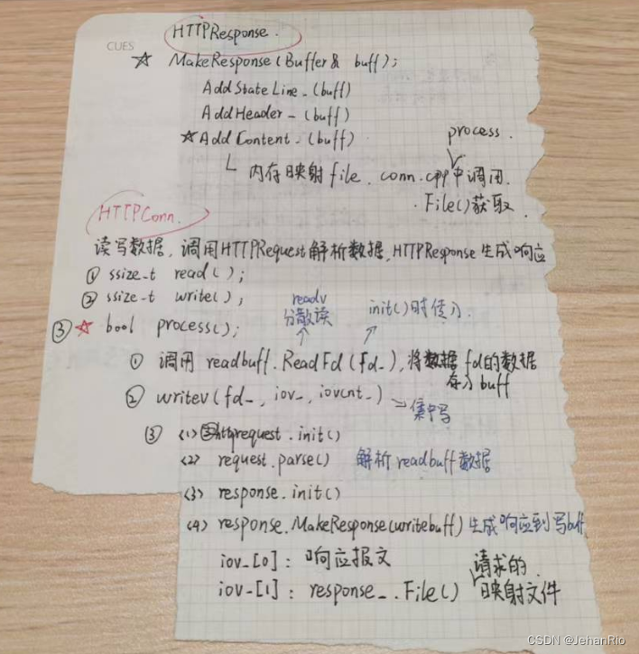
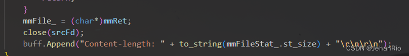
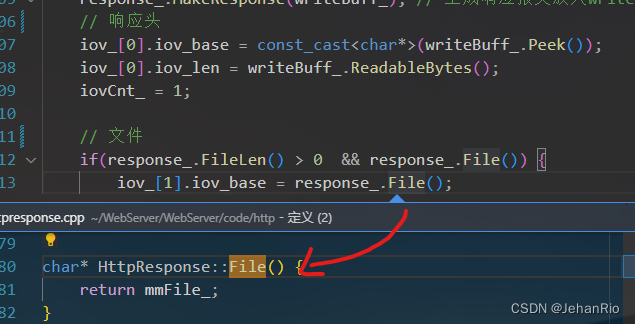

### 文章目录

-   [前言](https://blog.csdn.net/weixin_51322383/article/details/130512455#_1)
-   [1\. 响应报文](https://blog.csdn.net/weixin_51322383/article/details/130512455#1__11)
-   [2\. 代码生成响应报文步骤](https://blog.csdn.net/weixin_51322383/article/details/130512455#2__34)
-   -   [2.1 生成状态码](https://blog.csdn.net/weixin_51322383/article/details/130512455#21__39)
    -   [2.2 添加状态行和头部](https://blog.csdn.net/weixin_51322383/article/details/130512455#22__54)
    -   [2.3 添加响应正文](https://blog.csdn.net/weixin_51322383/article/details/130512455#23__58)
-   [3\. HTTP连接](https://blog.csdn.net/weixin_51322383/article/details/130512455#3_HTTP_85)
-   -   [3.1 整体概况](https://blog.csdn.net/weixin_51322383/article/details/130512455#31__87)
    -   [3.2 HttpConn的读写](https://blog.csdn.net/weixin_51322383/article/details/130512455#32_HttpConn_106)
    -   [3.3 逻辑代码](https://blog.csdn.net/weixin_51322383/article/details/130512455#33__117)
-   [4\. 代码](https://blog.csdn.net/weixin_51322383/article/details/130512455#4__148)
-   -   [httpresponse.h](https://blog.csdn.net/weixin_51322383/article/details/130512455#httpresponseh_149)
    -   [httpresponse.cpp](https://blog.csdn.net/weixin_51322383/article/details/130512455#httpresponsecpp_203)
    -   [httpconn.h](https://blog.csdn.net/weixin_51322383/article/details/130512455#httpconnh_382)
    -   [httpconn.cpp](https://blog.csdn.net/weixin_51322383/article/details/130512455#httpconncpp_448)

# 前言

今天上完体育课打完球发现了一家咖啡店，我之前一直纳闷数据谷里面没有咖啡店呢，结果今天就给我找到了。这家咖啡店的位置开的非常隐蔽，一到门口一条小狗就一直贴着我闻，走到店里面去点咖啡，店里装修的还不错，在这个位置也挺安静的，店里的咖啡师小姐姐说好奇怪，这条小狗狗第一次对一个男生这么亲近哈哈哈~~

在走之前它一直贴着我闻，估计是把我给记住了，后悔没在店里喝了再走，点的一杯生椰拿铁，味道还可以，下次去试试冰美。尤其是昨晚刚看了银河护卫队3，现在对小动物是一点抵抗力都没有了。以后打算经常去这家店，位置虽然偏了点，但是人少安静，还蛮喜欢这种静僻的感觉的。  


___

下午上了体育课又去健身房练了一个小时的腿，就打算今晚在实验室待晚一点再走。但是困得不行，是一点精力都没有了。刚睡了一刻钟，还是很困，怎么可以这么困，我真的能在实验室干到很晚再走嘛。。去洗一把脸清醒一下。

___

# 1\. 响应报文

**响应报文组成：**

```html
HTTP/1.1 200 OK
Date: Fri, 22 May 2009 06:07:21 GMT
Content-Type: text/html; charset=UTF-8
\r\n
<html>
      <head></head>
      <body>
            <!--body goes here-->
      </body>
</html>
```

-   状态行，由[HTTP协议](https://so.csdn.net/so/search?q=HTTP%E5%8D%8F%E8%AE%AE&spm=1001.2101.3001.7020)版本号， 状态码， 状态消息 三部分组成。 第一行为状态行，（HTTP/1.1）表明HTTP版本为1.1版本，状态码为200，状态消息为OK。
    
-   消息报头，用来说明客户端要使用的一些附加信息。 第二行和第三行为消息报头，Date:生成响应的日期和时间；Content-Type:指定了[MIME类型](https://so.csdn.net/so/search?q=MIME%E7%B1%BB%E5%9E%8B&spm=1001.2101.3001.7020)的HTML(text/html),编码类型是UTF-8。
    
-   空行，消息报头后面的空行是必须的。**它的作用是通过一个空行，告诉服务器头部到此为止。**
    
-   响应正文，服务器返回给客户端的文本信息。空行后面的html部分为响应正文。
    

# 2\. 代码生成响应报文步骤

在`HttpResponse.cpp`中，主要是考`MakeResponse(Buffer& buff)`这个函数实现的，分为三个步骤：1. 添加状态行；2. 添加头部；3. **添加响应报文**，其中，第三步涉及到内存映射，后面马上讲。

我们之前不是在`HttpRequest.cpp`中生成了请求报文吗，请求报文里面包括了我们要请求的页面（path），响应报文的过程就是根据请求报文写出响应头，将path上的文件放在响应体，然后发送给客户端（浏览器）。

## 2.1 生成状态码

```cpp
if(stat((srcDir_ + path_).data(), &mmFileStat_) < 0 || S_ISDIR(mmFileStat_.st_mode)) {
        code_ = 404;
    }
    else if(!(mmFileStat_.st_mode & S_IROTH)) {
        code_ = 403;
    }
    else if(code_ == -1) { 
        code_ = 200; 
    }
```

关于stat的使用，参考这篇博文：[stat函数](https://blog.csdn.net/Dustinthewine/article/details/126673326)

## 2.2 添加状态行和头部

这里主要就是一些响应报文基本的内容，用`buff.Append()`添加进去即可。

## 2.3 添加响应正文

```cpp
void HttpResponse::AddContent_(Buffer& buff) {
    int srcFd = open((srcDir_ + path_).data(), O_RDONLY);
    if(srcFd < 0) { 
        ErrorContent(buff, "File NotFound!");
        return; 
    }

    /* 将文件映射到内存提高文件的访问速度 
        MAP_PRIVATE 建立一个写入时拷贝的私有映射*/
    LOG_DEBUG("file path %s", (srcDir_ + path_).data());
    int* mmRet = (int*)mmap(0, mmFileStat_.st_size, PROT_READ, MAP_PRIVATE, srcFd, 0);
    if(*mmRet == -1) {
        ErrorContent(buff, "File NotFound!");
        return; 
    }
    mmFile_ = (char*)mmRet;
    close(srcFd);
    buff.Append("Content-length: " + to_string(mmFileStat_.st_size) + "\r\n\r\n");
}
```

1.  首先需要打开这个文件
2.  用`mmap`这个函数映射到内存，可以提高文件的访问速度
3.  映射过后，就可以将该文件描述符关闭了
4.  将该内存映射的指针加入`buff`，至此，报文的所有内容就都在buff中了，后续读取到浏览器上，浏览器解析渲染就得到我们所看到的内容了。

# 3\. HTTP连接

## 3.1 整体概况

总结一下，一个HTTP连接要实现的功能就是：

1.  读取请求
2.  解析请求
3.  生成响应
4.  发送响应

然后浏览器就可以进行解析渲染了。

我先上一张图：

  
在一个HttpConn中，有两个缓冲区，一个用来读，一个用来写，还分别有哥request\_ （将请求报文放在读缓冲区） 和 response\_(将响应报文放在写缓冲区)。

注意理清这里的读和写的含义，因为请求报文是浏览器发来的，所以需要用读缓冲区去读取，而响应报文是这个连接生成准备发给浏览器的，所以对应写缓冲区

解析请求报文和生成响应报文都是在`HttpConn::process()`函数内完成的。并且是在解析请求报文后随即生成了响应报文。之后这个生成的响应报文便放在缓冲区等待`writev()`函数将其发送给fd。

## 3.2 HttpConn的读写

在这段代码里面，还有两个重要的函数，分别是`read`和`write`

这里的`read`需要将请求报文的内容读取到读缓冲区里面来，这样request\_才能够解析报文。

然后是`write`，这里主要是使用了`writev`连续写来将响应报文写到fd（浏览器）中。我们前面提到的生成响应报文，他只是放在了buff中，并没有发送给浏览器，这里用write就实现传输啦。

注意由于生成响应报文的响应正文里面只是生成了`Content-length`，并没有将文件也放进缓冲区，因为如果文件太大，缓冲区可能会装不下。所以我们在传输的时候，采用了分块写的方式，一块传输buff里面的内容，另一块传输内存映射的文件指针。  
  


## 3.3 逻辑代码

```cpp
//只为了说明逻辑，代码有删减
bool HttpConn::process() {
    request_.Init();//初始化解析类
    if(readBuff_.ReadableBytes() <= 0) {//从缓冲区中读数据
        return false;
    }
    else if(request_.parse(readBuff_)) {//解析数据,根据解析结果进行响应类的初始化
        response_.Init(srcDir, request_.path(), request_.IsKeepAlive(), 200);
    } else {
        response_.Init(srcDir, request_.path(), false, 400);
    }
    response_.MakeResponse(writeBuff_);//生成响应报文放入writeBuff_中
    /* 响应头  iov记录了需要把数据从缓冲区发送出去的相关信息
    iov_base为缓冲区首地址，iov_len为缓冲区长度 */
    iov_[0].iov_base = const_cast<char*>(writeBuff_.Peek());
    iov_[0].iov_len = writeBuff_.ReadableBytes();
    iovCnt_ = 1;

    /* 文件 */
    if(response_.FileLen() > 0  && response_.File()) { //
        iov_[1].iov_base = response_.File();
        iov_[1].iov_len = response_.FileLen();
        iovCnt_ = 2;
    }
    return true;
}
```

# 4\. 代码

## httpresponse.h

```cpp
#ifndef HTTP_RESPONSE_H
#define HTTP_RESPONSE_H

#include <unordered_map>
#include <fcntl.h>       // open
#include <unistd.h>      // close
#include <sys/stat.h>    // stat
#include <sys/mman.h>    // mmap, munmap

#include "../buffer/buffer.h"
#include "../log/log.h"

class HttpResponse {
public:
    HttpResponse();
    ~HttpResponse();

    void Init(const std::string& srcDir, std::string& path, bool isKeepAlive = false, int code = -1);
    void MakeResponse(Buffer& buff);
    void UnmapFile();
    char* File();
    size_t FileLen() const;
    void ErrorContent(Buffer& buff, std::string message);
    int Code() const { return code_; }

private:
    void AddStateLine_(Buffer &buff);
    void AddHeader_(Buffer &buff);
    void AddContent_(Buffer &buff);

    void ErrorHtml_();
    std::string GetFileType_();

    int code_;
    bool isKeepAlive_;

    std::string path_;
    std::string srcDir_;
    
    char* mmFile_; 
    struct stat mmFileStat_;

    static const std::unordered_map<std::string, std::string> SUFFIX_TYPE;  // 后缀类型集
    static const std::unordered_map<int, std::string> CODE_STATUS;          // 编码状态集
    static const std::unordered_map<int, std::string> CODE_PATH;            // 编码路径集
};


#endif //HTTP_RESPONSE_H

```

## httpresponse.cpp

```cpp
#include "httpresponse.h"

using namespace std;

const unordered_map<string, string> HttpResponse::SUFFIX_TYPE = {
    { ".html",  "text/html" },
    { ".xml",   "text/xml" },
    { ".xhtml", "application/xhtml+xml" },
    { ".txt",   "text/plain" },
    { ".rtf",   "application/rtf" },
    { ".pdf",   "application/pdf" },
    { ".word",  "application/nsword" },
    { ".png",   "image/png" },
    { ".gif",   "image/gif" },
    { ".jpg",   "image/jpeg" },
    { ".jpeg",  "image/jpeg" },
    { ".au",    "audio/basic" },
    { ".mpeg",  "video/mpeg" },
    { ".mpg",   "video/mpeg" },
    { ".avi",   "video/x-msvideo" },
    { ".gz",    "application/x-gzip" },
    { ".tar",   "application/x-tar" },
    { ".css",   "text/css "},
    { ".js",    "text/javascript "},
};

const unordered_map<int, string> HttpResponse::CODE_STATUS = {
    { 200, "OK" },
    { 400, "Bad Request" },
    { 403, "Forbidden" },
    { 404, "Not Found" },
};

const unordered_map<int, string> HttpResponse::CODE_PATH = {
    { 400, "/400.html" },
    { 403, "/403.html" },
    { 404, "/404.html" },
};

HttpResponse::HttpResponse() {
    code_ = -1;
    path_ = srcDir_ = "";
    isKeepAlive_ = false;
    mmFile_ = nullptr; 
    mmFileStat_ = { 0 };
};

HttpResponse::~HttpResponse() {
    UnmapFile();
}

void HttpResponse::Init(const string& srcDir, string& path, bool isKeepAlive, int code){
    assert(srcDir != "");
    if(mmFile_) { UnmapFile(); }
    code_ = code;
    isKeepAlive_ = isKeepAlive;
    path_ = path;
    srcDir_ = srcDir;
    mmFile_ = nullptr; 
    mmFileStat_ = { 0 };
}

void HttpResponse::MakeResponse(Buffer& buff) {
    /* 判断请求的资源文件 */
    if(stat((srcDir_ + path_).data(), &mmFileStat_) < 0 || S_ISDIR(mmFileStat_.st_mode)) {
        code_ = 404;
    }
    else if(!(mmFileStat_.st_mode & S_IROTH)) {
        code_ = 403;
    }
    else if(code_ == -1) { 
        code_ = 200; 
    }
    ErrorHtml_();
    AddStateLine_(buff);
    AddHeader_(buff);
    AddContent_(buff);
}

char* HttpResponse::File() {
    return mmFile_;
}

size_t HttpResponse::FileLen() const {
    return mmFileStat_.st_size;
}

void HttpResponse::ErrorHtml_() {
    if(CODE_PATH.count(code_) == 1) {
        path_ = CODE_PATH.find(code_)->second;
        stat((srcDir_ + path_).data(), &mmFileStat_);
    }
}

void HttpResponse::AddStateLine_(Buffer& buff) {
    string status;
    if(CODE_STATUS.count(code_) == 1) {
        status = CODE_STATUS.find(code_)->second;
    }
    else {
        code_ = 400;
        status = CODE_STATUS.find(400)->second;
    }
    buff.Append("HTTP/1.1 " + to_string(code_) + " " + status + "\r\n");
}

void HttpResponse::AddHeader_(Buffer& buff) {
    buff.Append("Connection: ");
    if(isKeepAlive_) {
        buff.Append("keep-alive\r\n");
        buff.Append("keep-alive: max=6, timeout=120\r\n");
    } else{
        buff.Append("close\r\n");
    }
    buff.Append("Content-type: " + GetFileType_() + "\r\n");
}

void HttpResponse::AddContent_(Buffer& buff) {
    int srcFd = open((srcDir_ + path_).data(), O_RDONLY);
    if(srcFd < 0) { 
        ErrorContent(buff, "File NotFound!");
        return; 
    }

    //将文件映射到内存提高文件的访问速度  MAP_PRIVATE 建立一个写入时拷贝的私有映射
    LOG_DEBUG("file path %s", (srcDir_ + path_).data());
    int* mmRet = (int*)mmap(0, mmFileStat_.st_size, PROT_READ, MAP_PRIVATE, srcFd, 0);
    if(*mmRet == -1) {
        ErrorContent(buff, "File NotFound!");
        return; 
    }
    mmFile_ = (char*)mmRet;
    close(srcFd);
    buff.Append("Content-length: " + to_string(mmFileStat_.st_size) + "\r\n\r\n");
}

void HttpResponse::UnmapFile() {
    if(mmFile_) {
        munmap(mmFile_, mmFileStat_.st_size);
        mmFile_ = nullptr;
    }
}

// 判断文件类型 
string HttpResponse::GetFileType_() {
    string::size_type idx = path_.find_last_of('.');
    if(idx == string::npos) {   // 最大值 find函数在找不到指定值得情况下会返回string::npos
        return "text/plain";
    }
    string suffix = path_.substr(idx);
    if(SUFFIX_TYPE.count(suffix) == 1) {
        return SUFFIX_TYPE.find(suffix)->second;
    }
    return "text/plain";
}

void HttpResponse::ErrorContent(Buffer& buff, string message) 
{
    string body;
    string status;
    body += "<html><title>Error</title>";
    body += "<body bgcolor=\"ffffff\">";
    if(CODE_STATUS.count(code_) == 1) {
        status = CODE_STATUS.find(code_)->second;
    } else {
        status = "Bad Request";
    }
    body += to_string(code_) + " : " + status  + "\n";
    body += "<p>" + message + "</p>";
    body += "<hr><em>TinyWebServer</em></body></html>";

    buff.Append("Content-length: " + to_string(body.size()) + "\r\n\r\n");
    buff.Append(body);
}

```

## httpconn.h

```cpp
#ifndef HTTP_CONN_H
#define HTTP_CONN_H

#include <sys/types.h>
#include <sys/uio.h>     // readv/writev
#include <arpa/inet.h>   // sockaddr_in
#include <stdlib.h>      // atoi()
#include <errno.h>      

#include "../log/log.h"
#include "../buffer/buffer.h"
#include "httprequest.h"
#include "httpresponse.h"
/*
进行读写数据并调用httprequest 来解析数据以及httpresponse来生成响应
*/
class HttpConn {
public:
    HttpConn();
    ~HttpConn();
    
    void init(int sockFd, const sockaddr_in& addr);
    ssize_t read(int* saveErrno);
    ssize_t write(int* saveErrno);
    void Close();
    int GetFd() const;
    int GetPort() const;
    const char* GetIP() const;
    sockaddr_in GetAddr() const;
    bool process();

    // 写的总长度
    int ToWriteBytes() { 
        return iov_[0].iov_len + iov_[1].iov_len; 
    }

    bool IsKeepAlive() const {
        return request_.IsKeepAlive();
    }

    static bool isET;
    static const char* srcDir;
    static std::atomic<int> userCount;  // 原子，支持锁
    
private:
   
    int fd_;
    struct  sockaddr_in addr_;

    bool isClose_;
    
    int iovCnt_;
    struct iovec iov_[2];
    
    Buffer readBuff_; // 读缓冲区
    Buffer writeBuff_; // 写缓冲区

    HttpRequest request_;
    HttpResponse response_;
};

#endif
```

## httpconn.cpp

```cpp
#include "httpconn.h"
using namespace std;

const char* HttpConn::srcDir;
std::atomic<int> HttpConn::userCount;
bool HttpConn::isET;

HttpConn::HttpConn() { 
    fd_ = -1;
    addr_ = { 0 };
    isClose_ = true;
};

HttpConn::~HttpConn() { 
    Close(); 
};

void HttpConn::init(int fd, const sockaddr_in& addr) {
    assert(fd > 0);
    userCount++;
    addr_ = addr;
    fd_ = fd;
    writeBuff_.RetrieveAll();
    readBuff_.RetrieveAll();
    isClose_ = false;
    LOG_INFO("Client[%d](%s:%d) in, userCount:%d", fd_, GetIP(), GetPort(), (int)userCount);
}

void HttpConn::Close() {
    response_.UnmapFile();
    if(isClose_ == false){
        isClose_ = true; 
        userCount--;
        close(fd_);
        LOG_INFO("Client[%d](%s:%d) quit, UserCount:%d", fd_, GetIP(), GetPort(), (int)userCount);
    }
}

int HttpConn::GetFd() const {
    return fd_;
};

struct sockaddr_in HttpConn::GetAddr() const {
    return addr_;
}

const char* HttpConn::GetIP() const {
    return inet_ntoa(addr_.sin_addr);
}

int HttpConn::GetPort() const {
    return addr_.sin_port;
}

ssize_t HttpConn::read(int* saveErrno) {
    ssize_t len = -1;
    do {
        len = readBuff_.ReadFd(fd_, saveErrno);
        if (len <= 0) {
            break;
        }
    } while (isET); // ET:边沿触发要一次性全部读出
    return len;
}

// 主要采用writev连续写函数
ssize_t HttpConn::write(int* saveErrno) {
    ssize_t len = -1;
    do {
        len = writev(fd_, iov_, iovCnt_);   // 将iov的内容写到fd中
        if(len <= 0) {
            *saveErrno = errno;
            break;
        }
        if(iov_[0].iov_len + iov_[1].iov_len  == 0) { break; } /* 传输结束 */
        else if(static_cast<size_t>(len) > iov_[0].iov_len) {
            iov_[1].iov_base = (uint8_t*) iov_[1].iov_base + (len - iov_[0].iov_len);
            iov_[1].iov_len -= (len - iov_[0].iov_len);
            if(iov_[0].iov_len) {
                writeBuff_.RetrieveAll();
                iov_[0].iov_len = 0;
            }
        }
        else {
            iov_[0].iov_base = (uint8_t*)iov_[0].iov_base + len; 
            iov_[0].iov_len -= len; 
            writeBuff_.Retrieve(len);
        }
    } while(isET || ToWriteBytes() > 10240);
    return len;
}

bool HttpConn::process() {
    request_.Init();
    if(readBuff_.ReadableBytes() <= 0) {
        return false;
    }
    else if(request_.parse(readBuff_)) {    // 解析成功
        LOG_DEBUG("%s", request_.path().c_str());
        response_.Init(srcDir, request_.path(), request_.IsKeepAlive(), 200);
    } else {
        response_.Init(srcDir, request_.path(), false, 400);
    }

    response_.MakeResponse(writeBuff_); // 生成响应报文放入writeBuff_中
    // 响应头
    iov_[0].iov_base = const_cast<char*>(writeBuff_.Peek());
    iov_[0].iov_len = writeBuff_.ReadableBytes();
    iovCnt_ = 1;

    // 文件
    if(response_.FileLen() > 0  && response_.File()) {
        iov_[1].iov_base = response_.File();
        iov_[1].iov_len = response_.FileLen();
        iovCnt_ = 2;
    }
    LOG_DEBUG("filesize:%d, %d  to %d", response_.FileLen() , iovCnt_, ToWriteBytes());
    return true;
}

```

 
