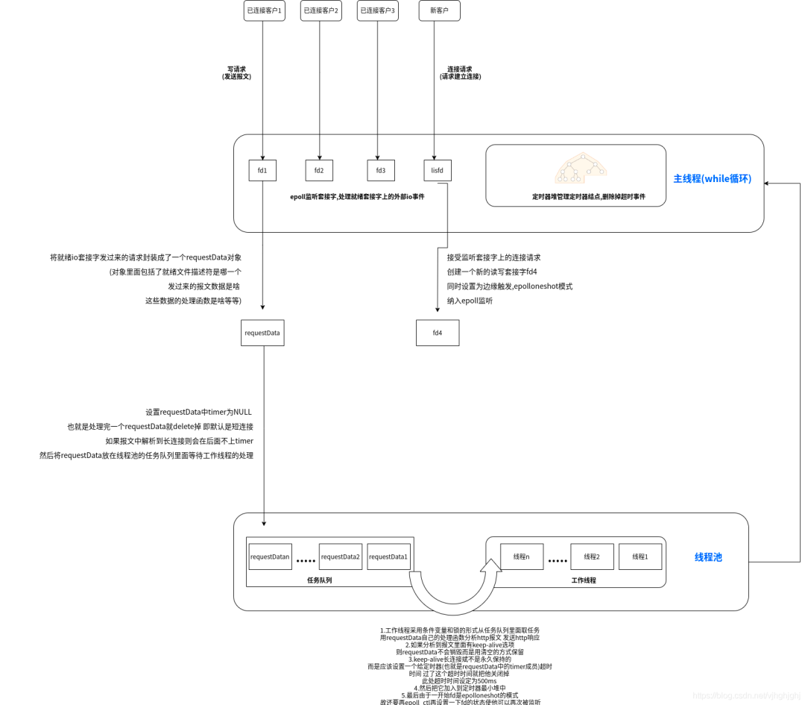
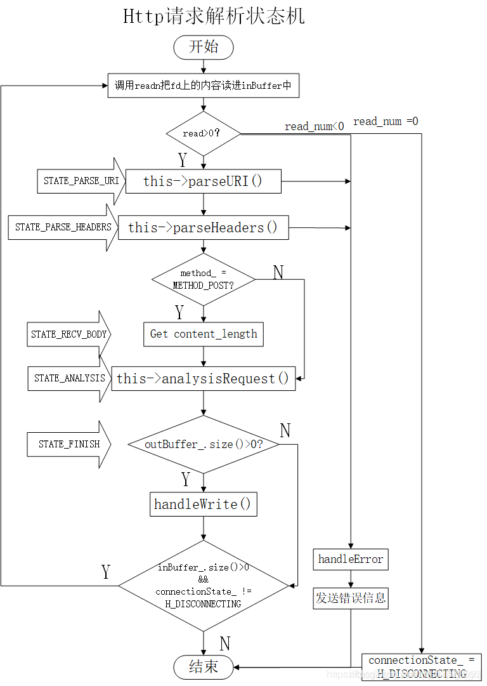
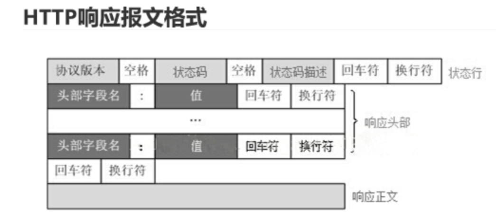
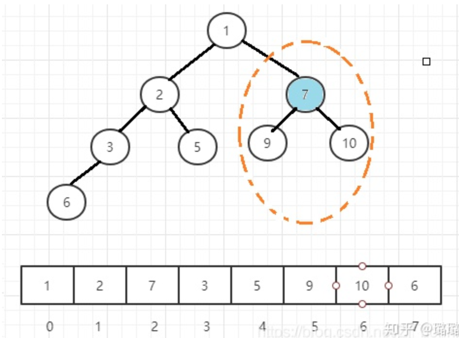
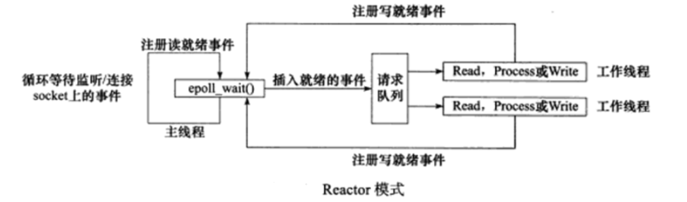
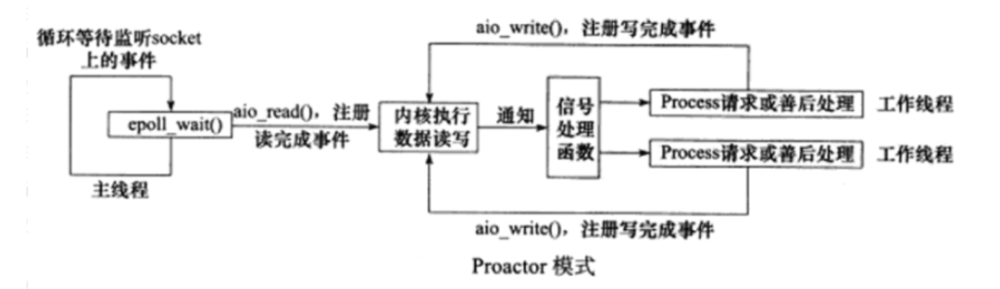

上期写了**简历项目**[简历项目烂大街怎么办?教你最有谱的摆烂](http://mp.weixin.qq.com/s?__biz=MzkwMjE3OTY2NA==&mid=2247485534&idx=1&sn=cabe7a213647871dfdb4ce374f4671ba&chksm=c0a83661f7dfbf772f78474cb4cd0a601a5645bf89d99312a6b1c9bd7b8310c3a58217311678&scene=21#wechat_redirect)，有位读者照做以后，拿下了主管面，在群里宣传以后，最近多了不少小伙伴来催我更新**服务器项目相关知识点**。  


拖延了这么些天这次终于来了，这次这么磨蹭一方面是最近忙着搞毕设，另一方面也是版权问题不好搞。  

这份总结是我之前秋招的时候，根据每次面试的问题，不断**查漏补缺**总结而成，迭代了很多次。每次遇到新的问题，自己在网上边查边总结，当时主要是自己看嘛，也没有什么版权问题，但是现在要发在微信公众号这个公开平台，就需要追本溯源的查一查当初内容来源，尊重原作者的成果。我会尽量确认出处，**如有侵权烦请告知！**

说在前面的话

  

  

每个人服务器项目实现的功能不同，可以延伸的方向也会不同，**第一节关于项目本身细节问题**仅限于**个人改进后的项目**，大家只需参考与自己重合的内容即可。  

面试官的问题**千奇百怪**，通常问你的时候不太可能就像下文**标题**一样，非常**精准的**问你某某知识点。通常可能会抛出一些笼统的问题，这个时候就需要你**快速定位**一下，他到底感兴趣的是什么。所以我们需要以不变应万变，引导面试官到你准备好的内容上面来。

同时需要强调一点， **学无止境**，本篇内容只能算是**抛砖引玉**，给大家一些借鉴，并不能**止步于此**，大家还是要继续做一些**更深更细**的学习~

当然我也知道，这只是我个人的面试问题，**不一定非常全面**，后面我会**开源**本篇笔记，如果后面有同学被问到了**关于这个项目新的问题**，可以更新上来，**一同维护！**


01

  

项目本身细节问题

  


01.项目介绍


这个项目主要的目的是对**浏览器的链接请求进行解析处理，处理完之后给浏览器客户端返回一个响应，如文字图片视频等**。服务器后端的处理方式**使用socket通信，利用多路IO复用**，可以同时处理多个请求，请求的解析使**用预先准备好的线程池**，使用reactor模式，**主线程负责监听**IO，获取io请求后把请求对象放入请求队列，交给工作线程。

睡眠在请求队列上的**工作线程被唤醒进行**数据读取以及逻辑处理。利用**状态机**思想解析 Http 报文，支持 **GET/POST****请求**，支持**长/短连接；**

使用基于**小根堆**的定时器关闭超时请求，解决超时，连接系统资源占用问题。


02.架构概述


**主线程：**

1.  在主线程中，epoll监听套接字， 处理就绪套接字上的外部IO事件，包括已连接客户的写请求（发送报文），或者新客户的连接请求。
    
2.  将就绪IO套接字发过来的请求封装成一个requestData对象，对象里面包括了就绪文件描述符是哪一个，发过来的报文数据是啥，这些数据的处理函数是啥等等。
    
3.  并且设置requestData中的timer为NULL，也就是处理完一个requestData就delete掉，默认是短连接。如果报文解析到长连接，则会在后面补上timer。然后将requestData放在线程池的任务队列里面等待工作线程的处理。
    
4.  主线程还有一个while循环，利用定时器堆管理定时器结点，删除超时事件。
    

**工作线程：**

1.  工作线程采用条件变量和锁的形式从任务队列里面取任务，用requestData自己的处理函数分析http报文，发送http响应。
    
2.  如果分析到报文里面有keep-alive选项，则requestData不会销毁，而是用清空的方式保留。
    
3.  keep-alive长连接不是永久保留的，而是设置了一个定时器（也就是keep-alive中的timer成员）超时，超出时间以后，就把他关闭掉，这里超时时间设定为500ms。
    
4.  然后就把它加入到定时器最小堆中。
    
5.  最后由于一开始fd是epolloneshot模式，还需要再epoll ctl设置一下fd的状态，使得他可以再次被监听。
    

其中线程池中工作线程取用任务队列里面的任务，在工作线程调用requestData中的handleRequest进行使用**状态机**解析了HTTP请求




03.屏蔽掉SIGPIPE信号


在整个epoll监听循环开始之前，需要**先屏蔽掉SIGPIPE信号**。

默认读写一个关闭的socket会触发sigpipe信号。该信号的默认操作是关闭进程，这明显是我们不想要的。所以我们需要重新设置sigpipe的信号回调操作函数，比如忽略操作等，可以防止调用它的默认操作。

```
 //处理sigpipe信号 void handle_for_sigpipe(){      struct sigaction sa; //信号处理结构体      memset(&sa, '\0', sizeof(sa));      sa.sa_handler = SIG_IGN;//设置信号的处理回调函数 这个SIG_IGN宏代表的操作就是忽略该信号       sa.sa_flags = 0;      if(sigaction(SIGPIPE, &sa, NULL))//将信号和信号的处理结构体绑定        return; }
```


04.端口复用


用setsockopt(listen\_fd, SOL\_SOCKET, SO\_REUSEADDR, &optval, sizeof(optval)消除bind时"Address already in use"错误，即设置SO\_REUSEADDR 端口复用。


05.epoll监管和EPOLLONESHOT


epoll监管套接字的时候用边沿触发+EPOLLONESHOT+非阻塞IO。

> ##### EPOLLONESHOT事件
>
> ##### 即使可以使用边缘触发模式，一个socket上的某个时间还是可能被触发多次。比如一个线程在读取完某个socket上的数据后开始处理这些数据，而在数据的处理过程中，socket上又有了新数据可以读（EPOLLIN再次被触发），此时另外一个线程被唤醒来读取这些新的数据。就会出现两个线程同时操作一个socket的局面。一个socket连接在任意时刻都只被一个线程处理，可以使用epollEPOLLONESHOT实现。
>
> ##### 对于注册了EPOLLONESHOT事件的文件描述符有，操作系统最多出发其注册的一个刻度、可写或异常事件，且只触发一次。除非我们使用epoll\_ctl函数重置该文件描述符上注册的EPOLLONESHOT事件。
>
> 这样一个线程在处理某个socket时，其他线程是不可能有机会操作该socket，但反过来要注意，注册了EPOLLONESHOT事件的socket一旦被某个线程处理完毕，该线程就应该立即重置socket上的EPOLLONESHOT事件，以确保这个socket下一次可读时，其EPOLLIN事件能被触发，进而可以让其他线程有几回处理这个socket。


06.多线程和线程池


使用多线程充分利用**多核CPU**，并使用线程池**避免线程频繁创建**、销**毁加大系统开销。**

-   创建一个线程池来管理多线程，线程池中主要包含**任务队列** 和**工作线程**集合，将任务添加到队列中，然后在创建线程后，自动启动这些任务。使用了一个固定线程数的工作线程，限制线程最大并发数。
    
-   多个线程共享任务队列，所以需要进行线程间同步，工作线程之间对任务队列的竞争采用**条件变量**和**互斥锁**结合使用。
    
-   一个工作线程**先加互斥锁**，当任务队列中任务数量为0时候，阻塞在条件变量，当任务数量大于0时候，用条件变量通知阻塞在条件变量下的线程，这些线程来继续竞争获取任务。
    
-   对任务队列中任务的调度采用**先来先服务**算法。
    

> 线程池的线程数量最直接的限制因素是CPU处理器的个数。
>
> 如果CPU是四核的，那么对于CPU密集的任务，线程池的线程数量最好也为4，或者+1防止其他因素导致阻塞。
>
> 如果是IO密集的任务，一般要多于CPU的核数，因为线程间竞争的不是CPU资源而是IO，IO的处理一般比较慢，多于核数的线程将为CPU争取更多的任务，不至于在县城处理IO的时候造成CPU空闲导致资源浪费。


07.解析HTTP请求


1\. 采用reactor事件处理模式，主线程只负责监听IO，获取io请求后把请求对象放入请求队列，交给工作线程，工作线程负责数据读取以及逻辑处理。

> proactor模式将所有IO读写操作 都交给主线程和内核来处理，工作线程仅仅负责业务逻辑。

2\. 在主线程循环监听到读写套接字有报文传过来以后，在工作线程调用requestData中的handleRequest进行使用**状态机**解析了HTTP请求。

http报文解析和报文响应 解析过程状态机如上图所示。

在一趟循环过程中，状态机先read一个数据包，然后根据当前状态变量判断如何处理该数据包。当数据包处理完之后，状态机通过给当前状态变量传递目标状态值来实现状态转移。那么当状态机进行下一趟循环时，将执行新的状态对应的逻辑。


08.GET和POST报文解析


值得注意的是这里支持了两种类型GET和POST报文的解析。

```
//get报文:请求访问的资源。（客户端：我想访问你的某个资源）
```

  

```
//post报文:传输实体主体。（客户端：我要把这条信息告诉你）
```

如果是post报文的话，首部行里面必然会有Content-length字段而get没有，所以取出这个字段，求出后面实体主体时候要取用的长度。然后往下走回送相应的http响应报文即可。

而get报文，实体主体是空的，直接读取请求行的url数据，然后往下走回送相应的http响应报文即可。

-   当得到一个完整的，正确的HTTP请求时，就到了`analysisReques`代码部分，我们需要首先对GET请求和不同POST请求（登录，注册，请求图片，视频等等）做不同的处理，然后**分析目标文件的属性**，若目标文件存在、对所有用户可读且不是目录时，则**使用****`mmap`将其映射到内存地址`m_file_address`处**，并告诉调用者获取文件成功。
    
-   在这是支持**长连接 keep-alive**
    
    在首部行读取出来数据以后如果请求方设置了长连接，则Connection字段为keep-alive以此作为依据。
    
    如果读取到这个字段的话就在报文解析，报文回送完毕之后将requestData重置。然后将该套接字属性也用epoll\_ctl重置，再次加入epoll监听。
    




09.定时器优化


实现了一个小根堆的定时器及时剔除超时请求，使用了STL的优先队列来管理定时器。  

**优化：**原本是一个基于升序链表的定时器，升序定时器链将其中的定时器按照超时时间做升序排列。但是基于升序链表的定时器，添加定时器的效率**偏低O(n)**，而使用了**优先队列**管理定时器，优先队列的底层是小根堆，添加一个定时器的时间复杂度是**O(log(n))**，删除定时器的时间复杂度是**O(1)**，执行定时器任务的时间复杂度是**O(1)**。

> alarm函数**周期性地触发SIGALRM信号**，该信号处理函数利用管道通知主循环执行定时器链表上的定时任务。

默认是短连接，如果在任务处理时检测到是长连接的话，则加入epoll继续响应，并且设置一个定时器（`mytimer`），放入优先队列中。


10.两处锁的使用


第一处是请求任务队列的添加和取操作，都需要加锁，并配合条件变量，跨越了多个线程。

第二处是定时器结点的添加和删除，需要加锁，主线程和工作线程都要操作定时器队列。


11.改进


-   指针可以改成shared\_ptr，不需要delete。
    

> shared\_ptr要注意**线程安全**和**循环引用**的问题。

-   想法在某些地方写成单例模式。
    
-   信号处理部分可以将 epoll\_wait 替换为更安全的 epoll\_pwait。
    

02

  

涉及常考知识点

  


01.优先队列


优先队列（priority queue）可以在**O(1)**时间内获得最大值，并且可以在**O(log n)** 时间内取出最大值或插入任意值。

优先队列常常用堆（heap）来实现。堆是一个**完全二叉树**，其每个节点的值总是小于等于子节点的值。实际实现堆时，我们通常用一个**数组**而不是用指针建立一个树。这是因为堆是完全二叉树，所以用数组表示时，**位置 i 的节点的父节点位置一定为 \[(i-1)/2\]，而它的两个子节点的位置又一定分别为 2i+1 和 2i+2。**

以下是堆的实现方法，其中最核心的两个操作是**上浮**和**下沉**，例如小根堆：如果一个节点比父节点小，那么需要交换这个两个节点；交换后还可能比它新的父节点大，因此需要不断地进行比较和交换操作，我们称之为上浮；类似地，如果一个节点比子节点大，也需要不断地向下进行比较和交换操作，我们称之为下沉。如果一个节点有两个子节点，我们总是交换最小的子节点。



  

```
vector<int> heap;
```

通过将算法中的大于号和小于号互换，我们也可以得到一个快速获得最小值的优先队列。  


02.五种IO模型


#### 网络IO模型

网络IO涉及**用户空间**和**内核空间**，一般会经历两个阶段：

-   **一阶段**：**等待数据准备就绪**，即等待网络数据被copy到内核缓冲区
    
-   **二阶段**：**将数据从内核缓冲区copy到用户缓冲区**
    

上述数据准备就绪可理解为socket中有数据到来，**根据以上两阶段的不同**，出现多种网络IO模型，接下来将根据这两阶段来进行分析。

#### 1\. 阻塞IO

调用者调用了某个函数，等待这个函数返回，期间什么也不做，不停的检查这个函数有没有返回，必须等待这个函数返回才能进行下一步动作。用户进程**全程阻塞**直到两阶段完成，即，**一阶段**等待数据会阻塞，**二阶段**将数据从内核`copy`到用户空间也会阻塞，只有`copy`完数据后内核返回，用户进程才会**解除阻塞**状态，重新运行。

`linux`中`socket`默认`blocking`

缺点：同一时刻智能处理一个操作，效率低

**结论**：阻塞IO，两阶段都阻塞。

#### 2\. 非阻塞IO

用户进程系统调用时，如果没有数据，则直接返回，不管事件有没有发生，若没有发生，则返回-1。因此**一阶段数据准备**不会阻塞**用户进程。但是，用户进程需要**不断的询问内核**数据是否准备好（会造成CPU空转浪费资源，因此很少使用）。当数据准备好时，用户进程会**阻塞直到**数据从内核空间copy到用户空间完成（**二阶段），内核返回结果。

可使用`fcntl`将`socket`设置为`NON-BLOCKING`(`fcntl(fd, F_SETFL, O_NONBLOCK);`)，使其变为**非阻塞**。

这里需要单独判断一下返回值为-1的情况，以`recv` 返回值为例，当返回值为-1时，需要先判断errno，errno为`EAGAIN`表示recv操作未完成，如果errno 为 `EWOULDBLOCK`, 表示无数据，这两种情况下都不是真正的系统错误，排除这两个以后，表示遇到系统错误。含义：

-   **大于0**，接收数据完毕，返回值即收到的字节数
    
-   **等于0**，连接已经正常断开
    

缺点：忙轮询，需要占用CPU资源。

**结论：**非阻塞IO一阶段不阻塞，二阶段阻塞。

#### 3\. IO多路复用 (select/poll/epoll)

linux通过使用`select/poll/epoll`函数实现IO复用，这些函数本身是**阻塞的**。但是和阻塞IO所不同的是这些函数可以**同时阻塞多个IO操作**。可在单个进程/线程中同时监听多个网络连接的`socket fd`，一旦有**事件触发**，才真正的调用IO操作函数，进行相应处理。

**结论：**两阶段都处于阻塞状态，优点是单个线程可同时监听和处理多个网络连接。

> 如果连接数不是很高的话，使用select/epoll的web server不一定比使用multi-threading + blocking IO的web server性能更好，可能延迟更大。因为前者需要两个系统调用(select/epoll + read)，而后者只有一个(read)。但是在连接数很多的情况下，select/epoll的优势就凸显出来了。

#### 4\. 信号驱动IO

linux用socket进行信号驱动IO，通过`sigaction`系统调用，建立起信号驱动IO的socket，并绑定一个**信号处理函数**；`sigaction`不会阻塞，立即返回。进程继续运行。当数据准备好，内核就为进程产生一个`SIGIO`信号，随后在信号处理函数中调用`recv`接收数据。

与非阻塞IO的区别在于它提供了消息通知机制，不需要用户进程不断地轮询检查，减少了系统调用次数，提高了效率。

**结论：**一阶段不阻塞（异步），二阶段阻塞（同步）

以上四种模型都有一个**共同点**：**二阶段阻塞**，也就是在真正IO操作的时候需要用户进程参与，因此以上四种模型均称为**同步IO模型**。

#### 5\. 异步IO

Linux中提供了异步IO的接口`aio_read`和`aio_write`，内核收到用户进程的`aio_read`之后会立即返回，不会阻塞，`aio_read`会给内核传递**文件描述符**，**缓冲区指针**，**缓冲区大小**，**文件偏移**等；当数据准备好，内核直接将数据`copy`到用户空间，`copy`完后给用户进程发送一个信号，进行用户数据异步处理（`aio_read`）。因此，异步IO中用户进程是不需要参与数据从内核空间`copy`到用户空间这个过程的，也即**二阶段不阻塞**。

**结论：两阶段都不阻塞**


03.阻塞与非阻塞，同步与异步


**阻塞和非阻塞的区别**在于内核数据还没准备好时，用户进程在**一阶段数据准备时**是否会阻塞；**同步与异步的区别**在于当数据从内核`copy`到用户空间时，用户进程是否会阻参与**第二阶段的数据读写**。

同步表示**第二阶段数据的读写**都是请求方自己来完成；异步表示**请求方并没有参与事件读写**，只是向其他人传入请求的事件以及事情发生时通知方式，之后请求方就可以去处理其他逻辑，当其他人监听到事件处理完成后，会用事先约好的通知方式，通知请求方处理结果。


04.IO多路复用


-   #### 什么是IO多路复用技术？
    

简单点说就是**单个线程/进程**可监听**多个**文件描述符，一旦某个fd就绪，就可以进行相应的读写操作。通过减少运行的进程，有效的减少**上下文切换**的消耗。但是select、poll、epoll本质都是同步I/O，他们都需要在读写事件就绪之后自己负责读写，即这个数据读写过程是阻塞的。

-   #### 为什么需要IO多路复用技术
    

为实现**高性能服务器**。阻塞IO的`recvfrom`接口会**阻塞**直到有数据copy完成，如果是**单线程**的话会导致**主线程被阻塞**，即整个程序永远**锁死**。当然可以通过多线程解决，即**一个连接分配一个线程**来处理，但是如果是**百万连接**情况，总不能创建百万个线程，毕竟操作系统资源有限。因此就有了IO多路复用技术来解决**单线程监听多个网络连接**的情况。

-   #### IO多路复用技术有哪些？
    

主要IO多路复用技术有：`select`，`poll`和`epoll`，注意这些系统调用本身都是**阻塞**的，其所监听的`socket`设置为`non-blocking`。`select`同`poll`原理类似。

-   #### select
    

**工作流程：**

1.  首先构造一个关于文件描述符的列表`readfds`，将要监听的文件描述符添加到该列表中，通过`FD_SET`将`readfds`中对应的文件描述符设为1。
    
2.  调用`select`，将文件描述符列表`readfds` copy到内核空间，监听该列表中的文件描述符，`轮询`感兴趣的fd，**没有数据到来则select阻塞**，直到这些文件描述符中的一个或者多个进行IO操作时，内核将对应位置为1并将结果返回用户空间。
    
3.  用户空间**遍历**文件描述符列表`readfds`，通过`FD_ISSET`检测对应的fd是否置位，如果置位则调用read读取数据。
    

**优点**：可以监听多个文件描述符

**缺点**：

-   **最大可监听文件描述符**有上限，由`fd_set`决定（一般为1024）
    
-   需要将`fd_set`在用户态和内核态之间进行copy，开销大
    
-   无法精确知道哪些fd准备就绪，每次都需要遍历所有的fd
    
-   文件描述符列表集合不能重用，每次都需要重置。
    
-   #### poll
    

`poll`跟`select`实现方式差不多，效率也差不多。只是描述fd集合的方式不同，poll使用pollfd结构而不是select的fd\_set结构。这个结构体`struct pollfd`，里面有`fd`是委托内核检测的文件描述符，`events`是委托内核检测文件描述符的什么事件，`revents`是文件描述符实际发生的事件。

区别在于

-   **没有最大可监听fd限制**，因为其底层通过**链表**实现；
    
-   `poll`内核通过`revents`来设置某些事件是否触发，所有每次不需要再重置。
    

```
struct pollfd{
```

-   #### epoll
    

`epoll`是一种比`select`，`poll`更加高效的IO多路复用技术。epoll有三个重要接口：`epoll_create`, `epoll_ctl`, `epoll_wait`。

首先通过`epoll_create`在**内核**创建一个新的创建`eventpoll`结构体。

这个在**内核**创建的结构体有两个重要的数据，一个是需要检测的文件描述符信息，底层是**红黑树，** **增删改时间复杂度都为logn**。另一个是就绪列表，存放所有有IO事件到来的fd（其共用红黑树的节点），底层是**双向链表**。

`epoll_ctl`是对这个实例进行管理，包括**插入**，**删除**和**更新**三个操作。

其中**插入**是使用socket fd及其关注的事件构造结构体，并插入到`eventpoll`中，同时会给内核中断处理程序注册一个**回调函数**，告诉内核，如果这个句柄的中断到了，就把它放到**准备就绪list链表**中。**删除**就是将socket fd对应的节点从`eventpoll`中删除，**更新**就是修改socket fd相关的信息，比如更改其所监听的事件等。

`epoll_wait`为检测函数，是一个**阻塞**的接口，如果就绪列表中有事件到来，就会将**就绪事件**copy到用户空间（通过`epoll_event`结构体），并返回事件的数量。没有数据就sleep，等到timeout时间到了即使没有数据也返回。

' fill='%23FFFFFF'%3E%3Crect x='249' y='126' width='1' height='1'%3E%3C/rect%3E%3C/g%3E%3C/g%3E%3C/svg%3E)

05.epoll的工作模式：LT和ET

' fill='%23FFFFFF'%3E%3Crect x='249' y='126' width='1' height='1'%3E%3C/rect%3E%3C/g%3E%3C/g%3E%3C/svg%3E)

假设委托内核检测读事件，检测fd的读缓冲区。  

**水平触发LT(Level Trigger)**：只要缓冲区有数据，就一直触发，直到缓冲区无数据。如果用户只读一部分数据，或者用户不读数据，只有缓冲区还有数据，就会一直触发。除非缓冲区的数据读完了，才不通知。LT是一种默认的工作方式，同时支持block和non-block socket。**（读一次）**

**边缘触发ET(Edge Trigger)**: 缓冲区从无数据到有数据时，epoll检测到了会给用户通知。如果用户不读数据，数据一直在缓冲区，epoll下次检测的时候就不通知；如果用户只读了部分数据，epoll不通知。直到下一次客户端有新的数据包到达时，`epoll_wait`才会再次被唤醒。**（循环读）**

ET只支持**no-block socket**，在这种模式下，当描述符从**未就绪**变为**就绪**时，内核通过epoll告诉你，然后它会假设你知道文件描述符已经就绪，并且不会再为那个文件描述符发送更多的就绪通知，直到做了某些操作导致那个文件描述符不再为就绪状态。如果一直不对这个fd做IO操作（从而导致它在此变为未就绪），内核不会发送更多的通知。

ET在很大程度上减少了epoll事件被重复触发的次数，因此效率比LT高。epoll工作在ET模式的时候，必须使用非阻塞接口，**以避免由一个文件句柄的阻塞读/写操作 而把多个文件描述符的任务饿死**。

**为什么ET模式下一定要设置为非阻塞模式？**

因为ET模式，当有数据时，只会被触发一次，所以每次读取数据时，**一定要一次性把数据读取完**（必须等到它们返回**EWOULDBLOCK**（确保所有数据都已读完或写完），所以我们需要**设置一个whlie循环read数据，但如果read是阻塞模式，那么如果没有数据时，将会阻塞，导致程序卡死。**所以这里read只允许非阻塞模式，如果没有数据，read将会跳出循环，继续执行其他程序。

**优缺点**

**1\. ET模式**

缺点：应用层业务逻辑复杂，容易遗漏事件，很难用好。

优点：相对LT模式效率比较高。一触发立即处理事件。

**2\. LT模式**

优点：编程更符合用户直觉，业务层逻辑更简单。

缺点：效率比ET低。


07.epoll与select, poll对比


对于select和poll来说，所有文件描述符都是在**用户态被加入其文件描述符集合**的，每次调用都需要**将整个集合拷贝到**内核态**；epoll则将**整个文件描述符集合维护在内核态**，每次添加文件描述符的时候都**都需要执行一个系统调用。

**系统调用的开销是很大的**，而且在有很多短期活跃连接的情况下，epoll可能会慢于select和poll由于这些大量的系统调用开销。

select使用**线性表**描述文件描述符集合，**文件描述符有上限**；poll使用链表来描述；epoll底层通过**红黑树**来描述，并且维护一个**就绪链表**，将事件表中已经就绪的事件添加到这里，在使用epoll\_wait调用时，仅观察这个list中有没有数据即可。

select和poll的最大开销**来自内核判断是否有文件描述符就绪**这一过程：每次执行select或poll调用时，它们会采用**遍历**的方式，遍历整个文件描述符集合去判断各个文件描述符是否有活动；epoll则不需要去以这种方式检查，当有活动产生时，会自动**触发epoll回调函数通知epoll文件描述符**，然后**内核将这些就绪的文件描述符放到就绪链表**中等待epoll\_wait调用后被处理。

select和poll都只能工作在相对低效的LT模式下，而epoll同时支持LT和ET模式。

综上，当**监测的fd数量较小，且各个fd都很活跃的情况下**，建议使用select和poll；当监听的fd数量较多，且**单位时间仅部分fd活跃的情况**下，使用epoll会明显提升性能。


08.事件处理模式：Reactor和Proactor


reactor事件处理模式，主线程只负责监听IO，获取io请求后把请求对象放入请求队列，交给工作线程，工作线程负责数据读取以及逻辑处理。  

proactor模式将所有IO读写操作 都交给主线程和内核来处理，工作线程仅仅负责业务逻辑。

服务器程序通常需要处理三类事件：**I/O 事件**、**信号**及**定时事件**。随着网络设计模式的兴起，Reactor 和 Proactor 事件处理模式应运而生。

-   **同步 I/O** 模型通常用于实现 **Reactor 模式**
    
-   **异步 I/O** 模型则用于实现 **Proactor 模式**。
    

#### Reactor模式：

Reactor 模式：**主线程**只负责监听文件描述符上是否有事件发生，有的话就立即将该事件通知工作线程（逻辑单元）。除此之外，**主线程不做任何其他实质性的工作。读写数据，接受新的连接，以及处理客户请求均在工作线程中完成。**

-   使用同步 I/O 模型（以 epoll\_wait 为例）实现的 Reactor 模式的工作流程：
    

1.  主线程往 epoll 内核事件表中注册 socket 上的读就绪事件。
    
2.  主线程调用 epoll\_wait 等待 socket 上有数据可读。
    
3.  当 socket 上有数据可读时， epoll\_wait 通知主线程。主线程则主线程则**socket 可读事件放入请求队列**。
    
4.  睡眠在请求队列上的**某个工作线程被唤醒**，它从 socket 读取数据，并处理客户请求，然后往 epoll 内核事件表中注册该 socket 上的写就绪事件。
    
5.  主线程调用 epoll\_wait 等待 socket 可写。
    
6.  当 socket 可写时，epoll\_wait 通知主线程。主线程将 socket 可写事件放入请求队列。
    
7.  睡眠在请求队列上的某个工作进程被唤醒，它往 socket 上写入服务器处理客户请求的结果。
    



工作线程从请求队列中取出事件后，将根据事件类型来决定如何处理它：对于可读事件，执行读数据和处理请求的操作；对于可写事件，执行写数据的操作。因此，Reactor 模式中没必要区分所谓的 “读工作线程” 和 “写工作线程”。  

#### Proactor模式

Proactor 模式**将所有 I/O 操作都交给主线程和内核来处理， 工作线程仅仅负责业务逻辑。**

-   使用异步 I/O 模型（以 aio\_read 和 aio\_write为例）实现的 Proactor 模式的工作流程：
    

1.  主线程调用 aio\_read 函数向内核注册 socket 上的读完成事件，并告诉内核用户读缓冲区的位置，以及读操作完成时如何通知应用程序(这里以信号为例)主线程继续处理其他逻辑。
    
2.  当 socket 上的数据被读入用户缓冲区后，**内核**将向应用程序发送一个信号，以**通知应用程序数据已经可用。**
    
3.  应用程序预先定义好的**信号处理函数**选择一个工作线程来处理客户请求。工作线程处理完客户请求之后，调用 aio\_write 函数向内核注册 socket 上的写完成事件，并告诉**内核用户写缓冲区的位置**，以及写操作完成时如何通知应用程序（仍然以信号为例）
    
4.  主线程继续处理其他逻辑
    
5.  当用户缓冲区的数据被写入 socket 之后，内核将向应用程序发送一个信号，以**通知应用程序数据已经发送完毕**。
    
6.  应用程序预先定义好的信号处理函数选择一个工作线程来做善后处理，比如决定是否关闭 socket。
    



连接 socket 上的读写事件是通过 aio\_read/aio\_write 向内核注册的，因此内核将通过信号来向应用程序报告连接 socket 上的读写事件。所以，**主线程中的 epoll\_wait 调用仅能用来检测监听 socket 上的**连接请求事件，而不能用来检测 socket 上的读写事件。  

#### Reactor和Proactor区别及优缺点

**1\. Reactor 是****非阻塞同步网络模式，感知的是就绪可读写事件**。在每次感知到有事件发生（比如可读就绪事件）后，就需要**应用进程**主动调用 read 方法来完成**数据的读取**，也就是要应用进程主动将 socket 接收缓存中的**数据读到应用进程内存中**，这个过程是同步的，**读取完数据后应用进程才能处理数据。**

-   优缺点：Reactor实现相对简单，对于耗时短的处理场景处理高效；事件的串行化对应用是透明的，可以顺序的同步执行而不需要加锁；Reactor处理耗时长的操作会造成事件分发的阻塞，影响到后续事件的处理；
    

**2\. Proactor 是****异步网络模式， 感知的是已完成的读写事件**。在发起异步读写请求时，需要传入数据缓冲区的地址（用来存放结果数据）等信息，这样系统内核才可以自动帮我们把数据的读写工作完成，**这里的读写工作全程由操作系统来做，并不需要像 Reactor 那样还需要应用进程主动发起 read/write 来读写数据**，操作系统完成读写工作后，就会通知应用进程直接处理数据。

-   优缺点：Proactor性能更高，这种设计**允许多个任务并发的执行，从而提高吞吐量**；并可执行耗时长的任务（各个任务间互不影响）；Proactor实现逻辑复杂；依赖操作系统对异步的支持。
    

3\. Reactor 可以理解为**来了事件操作系统通知应用进程，让应用进程来处理**，而 Proactor 可以理解为**来了事件操作系统来处理，处理完再通知应用进程**。

#### 适用场景

Reactor：同时接收多个服务请求，并且依次同步的处理它们的事件驱动程序；

Proactor：异步接收和同时处理多个服务请求的事件驱动程序；

' fill='%23FFFFFF'%3E%3Crect x='249' y='126' width='1' height='1'%3E%3C/rect%3E%3C/g%3E%3C/g%3E%3C/svg%3E)

09.线程池

' fill='%23FFFFFF'%3E%3Crect x='249' y='126' width='1' height='1'%3E%3C/rect%3E%3C/g%3E%3C/g%3E%3C/svg%3E)

#### 1\. 线程池设计

使用多线程充分利用多核CPU，并使用线程池避免线程频繁创建、销毁加大系统开销。

-   创建一个线程池来管理多线程，线程池中主要包含**任务队列** 和**工作线程**集合，将任务添加到队列中，然后在创建线程后，自动启动这些任务。使用了一个固定线程数的工作线程，限制线程最大并发数。
    
-   多个线程共享任务队列，所以需要进行线程间同步，工作线程之间对任务队列的竞争采用**条件变量**和**互斥锁**结合使用
    
-   一个工作线程**先加互斥锁**，当任务队列中任务数量为0时候，阻塞在条件变量，当任务数量大于0时候，用条件变量通知阻塞在条件变量下的线程，这些线程来继续竞争获取任务
    
-   对任务队列中任务的调度采用**先来先服务**算法
    

#### 2\. 根据并发量、任务执行时间使用线程池

> 1\. 高并发、任务执行时间短的业务怎样使用线程池？
>
> 2\. 并发不高、任务执行时间长的业务怎样使用线程池？
>
> 3\. 并发高、业务执行时间长的业务怎样使用线程池？

线程池本质上是**生产者和消费者**模型，包括三要素：

-   往线程池队列中投**递任务的生产者**；
    
-   **任务队列**；
    
-   从任务队列取出任务执行的**工作线程（消费者）**。
    

要想合理的配置线程池的大小，得分析线程池任务的特性，可以从以下几个方面来分析：

-   根据任务的性质来分：CPU 密集型任务；IO 密集型任务；混合型任务。
    
-   根据任务的优先级：高、中、低
    
-   根据任务的执行时间：长、中、短
    

不同性质的任务可以交给不同配置的线程池执行。

#### 3\. 线程池的线程数量

最直接的限制因素是CPU处理器的个数。

-   如果CPU是4核的，那么对于CPU密集的任务，线程池的线程数量最好也为4，或者+1防止其他因素导致阻塞。
    
-   如果是IO密集的任务，一般要多于CPU的核数，因为 IO 操作不占用 CPU，线程间竞争的不是CPU资源而是IO，IO的处理一般比较慢，多于核数的线程将为CPU争取更多的任务，不至于在线程处理IO的时候造成CPU空闲导致资源浪费。
    
-   而对于混合型的任务，如果可以拆分，拆分成 IO 密集型和 CPU 密集型分别处理，前提是两者运行的时间是差不多的，如果处理时间相差很大，则没必要拆分了。
    

如果**任务执行时间长**，在工作线程数量有限的情况下，工作线程很快就很被任务占完，导致后续任务不能及时被处理，此时应适当**增加工作线程数量**；反过来，如果**任务执行时间短**，那么**工作线程数量不用太多**，太多的工作线程会导致过多的时间浪费在线程上下文切换上。

回到这个问题本身来，这里的“高并发”应该是生产者生产任务的速度比较快，此时需要适当**增大任务队列上限**。

但是对于第三个问题并发高、业务执行时间长这种情形单纯靠线程池解决方案是不合适的，即使服务器有再高的资源配置，每个任务长周期地占用着资源，最终服务器资源也会很快被耗尽，因此对于这种情况，应该配合**业务解耦**，做些模块拆分优化整个系统结构。

03

  

延伸问题

  

#### 1、这个web服务器是你自己申请的域名么？域名号是多少？

没有申请，因为服务器是放在同一网段的虚拟机里，然后在本地的浏览器里面访问。

或者也可以在同一局域网的不同主机下实验，在同一局域网下通过私有IP+端口号就可以访问。

又或者或者直接把服务器程序放在本地，然后使用本地回环地址127.0.0.1就可以。

本地回环地址主要作用有两个：一是测试本机的网络配置，能PING通127.0.0.1说明本机的网卡和IP协议安装都没有问题；另一个作用是某些SERVER/CLIENT的应用程序在运行时需调用服务器上的资源，一般要指定SERVER的IP地址，但当该程序要在同一台机器上运行而没有别的SERVER时就可以把SERVER的资源装在本机，SERVER的IP地址设为127.0.0.1同样也可以运行。

#### 2.线程池中的工作线程是一直等待吗？

线程池中的工作线程是处于一直阻塞等待的模式下的。因为在我们创建线程池之初时，我们通过循环调用pthread\_create往线程池中创建了5个工作线程，工作线程处理函数接口为pthread\_create函数原型中第三个参数函数指针所指向的worker函数（自定义的函数），然后调用线程池类成员函数run（自定义）。

为什么不直接将第三个参数直接指向run函数，而是要通过向worker中传入对象从而调用run呢？原因是因为我们已经将worker设置为静态成员函数，而我们都知道静态成员函数只能访问静态成员变量，所以为了能够访问到类内非静态成员变量，我们可以通过在worker中调用run这个非静态成员变量来达到这一要求。

在run函数中，我们为了能够处理高并发的问题，将线程池中的工作线程都设置为阻塞等待在请求队列是否不为空的条件上，因此项目中线程池中的工作线程是处于一直阻塞等待的模式下的。

#### 3.你的线程池工作线程处理完一个任务后的状态是什么？

这里要分**两种**情况考虑

1.  当处理完任务后如果请求队列为空时，则这个线程重新回到阻塞等待的状态。
    
2.  当处理完任务后如果请求队列不为空时，那么这个线程将处于与其他线程竞争资源的状态，谁获得锁谁就获得了处理事件的资格。
    

#### 4.如果同时1000个客户端进行访问请求，线程数不多，怎么能及时响应处理每一个呢？

该项目是基于IO复用的并发模式。**需要注意的是，不是一个客户连接就对应一个线程**！当客户连接有事件需要处理的时，epoll会进行事件提醒，而后讲对应的任务加入请求队列，等待工作线程竞争执行。**如果速度还是慢，那就只能够增大线程池容量**，或者考虑集群分布式的做法。

#### 5.如果一个客户请求需要占用线程很久的时间，会不会影响接下来的客户请求呢，有什么好的策略呢?

会影响接下来的客户请求，因为线程池内线程的数量时有限的，如果客户请求占用线程时间过久的话会影响到处理请求的效率，当请求处理过慢时会造成后续接受的请求只能在请求队列中等待被处理，从而影响接下来的客户请求。

**应对策略：**

1.  我们可以为线程处理请求对象设置处理超时时间, 超过时间先发送信号告知线程处理超时，然后设定一个时间间隔再次检测，若此时这个请求还占用线程则直接将其断开连接。
    
2.  给每一个线程处理任务设定一个时间阈值，当某一个客户请求时间过长，则将其**置于任务请求最后**，或断开连接。
    

#### 6、状态机设计机制及优缺点

状态机就是用于不同状态转换的一种数学模型。

设计机制：将程序中的不同状态进行整合，来保证不论状态发生的顺序如何，最后都能转移到需要的状态上。

好处：项目中状态机主要用于对客户端请求的处理，其中有三种状态，处理请求行，处理请求头，处理请求体，有了状态机，一方面可以避免多种状态同时发生造成混乱。另一方面保证了状态处理结束后能够正确的进行状态转移，相比只有if进行判断更加安全可靠。

缺点：状态机的缺点就是性能比较低，一般一个状态做一个事情，性能比较差，在追求高性能的场景下一般不用，高性能场景一般使用流水线设计。

#### 7、Webbench是什么，介绍一下原理

父进程fork若干个子进程，每个子进程在用户要求时间或默认的时间内对目标web循环发出实际访问请求，父子进程通过管道进行通信，子进程通过管道写端向父进程传递在若干次请求访问完毕后记录到的总信息，父进程通过管道读端读取子进程发来的相关信息，子进程在时间到后结束，父进程在所有子进程退出后统计并给用户显示最后的测试结果，然后退出。

#### 8、介绍一下生产者消费者

生产者和消费者主要用于对于数据的同步使用，生产者生产数据，然后放到共享缓冲区中，消费者在缓冲区没有数据之前会阻塞等待，当生产者生产数据之后，会用signal函数唤醒阻塞，开始消费数据，而当数据生产充满缓冲区之后，生产者就会阻塞等待。其中的阻塞都使用条件变量。

参考资料  

  

《牛客服务器项目讲义》

https://blog.csdn.net/a15929748502/article/details/90269859

https://github.com/KyleAndKelly/MyWebServer  

https://zhuanlan.zhihu.com/p/364044293  

https://zhuanlan.zhihu.com/p/269247362

版权申明：内容来源于网络，版权归原创者所有。除非无法确认，我都会标明作者及出处，如有侵权烦请告知，我会立即删除并表示歉意，谢谢！