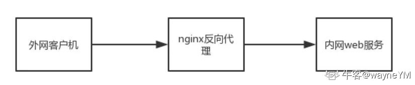
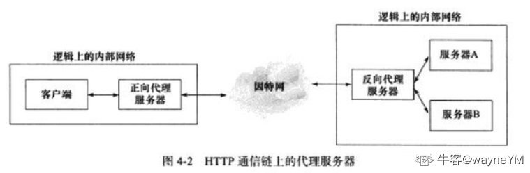
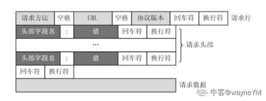
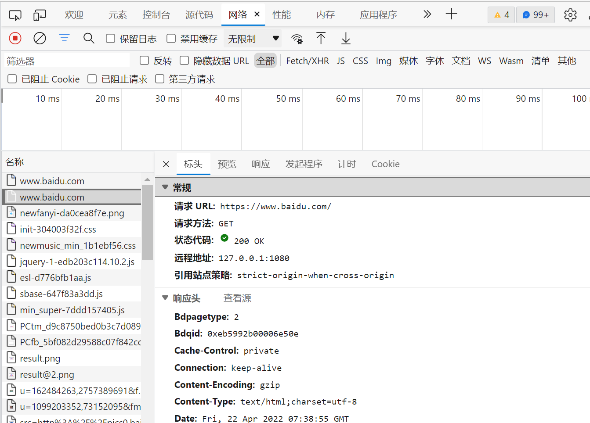
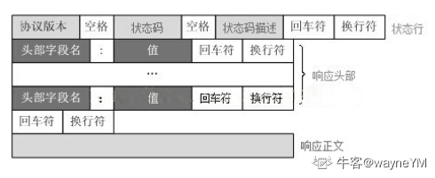

# WebServer服务器项目可能会被问到的问题（二）

想不到第一篇文章收获到了那么多的点赞和收藏，感谢各位小伙伴的捧场，还没有看过一的小伙伴可通过这个链接直达
第一篇的链接：[WebServer服务器项目可能会被问到的问题(一)](https://www.nowcoder.com/discuss/934904)
第二篇的连接：[WebServer服务器项目可能会被问到的问题(二)](https://www.nowcoder.com/discuss/939267)
第三篇的连接：[WebServer服务器项目可能会被问到的问题(三)](https://www.nowcoder.com/discuss/945403)
大家的收藏太猛了，赶紧过来更新第二期了

本期包含的内容有：

- HTTP的各种知识及衍生知识
- Nginx反向代理和负载均衡
- ***的理论原理

由于是个人在去年春招秋招时整理的笔记，难免会有缺漏，同时参考了一些互联网上的公开资料，同时尽可能的在文中呈现了信源。有不妥或者不正确的地方欢迎各位大佬评论区指出呀。

**如果对大家有帮助的话希望可以收获小伙伴们的点赞呀！~**在此也再立个flag，下周五前争取更了第三期（也是最后一期了）。

## [nginx](https://hd.nowcoder.com/link.html?target=https://www.yiibai.com/nginx)反向代理

个人答案：

- nginx作为web服务器一个重要的功能就是反向代理（还有两个是静态web服务器、负载均衡。）

- nginx反向代理的指令不需要新增额外的模块，默认自带proxy_shell指令，只需修改配置文件就可以实现。

- 反向代理服务器

- 反向代理服务器是一种代理服务器，用于管理从外部网络到内部网络的连接或任何特定请求。它保护、路由和管理从外部网络到内部网络、Web服务器或专用网络的流量。

  

  - Linux高性能服务器编程解释：反向代理被设置在服务器端，因而客户端无须进行任何设置。反向代理是指用代理服务器来接受internet上的连接请求，然后将请求转发给内部网络上的服务器，并将从内部服务器上得到的结果返回给客户端。



- **nginx反向代理服务：**浏览器输入网址并回车后，会发起一个http请求给nginx（反向代理服务器），这个请求如果是访问静态文件，那么nginx作为web服务器直接返回请求的内容，如果是访问的后台服务逻辑，那么nginx把请求转发给后端的服务处理。
- nginx配置反向代理服务器的好处：
- nginx反向代理重要的作用是配合upstream实现负载均衡
  - 同时增加安全性，客户端不能直接访问后端服务，多了一个中间的屏障。
  - 提升性能，通过异步非阻塞的方式把请求传给后端，提升了并发处理能力。
  - 也可利用缓存、压缩响应提高响应速度。
- [nginx配置反向代理方法](https://hd.nowcoder.com/link.html?target=https://www.yiibai.com/nginx/reverse-proxy.html)

## nginx负载均衡

- 负载均衡也是Nginx常用的一个功能，负载均衡其意思就是分摊到多个操作单元上进行执行，从而共同完成工作任务。简单而言就是当有2台或以上服务器时，根据规则随机的将请求分发到指定的服务器上处理，负载均衡配置一般都需要同时配置反向代理，通过反向代理跳转到负载均衡。而Nginx目前支持自带3种负载均衡策略，还有2种常用的第三方策略。
  - RR：每个请求按时间顺序逐一分配到不同的后端服务器，如果后端服务器`down`掉，能自动剔除。
  - 权重：指定轮询几率，weight和访问比率成正比，用于后端服务器性能不均的情况。
  - ip_hash：上面的`2`种方式都有一个问题，那就是下一个请求来的时候请求可能分发到另外一个服务器，当我们的程序不是无状态的时候(采用了session保存数据)，这时候就有一个很大的很问题了，比如把登录信息保存到了session中，那么跳转到另外一台服务器的时候就需要重新登录了，所以很多时候我们需要一个客户只访问一个服务器，那么就需要用iphash了，iphash的每个请求按访问ip的hash结果分配，这样每个访客固定访问一个后端服务器，可以解决session的问题。
  - fair（第三方）：按后端服务器的响应时间来分配请求，响应时间短的优先分配。
  - url_hash：按访问url的hash结果来分配请求，使每个url定向到同一个后端服务器，后端服务器为缓存时比较有效。 在upstream中加入hash语句，server语句中不能写入weight等其他的参数，hash_method是使用的hash算法。

- nginx做HTTP服务器实现动静分离
  - Nginx本身也是一个静态资源的服务器，当只有静态资源的时候，就可以使用Nginx来做服务器，同时现在也很流行动静分离，就可以通过Nginx来实现。动静分离是让***站里的***页根据一定规则把不变的资源和经常变的资源区分开来，动静资源做好了拆分以后，我们就可以根据静态资源的特点将其做缓存操作，这就是网站静态化处理的核心思路。

## ***原理

方案1:

通过点到点直接连接实现信息连通。形象的说就是打隧道改路由。

方案2

点到端***。

## HTTP相关

使用有限状态机解析实现。有的应用层协议头部包含数据包类型字段，每种类型可以映射为逻辑单元的一种执行状态，服务器可以根据它来编写相应的处理逻辑。

### 格式

#### 请求报文

**get一般不包含请求数据**，一般在请求行中以?分割URL和传输数据，多个参数用&连接。以下是一个实例，这部分内容浏览器F12点进去network就能看到，推荐大家自己手动打开感受一下。





```
GET / HTTP/1.1

Host: https://*********

User-Agent: Mozilla/5.0 (Windows NT 10.0; Win64; x64; rv:86.0) Gecko/20100101 Firefox/86.0 Accept: text/html,application/xhtml+xml,application/xml;q=0.9,image/webp,*/*;q=0.8 Accept-Language: zh-CN,zh;q=0.8,zh-TW;q=0.7,zh-HK;q=0.5,en-US;q=0.3,en;q=0.2 Accept-Encoding: gzip, deflate, br

Connection: keep-alive

Cookie: BAIDUID=6729CB682DADC2CF738F533E35162D98:FG=1; BIDUPSID=6729CB682DADC2CFE015A8099199557E; PSTM=1614320692; BD_UPN=13314752; BDORZ=FFFB88E999055A3F8A630C64834BD6D0; __yjs_duid=1_d05d52b14af4a339210722080a668ec2161****694782; BD\_HOME=1; H_PS_PSSID=33514_33257_33273_31660_33570_26350; BA_HECTOR=8h2001alag0lag85nk1g3hcm60q

Upgrade-Insecure-Requests: 1

Cache-Control: max-age=0
```

#### 响应报文



```
HTTP/1.1 200 OK
Bdpagetype: 1
Bdqid: 0xf3c9743300024ee4
Cache-Control: private
Connection: keep-alive
Content-Encoding: gzip
Content-Type: text/html;charset=utf-8

Date: Fri, 26 Feb 2021 08:44:35 GMT
Expires: Fri, 26 Feb 2021 08:44:35 GMT
Server: BWS/1.1
Set-Cookie: BDSVRTM=13; path=/
Set-Cookie: BD_HOME=1; path=/
Set-Cookie: H_PS_PSSID=33514_33257_33273_31660_33570_26350; path=/; domain=.baidu.com Strict-Transport-Security: max-age=172800

Traceid: 161****0751284122890175****9583927635684

X-Ua-Compatible: IE=Edge,chrome=1

Transfer-Encoding: chunked

＜html＞
＜head＞
＜title＞Wrox Homepage＜/title＞
＜/head＞
＜body＞
＜!-- body goes here --＞
＜/body＞
＜/html＞
```

### 一次HTTP请求响应的流程

个人答案：

- 域名解析
- 发起TCP的3次握手
- 建立TCP连接后发起http请求
- 服务器响应http请求，浏览器得到html代码
- 浏览器解析html代码，并请求html代码中的资源（如js、css、图片等）
- 浏览器对页面进行渲染呈现给用户

### HTTP方法

个人答案：

- GET：用于请求访问已经被URI（统一资源标识符）识别的资源，可以通过URL传参给服务器
- POST：用于传输信息给服务器，主要功能与GET方法类似，但一般推荐使用POST方式。
- PUT：传输文件，报文主体中包含文件内容，保存到对应URI位置。
- HEAD：获得豹纹不，与GET类似，只是不返回报文主体，一般用于验证URI是否有效。
- DELETE：删除文件，与PUT相反，删除对应URI位置文件。
- OPTIONS：查询相应URI支持的HTTP方法。

### GET、POST区别

个人答案：

- get重点在从服务器上获取资源；
- post重点在向服务器发送数据；

- get传输数据是通过URL请求，以field（字段）= value的形式，置于URL后，并用"?"连接，多个请求数据间用"&"连接，如`http://127.0.0.1/Test/login.action?name=admin&password=admin`，这个过程用户是可见的；
- post传输数据通过Http的post机制，将字段与对应值封存在请求实体中发送给服务器，这个过程对用户是不可见的；

- Get传输的数据量小，因为受URL长度限制，但效率较高；
- Post可以传输大量数据，所以上传文件时只能用Post方式；

- get是不安全的，因为URL是可见的，可能会泄露私密信息，如密码等；
- post较get安全性较高；

- get方式只能支持ASCII字符，向服务器传的中文字符可能会乱码。
- post支持标准字符集，可以正确传递中文字符。

### 状态码

- 1xx：指示信息--表示请求已接收，继续处理
- 2xx：成功--表示请求已被成功接收、理解、接受
  - **200**：请求被正常处理
  - 204：请求被受理但没有资源可以返回
  - 206：客户端只是请求资源的一部分，服务器只对请求的部分资源执行GET方法，相应报文中通过Content-Range指定范围的资源。
- 3xx：重定向--要完成请求必须进行更进一步的操作
  - **301**：永久性重定向
  - **302**：临时重定向
  - 303：与302状态码有相似功能，只是它希望客户端在请求一个URI的时候，能通过GET方法重定向到另一个URI上
  - 304：发送附带条件的请求时，条件不满足时返回，与重定向无关
  - 307：临时重定向，与302类似，只是强制要求使用POST方法
- 4xx：客户端错误--请求有语法错误或请求无法实现
  - **400：**请求报文语法有误，服务器无法识别
  - 401：请求需要认证
  - **403**：请求的对应资源禁止被访问
  - **404**：服务器无法找到对应资源
- 5xx：服务器端错误--服务器未能实现合法的请求
  - **500：**服务器内部错误
  - **503：**服务器正忙

### HTTPS

#### HTTP 与 HTTPS 有哪些区别？

1. HTTP 是超⽂本传输协议，信息是明⽂传输，存在安全⻛险的问题。HTTPS 则解决 HTTP 不安全的缺陷，在 TCP 和 HTTP ⽹络层之间加⼊了 SSL/TLS 安全协议，使得报⽂能够加密传输。
2. HTTP 连接建⽴相对简单， TCP 三次握⼿之后便可进⾏ HTTP 的报⽂传输。⽽ HTTPS 在 TCP 三次握⼿之后，还需进⾏ SSL/TLS 的握⼿过程，才可进⼊加密报⽂传输。
3. HTTP 的端⼝号是 80，HTTPS 的端⼝号是 443。
4. HTTPS 协议需要向 CA（证书权威机构）申请数字证书，来保证服务器的身份是可信的。

#### HTTPS 采⽤的是对称加密和⾮对称加密结合的「混合加密」⽅式：

- 在通信建⽴前采⽤⾮对称加密的⽅式交换「会话秘钥」，后续就不再使⽤⾮对称加密。
- 在通信过程中全部使⽤对称加密的「会话秘钥」的⽅式加密明⽂数据。

采⽤「混合加密」的⽅式的原因：

- 对称加密只使⽤⼀个密钥，运算速度快，密钥必须保密，⽆法做到安全的密钥交换。
- ⾮对称加密使⽤两个密钥：公钥和私钥，公钥可以任意分发⽽私钥保密，解决了密钥交换问题但速度慢。

#### 介绍一下HTTP/1 HTTP/2 HTTP/3的发展吧

个人答案：

- 技术的发展都是为了解决某些问题
- HTTP/1的问题是**短链接每次都需要三握四挥**、**不安全**（HTTPs）、无状态（Cookie）、**服务端不能主动发送**。(核心，1.0短连接 1.1可以长连接 不安全)
- HTTP/2默认了长连接（Keep-Alive）、**引入TLS/SSL**、Cookie、服务端主动发送、头部压缩、多路复用。但是还有**队头阻塞**的问题（因为虽然进行了长连接，但是还有一种情况会出现队头阻塞，那就是 丢失重传）。(核心 队头阻塞 ssl cookie)
- HTTP/3使用**UDP解决了丢失重传导致的队头阻塞**，并且使用了TLS/SSL1.3减少了建立HTTPs连接的时间到1.5-2个RTT（往返时间），还引入了二进制编码，其他细节忘记了。

- 提前将资源推送到浏览器
- 推送可以基于已发送的请求，例如客户端请求 `html`，服务端可以主动推送 `js`、`css` 文件

### https7次握手具体流程(tcp3次+tls4次)

客户端 -----SYN-----> 服务端

客户端 <-----SYN ACK ----- 服务端

客户端 -----SYN ACK -----> 服务端

三次握手完毕

客户端hello

客户端 -----客户端随机数 tls版本号(Client Hello) -----> 服务端

客户hello完毕

服务端hello

客户端 <-----协议 加密方***话id 服务端随机数(Service Hello) ----- 服务端

客户端 <-----服务端证书(有ca私钥加密过的服务端公钥) (Service Certificate)----- 服务端

服务端hello完毕 还有一些可选内容可以发

> 客户端此时有 服务器随机数(明文) 客户端随机数(明文) 服务端公钥(明文+验证过为真)
>
> 服务端此时有 服务器随机数(明文) 客户端随机数(明文)
>
> 那么客户端可以使用服务端公钥加密 客户端随机数 + 服务端随机数 + premaster 搭建出会话密码
>
> 服务端私钥解密一波 能看到秘钥

客户端 -----服务端公钥加密后的key(两个随机数+premaster组成)-----> 服务端

> 之后客户端通信用会话秘钥加密
>
> 向服务端发送 Client Key Exchange 消息，包含使用服务端公钥加密的随机字符串，即预主密钥（Pre Master Secret）。
>
> 向服务端发送 Change Cipher Spec 消息，通知服务端后续数据会加密传输。
>
> 向服务端发送 Finished 消息，其中包含加密后的握手信息。

客户端 <-----ack----- 服务端

> 1. 向客户端发送 Change Cipher Spec 消息，通知客户端后续数据会加密传输。
> 2. 向客户端发送 Finished 消息，验证客户端的 Finished 消息并完成 TLS 握手。

#### tls的核心4次

客户端 服务端

1. 客户端给服务端随机数，告诉服务端我能用哪些加密手段 -->
2. 服务端给客户端随机数，告诉客户端就用哪种加密手段 <--
3. 服务端给客户证书，(里面包含了ca加密的服务端公钥) <--
4. 客户端把会话秘钥生成 传给服务端 (服务端公钥加密 2个随机数+premaster 搭建会话秘钥) -->

### HTTP优化方案

个人答案：

- 内容缓存：将经常用到的内容进行缓存起来，那么客户端就可以直接在内存中获取相应的数据了。
- 压缩：将文本数据进行压缩，减少带宽
- SSL加速（SSL Acceleration）：***L协议对HTTP协议进行加密，在通道内加密并加速
- TCP复用：TCP连接复用是将多个客户端的HTTP请求复用到一个服务器端TCP连接上，而HTTP复用则是一个客户端的多个HTTP请求通过一个TCP连接进行处理。前者是负载均衡设备的独特功能；而后者是HTTP 1.1协议所支持的新功能，目前被大多数浏览器所支持。
- TCP缓冲：通过采用TCP缓冲技术，可以提高服务器端响应时间和处理效率，减少由于通信链路问题给服务器造成的连接负担。

如果各位小伙伴看到了这里，这还不点个赞留下条评论再走！能看完的你都是最牛的。