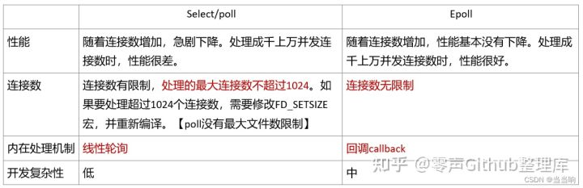

# 面试 | #webserver项目整理#

# 项目可能遇到的问题及答案汇总（不定期更新）

## 项目的重点、难点，以及怎么解决难点的

> - 项目中的重点在于应用层上HTTP协议的使用，怎么去解析HTTP请求，怎么根据HTTP请求去做出应答这样一个流程我觉得是这个项目的重点。
> - 项目的难点我觉得在于如何将一个完整的服务器拆分成多个模块，同时在实现的时候又将其各个部分功能组合在一起。首先一个HTTP服务器要实现的是完成请求应答这样一件事，然后需要考虑到读写数据的缓冲区、同时多个连接需要处理多种事件、连接超时关闭避免资源消耗等这一系列问题，所以就有了各种模块。单独编写模块出来后还要考虑怎么去组合怎么去搭配，互相之间的接口要怎么设计，我觉得是我在项目中遇到的问题。
> - 难点的解决通过自顶向下的设计方式。先确定整体的功能也就是完成一次HTTP传输，再向下考虑需要用到什么组件，然后再依次实现各个组件，最后再将模块组合起来，期间需要多次修改接口。

## 项目实现的效果以及瓶颈和不足

> - 项目实现效果我是部署在单核2G的云服务器上的，跑过压力测试但是实际效果并不理想，只有3000左右的QPS（并发数/平均访问时间），拆测可能跟设计模式的选择还有测试服务器的性能有关系。
> - 该服务器的瓶颈我觉得在于网络设计模式的选择。首先该服务器的网络设计模式是采用的单Reactor多线程模式。就是主线程内循环使用IO多路复用，监听连接并且建立连接，同时也会监听新连接上的读写事件，并将读写和业务逻辑处理分发给多线程进行处理。这么一个设计模式的缺陷在于一个Reactor对象承担了所有事件的监听和响应，当遇到突发的高并发时，往往不能及时处理新连接。

## 针对瓶颈如何改进

> - 针对不足可以改变网络设计模式。即采用多Reactor多线程模型。相比改变前，多Reactor多线程模型中主线程主Reactor只负责监听连接还有建立连接，并且将建立好的连接通过生产者消费者模型传递给子线程里的子Reactor负责监听对应连接上的事件。这样主线程就可以在遇到瞬间并发时也能够及时处理新连接的建立。

## 采用什么网络模型

> - 采用单Reactor多线程模型。主线程是一个Reactor，进行IO多路复用实现连接事件和读写事件的监听，同时主线程负责新连接的建立，子线程则负责数据的读写还有业务逻辑处理。

## HTTP解析怎么实现的（正则表达式和有限状态机）

> - HTTP解析是通过正则表达式还有有限状态机实现的。一个HTTP请求报文是由三部分组成的，请求行、头部字段还有消息体，通过在状态机里重复这三个部分之间的解析跳转，最终可以完成一个完整请求报文的解析。HTTP1.1请求报文是ASCII码的固定文本形式，通过正则表达式去解析可以简化我们的任务量。

## HTTP应答怎么将网页资源发送出去

> - HTTP应答发送这里采用了集中写的形式。利用Linux函数writev，我们可以根据解析结果制作响应行和响应头并且存放在缓冲区，然后将响应体（也就是请求的资源文件）通过内存映射mmap映射到我们内存中去，最后通过集中写的形式将一个完整的HTTP应答发送出去。

## 浏览器从输入URL到显示的整个过程

> - 主要有过程：URL输入之后，需要建立TCP连接，而一个唯一确认的TCP连接需要一个四元组（服务器IP，服务器端口，客户端IP，客户端端口）确定。而此时客户端并不知道域名所对应的IP地址，所以此时需要通过DNS域名服务器进行解析，将域名转换为对应的服务器IP地址。这个时候客户端就可以建立和服务器之间的TCP连接了（这个中间有三次握手的流程）。连接之后客户端请求服务器的数据需要发送HTTP请求到达服务器端，接着服务器进行响应，并且发送回资源。浏览器在接到资源之后对其进行解析并渲染，对于网页中的其他资源会再次发送HTTP请求该资源，直到网页内容完整的传输到浏览器。

## 主机字节序和网络字节序

> 主机字节序通常指的是小端序，而网络字节序通常指的是大端序。所谓的小端序指的就是整数的低位字节存放在内存的低地址处，而大端序则指的是整数的高位字节存放在内存的低地址处。之所以要进行转换是为了数据传输的统一。

> 通过一个共用体可以辨别主机是大端还是小端。

```cpp
union test {
  short int data;
  char num[sizeof(short)];
}

test a;
a.data = 0x00ff;
std::cout << a.num[0] << std::endl;
```

> 字节序转换函数 `htonl()` `htons()` `ntohl()` `ntohs()`

## 除了GET还有什么HTTP方法

> 除了GET方法还有POST、HEAD、DELETE、OPTIONS等。

## HTTP状态码说一下

> 常见的状态码有 200-请求成功 301-资源被永久转移到其他URL 404-请求的资源不存在 500-内部服务器错误

> 响应状态码分为5类；1开头的状态码表示信息，服务器接到该请求，需要客户端的进一步操作；2开头代表成功，操作被成功接受并且处理；3开头代表重定向，需要进一步的操作；4开头代表客户端错误，包括无法完成请求和语法错误；5开头代表服务器错误，指明服务器在处理请求的过程中出错。

## 如何防止粘包现象

> - 在这个项目中不会发生粘包现象。因为HTTP解析是通过状态机来进行的，一个状态机结束的标志是当读到一个完整的请求或者是该请求不完整才会退出，当请求不完整的时候，服务器不会将该部分标为已读而是直接退出，等到资源重新可读时再接着判断。

> - 所谓粘包是指在TCP连接中，由于TCP是面向字节传输的，所以在一次传输中可能包含多个HTTP请求应答，两个相邻之间的HTTP请求应答可能由于过小或者过大，在TCP传输层上被合并在一个TCP报文段里或者被拆分成多个TCP报文段，多个不同连接数据紧挨着的情况便称为粘包现象。

> - 拆包指的便是针对这种粘包现象进行的一个解决措施。通常可以通过在应用层协商每次传输的数据大小、在传输数据中指明本次传输的数据大小、在每个数据包后面加上特殊的划分界限的标志等措施来解决粘包现象。

## 说一说线程池

> 这个项目实现一个固定线程数量的线程池。使用到了生产者消费者模型，所有线程共享一个生产队列，通过条件变量唤醒线程执行队列里的任务。所有线程是分离状态，在线程池销毁的时候设置关闭标志位，唤醒所有线程使其退出。

## 线程池线程数量怎么确定的

> 线程池数量是对外开放接口，由调用者自定义，在运行时会固定线程数量不会发生动态调整。

## 说一说怎么用小根堆实现定时器

> 小根堆是组织定时器的一个数据结构，每次取队头都是最短的超时时间，以最短的超时时间来作为定时，确保每次定时时间到达都有事件发生。小根堆支持对定时器的增删改，通过哈希表将文件描述符映射到指定的定时器中，可以实现O(1) 时间复杂度的查找，但是堆调整则需要logn的时间复杂度。

## 说一说定时器的作用

> 定时器是模拟TCP层面的｀kepp-alive｀套接字属性。默认的`keep-alive`套接字属性其超时时间过长，通过在应用层设置定时器来模拟该选项，可以及时关闭失效的连接来避免资源的浪费。

## 说一说日志系统

> 日志系统通过单例模式还有双缓冲区、异步线程，实现日志文件的异步写入。通过使用宏定义简化日志系统的使用。

## 双缓冲区分别是什么？怎么实现

> 双缓冲区一个是buff缓冲区，接收要输入的日志消息，如果开启异步线程则再将其转移到生产者消费者队列中，同时唤醒异步线程将其取出写入到对应的日志文件中去。如果没有开启异步线程则直接将buff缓冲区的内容写入到对应文件中去。这里双缓冲区是为了缓解内存读写速度和IO读写速度不匹配的问题，如果不开启异步线程，则不需要，因为当前进程会被IO阻塞，不存在读写速度不匹配的问题。但是当开启异步线程时，IO读写速度和内存读写速度不匹配，容易导致数据丢失，所以开启异步线程时需要使用双缓冲区。

## 双缓冲区有什么用

> 双缓冲区是为了缓解内存读写速度和IO读写速度不匹配的问题，如果不开启异步线程，则不需要，因为当前进程会被IO阻塞，不存在读写速度不匹配的问题。但是当开启异步线程时，IO读写速度和内存读写速度不匹配，容易导致数据丢失，所以开启异步线程时需要使用双缓冲区。

## 项目怎么实现线程安全

> 通过互斥锁、条件变量来达到多线程同步的目的。

## 说说锁的类别

> 互斥锁：同一时间只能由一个线程访问临界区资源；条件锁：也就是条件变量，当条件不满足时会一直阻塞操作；自旋锁：当获取锁的条件不满足时不会阻塞，而是处于轮询状态不断尝试获取锁，会持续占用cpu，适合持锁时间短的场景；递归锁：可以对临界区资源重复加锁（不同锁）；读写锁：读时共享写时独占，当读锁上锁时，其他线程可以继续上读锁，但是上写锁时会阻塞直到全部读锁释放，上写锁时其他锁都将被阻塞。

## 说说单例模式，还有什么设计模式

> 单例模式是指在程序运行过程中只有唯一的一个实例，其生命周期从创建到程序结束为止。我知道的其他设计模式还有工厂模式、观察者模式。

> 工厂模式是创建型模式，简单工厂通过对创建对象的接口做一个封装，将其创建封装在一个类中，使用者可以通过指定创建对象类型就可以返回需要的对象，违反开闭原则，每次新增加产品都要修改工厂类。

> 工厂方法模式是在简单工厂上进行改进的，其产品对象生产推迟到子类当中去，通过多个子工厂类来实现不同产品对象的生产。

> 抽象工厂可以针对多种类型的产品对象，具体不是很了解。

> 观察者模式：描述一种多个对象中，存在一对多的依赖关系的一种模式，当一个对象状态发生改变时，其他依赖他的对象都将收到通知并且更新。适用于发布-订阅的一个场景。

## 手写单例模式

```cpp
//  局部静态变量
//  折构函数私有是为了防止外界delete返回的指针导致对象生命周期提前结束
//  局部静态对象，程序结束时会自动回收
template<typename T>
class Singleton {
  public:
    static T& getInstance() {
      static T t;
      return t;
    }

    Singleton(const Singleton&) = delete; 
    Singleton& operator=(const Singleton&) = delete; 
  protected:
    Singleton() = default;
    ~Singleton() = default;
};
//  双检锁加自动回收
class Singleton {
  public:
    static Singleton* GetInstance()
    {
        if (m_pInstance == NULL )
        {
            Lock(); // 加锁
            if (m_pInstance == NULL )
            {
                m_pInstance = new Singleton ();
            }
            UnLock(); // 解锁
        }
        return m_pInstance;
    }
 
    // 实现一个内嵌垃圾回收类    
    class CGarbo {
    public:
        ~CGarbo()
        {
            if(Singleton::m_pInstance) 
                delete Singleton::m_pInstance;
        }
    };
 
    static CGarbo Garbo; // 定义一个静态成员变量，程序结束时，系统会自动调用它的析构函数从而释放单例对象
 
private:
    Singleton(){};
    Singleton(Singleton const&); 
    Singleton& operator=(Singleton const&); 
 
    static Singleton* m_pInstance;
};
 
Singleton* Singleton::m_pInstance = NULL;
Singleton::CGarbo Garbo;
```

## 说一说常用的网络编程API

> socket() bind() connect() listen() accept()

## 说一说服务端和客户端建立连接的过程（函数调用）

> 先通过socket函数调用来返回创建一个套接字，接着调用bind函数为改套接字绑定端口和IP地址，再通过listen函数调用将其变为监听套接字，最后调用accept函数调用来返回新建立的TCP连接

## 说一说四种IO模型

> 分别是同步阻塞IO模型、同步非阻塞IO模型、信号驱动IO模型、异步IO模型、多路IO复用模型。同步和异步的区别在于两者获取数据的方式不同。同步IO需要使用系统调用将内核中的数据拷贝到指定位置，异步IO则由内核自动将数据拷贝到指定内存中去。多路IO则是能够在阻塞期间同时监听多个描述符上的事件发生。

## 说一说epoll(*)

> epoll是Linux上独有的IO多路复用技术。一个进程可以监视多个描述符，epoll所支持的文件描述符上限是最大可以打开文件的数目，一旦某个描述符就绪（一般是读就绪或者写就绪），能够通知程序进行相应的读写操作。但本质上都是同步I/O，因为他们都需要在读写事件就绪后自己负责进行读写，也就是说这个读写过程是阻塞的。epoll底层是一棵红黑树还有一个双向链表，红黑树存放的是与文件描述符相对应的epitem结构体，当文件描述符上有对应感兴趣事件发生时，内核将其添加到链表里，每次epoll_wait则【清空链表（ET模式下）】将其拷贝到用户空间，同时返回就绪事件的数量。使用红黑树查找删除添加都是logn的时间复杂度，有较稳定的时间复杂度，同时红黑树查找是为了防止重复添加文件描述符。

## epoll一定高效嘛？为什么要用epoll(*)

> epoll适用于需要观察大量事件的场景；select能够监听的事件数量有最大文件描述符的上限，一般是1024个，而且每次调用时都需要将文件描述符集合在内核和用户之间进行拷贝。poll没有文件描述符数量的限制，不过和select一样，每次调用都要将文件描述符集合在内核和用户之间进行拷贝，每次有事件触发时，需要遍历所有文件描述符找出触发的事件；而epoll只需要往内核空间里的红黑树添加修改或者删除指定的文件描述符和事件，不需要每次都拷贝所有的文件描述符集合到内核当中去，同时也能够直接返回就绪事件无需重复遍历文件描述符集合。

> 所以在需要监听多个文件描述符上的事件的时候，选用epoll更有效率，内核直接返回触发事件。但是当需要监听的文件描述符数量少且较为活跃的情况下，select和poll相比epoll更有效率，因为其省去了触发感兴趣事件时的函数回调操作（将数据从红黑树上添加到就绪链表中）。

## LT模式和ET模式的区别

> LT模式下只要内核缓冲区还有数据可读便会提醒（哪怕已经提醒过，针对同一事件可以多次提醒）

> ET模式下，每一次事件到来只通知一次（针对一个事件只提醒一次而不是提醒多次），没有及时读取完，该部分剩余数据直到下次触发，才能被读取（有可能永远也读不到，如果没有再次触发文件描述符上的该事件）

## ET模式为什么需要非阻塞

> ET需要一次读完-->多次重复读取-->阻塞读取时最后一次必定阻塞-->任务线程阻塞，后续新的事件任务没法及时处理-->多个文件描述符上的事件饿死

> ET非阻塞时，（重复）最后一次的读写（没有数据）必定阻塞，因为需要把数据一次读完，而此时没有数据必定阻塞

> 阻塞会导致多个文件描述符上的任务得不到及时处理而被饿死（对应的读写、逻辑处理任务存放在生产者消费者队列里），此时任务线程都阻塞在调用中无法处理其他文件描述符上的事件

> LT模式下只要内核缓冲区还有数据可读便会提醒（哪怕已经提醒过，针对同一事件可以多次提醒）

> ET模式下，每一次事件到来只通知一次（针对一个事件只提醒一次而不是提醒多次），没有及时读取完，该部分剩余数据直到下次触发，才能被读取（有可能永远也读不到，如果没有再次触发文件描述符上的该事件）

> oneshot确保同一时间只能有一个线程处理同一个文件描述符上的事件（发送用户通知后，将文件描述符从监听感兴趣列表里删除），避免多个线程同时操作导致错误

> 比如正在逻辑处理，突然触发可写事件。会导致数据传输不完整

> TCP写缓冲区由饱和变成饱和会触发可写事件，此时用户缓冲区数据尚未处理成功就被发送出去

## select、poll和epoll的区别？三者的应用场景



> 当有事件触发时，select和poll需要用户自己去遍历文件描述符找出触发的事件，而epoll能够直接返回所有的触发事件；

> 每次调用select和poll都需要将文件描述符集合拷贝到内核空间，返回时再拷贝一次。而epoll只需要拷贝需要修改的文件描述符而不需要集体的拷贝；

> select支持的文件描述符数量有上限，而poll和epoll没有此限制；