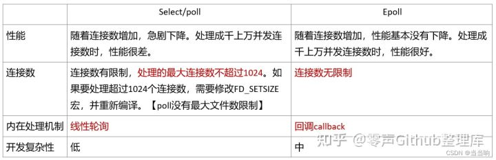

# 烂大街的WebServer分享一下

***项目地址：[https://github.com/linyacool/WebServer/tree/master/WebServer](https://hd.nowcoder.com/link.html?target=https://github.com/linyacool/WebServer/tree/master/WebServer) （非本人）***

------

# 本人整理存在客观性，食用时请注意分辨，欢迎指正错误。

------

## 项目介绍

### 项目背景

> 这个项目是当时在学习过程中实践练手的一个项目，主要参考了高性能服务器和Linux多线程服务器这两本书籍以及一些开源代码进行开发。主要涉及到的知识有C++、网络编程、多线程编程、Linux库函数。
>
> 约2K行代码量。

### 简要描述

> 项目由IO多路复用模块、定时器模块、日志模块、线程池模块、缓冲区模块组成。
>
> 实现了浏览器访问服务器，获取服务器资源的功能。

> 项目总体的框架采用的是单Reactor多线程模型。在主线程里通过IO多路复用监听多个文件描述符上的事件。主线程负责连接的建立和断开，同时将读写和逻辑处理任务加入线程池里的任务队列，由线程池里的线程负责完成相应操作实现任务的并行处理。在应用层面实现心跳机制，通过定时器来清除不活跃的连接减少高并发场景下不必要的系统资源的占用【文件描述符的占用、维护一个TCP连接所需要的资源】 。对于到达的HTTP报文，采用了有限状态机和正则表达式进行解析，资源的响应则通过集中写和内存映射的方式进行传输。最后加入日志模块实现服务器日常运行情况的记录。

### 项目职责

> 在应用层采用HTTP1.1协议构建B/S模型。通过使用状态机和正则表达式完成HTTP报文的解析。
>
> 通过构建线程池完成多个读写任务和逻辑处理任务的并行处理。
>
> 同时采用Reactor设计模式和IO多路复用实现了高并发的服务器。
>
> 在应用层实现心跳机制检测不活跃连接，通过及时释放资源来确保服务器在高并发场景下也能够稳定可靠。
>
> 最后采用单例模式还有双缓冲区实现异步日志来记录**服务器的运行情况**。

### 项目流程（*）

> - 首先是服务器的一个参数初始化操作。
>
> 通过构造WebServer这个对象传递参数进行服务器相关参数的设定，主要参数有设置定时器超时时间、设置Epoll触发模式、设置日志系统的开启、日志路径以及异步开关、设置线程池的线程数量。
>
> - 然后是通过设定的参数对服务器的各个模块进行初始化。主要有日志、线程池、IO复用、HTTP对象、缓冲区、阻塞队列等模块。
>
> 日志模块的初始化是先建立一个日志文件，通过一个变量按照天数去划分不同的日志文件。线程池采用RAII手法，在构造时创建线程，折构时唤醒所有睡眠的线程使其退出循环。IO复用是对epoll函数调用的一个封装。HTTP对象主要设置文件存放的相关路径。缓冲区和阻塞队列主要完成指定大小的参数设定。
>
> - 服务器各个模块初始化完成之后就是主线程里IO复用监听事件的循环。
>
> 监听事件有新连接到达、读事件和写事件和异常事件。根据不同的事件进行一个任务处理。
>
> 当新连接到达的时候，通过调用accept取出新连接（ET模式下需要循环操作），将新连接的文件描述符用来初始化HTTP连接（套接字地址和文件描述符绑定到一个HTTP对象），完成绑定定时器的初始化，同时添加监听读事件，设置其文件描述符为非阻塞。
>
> 当有异常事件发生的时候，关闭该连接同时移除监听事件和定时器。
>
> 当触发读事件的时候，调整定时器的定时时间，将读任务放入线程池的任务队列当中去。这个时候线程池对象里的多个线程，处于一个睡眠或者竞争任务并执行的过程，任务加入到任务队列当中去时会发送一个唤醒信号，如果有睡眠的线程则会被唤醒，进入循环里探测任务队列是否为空，取出任务并执行或者队列为空继续睡眠。
>
> 线程执行读任务函数主要是完成一个非阻塞读取调用直到读完，将数据缓存在用户缓冲区中，接着执行一个消息解析的操作，根据HTTP解析是否成功的判断来决定重新注册写事件还是读事件。如果解析失败那么重新注册读事件等待下次读取更多数据直到一个完整的HTTP请求。如果是解析成功的话就制作响应报文并且注册写事件，等待内核缓冲区可写触发事件时，将其写入内核缓冲区。
>
> 这部分的重点是逻辑处理的过程，也就是HTTP解析和HTTP报文的制作。
>
> 解析采用的是状态机和正则表达式，每次都读取以\r\n结尾的一段字符串，通过状态机来判定获取的字符串是属于HTTP请求的哪一部分，再跳转到相应的函数进行解析，如果读取的字符串没有以\r\n结尾则认为此次数据获取不完整，返回解析失败重新注册读事件。如果解析完成之后则根据解析过程中保存的相应信息，制作响应报文，通过集中写将资源文件和响应报文分别发送回客户端。

### 项目效果

> 在单核【2.4GHz】2G的云服务器上实现了并发量2W+，QPS8K+的效果。
>
> 在满载（开始有连接崩溃的临界）的情况下，内存占用达到60%，这个和缓冲区大小的设置有关，可以通过进一步提高其大小来提高性能。同时CPU占用率较高（45%），推测和单核进行频繁的上下文切换（多线程）有关。
>
> 整个项目更偏向于IO密集型。

### 重点难点

> 项目的重点在于HTTP报文的解析和制作。
>
> 项目的难点在于整个项目的规划以及框架的设计，以及围绕高并发进行的一系列优化。（线程安全）

### 解决方案

> 通过采用从局部到整体的设计思想。先使用单一线程完成串行的HTTP连接建立、HTTP消息处理和HTTP应答发送，然后围绕高并发这个核心扩展多个模块。首先就是日志模块和缓冲区模块的一个设计，这里优先实现是为了下面各个模块的调试方便，记录各个模块运行的状况和打印输出模块运作情况来排除明显的BUG。然后是引入IO多路复用实现单线程下也能在一次系统调用中同时监听多个文件描述符，再进一步搭配线程池实现多客户多任务并行处理，这是高并发的核心部分。在这个基础上做一点优化，在应用层实现了心跳机制，通过定时器实现非活跃连接的一个检测和中断，减少系统资源（内存）不必要的浪费。最后将所有模块整合起来，实现一个单Reactor多线程的网络设计模式，将多个模块串联起来实现完整高并发的服务器程序。
>
> 线程安全这块是通过不断将锁的粒度降低，平衡性能和安全。一开始采用粒度较粗的锁实现互斥（通常是整个操作），然后慢慢分析将一些不共享的代码移出临界区，慢慢调整慢慢优化。

### 项目瓶颈

> 这个项目高并发的瓶颈在于整个框架网络设计模式的选择以及线程池的设定。首先网络设计模式采用的的是单Reactor模型，在主线程里使用一个复用IO承担了所有事件的监听，包括读写事件和新连接的到来。这样的一个缺点就是当瞬间并发量高的时候，往往新连接不能被及时处理【epoll_wait调用返回的数据存放在用户指定的缓冲区，这部分缓冲区有一定的上限】。然后另一方面是关于线程池的线程数量这一块，线程池线程数量是在构造时就确定的，不能根据机器的核心数量动态调整（需要修改源码去设定），固定的线程数量在核心过少或者过多的机器上都会有性能损失（可以通过使用普通线程和核心线程进行优化）。

### 项目优化（未实现）

> 项目高并发的优化可以从线程池和网络设计模式这两部分入手。首先是单Reactor模型，可以采用Proactor模型或者多Reactor模型进行改进。Proactor模型对异步IO有要求，而在Linux上没有相关的异步IO系统调用，一般都是采用同步模拟（由主线程完成IO操作）去实现，相比之下强行模拟的效果不如采用单Reactor（这个时候主线程承担了太多工作）。另一个改良方案采用多Reactor模型，主线程只负责新连接到达的监听以及新连接的建立，对于新到达的连接通过生产者消费者模型分发给子Reactor（另起线程），由子Reactor完成已建立连接的读写事件监听任务。这样当有瞬间的高并发连接时，也不会出现新连接丢失的情况。
>
> 另一个是关于线程池线程数量设定的优化。线程池的线程数量在构造的时候就已经确定下来，当机器核心数量改变时需要通过修改才能改变线程数量去匹配，不符合开闭原则，线程数量这一块可以通过C++17新特性动态获得机器的核心数量`std::thread::hardware_concurrency()`，来使程序更好的匹配机器实现更好的性能【避免核心数量过少进行频繁的上下文切换以及核心数量过多被闲置】。或者通过普通线程（临时创建用来响应多余的任务）和核心线程（一直存在）来优化【实现较为复杂】

### 项目遇到棘手的问题

### 个人收获

> 学习了基本的网络编程和多线程编程。进一步熟悉C++语法还有一些常用的新特性，了解常用的设计模式还有网络设计模式。了解一个项目框架和模块的设计方法。

## 模块

### 缓冲区

#### 如何实现动态扩容

### 阻塞队列（生产者消费者）

### 定时器

#### 为什么要手动实现小根堆？

> 学习之用，为了更好的熟悉堆这一数据结构

#### 常用的定时器结构和它们的差异？

> 除了小根堆实现之外，还有使用时间轮和基于升序链表实现的定时器结构。
>
> 基于升序链表实现的定时器结构按照超时时间作为升序做排序，每个结点都链接到下一个结点，由于链表的有序性以及不支持随机访问的特性，每次插入定时器都需要遍历寻找合适的位置，而且每次定时器调整超时时间时也需要往后遍历寻找合适的位置进行挪动，遍历操作效率较低。~~同时也需要通过多次计时（通过信号中断实现）来检测链表中的定时器是否超时并进行处理。~~ 优化方式可以通过利用IO复用的超时选项。
>
> 不同于采用单条链表实现的定时器每次插入更新进行遍历来寻找合适的位置进行操作，时间轮利用哈希思想，将相差整个计时周期整数倍的定时器散列到不同的时间槽中，减少链表上的定时器数量避免过多的顺序遍历操作。时间轮通过提高时间槽的数量来提高查找效率【使每个时间槽里的链表长度尽可能短】，通过减少计时间隔来提高定时器的精度【使定时时间尽可能准确】，设计时需要考虑这两个因素，时间槽多但是定时器数量少则会造成效率低下，可以通过多级时间轮优化，但是实现起来复杂。
>
> 小根堆实现的定时器结构，每次取堆头都是最短超时时间，能够利用IO复用的超时选项，每次的计时间隔动态调整为最短超时时间，确保每次调用IO复用系统调用返回时都至少有一个定时事件的超时发生或者监听事件的到达，有效地减少了多余的计时中断（利用信号中断进行计时）。最主要是确保每次定时器插入、更新、删除都能实现稳定的logn时间复杂度【该时间复杂度是调整堆的代价，定时器的定位利用哈希表实现O1查找】，而不像链表一样依赖于定时器数量的大小以及时间轮需要兼顾时间精度和效率的问题。

#### 定时器设计的必要性？

> 

### 网络设计模式

#### 为什么采用Reactor？

> 服务器的框架实现一般采用Reactor或者Proctor，而Proctor模型对异步IO是针对异步IO设计的，Linux上没有相关的异步IO系统调用，只能通过主线程进行同步IO进行模拟，实现的意义不大，所以便直接采用了Reactor模型。

#### Reactor和Proctor的区别？

> Reactor是采用IO多路复用监听事件，对于到达的时间根据类型进行任务分发，通常是交给线程池处理。【即负责监听和分发事件】
>
> 而Proctor模型不同于Reactor模型进行同步IO，该模型采用的是异步IO，只负责发起IO操作，真正的IO实现由操作系统处理。然后任务池从指定的缓冲区取出数据进行操作，只考虑逻辑处理不需要处理IO操作。

#### 同步IO和异步IO的区别？

> 同步IO和异步IO的区别主要在于获取数据的方式不同。同步IO是内核通知用户可以进行读写操作，需要用户手动使用函数进行系统调用陷入内核，将内核数据拷贝到用户缓冲区。
>
> 而异步IO则是通过系统调用向内核发起通知，告知要进行的IO操作并指明存放的缓冲区，当内核完成IO操作时再通知用户（通常是回调函数实现），此时用户得到的是已经准备好的数据，没有中间阻塞的IO操作。

#### 有什么优化方式？

> 可以采用Proactor模型或者多Reactor模型进行改进。Proactor模型对异步IO有要求，而在Linux上没有相关的异步IO系统调用，一般都是采用同步模拟（由主线程完成IO操作）去实现，相比之下强行模拟的效果不如采用单Reactor（这个时候主线程承担了太多工作）。另一个改良方案采用多Reactor模型，主线程只负责新连接到达的监听以及新连接的建立，对于新到达的连接通过生产者消费者模型分发给子Reactor（另起线程），由子Reactor完成已建立连接的读写事件监听任务。这样当有瞬间的高并发连接时，也不会出现新连接丢失的情况。

### 日志系统

#### 日志系统记录的内容及作用？

> 在开发其他模块的时候主要用来记录模块的信息，通过日志判断模块功能是否正常。
>
> 在服务器运行期间主要记录服务器设定的参数、新客户的建立与断开、异常事件的发生（并发数量达到上限、套接字初始化失败等）。便于对服务器运行过程中一些不明情况的分析。

#### 日志系统的实现需要考虑什么？

> 线程安全性还有效率问题。
>
> 首先是线程安全方面，日志系统需要记录多个连接运行的情况，也就是说日志系统被多个线程拥有，这个时候需要考虑线程安全的问题，通过内部关键操作（涉及临界区资源的部分）进行加锁，实现每个线程对日志对象的访问不会产生冲突，避免日志写入的混乱。
>
> 另一个方面的话是效率问题，为了实现线程安全人为地加锁，而日志系统又需要进行IO操作，这样会导致线程持锁阻塞其他线程对锁地争用，同时大量地IO读写也会使当前调用日志对象的线程被阻塞在IO操作上，颠倒了事件处理优先级的顺序。效率这一块可以通过采用异步线程加双缓冲区写入的方式优化，调用日志对象的线程只需要完成两次内存拷贝，通过空间换时间的手法【双缓冲区是为了缓解内存读写速度和磁盘读写速度的差异导致部分数据丢失】，将磁盘IO操作交给单独的线程去处理，这样调用日志对象的线程能够保证尽可能地持锁时间短而且不会阻塞在IO操作上。

#### 日志系统的缓冲区满了（内存不足）怎么办？

> 可以实现缓冲区动态扩容的手法【通过复用已经写入内核的缓冲区空间以及STL底层的扩容机制】，同时在缓冲区大小达到一定程度的时候主动丢弃该部分数据，将缓冲区的大小重新调整，避免因为内存不足而导致进程崩溃。

### IO多路复用

#### select、poll、epoll的区别？

> 

> 当有事件触发时，select和poll需要用户自己去遍历文件描述符找出触发的事件，而epoll能够直接返回所有的触发事件；

> 每次调用select和poll都需要将文件描述符集合拷贝到内核空间，返回时再拷贝一次。而epoll只需要拷贝需要修改的文件描述符而不需要集体的拷贝；

> select支持的文件描述符数量有上限，而poll和epoll没有此限制；

#### epoll一定高效吗？

> epoll适用于需要观察大量事件的场景；select能够监听的事件数量有最大文件描述符的上限，一般是1024个，而且每次调用时都需要将文件描述符集合在内核和用户之间进行拷贝。poll没有文件描述符数量的限制，不过和select一样，每次调用都要将文件描述符集合在内核和用户之间进行拷贝，每次有事件触发时，需要遍历所有文件描述符找出触发的事件；而epoll只需要往内核空间里的红黑树添加修改或者删除指定的文件描述符和事件，不需要每次都拷贝所有的文件描述符集合到内核当中去，同时也能够直接返回就绪事件无需重复遍历文件描述符集合。

> 所以在需要监听多个文件描述符上的事件的时候，选用epoll更有效率，内核直接返回触发事件。但是当需要监听的文件描述符数量少且较为活跃的情况下，select和poll相比epoll更有效率，因为其省去了触发感兴趣事件时的函数回调操作（将数据从红黑树上添加到就绪链表中）。

#### ET、LT模式的区别？

> LT模式下只要内核缓冲区还有数据可读便会提醒（哪怕已经提醒过，针对同一事件可以多次提醒）

> ET模式下，每一次事件到来只通知一次（针对一个事件只提醒一次而不是提醒多次），没有及时读取完，该部分剩余数据直到下次触发，才能被读取（有可能永远也读不到，如果没有再次触发文件描述符上的该事件）

### 设计模式

#### 说说单例模式？

> 单例模式是在程序的整个生命周期内，对象具有唯一实例的一种设计模式。C++11可以通过局部静态对象来实现。

#### 说说工厂模式？

> 工厂模式主要是定义了一个创建对象的接口，让其子类决定实例化哪一类具体对象，将对象的创建延迟到子类当中进行。

#### 观察者模式说一下？

> 观察者模式主要适用于一对多的关系当中，当一个对象被修改时，会自动通知依赖于其的对象，最典型的应用是发布——订阅的场景，像博客关注博主一类。

#### 设计模式六大原则

> 1、单一原则；
>
> 2、里氏替换原则；
>
> 3、依赖倒置原则；
>
> 4、接口隔离原则；
>
> 5、迪米特原则；
>
> 6、开闭原则。

### 线程池

#### 任务队列里的任务数量多于线程数量怎么去设计？

> 临时创建普通线程处理多余的任务，任务执行完成之后进行线程销毁。

### HTTP

#### HTTP连接到来的一整个流程

> 

#### CGI有使用吗？

> 没有实现。CGI是通过服务器调用其他可执行程序，通过输出重定向到套接字实现消息的响应。

#### 为什么使用有限状态机？

> 一个HTTP报文可以拆分为请求行、头部字段、请求体。每个部分之间都通过特殊界限符划分。在我们获得一个数据包（以\r\n结尾的数据包）的时候可以根据状态机的状态变量判断如何处理当前的数据包，并且在执行完相应操作后设置状态变量进行状态转移完成整个报文的解析工作。

#### POST怎么实现的？

> 

#### 实现了什么状态码？

> 200、400、404

### 为什么需要用双缓冲区而不用一个大的缓冲区？

> 考虑到一个效率问题。双缓冲区由可以动态扩容的缓冲区和生产者消费者模型组成，动态扩容的缓冲区模块本身不是线程安全（每个HTTP对象独占缓冲区，所以默认设计为非线程安全），每次使用都需要外部加锁。每次我们异步线程访问这个缓冲区就需要和当前调用日志对象的线程争用锁，而如果使用双缓冲区，那么可以避免这种行为，这里设计多一层缓冲区供异步线程使用就可以避免这种锁争用的情况。提高效率的同时设计起来也更加清晰明了。
>
> 除此之外多一级缓存可以使得异步线程能够处理更多数据，同时动态扩容的缓冲区也不至于过于庞大（见动态扩容的原理），类似于计算机CPU缓存。