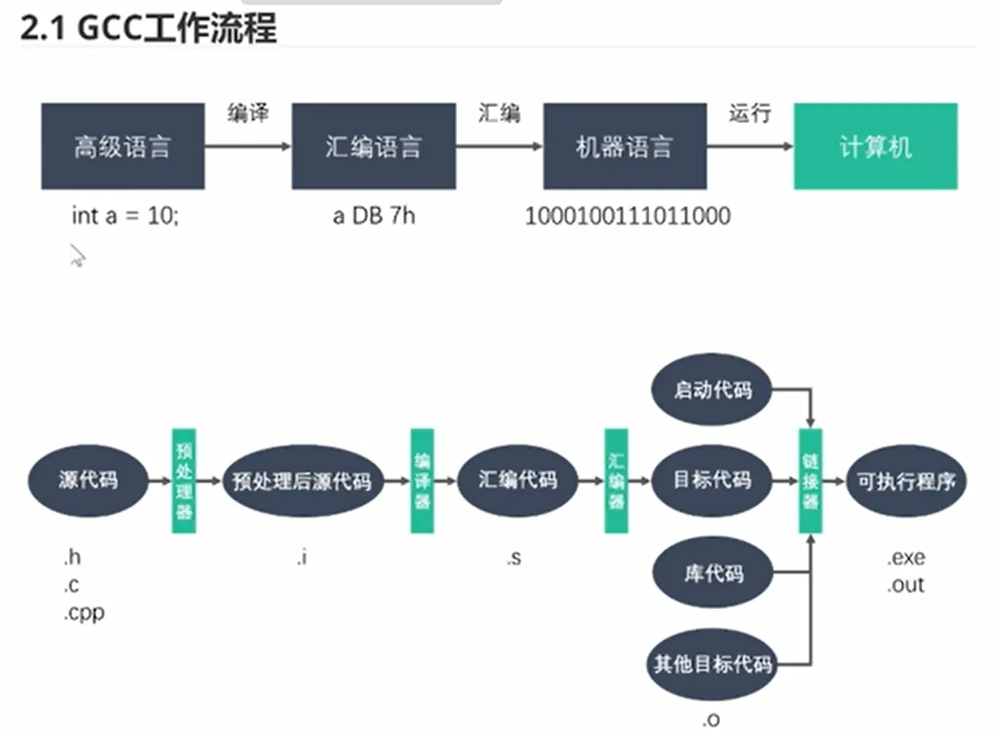
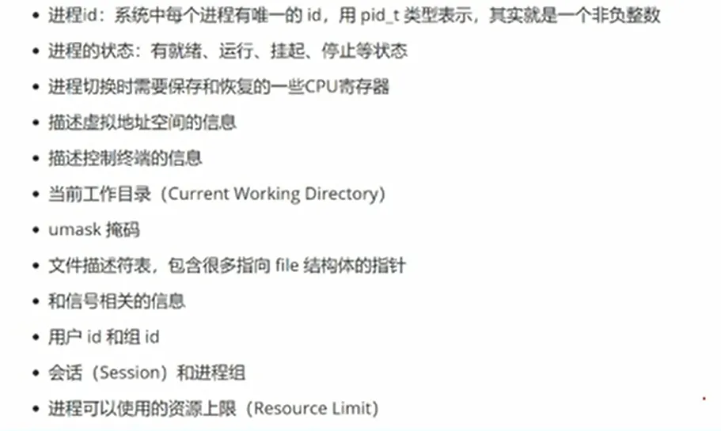
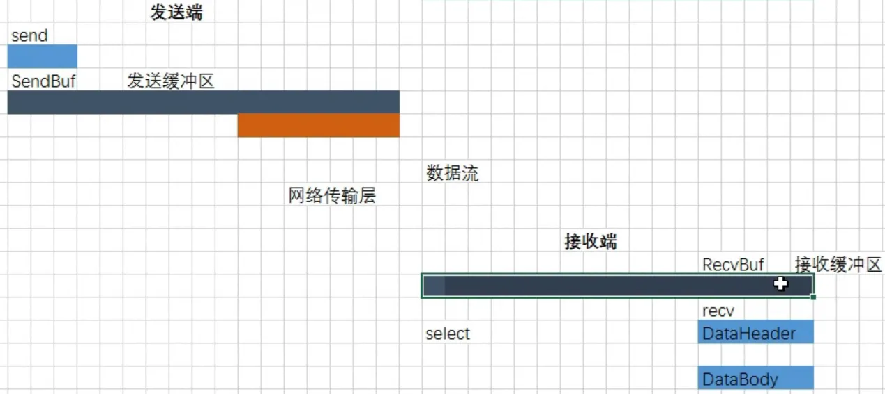
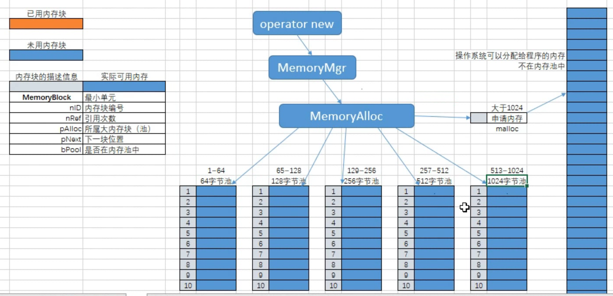
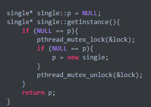
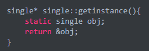
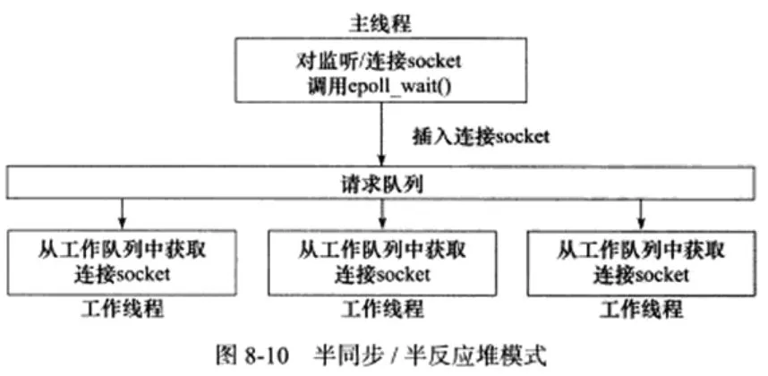
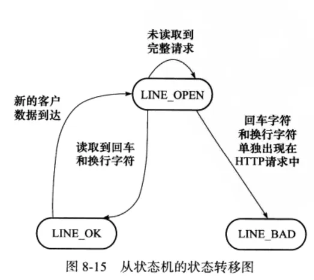
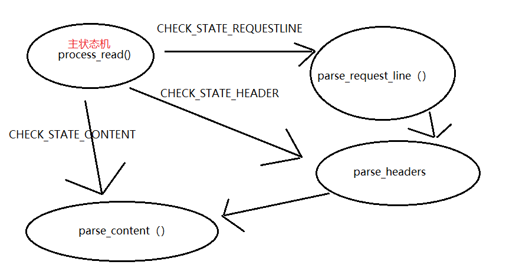
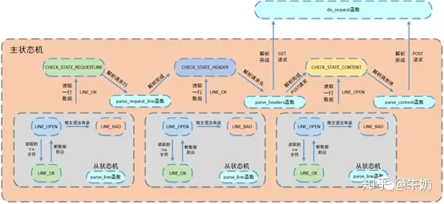

板凳精神

[C++ webserver服务器项目相关知识点总结 - 知乎 (zhihu.com)](https://zhuanlan.zhihu.com/p/497215631)

## GCC工作流程



## PCB里面有什么



## 同步、异步、阻塞、非阻塞

同步：例如read，用户自己会将数据从内核缓冲区读到用户缓冲区，即：自己将数据处理完成后再往下执行。

异步：内核会帮助用户将数据从内核缓冲区拷贝到用户缓冲区，用户不需要等待，可以去做别的事情，内核拷贝完成后通知用户即可。

阻塞：read文件描述符没有数据时等待。

非阻塞：read没有数据时不需要等待，而且没有数据可读时返回-1和error=EAGAIN信号。


## 解决粘包问题




发送端有发生缓冲区，接收端有接收缓冲区

接收端接收数据时，尽可能多的将接收到的数据放到本地缓冲区中，而不是让数据存在操作系统的缓冲区中，以防止网络阻塞。

## 拆包

在本地定义一个消息体，将本地缓冲区中接收到的数据分批放入消息体中。

将需要的消息体取出来以后，本地缓冲区中未处理的数据前移，同时更新尾指针（偏移指针）

## 注意事项

服务器在存储客户节点时，要new在堆开辟空间，因为栈空间很小，当每个客户的消息体较大时会出现栈溢出（栈空间大小一般为1~2M）

要用指针（new）数组存储客户对象

## c++计时

CELLTimestamp tTime;

cTime.getElapsedTimeInMilliSec();

频繁的加、解锁会增加时间消耗

## 性能分析

## 内存管理

new，delete组合使用

避免内存碎片

建立内存池，提前申请足够大小的内存，程序自己管理

建立对象池，减少对象创建与释放的消耗

智能指针，保证创建的对象正常释放

### 内存管理器

根据需求大小分配特定的内存池



**内存池设计-高效**

内存池需要对每一个链表做字典映射，在需要内存的时候找到对应的链表取出数据，如果链表比较多的情况下，速度会下降很多。

采用映射机制，无需查找，可以直接定位到该内存链表。


创建***单例模式\***的内存管理工具，在全局使用时只需要创建一个对象即可

申请内存时超出自定义范围，直接向操作系统申请，标记为不在内存池中

注意内存块的大小，字节对齐方式

## 内存管理总结

●做好内存管理:

避免内存碎片的产生，使程序长期稳定、高效的运行。由于多线程加锁，性能下降了，但稳定性提高了

***●1.内存池\***

从系统中申请足够大小的内存，由程序自己管理。

***●2.对象池（slab算法）\***

创建足够多的对象，减少创建释放对象的消耗

***●3.智能指针\***

保证被创建的对象，正确的释放，减少错误使用指针的风险

### 改进点

加入日志，例如：服务器运行一周，记录瓶颈，时间点，最大申请了多少内存

优点：可以分析内存泄漏，那些地方使用内存了，或使用完后没有释放，可以记录内存地址，id等

主要针对长久运行的服务器

## webserver

### 新增功能：内存管理（内存池+对象池）

**特点：**

不会提升收发能力，但使程序稳定，防止产生内存碎片

超过100k的空间直接向系统申请

映射数组可以换成map

大对象使用对象池

将普通的new delete换成智能指针shared_ptr，会增加性能消耗

多线程中在 ***申请和释放\*** 之前要加锁，此处使用了lock_guard<mutex>lock(_mutex)

### 内存池

- **重载**

1. new，delete，new[]，delete[]运算符

- **建立内存块单元class，包括：**

1. 内存块id，
2. 引用次数，
3. 是否在内存池中，
4. 下一个内存块地址，
5. 属于哪一个内存池。

- **建立内存池clsss，包括：**

1. 初始化内存池（使用内存池映射数组），
2. 申请内存（根据自定义数值申请池内的还是池外的，实际申请的内存地址向后偏移，偏移一个内存块头部长度），
3. 释放内存（释放之前判断是否还在用，链表头插法）。
4. 每个内存池在使用之前要初始化一次，初始化过程中要注意实际的内存块大小（申请空间 + 内存块头部空间），在初始化完毕后将最后一个内存块的下一个地址置为nullptr，防止野指针（经历：第一次写的时候没注意野指针，当内存块用完了后一直报指针异常，因为要对id，ref等赋值，此处报错，单步调试完后才发现bug）。

- **建立内存池管理工具class，使用单例模式创建内存管理对象，因为没有必要创建多个工具对象，可以根据内存池映射数组定位到具体的哪一个内存池，所以一个足以。包括：**

1. 申请内存（将内存池class再次封装了一下，申请过大时直接向操作系统申请）。
2. 释放内存（释放过程中要注意地址偏移，向前偏移一个内存块的头部长度）。
3. 检查剩余内存块，内存块整理（通过判断该内存块是否被引用来整理）。

- **项目中大多数使用了64和128字节的内存池，256的较少。**

### 对象池（直接作为当前类的基类即可，增加了扩展性）

- **重载**

1. new，delete运算符，
2. 第一次没重载，程序没按自己的要求执行，找了半天bug。

- **建立对象节点class，包括：**

1. 对象块id，
2. 引用次数，
3. 是否在对象池中，
4. 下一个对象块的地址。

- **使用模板建立对象池class（属性：对象类型，当前对象池需要的对象块数量），包括：**

1. 初始化对象池（根据类模板传入参数初始化对象池，单个对象所需要的实际大小 = 类占用空间 + 对象块头部占用空间。
2. 申请对象池总空间时优先使用自定义new和new[]，便于更好的内存管理），
3. 释放对象块（放回到对象池中）。

- **使用模板建立对象池管理器class（属性：哪个类，池的大小）**

1. 单例模式初始化每个池的管理工具。

- **项目中将webserver，log，sql，设置为容量为1的对象池，因为只需要一个。主要用于接收客户端连接，每一个客户端作为一个类对象进入到对象池中，对象块个数：65536。**

## **时间轮**

解决定时器优先级问题，优先级越高的越先触发。

处理定时器任务的时间顺序：nginx采用红黑树，go、libevent、libev采用最小堆。不适用于大量任务。

处理定时器任务的执行顺序：kafka、netty、skynet、linux内核中的crontab采用时间轮。

数据结构：数组+取余

### 设计方案

**参数：**

- 最小时间间隔：1ms
- 轮子1的大小：2^8 = 256
- 轮子2~5的大小：2^6 = 64

**实现：**

- 所有的轮子和任务队列实现方式：双向循环链表。

**定时器链表包含：**

- 当前时刻下的任务队列
- 当前定时器的定时时间
- 每个任务的回调函数，参数

**时间轮链表包含：**

- 5个轮子由链表串起来
- 轮子大小
- 时间点的索引号

**定时器管理：**

- 5个时间轮集合
- 初始时间
- 就绪任务列表

### **功能：**

**检查，更新时间轮**

获取当前时间（秒级），轮询任务的次数 = 当前时刻 - 上一个时间的更新点，每一次检查完成后更新上一个时间点。

取出当前轮子每个时刻的任务队列，判断是否有任务，如果有，则加入到就绪队列中。

当前轮子遍历完成时，寻找下一个轮子。

第一个轮子寻找就绪任务时直接添加。

从第二个轮子开始，如果定时时间没到的话，重新规划定时时间，这样可以把后面几个轮子中的任务全部更新到第一个轮子中。

**添加定时器任务**

设定延时时间 = 当前时间 + 延时时长

以每个轮子大小为时间节点，将定时任务添加到相应的时间节点处的任务队列中（采用移位操作，加强运算速度，尾插法）。

**添加就绪的定时器任务**

尾插法，添加到就绪队列中。

**删除定时器**


**寻找下一个轮子**

目的为了将后面的4个轮子中的任务重新添加到第一个轮子中。如果检测到任务的定时时间已到，则添加到就绪列表中，否则更新定时任务。

**执行到期任务**

遍历就绪队列，执行相应的定时器任务。

## web服务器细节总结

### 异步写日志

**初始化：**

日志文件名称为：当前时间，以避免重复。

方式：创建线程异步写日志函数，先将日志写入日志队列中，然后写线程从队列中取出一条日志写入到文件中。

生产者消费者模型+阻塞队列（循环数组，800字节大小），使用条件变量（提供了一种线程间的通知机制）实现同步机制。

存储的日志大小上限值：2000字节，超过此值时进行一次写操作。

每个日志的最大行数：10000行，超过时，新建文件写入

日志等级：调试信息LOG_DEBUG()，输出信息LOG_INFO()，警告信息LOG_WARN()，错误信息LOG_ERROR()，致命错误消息LOG_FATAL()

### 遇到的问题

单例模式应该返回对象的地址，

线程安全的单例模式，双检测机制不能保证安全性。



可以使用muduo库中的***pthread_once\***函数使用pthread_once_t保证懒汉模式的线程安全。

C++11标准以后，要求编译器保证内部***静态变量\***的线程安全性。



## 数据库（存储用户名+密码）

数据库类：单例模式

默认初始化8条数据库连接。

数据库的连接的创建与销毁使用***RAII\***机制，将数据库连接的获取与释放通过RAII机制封装，避免手动释放，将资源或状态与对象的生命周期绑定，实现安全管理。

## 线程池

创建线程：16个线程。

***线程分离\***（不会产生僵尸线程，一个可分离的线程是不可以被其他线程回收资源或者杀死的，他的存储器资源在他终止的时候可以由系统自动释放，原因：为了在使用线程的时候，避免线程的资源得不到正确的释放，从而导致了内存泄漏的问题。所以要确保线程为可分离的的状态，否则要进行线程等待已回收他的资源pthread_join()）。

***---封装了半同步/半反应堆（Reactor）并发模式的线程池类，使用互斥锁完成对线程池的各种操作---\***



***这样做的好处：通用性较高，因为使用一个工作队列完全解除了主线程和工作线程的耦合关系，主线程往工作队列中插入任务，工作线程从队列中取出任务并执行。\***

## 事件处理模式

服务器通常处理3类事件：***I/O事件，信号，定时器\***，两种高效的事件处理模式：Reactor、Proactor。

项目使用了Reactor，WebServer类中的dealWithRead() / delWithWrite()主线程负责监听文件描述符上是否有读/写事件产生，工作线程负责读写数据，接受新连接，业务处理。

proactor：主线程负责接受新连接、数据读写操作，工作线程负责业务逻辑（处理客户请求）。

### **项目中的业务处理包括：**

1.读取客户端发送的数据：利用主从状态机模式，***主状态机\***解析报文数据（正在分析请求行***CHECK_STATE_REQUESTLINE\***，正在分析请求头***CHECK_STATE_HEADER\***，正在分析请求内容***CHECK_STATE_CONTENT\***），***从状态机\***判断数据行的完整性（读取到完整行***LINE_OK\***，行出错***LINE_BAD\***，行数据不完整***LINE_OPEN\***）。switch模拟状态机。读完数据后向客户端回写状态：1xx, 2xx, 3xx, 4xx, 5xx。



从状态机负责读取报文的一行，主状态机负责对该行数据进行解析，主状态机内部调用从状态机，从状态机驱动主状态机。



2.向客户端写数据：例如发送文件，使用***writev\***，以顺序iov[0]，iov[1]至iov[iovcnt-1]从缓冲区中聚集输出数据。项目中，申请了2个iov，其中***iov[0]为存储报文状态行的缓冲区，iov[1]指向资源文件指针\***。当报文消息报头较小时，第一次传输后，需要更新m_iv[1].iov_base = 0，iov_len，m_iv[0].iov_len = 0，只传输文件，不用传输响应消息头。每次传输后都要更新下次传输的文件起始位置和长度。

## **LT模式与ET模式**

epoll对文件描述符的操作有两种模式：LT水平触发和ET边缘。其中，ET模式是epoll的高效工作模式。

- 采用LT工作模式时，当epoll_wait检测到其上有事件发生并将此事件通知应用程序后，***应用程序可以不立即处理该事件\***。这样，当应用程序下一次调用epoll_wait时，epoll还会再次向应用程序通知此事件，直到该事件被处理完毕。
- 采用ET模式时，当epoll_wait检测到其上有事件发生并将此事件通知应用程序后，***应用程序必须立即处理该事件\***，因为后续的epoll_wait调用将不再向应用程序通知这一事件。

因此，ET模式在很大程度上降低了同一个epoll事件被重复触发的次数，故效率要比LT模式高。

sockfd文件描述符设置为非阻塞模式。

## 面试问题总结

### 文件传输问题

**知识：**结构体***struct iovec\***结构体定义了一个向量元素，通常这个 iovec 结构体用于一个多元素的数组，对于每一个元素，iovec 结构体的字段 ***iov_base\*** 指向一个缓冲区，这个缓冲区存放的是网络接收的数据（read），或者网络将要发送的数据（write）。iovec 结构体的字段 ***iov_len\*** 存放的是接收数据的最大长度（read），或者实际写入的数据长度（write）。**readv和writev函数用于在一次函数调用中读、写多个非连续缓冲区，**称之为***散布读和聚集写\***，writev以顺序iov[0]，iov[1]至iov[iovcnt-1]从缓冲区中聚集输出数据。

**问题：**项目中使用writev向客服端发送数据，定位到writev的iovec结构体成员有问题，每次传输后不会自动偏移文件指针*iov_base* 和传输长度*iov_len* ，还会按照原有指针和原有长度发送数据。

**修改：**

1.对于大文件传输：第一次传输完成时，报文头发送长度置成0，只传输文件，不用传输响应消息头。每次传输后都要更新下次传输的文件起始位置和长度，***起始位置的更新为：\***文件起始地址+已经发送的字节数，***文件长度更新为：\***下一次准备发送的的字节数。

2.没有大文件传输时：更新发送报文头偏移地址和发送长度。

## **线程池相关**

### 手写线程池

### 线程的同步机制有哪些？

***临界区：\***临界区指的是一个访问共用资源（例如：共用设备或是共用存储器）的程序片段，而这些共用资源又无法同时被多个线程访问的特性。***当有线程进入临界区段时，其他线程或是进程必须等待\***（例如：bounded waiting 等待法），有一些同步的机制必须在临界区段的进入点与离开点实现，以确保这些共用资源是被互斥获得使用。通过对多线程的串行化来访问公共资源或者一段代码，速度快，适合控制数据访问。

***互斥量：\***为协调对一个共享资源的单独访问而设计，只有拥有互斥量的线程才有权限访问系统的公共资源，因为互斥量只有一个，所以能保证资源不会同时被多个线程访问。互斥不仅能实现同一应用程序的公共资源的访问，还能实现不同应用程序公共资源的安全共享。

***信号量：\***为控制一个具有有限数量的用户资源而设计。它允许多个线程在同一时刻去访问同一个资源，但一般需要限制同一时刻访问此资源的最大线程数目。

***事件：\***用来通知线程有一些事件已经发生，从而启动后续任务的开始。

项目中使用***队列和锁\***实现。多个线程访问同一个对象，并且某些线程还想修改这个对象，这时需要线程同步。

### 线程池中的工作线程是一直等待吗？

为了能够处理高并发的问题，工作线程设置为阻塞等待在请求队列是否不为空的条件上，***线程池中的工作线程是处于一直阻塞等待的模式下的\***。在创建线程池时，通过循环调用pthread_create往线程池中创建了8个工作线程，工作线程处理函数接口为pthread_create函数原型中第三个参数函数指针所指向的worker函数（自定义的函数），然后调用线程池类成员函数run（自定义）。

### 你的线程池工作线程处理完一个任务后的状态是什么？

**分两种情况考虑**

（1） 当处理完任务后如果请求队列为空时，这个线程重新回到阻塞等待的状态。

（2） 当处理完任务后如果请求队列不为空时，这个线程将处于与其他线程竞争资源的状态，谁获得锁谁就获得了处理事件的资格。

### 如果同时1000个客户端进行访问请求，线程数不多，怎么能及时响应处理每一个呢？

### *one loop pre thread*

首先这种问法就相当于问服务器如何处理高并发的问题，本项目中是通过对子线程循环调用来解决高并发的问题的。

**具体实现过程如下：**

在创建线程的同时调用pthread_detach将线程进行分离，这样就不用单独对工作线程进行回收，但是一般情况只要设置了分离属性，这个线程在处理完任务后，也就是子线程结束后，资源会被自动回收。这种情况下服务器基本就只能处理8个请求事件了（线程池里只有8个线程）。那怎么实现高并发的请求呢？可能会说让线程池里创建足够多的线程数，这当然是理想化的，现实中线程数量过大会导致更多的线程上下文切换，占用更多内存，这显然是不合理的。

**接下来所叙述的就是本项目中用来处理高并发问题的方法了：**

我们知道调用了pthread_detach的线程只有等到他结束时系统才会回收他的资源，那么我们就可以从这里下手了。***我们通过子线程的run调用函数进行while循环，让每一个线程池中的线程永远都不会终止，说白了就是让他处理完当前任务就去处理下一个，没有任务就一直阻塞在那里等待。\***这样就能达到服务器高并发的要求，同一时刻8个线程都在处理请求任务，处理完之后接着处理，**直到请求队列为空表示任务全部处理完成。**

### 如果一个客户请求需要占用线程很久的时间，会不会影响接下来的客户请求呢，有什么好的策略呢?

会影响接下来的客户请求，因为线程池内线程的数量时有限的，如果客户请求占用线程时间过久的话会影响到处理请求的效率，当请求处理过慢时会造成后续接受的请求只能在请求队列中等待被处理，从而影响接下来的客户请求。

**应对策略（定时器）：**

可以为线程处理请求对象设置处理***超时时间\***, 超过时间先发送信号告知线程处理超时，然后设定一个时间间隔再次检测，若此时这个请求还占用线程则直接将其断开连接。

## **并发模型相关**

### 简单说一下服务器使用的并发模型？

**（1）半同步/半异步模式（异步接收数据，同步处理数据）**

这里的同步异步是：按顺序依次执行程序就是同步，当程序的执行是由信号，中断等驱动执行，则为异步。

***半异步：\***异步处理I/O事件，就是客户端向服务器端的请求的接收，是通过异步线程进行处理的，来请求触发处理，将请求插入到请求队列中，使用***Round Robin算法\***轮流选取工作线程来处理请求对象。

***半同步：\***是指同步处理请求数据，异步线程接收完请求之后会封装一下插入队列，工作线程就依次同步从队列中取出请求对象进行处理。

***半同步/半反应堆：\***它是半同步/半异步模式的变体，它核心在于，主线程充当异步线程，只负责监听客户端请求以及向内核注册读写事件，这和前面的***Reactor\***（反应堆）事件处理模型类似，所以这样称呼。

它的进阶就是使用模拟的proactor事件模型，主线程除了监听，还负责了数据的读写。

但是！上面这种半反应堆模式的一个问题就是，因为有了请求队列，每次工作线程处理队列请求都需要加锁，白白消耗CPU；另一方面如果任务很多，工作线程很少，就会造成客户端响应速度变慢。

***高效的半同步/半异步模式：解决办法就是取消任务队列\***，直接由主线程将各个客户端请求派发给各个工作线程，后期每个工作线程都持续响应同一个请求带来的读写。

**（2）领导者/追随者模式（一个领导者，一群追随者）**

任意时间点，仅有一个领导者线程监听，其它线程都是追随者，监听到请求后，领导者线程首先选出新的领导者，再处理请求，然后循环往复。如果没有新的领导者，处理完事件可以重新变成领导者。

分为三部分：

\1. 句柄集：负责监听I/O事件，并把事件报告给领导者线程，每一个句柄相当于一个文件描述符。

\2. 线程集：所工作线程的管理者，保证其中的线程每一时间都处于领导者、processing、追随者三者之一。

\3. 事件处理器和具体的事件处理器：里面包含回调函数。具体的事件处理器可以重写回调函数。

### reactor、proactor、主从reactor模型的区别？

对应《Linux高性能服务器编程》P127 – P130

***Reactor：\***

***主线程往epoll内核上注册socket读事件EPOLLIN***，***主线程调用epoll_wait等待socket上有数据可读***，当socket上有数据可读的时候，主线程把socket可读事件放入请求队列。睡眠在请求队列上的某个工作线程被唤醒，处理客户请求，***然后往epoll内核上注册socket写请求事件EPOLLOUT***。***主线程调用epoll_wait等待写请求事件***，当有事件可写的时候，主线程把socket可写事件放入请求队列。睡眠在请求队列上的工作线程被唤醒，处理客户请求。

***Proactor:\***

***主线程调用aio_read函数向内核注册socket上的读完成事件，并告诉内核用户读缓冲区的位置\***，以及读完成后如何通知应用程序，主线程继续处理其他逻辑，当socket上的数据被读入用户缓冲区后，通过信号告知应用程序数据已经可以使用。应用程序预先定义好的信号处理函数选择一个工作线程来处理客户请求。工作线程处理完客户请求之后调用aio_write函数向内核注册socket写完成事件，并告诉内核写缓冲区的位置，以及写完成时如何通知应用程序。主线程处理其他逻辑。当用户缓存区的数据被写入socket之后内核向应用程序发送一个信号，以通知应用程序数据已经发送完毕。应用程序预先定义的数据处理函数就会完成工作。

***reactor模式：\***同步阻塞I/O模式，注册对应读写事件处理器，等待事件发生进而调用事件处理器处理事件。 ***proactor模式：\***异步I/O模式。

***Reactor和Proactor模式的主要区别就是真正的读取和写入操作是有谁来完成的\***，Reactor中需要应用程序自己读取或者写入数据，Proactor模式中，应用程序不需要进行实际读写过程。

***Reactor：\***非阻塞同步网络模型，可以理解为：来了事件我通知你，你来处理

***Proactor：\***异步网络模型，可以理解为：来了事件我来处理，处理完了我通知你。

理论上：***Proactor比Reactor效率要高一些。\***

**模拟Proactor模式**

使用同步I/O方式模拟出Proactor模式的原理是：***主线程执行数据读写操作，读写完成之后，主线程向工作线程通知这一“完成事件”。\***那么从工作线程的角度来看，它们就直接获得了数据读写的结果，接下来要做的只是对读写的结果进行逻辑处理。

**使用同步I/O模型（仍以epoll_wait为例）模拟出Proactor模式的工作流程如下：**

1. 主线程往epoll内核事件表中***注册socket上的读就绪事件***。
2. 主线程调用epoll_wait等待socket上有数据可读。
3. 当socket上有数据可读时，epoll_wait 通知主线程。主线程从socket循环读取数据，直到没有更多数据可读，然后将读取到的数据封装成一个请求对象并插入请求队列。
4. 睡眠在请求队列上的某个工作线程被唤醒，它获得请求对象并处理客户请求，然后往epoll内核事件表中***注册socket上的写就绪事件。***
5. 当socket可写时，epoll_wait通知主线程。主线程往socket上写入服务器处理客户请求的结果。

**下面是重点：**

读就绪事件：当有事件到来，epoll_wait()单纯通知主线程有事件来了，主线程把事件放入请求队列。应用程序利用工作线程通过read()等函数把数据从内核缓冲区读到用户缓冲区。

读完成事件：有事件来了，***主线程往内核注册这个读事件\***（就是告诉内核注意了一会要读数据）。注册了之后，主线程就去干其他事情，内核就自动会负责将数据从内核缓冲区放到用户缓冲区。不用用户程序管。

而对于用reactor模式模拟的proactor模式来说，之前proactor是用主线程调用***aio_read\***函数向内核注册读事件，这里它主线程使用epoll向内核注册读事件。但是这里内核不会负责将数据从内核读到用户缓冲区，最后还是要靠主线程也就是用户程序***read()\***函数等负责将内核数据循环读到用户缓冲区。对于工作线程来说，收到的都是已读完成的数据，模拟就体现在这里。

**有人可能会问**

他们都是通过主线程调用不同函数进行注册，然后一个注册之后可以直接内核负责数据从内核到用户。另一个注册之后好像没啥用，那注册还有什么用？直接主线程循环读取然后封装放请求队列不就行了么？

不对，如果数据一直没来，直接进行循环读取就会持续在这里发生阻塞，这就是同步IO的特点，所以一定要注册一下然后等通知，这样就可以避免长期阻塞等候数据。

### **什么是ET（边缘触发）、LT（水平触发）？ET、LT优缺点？**

**ET模式**

缺点：应用层业务逻辑复杂，容易遗漏事件，很难用好。

优点：相对LT模式效率比较高。一触发立即处理事件。

**LT模式：**

优点：编程更符合用户直觉，业务层逻辑更简单。

缺点：效率比ET低。

**什么时候用ET，什么时候用LT？**

***LT适用于并发量小的情况，ET适用于并发量大的情况。\***ET在通知用户之后，就会将fd从就绪链表中删除，而LT不会，它会一直保留，这就会导致随着fd增多，就绪链表越大，每次都要从头开始遍历找到对应的fd，所以并发量越大效率越低。ET因为会删除所以效率比较高。

**怎么解决LT的缺点？**

LT模式下，可写状态的fd会一直触发事件，该怎么处理这个问题

方法1：每次要写数据时，将fd绑定EPOLLOUT事件，写完后将fd同EPOLLOUT从epoll中移除。

方法2：方法1中每次写数据都要操作epoll。如果数据量很少，socket很容易将数据发送出去。可以考虑改成：数据量很少时直接send，数据量很多时在采用方法1。

**触发LT模式后，读一次还是循环读？**

读一次。

**为什么ET模式下一定要设置非阻塞？**

因为***ET模式下是无限循环读\***，直到出现错误为***EAGAIN\***或者***EWOULDBLOCK\***，这两个错误表示socket为空，不用再读了，然后就停止循环了，如果是阻塞，循环读在socket为空的时候就会阻塞到那里，主线程的read()函数一旦阻塞，当再有其他监听事件过来就没办法读了，给其他事情造成了影响，所以必须要设置为非阻塞。

参考链接：

[epoll的LT和ETwww.jianshu.com/p/d3442ff24ba6](https://link.zhihu.com/?target=https%3A//www.jianshu.com/p/d3442ff24ba6)

## 你用了epoll，说一下为什么用epoll，还有其他复用方式吗？区别是什么？

对于***select和poll\***，所有文件描述符都是在用户态被加入其文件描述符集合的，***每次调用都需要将整个集合拷贝到内核态\***；***epoll则将整个文件描述符集合维护在内核态\***，每次添加文件描述符的时候都需要执行一个***系统调用\***。系统调用的开销是很大的，而且在有很多短期活跃连接的情况下，epoll可能会慢于select和poll由于这些大量的系统调用开销。

***select\***使用***线性表\***描述文件描述符集合，文件描述符有上限；***poll\***使用***链表\***来描述；***epoll\***底层通过***红黑树\***来描述，并且维护一个***ready list\***，将事件表中已经就绪的事件添加到这里，在使用epoll_wait调用时，仅观察这个list中有没有数据即可。

select和poll的最大开销来自内核判断是否有文件描述符就绪这一过程：每次执行select或poll调用时，它们会采用遍历的方式，***遍历整个文件描述符集合\***去判断各个文件描述符是否有活动；epoll则不需要去以这种方式检查，当有活动产生时，会自动***触发epoll回调函数通知epoll文件描述符\***，然后内核将这些就绪的文件描述符放到之前提到的ready list中等待epoll_wait调用后被处理。

select和poll都只能工作在相对低效的LT模式下，而epoll同时支持LT和ET模式。

***综上，当监测的fd数量较小，且各个fd都很活跃的情况下，建议使用select和poll；当监听的fd数量较多，且单位时间仅部分fd活跃的情况下，使用epoll会明显提升性能。\***

***epoll最大的优点就是\***，当出现满足条件的事件时，直接返回的是一个个满足条件结构体保存在结构体数组中，不需要像select和poll那样还需要循环依次判断每个是否满足时间发生条件，或者说不需要专门的数组去记录满足的事件。epoll最适合链接的很多，但是使用的很少的场景高并发低低传输的场景。另外epoll也可以突破最大文件上限。

缺点是：不能够跨平台。

而select业务逻辑复杂，需要自己去循环判断是否满足事件，而且不能突破最大文件上限。但优点就是可以跨平台所以保留了下来。

poll在select的基础上进行了改进，将添加事件和满足事件两者分离开来，并且可以突破最大上限。但是仍然需要自己判断或者添加数组，业务逻辑复杂。

参考公众号：

[select、poll、epoll对比huixxi.github.io/2020/06/02/%E5%B0%8F%E7%99%BD%E8%A7%86%E8%A7%92%EF%BC%9A%E4%B8%80%E6%96%87%E8%AF%BB%E6%87%82%E7%A4%BE%E9%95%BF%E7%9A%84TinyWebServer/#more](https://link.zhihu.com/?target=https%3A//huixxi.github.io/2020/06/02/%E5%B0%8F%E7%99%BD%E8%A7%86%E8%A7%92%EF%BC%9A%E4%B8%80%E6%96%87%E8%AF%BB%E6%87%82%E7%A4%BE%E9%95%BF%E7%9A%84TinyWebServer/%23more)

## **HTTP报文解析相关**

### 用了状态机啊，为什么要用状态机？

因为传统应用程序的控制流程基本是**按顺序执行**的：遵循事先设定的逻辑，从头到尾地执行。简单来说如果想在不同状态下实现代码跳转时，就需要破坏一些代码，这样就会造成代码逻辑混乱，代码显得十分复杂。所以我们必须采取不同的技术来处理这些情况。**它能处理任何顺序的事件，并能提供有意义的响应——即使这些事件发生的顺序和预计的不同**，有限状态机正是为了满足这方面的要求而设计的。每个状态都有一系列的转移，每个转移与输入和另一状态相关。当输入进来，如果它与当前状态的某个转移相匹配，机器转换为所指的状态，然后执行相应的代码。

### 状态机的转移图画一下



### https协议为什么安全？

***https=http+TLS(安全套接字层)/SSL(传输安全层)\***

TLS/SSL协议位于应用层协议和TCP之间，构建在TCP之上，由TCP协议保证数据传输版的可靠性，任何数据到权达TCP之前，都经过TLS/SSL协议处理。

https是加密传输协议，可以保障客户端到服务器端的传输数据安全。用户通过http协议访问网站时，浏览器和服务器之间是明文传输，这就意味着用户填写的密码、帐号、交易记录等机密信息都是明文，随时可能被泄露、窃取、篡改，被第三者加以利用。安装***SSL证书\***后，使用https加密协议访问网站，可**激活客户端浏览器到网站服务器之间的"SSL加密通道"**（SSL协议），实现高强度双向加密传输，防止传输数据被泄露或篡改。

### https的ssl连接过程

1.客户端提交https请求

\2. 服务器响应客户，并把证书公钥发给客户端

\3. 客户端验证证书公钥的有效性

\4. 有效后，会生成一个会话密钥

\5. 用证书公钥加密这个会话密钥后，发送给服务器

\6. 服务器收到公钥加密的会话密钥后，用私钥解密，回去会话密钥

\7. 客户端与服务器双方利用这个会话密钥加密要传输的数据进行通信

### GET和POST的区别


## **数据库登录注册相关**

### 登录说一下？

参考公众号

[最新版Web服务器项目详解 - 12 注册登录mp.weixin.qq.com/s?__biz=MzAxNzU2MzcwMw==&mid=2649274431&idx=4&sn=7595a70f06a79cb7abaebcd939e0cbee&chksm=83ffb167b4883871ce110aeb23e04acf835ef41016517247263a2c3ab6f8e615607858127ea6&token=1686112912&lang=zh_CN#rd](https://link.zhihu.com/?target=https%3A//mp.weixin.qq.com/s%3F__biz%3DMzAxNzU2MzcwMw%3D%3D%26mid%3D2649274431%26idx%3D4%26sn%3D7595a70f06a79cb7abaebcd939e0cbee%26chksm%3D83ffb167b4883871ce110aeb23e04acf835ef41016517247263a2c3ab6f8e615607858127ea6%26token%3D1686112912%26lang%3Dzh_CN%23rd)


数据库登录分为：***1.载入数据表，2.提取用户名和密码 ，3.注册和登录校验 ，4.页面跳转\***

1.载入数据表就是把数据库的数据通过map容器传到服务器上。

2.当从浏览器上输入用户的用户名和密码后，浏览器会一个post请求报文，服务器通过解析请求报文的消息体，解析出账号密码。

3.根据解析出的账号密码，与map容器中保存账号密码进行对比校验，相符则成功登陆。注册账号时，同样将输入的账号密码与数据库已经存储的账号名进行对比校验，防止出现相同的账号名。如果不相同就加入数据库。

4.当输入的账号密码与数据库的数据成功匹配，就将浏览器跳转到对应的界面。

### 你这个保存状态了吗？如果要保存，你会怎么做？（cookie和session）

***Cookie\***实际上是一小段的文本信息。客户端请求服务器，如果服务器需要记录该用户状态，就使用response向客户端浏览器颁发一个Cookie。客户端浏览器会把Cookie保存起来。当浏览器再请求该网站时，浏览器把请求的网址连同该Cookie一同提交给服务器。服务器检查该Cookie，以此来辨认用户状态。服务器还可以根据需要修改Cookie的内容。

***Session\***是另一种记录客户状态的机制，不同的是***Cookie保存在客户端浏览器中，而Session保存在服务器上\***。客户端浏览器访问服务器的时候，服务器把客户端信息以某种形式记录在服务器上。这就是Session。客户端浏览器再次访问时只需要从该Session中查找该客户的状态就可以了。

如果说**Cookie机制是通过检查客户身上的“通行证”来确定客户身份的话，那么Session机制就是通过检查服务器上的“客户明细表”来确认客户身份。Session相当于程序在服务器上建立的一份客户档案，客户来访的时候只需要查询客户档案表就可以了。**

session会话机制是一种服务器端机制，它使用类似于哈希表（可能还有哈希表）的结构来保存信息。
cookies会话机制：cookie是服务器存储在本地计算机上的小块文本，并随每个请求发送到同一服务器。 Web服务器使用HTTP标头将cookie发送到客户端。在客户端终端，浏览器解析cookie并将其保存为本地文件，该文件自动将来自同一服务器的任何请求绑定到这些cookie。

**cookie和session的对比**

*Cookie session*

*浏览器 服务器*

*不安全 安全*

*不占用服务器，性能高 占用服务器，性能低*

*存储空间小 存储空间大*

*哈希表结构存储信息 本地计算机上的小块文件*

### 登录中的用户名和密码你是load到本地，然后使用map匹配的，如果有10亿数据，即使load到本地后hash，也是很耗时的，你要怎么优化？

***1.数据结构的优化：\***为了保证数据库的一致性和完整性，在逻辑设计的时候往往会设计过多的表间关联，尽可能的降低数据的冗余。

***2.数据查询的优化\***：保证在实现功能的基础上，尽量减少对数据库的访问次数；通过搜索参数，尽量减少对表的访问行数，最小化结果集，从而减轻网络负担；能够分开的操作尽量分开处理，提高每次的响应速度；在数据窗口使用SQL时，尽量把使用的索引放在选择的首列；算法的结构尽量简单；

***3.对算法那的优化：\***尽量避免使用游标，因为游标的效率较差，如果游标操作的数据超过1万行，那么就应该考虑改写。使用基于游标的方法或临时表方法之前，应先寻找基于集的解决方案来解决问题，基于集的方法通常更有效。

***4.建立高效的索引：\***创建索引一般有以下两个目的：维护被索引列的唯一性和提供快速访问表中数据的策略。大型数据库有两种索引即簇索引和非簇索引，一个没有簇索引的表是按堆结构存储数据，所有的数据均添加在表的尾部，而建立了簇索引的表，其数据在物理上会按照簇索引键的顺序存储，一个表只允许有一个簇索引

### 用的mysql啊，redis了解吗？用过吗？

参考：

[mysql和redis的区别 - zxh_python - 博客园www.cnblogs.com/zxh1297/p/9394108.html](https://link.zhihu.com/?target=https%3A//www.cnblogs.com/zxh1297/p/9394108.html)

**1.mysql和redis的数据库类型**

mysql是关***系型数据库\***，主要用于存放持久化数据，将数据存储在硬盘中，读取速度较慢。

redis是NOSQL，即***非关系型数据库\***，也是***缓存数据库\***，即将数据存储在缓存中，缓存的读取速度快，能够大大的提高运行效率，但是保存时间有限。

**2.mysql的运行机制**

mysql作为持久化存储的关系型数据库，相对薄弱的地方在于每次请求访问数据库时，都存在着I/O操作，如果反复频繁的访问数据库。第一：会在反复链接数据库上花费大量时间，从而导致运行效率过慢；第二：反复的访问数据库也会导致数据库的负载过高，那么此时缓存的概念就衍生了出来。

**3.缓存**

缓存就是数据交换的缓冲区（cache），当浏览器执行请求时，首先会对在缓存中进行查找，如果存在，就获取；否则就访问数据库。缓存的好处就是读取速度快

**4.redis数据库**

redis数据库就是一款缓存数据库，用于存储使用频繁的数据，这样减少访问数据库的次数，提高运行效率。

**5.redis和mysql的区别总结**

*（1）类型上*

*从类型上来说，mysql是关系型数据库，redis是缓存数据库*

*（2）作用上*

*mysql用于持久化的存储数据到硬盘，功能强大，但是速度较慢*

*redis用于存储使用较为频繁的数据到缓存中，读取速度快*

*（3）需求上*

*mysql和redis因为需求的不同，一般都是配合使用。*

## **定时器相关**

### 为什么要用定时器？

服务器程序通常管理着众多定时事件，因此有效地组织这些定时事件，使之能在预期的时间点被触发且不影响服务器的主要逻辑，对于服务器的性能有着至关重要的影响。为此，要将每个定时事件分别封装成定时器，并使用某种容器类数据结构，比如链表、排序链表和时间轮，将所有定时器串联起来，以实现对定时事件的统一管理。

***本项目是为了方便释放那些超时的非活动连接，关闭被占用的文件描述符，才使用定时器。\***

1.1：什么是定时事件？

定时事件，是指固定一段时间之后触发某段代码，由该段代码处理一个事件。这里是删除非活动的epoll树上的注册事件，并关闭对应的socket，连接次数减一。

1.2：什么是定时器？

是指利用结构体或其他形式，**将多种定时事件进行封装起来**。这里只涉及一种定时事件，这里将该定时事件与连接资源封装为一个定时器类。具体包括连接资源、超时时间和回调函数，这里的回调函数指向定时事件。

1.3：连接资源包括什么？

连接资源包括客户端套接字地址、文件描述符和定时器

1.4：超时时间

超时时间=浏览器和服务器连接时刻 + 固定时间(TIMESLOT)，可以看出，定时器使用绝对时间作为超时值.

1.5：什么是定时器容器？

项目中的定时器容器为带头尾结点的**升序双向链表**，具体的为每个连接创建一个定时器，将其添加到链表中，并按照超时时间升序排列。

1.6：什么是定时任务？

将超时的定时器从链表中删除。

1.7:什么是定时任务处理函数？

定时任务处理函数，该函数封装在容器类中，具体的，函数遍历升序链表容器，根据超时时间，删除对应的到期的定时器，并调用回调函数（即定时事件）。

(注意：定时任务处理函数在主线程中调用)

## 说一下定时器的工作原理（*在主线程中执行*）

### 双向升序链表实现定时器

服务器主循环为每一个连接创建一个定时器，并对每个连接进行定时。另外，利用升序时间链表容器将所有定时器串联起来，若主循环接收到定时通知，则在链表中依次执行定时任务处理函数。

**怎么通知主循环？**

利用***alarm\***函数周期性地触发***SIGALRM信号\***，SIGALRM信号处理函数利用***管道\***通知主循环（注意，本项目的超时信号通过管道传输，管道的读端挂载到epoll上面，将信号对应的处理逻辑放在程序主循环中，由***主循环执行\***。）

### 删除和添加的时间复杂度说一下？还可以优化吗？

1.添加的尾节点时间复杂度为O(n)，是因为***本项目的逻辑是先从头遍历新定时器在链表的位置\***，如果位置恰好在最后，才插入在尾节点后，所以是O(n)。

2.删除的复杂度都是O(1)，因为这里的删除都是已知目标定时器在链表相应位置的删除。（看1.7可知，函数遍历升序链表容器，根据超时时间，删除对应的到期的定时器）

### **优化：**

### 1.在双向链表的基础上优化：

添加在尾节点的时间复杂度可以优化：在添加新的定时器的时候，***除了检测新定时器是否在小于头节点定时器的时间外，再检测新定时器是否在大于尾节点定时器的时间，都不符合再使用常规插入。\***

### 2.不使用双向链表，使用最小堆结构优化

本项目中时用优先级队列priority_queue实现最小堆，在主线程中轮询处理超时事件。定时器回调函数所做的工作：从epoll上删除用户文件描述符，关闭用户的文件描述符，用户数量-1。定时器使用绝对时间作为超时值，这里alarm设置为5秒，连接超时为15秒。

```cpp
//定时器节点指针
typedef shared_ptr<TimerNode> sp_timerNode;
//小根堆
priority_queue<sp_timerNode, deque<sp_timerNode>,  timerCmp> timerQueue;

//定义小根堆排序规则，按照超时时间
struct timerCmp
{
	bool operator()(shared_ptr<TimerNode>& s1, shared_ptr<TimerNode>& s2)const
	{
		return s1->getExpiredTime() > s2->getExpiredTime();
	}
};

//处理超时事件
void TimerManager::handleExpiredEvent() 
{
  while (!timerNodeQueue.empty()) 
  {
    SPTimerNode ptimer_now = timerNodeQueue.top();

    if (ptimer_now->isDeleted()) timerNodeQueue.pop();

    //并不立即删除，超时时先标记为无效状态，相当于本次删除上一次的超时连接
    else if (ptimer_now->isValid() == false) timerNodeQueue.pop();
    //else if (ptimer_now->isValid() == false) break;

    else break;
  }
}
```

### 最小堆优化，说一下时间复杂度和工作原理

**时间复杂度：**

添加：O(log(n))

删除：O(1)

***优化：\***将所有定时器中***超时时间最小的一个定时器的超时值作为alarm函数的定时值\***。这样，一旦定时任务处理函数tick()被调用，超时时间最小的定时器必然到期，我们就可以在tick 函数中处理该定时器。然后，再次从剩余的定时器中找出超时时间最小的一个（堆），***并将这段最小时间设置为下一次alarm函数的定时值\***。如此反复，就实现了较为精确的定时。

## **日志相关**

### 说下你的日志系统的运行机制？

步骤：

1：**单例模式**（局部静态变量懒汉方法）获取实例

**2：主程序一开始Log::get_instance()->init()初始化实例。初始化后：服务器启动按当前时刻创建日志（**前缀为时间，后缀为自定义log文件名，并记录创建日志的时间day和行数count）**。如果是异步**(通过是否设置队列大小判断是否异步，0为同步)**，工作线程将要写的内容放进阻塞队列，还创建了写线程用于在阻塞队列里取出一个内容(指针)，写入日志。**

3：其他功能模块调用write_log()函数写日志。（write_log：实现日志分级、分文件、按天分类，超行分类的格式化输出内容。）里面会根据异步、同步实现不同的写方式。

**问题1.1：阻塞队列是什么？**

本项目将生产者-消费者模型封装为阻塞队列，使用循环数组实现队列，作为两者共享的缓冲区。

### 为什么要异步？和同步的区别是什么？

因为同步日志的，日志写入函数与工作线程串行执行，由于涉及到I/O操作，***在单条日志比较大的时候，同步模式会阻塞整个处理流程，服务器所能处理的并发能力将有所下降，\***尤其是在峰值的时候，写日志可能成为系统的瓶颈。

而异步日志采用***生产者-消费者模型\***，工作线程将所写的日志内容先存入缓冲区，写线程从缓冲区中取出内容，写入日志。并发能力比较高。

（工作线程就是生产者，写线程是消费者）

2.1缓冲区用什么实现？

本项目将生产者-消费者模型进行了封装，使用***循环数组实现队列\***，作为两者共享的缓冲区。

2.2：什么是生产者消费者模式？

某个模块负责产生数据，这些数据由另一个模块来负责处理（此处的模块是广义的，可以是类、函数、线程、进程等）。产生数据的模块，就形象地称为生产者；而处理数据的模块，就称为消费者。

单单抽象出生产者和消费者，还够不上是生产者／消费者模式。该模式还需要有一个缓冲区处于生产者和消费者之间，作为一个中介。生产者把数据放入缓冲区，而消费者从缓冲区取出数据。大概的结构如下图。


### 现在你要监控一台服务器的状态，输出监控日志，请问如何将该日志分发到不同的机器上？（消息队列）

***同一个机器：使用观察者模式\***（有的叫发布订阅模式）

但***是多机器，借助redis数据库的消息队列的发布订阅模式\***。实现分布式日志系统。

### ***\*26、你的项目中用到哪些设计模式、\****

单例模式

### ***\*27、懒汉模式和饿汉模式具体怎么实现\****

看书的最后一页。

单例模式要两次加锁的原因是，如果针对多线程，两个线程同时判断出指针为空，就会同时创建两个单例的指针，判断一次之后进行加锁后再创建实例，就可以避免有另一个同时判断成功也迅速创建了实例，因为加锁后另一个进程不能再进入。

### ***\*28、单例模式会带来哪些问题？\****

单例模式一般没有接口，扩展困难。如果要扩展，则除了修改原来的代码，没有第二种途径，违背开闭原则。

在并发测试中，单例模式不利于代码调试。在调试过程中，如果单例中的代码没有执行完，也不能模拟生成一个新的对象。

单例模式的功能代码通常写在一个类中，如果功能设计不合理，则很容易违背单一职责原则。

### ***\*30、你web服务器能说一下项目框架吗？\****

这个项目主要的目的是对**浏览器的链接请求进行解析处理，处理完之后给浏览器客户端返回一个响应，如文字图片视频等**。服务器后端的处理方式**使用socket通信，利用多路IO复用**，可以同时处理多个请求，请求的解析使**用预先准备好的线程池**，使用模拟proactor模式，**主线程负责监听**，监听到有事件之后，从socket中循环读取数据，然后将读取到的数据封装成一个请求对象插入请求队列（STL链表list）。睡眠在请求队列上的**工作线程被唤醒进行处理**。处理的方式用**状态机**。

对请求文件的处理：客户端发出链接，到达服务器，服务器这端先用read_once（）函数一次性把所有请求读到缓冲区。然后process_read函数分别调用用三个函数对缓冲区的内容进行解析。主状态机主要用于解析客户端请求，从状态机用于解析一行内容并把每一行加\0\0格式化，方便主状态机解析，主状态机调用解析请求行，请求头，请求内容三部分函数进行解析。解析结束后利用do_request（）函数生成响应报文，该函数会根据不同的网址url产生不同响应体。最后通过write函数里套接字的传输方式把响应体传给客户端。

日志分为**同步日志和异步日志**，异步日志利用阻塞队列，先将日志放入阻塞队列中，然后利用条件变量将日志添加到对应文件中。采用**单例模式**。

日志系统初始化函数中主要要做的事：如果文件名没带路径，直接放到log_full_name。如果带路径，把文件名取出来放到log_name，把路径取出来放到dir_name，然后把时间+log_name放到log_full_name。

在write_log（）函数中，这里面有两部分，一部分是对新的文件名，时间，日志名进行再次处理，一部分是时间+新加入的日志参数放入缓冲区。异步加入阻塞队列，同步直接写入日志文件。阻塞队列是用数组模拟的生产者消费者模式。根据初始化函数传入的最后一个参数阻塞队列最大容纳值判断是同步还是异步，异步则其大于等于1。

用**单例模式创建了数据库连接池**。数据库链接池中，提前创建一定量的数据链接，并把他们保存在双向链表中。

**用定时器处理非活动链接，定时器容器利用升序链表进行设计**。

### ***\*32、那你说一下它的结构以及怎么工作的？\****

线程池最重要的是一个线程池数组和一个任务队列，在类的构造函数中创建一定数量的线程，并放到线程池数组中，然后主函数中将任务插入到请求队列中，已经创建的线程对队列中的任务进行抢夺，得到任务加锁进行处理，处理主要依靠线程的运行函数，该函数会调用http类里的解析函数对客户端的请求进行解析。并且调用数据库连接池导入数据。

为了可以同时处理多个连接，需要在让一个线程的处理函数不间断的进行while循环

### ***\*34、状态机设计机制是什么？你使用状态机给你项目带来哪些好处？\****

（自己编的）状态机就是用于不同状态转换的一种数学模型。

设计机制：将程序中的不同状态进行整合，来保证不论状态发生的顺序如何，最后都能转移到需要的状态上。

好处：项目中状态机主要用于对客户端请求的处理，其中有三种状态，处理请求行，处理请求头，处理请求体，有了状态机，一方面可以避免多种状态同时发生造成混乱。另一方面保证了状态处理结束后能够正确的进行状态转移，相比只有if进行判断更加安全可靠。

### ***\*35、有没有想过状态机会给项目带来哪些危害？\****

缺点：***状态机的缺点就是性能比较低\***，一般一个状态做一个事情，性能比较差，在追求高性能的场景下一般不用，***高性能场景一般使用流水线设计\***。

### ***\*36、你在项目设计的过程中遇到过什么问题？是怎么解决的。\****


### **18：项目日志系统的工作流程？**

日志分为同步日志和异步日志，异步日志利用阻塞队列，先将日志放入阻塞队列中，然后利用条件变量将日志添加到对应文件中。下面的意思是如果文件名没带路径，直接放到log_full_name。如果带路径，把文件名取出来放到log_name，把路径取出来放到dir_name，然后把时间+log_name放到log_full_name。这就是在初始化函数中主要要做的事。

在write_log（）函数中，这里面有两部分，一部分是对新的文件名，时间，日志名进行再次处理，一部分是时间+新加入的日志参数放入缓冲区。异步加入阻塞队列，同步直接写入日志文件。阻塞队列是用数组模拟的生产者消费者模式。根据初始化函数传入的最后一个参数阻塞队列最大容纳值判断是同步还是异步，异步则其大于等于1。

### **45：介绍一下生产者消费者？**

生产者和消费者主要用于对于数据的同步使用，生产者生产数据，然后放到共享缓冲区中，消费者在缓冲区没有数据之前会阻塞等待，当生产者生产数据之后，会用broadcast函数唤醒阻塞，开始消费数据，而当数据生产充满缓冲区之后，生产者就会阻塞等待。其中的阻塞都使用条件变量。

### 8.recactor为什么主线程只负责监听而工作线程负责处理，为什么这样设计

可以提高并发量。

### 9.两个线程可以同时对一个socket发送链接么、会有什么问题出现么

导致发生数据拥塞，

### 10.你的项目http请求怎么做的？如何保证http请求完整解析

### 11.如果我发的http包特别大怎么办

Tcp的时候会进行数据切片

### 16.为什么tcp面向字节流，udp面向报文

## **压测相关**

### 服务器并发量测试过吗？怎么测试的？

- Reactor与Proactor测试。

### webbench是什么？介绍一下原理

父进程fork若干个子进程，每个子进程在用户要求时间或默认的时间内对目标web循环发出实际访问请求，父子进程通过管道进行通信，子进程通过管道写端向父进程传递在若干次请求访问完毕后记录到的总信息，父进程通过管道读端读取子进程发来的相关信息，子进程在时间到后结束，父进程在所有子进程退出后统计并给用户显示最后的测试结果，然后退出。

### 测试的时候有没有遇到问题？

## **综合能力**

- 你的项目解决了哪些其他同类项目没有解决的问题？
- 说一下前端发送请求后，服务器处理的过程，中间涉及哪些协议？