## **从0到服务器开发——TinyWebServer**

## **前言：**

修改、完整注释、添加功能的项目代码：

[https://github.com/white0dew/WebServer](https://link.zhihu.com/?target=https%3A//github.com/white0dew/WebServer)

它是个什么项目？——Linux下C++轻量级Web服务器，助力初学者快速实践网络编程，搭建属于自己的服务器。

- 使用 线程池 + 非阻塞socket + epoll(ET和LT均实现) + 事件处理(Reactor和模拟Proactor均实现) 的并发模型
- 使用状态机解析HTTP请求报文，支持解析GET和POST请求
- 访问服务器数据库实现web端用户注册、登录功能，可以请求服务器图片和视频文件
- 实现同步/异步日志系统，记录服务器运行状态
- 经Webbench压力测试可以实现上万的并发连接数据交换

项目原代码：[https://github.com/qinguoyi/TinyWebServer](https://link.zhihu.com/?target=https%3A//github.com/qinguoyi/TinyWebServer)

强无敌！这篇文章是我在学习这个项目时所写的笔记。

1. **基础知识**

要开始这个项目，需要对linux编程、网络编程有一定的了解，这方面书籍推荐《Unix网络编程》和《Linux高性能服务器编程》。

## **什么是web sever？**

Web服务器一般指网站服务器，是指驻留于因特网上某种类型计算机的**程序**，可以处理**浏览器等Web客户端的请求并返回相应响应——**可以放置网站文件，让全世界浏览；可以放置数据文件，让全世界下载。目前最主流的三个Web服务器是**Apache、 Nginx 、IIS**。服务器与客户端的关系如下：

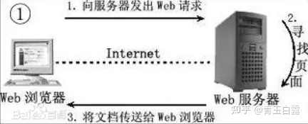

在本项目中，web请求主要是指HTTP协议，有关HTTP协议知识可以参考[介绍](https://link.zhihu.com/?target=https%3A//www.cnblogs.com/an-wen/p/11180076.html)，HTTP基于TCP/IP，进一步了解请百度。

## **什么是socket？**

客户端与主机之间是如何通信的？——Socket

socket起源于Unix，**而Unix/Linux基本哲学之一就是“一切皆文件”，都可以用“打开open –> 读写write/read –> 关闭close”模式来操作**。Socket就是该模式的一个实现，socket即是一种特殊的文件，一些socket函数就是对其进行的操作（读/写IO、打开、关闭），我们以下客户端获取服务端的时间的例子，来理解socket的使用过程：

**服务器端代码**


```cpp
// 《unix网络编程》的公共头文件
#include    "unp.h"
#include    <time.h>
int main(int argc, char **argv)
{
    int                 listenfd, connfd;
    struct sockaddr_in  servaddr;
    char                buff[MAXLINE];
    time_t              ticks;
    // 创建socket套接字文件描述符
    listenfd = Socket(AF_INET, SOCK_STREAM, 0); 
    bzero(&servaddr, sizeof(servaddr));
    servaddr.sin_family      = AF_INET;
    // 将套接字绑定到所有可用的接口
    // 注htol是主机序转网络字节序，请百度了解
    servaddr.sin_addr.s_addr = htonl(INADDR_ANY);
    servaddr.sin_port        = htons(13);   
    // 绑定该socket和地址
    Bind(listenfd, (SA *) &servaddr, sizeof(servaddr));
    // 服务器开始监听这个端口上（创建监听队列）
    Listen(listenfd, LISTENQ);
    // 服务器处理代码
    for ( ; ; ) {
        // 从监听队列中，取出一个客户端连接
        connfd = Accept(listenfd, (SA *) NULL, NULL);
        ticks = time(NULL);
        snprintf(buff, sizeof(buff), "%.24s\r\n", ctime(&ticks));
        Write(connfd, buff, strlen(buff));
        Close(connfd);
    }
}
```


**客户端程序**


```cpp
// 《unix网络编程》的公共头文件
#include "unp.h"
int main(int argc, char **argv)
{
    int                 sockfd, n;
    char                recvline[MAXLINE + 1];
    struct sockaddr_in  servaddr;
    if (argc != 2)
        err_quit("usage: a.out <IPaddress>");
    // 创建客户端socket
    if ( (sockfd = socket(AF_INET, SOCK_STREAM, 0)) < 0)
        err_sys("socket error");

    bzero(&servaddr, sizeof(servaddr));
    servaddr.sin_family = AF_INET;
    servaddr.sin_port   = htons(13);    /* daytime server */
    if (inet_pton(AF_INET, argv[1], &servaddr.sin_addr) <= 0)
        err_quit("inet_pton error for %s", argv[1]);
    //尝试连接对应地址的服务器端口
    if (connect(sockfd, (SA *) &servaddr, sizeof(servaddr)) < 0)
        err_sys("connect error");
    // 读取socket中的内容
    while ( (n = read(sockfd, recvline, MAXLINE)) > 0) {
        recvline[n] = 0;    /* null terminate */
        if (fputs(recvline, stdout) == EOF)
            err_sys("fputs error");
    }
    if (n < 0)
        err_sys("read error");
    exit(0);
}
```


TCP服务器与TCP客户端的工作流程见下：

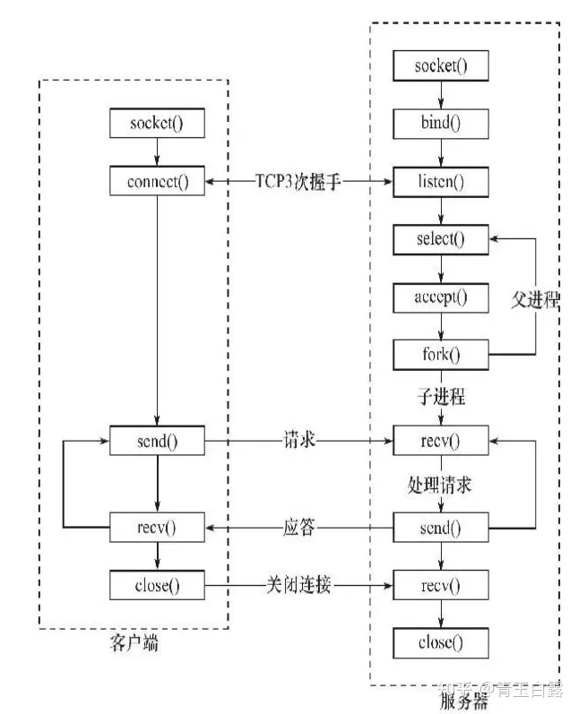

进一步了解socket可以[参考](https://link.zhihu.com/?target=https%3A//www.cnblogs.com/clschao/articles/9593164.html%23part_2)。

试想，如果有多个客户端都想connect服务器，那么服务器如何对这些客户端进行处理？这就需要介绍一下IO复用。

## **IO复用是什么？**

IO复用指的是在单个进程中**通过记录跟踪每一个Socket(I/O流)的状态来同时管理多个I/O流**. 发明它的原因，是尽量多的提高服务器的吞吐能力，[参考链接](https://www.zhihu.com/question/32163005/answer/55772739)。

如上文所说，当多个客户端与服务器连接时，这就涉及如何“同时”给每个客户端提供服务的问题。服务器的基本框架如下：


图中的逻辑单元，就是上例中“写入服务器时间”这一功能。要解决多客户端连接的问题，**首先得有一个队列**来对这个连接请求进行排序存放，而后需要通过**并发多线程的手段对已连接的客户进行应答处理**。

本项目是利用epollIO复用技术实现对**监听socket（listenfd）**和**连接socket（客户请求连接之后的socket）**的同时监听。注意I/O复用虽然可以同时监听多个文件描述符，但是它本身是阻塞的，所以为提高效率，这部分通过线程池来实现并发，为每个就绪的文件描述符分配**一个逻辑单元（线程）**来处理。

Unix有**五种基本的IO模型**：

- 阻塞式IO（守株待兔）
- 非阻塞式IO（没有就返回，直到有，其实是一种轮询（polling）操作）
- IO复用（select、poll等，使系统阻塞在select或poll调用上，而不是真正的IO系统调用（如recvfrom），等待select返回可读才调用IO系统，其优势就在于可以等待多个描述符就位）
- 信号驱动式IO（sigio，即利用信号处理函数来通知数据已完备且不阻塞主进程）
- 异步IO（posix的aio_系列函数，与信号驱动的区别在于，信号驱动是内核告诉我们何时可以进行IO，而后者是内核通知何时IO操作已完成）

**对于到来的IO事件（或是其他的信号/定时事件），**又有**两种事件处理模式**：

- **Reactor模式：**要求**主线程（I/O处理单元）**只负责监听文件描述符上是否有事件发生（可读、可写），若有，**则立即通知工作线程**，将socket**可读可写事件放入请求队列**，读写数据、接受新连接及处理客户请求**均在工作线程中完成**。(需要区别读和写事件)
- **Proactor模式：**主线程和内核负责处理读写数据、接受新连接**等I/O操作**，**工作线程仅负责业务逻辑（给予相应的返回url），如处理客户请求**。

通常使用**同步I/O模型（如epoll_wait）实现Reactor**，使用**异步I/O**（如aio_read和aio_write）实现Proactor，**但是异步IO并不成熟，本项目中使用同步IO模拟proactor模式**。有关这一部分的进一步介绍请参考第四章、线程池。

PS：什么是同步I/O，什么是异步I/O呢？

- 同步（阻塞）I/O：**等待IO操作完成，才能继续进行下一步操作**。这种情况称为同步IO。
- 异步（非阻塞）I/O：当代码执行IO操作时，它只发出IO指令，并不等待IO结果，然后就去执行其他代码了。一段时间后，当IO返回结果时（内核已经完成数据拷贝），再通知CPU进行处理。（异步操作的潜台词就是**你先做，我去忙其他的，你好了再叫我**）

IO复用需要借助select/poll/epoll，本项目之所以采用epoll，参考问题（[Why is epoll faster than select?](https://link.zhihu.com/?target=https%3A//stackoverflow.com/questions/17355593/why-is-epoll-faster-than-select)）

- 对于select和poll来说，所有文件描述符都是在用户态被加入其文件描述符集合的，**每次调用都需要将整个集合拷贝到内核态**；epoll则将整个文件描述符集合维护在内核态，每次添加文件描述符的时候都需要**执行一个系统调用**。系统调用的开销是很大的，而且在有很多短期活跃连接的情况下，epoll可能会慢于select和poll由于这些大量的系统调用开销。
- select使用线性表描述文件描述符集合，**文件描述符有上限**；poll使用**链表来描述**；epoll底层通过红黑树来描述，并且维护一个ready list，将事件表中已经就绪的事件添加到这里，在使用epoll_wait调用时，仅观察这个list中有没有数据即可。
- select和poll的最大开销来自内核判断是否有文件描述符就绪这一过程：每次执行select或poll调用时，**它们会采用遍历的方式**，遍历整个文件描述符集合去判断各个文件描述符是否有活动；epoll则不需要去以这种方式检查，当有活动产生时，**会自动触发epoll回调函数通知epoll文件描述符**，然后内核将这些就绪的文件描述符放到之前提到的**ready list中等待epoll_wait调用后被处理**。
- select和poll都只能工作在**相对低效的LT模式下**，而epoll同时支持LT和ET模式。
- 综上，**当监测的fd数量较小**，且各个fd都很活跃的情况下，建议使用select和poll；**当监听的fd数量较多**，且单位时间仅部分fd活跃的情况下，使用epoll会明显提升性能。

其中提到的LT与ET是什么意思？

- LT是指电平触发（level trigger），当IO事件就绪时，内核会一直通知，直到该IO事件被处理；
- ET是指边沿触发（Edge trigger），当IO事件就绪时，内核只会通知一次，如果在这次没有及时处理，该IO事件就丢失了。

## **什么是多线程？**

上文提到了并发多线程，在计算机中程序是作为一个进程存在的，线程是对进程的进一步划分，即在一个进程中可以有多个不同的代码执行路径。相对于进程而言，线程不需要操作系统为其分配资源，因为它的资源就在进程中，并且线程的创建和销毁相比于进程小得多，所以多线程程序效率较高。

但是在服务器项目中，如果频繁地创建/销毁线程也是不可取的，这就引入了线程池技术，即提前创建一批线程，当有任务需要执行时，就从线程池中选一个线程来进行任务的执行，任务执行完毕之后，再将该线程丢进线程池中，以等待后续的任务。

关于这部分的详细介绍可以参考：[多线程与并发](https://link.zhihu.com/?target=https%3A//blog.csdn.net/ll15982534415/article/details/109151982)。

## **二、项目学习**

完成了基础知识的了解之后，现在就来进行项目代码的学习，这就有一个问题了，究竟，怎样才算是看懂了一个开源项目？把所有代码都复现一遍？

如果真是复现一遍，性价比太小了。如果这个开源项目是工作需要，或者说就是在它的基础上进行修改，那么对其代码整体进行浏览是必不可少的。但若是只是为了学习这个项目的架构和思想，那么从整体入手，细究某一个功能，再瞄准感兴趣的代码块就可以了。

对于本文的服务器项目，笔者主要是为了学习web服务器的相关知识，不需要全部了解，但是大部分代码都得理清脉络，于是我就采用了这种方式来学习：

- 代码架构，每一个目录负责什么模块（这个部分可以结合开源项目的文档，可以加快对项目的理解速度）
- 编译运行，看看有什么功能；
- 挑某一个功能，细究其代码实现，我就先挑“用户登录注册”功能来进行研究，再考虑其他的功能；
- 添加功能，如何在现有的框架下增加一个功能？比如上传文件、上传博客等等？添加留言板？
- 未完......

ok，学习路线规划好了，下面就开始代码学习之旅！

## **代码架构**

用VsCode打开项目，该项目的代码架构如下：

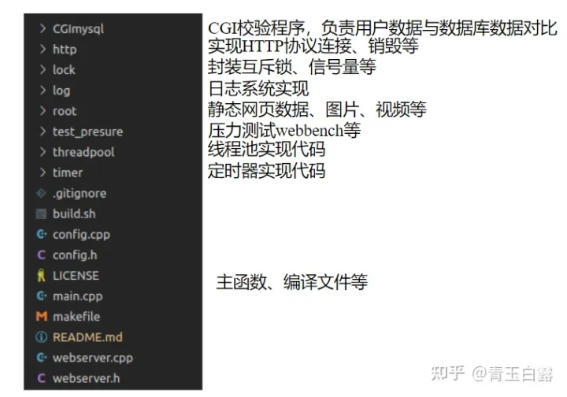

参考文档，该项目的代码框架如下：

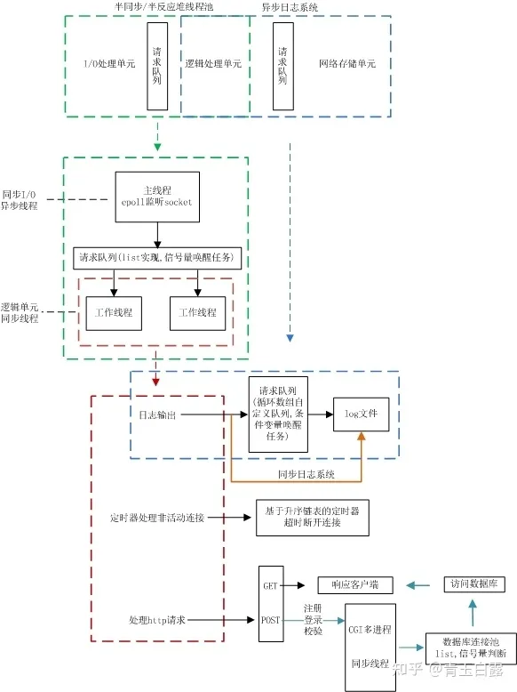

## **编译运行**

安装Mysql、创建数据库、修改代码，编译,运行：


```bash
 sh ./build.sh 
 ./server
 // 打开浏览器
 localhost:9006
```


浏览器显示如下：


点击新用户，注册一个账号之后再登录，有一下三个功能：


分别是网页上展示一个图片/视频/微信公众号。

通过阅读代码框架和运行逻辑，先给出一个服务器运行时工作流程图如下：

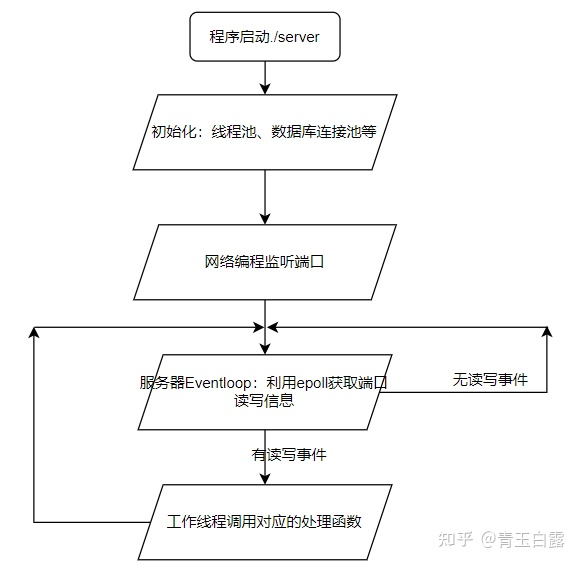

所有功能我最感兴趣的还是**登录注册功能**，去看看如何实现的。

## **功能细究**

关于登录功能，页面跳转逻辑如下图所示，原图来自[两猿社](https://link.zhihu.com/?target=https%3A//mp.weixin.qq.com/s%3F__biz%3DMzAxNzU2MzcwMw%3D%3D%26mid%3D2649274431%26idx%3D4%26sn%3D7595a70f06a79cb7abaebcd939e0cbee%26chksm%3D83ffb167b4883871ce110aeb23e04acf835ef41016517247263a2c3ab6f8e615607858127ea6%26token%3D1686112912%26lang%3Dzh_CN%23rd)：

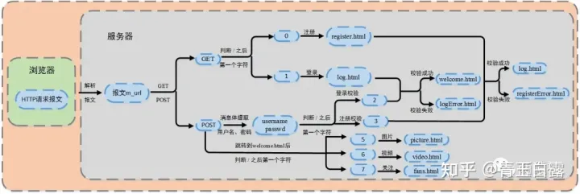

上图的逻辑已经很清晰，根据HTTP请求的方法是GET还是POST，确定是获取注册/登录用户界面，还是更新用户密码跳转到登录成功界面。有关HTTP部分的介绍参考**三、拔萝带泥-HTTP**。

具体一点，首先需要从数据库中**获取所有的用户名和密码**（PS：在实际的大型项目中用户密码的传输可以参考[用户登录实践](https://link.zhihu.com/?target=https%3A//blog.csdn.net/bjspo/article/details/90059325)），这些用户名和密码以某种数据结构（如哈希表）保存。

当浏览器请求到达时，根据其请求访问，**返回对应的界面html或是错误提示**。

整个过程其实是一个**有限状态机**。有限状态机？

有限状态机就是指系统状态从某一种状态转移到另外一种状态，表示“选择”和“更新状态”的过程。想进一步了解请参考：[有限状态机？](https://zhuanlan.zhihu.com/p/46347732)

由于该功能内部细节太多，请跳转阅读第三章、拔萝带泥-HTTP。


## **三、拔萝带泥——HTTP**

这个部分是对第二章登录注册功能的详细解析。首先介绍Epoll的使用，再介绍HTTP的相关知识，而后在给出“用户登录注册”过程的细节。

## **Epoll**

这个部分主要介绍epoll的函数调用框架，先看看epoll常用的函数。

### **常用函数**

epoll_create


```text
//创建一个指示epoll内核事件表的文件描述符
//该描述符将用作其他epoll系统调用的第一个参数
//size不起作用。
int epoll_create(int size)
```


epoll_ctl


```text
//操作内核事件表监控的文件描述符上的事件：注册、修改、删除
int epoll_ctl(int epfd, int op, int fd, struct epoll_event *event)
```


其中，epfd：为epoll_creat的句柄

op：表示动作，用3个宏来表示：

- EPOLL_CTL_ADD (注册新的fd到epfd)，
- EPOLL_CTL_MOD (修改已经注册的fd的监听事件)，
- EPOLL_CTL_DEL (从epfd删除一个fd)；

event：告诉内核需要监听的事件

event结构体定义如下：


```text
struct epoll_event {
    __uint32_t events; /* Epoll events */
    epoll_data_t data; /* User data variable */
4};
```


events描述事件类型，其中epoll事件类型有以下几种

- EPOLLIN：表示对应的文件描述符**可以读**（包括对端SOCKET正常关闭）
- EPOLLOUT：表示对应的文件描述符**可以写**
- EPOLLPRI：表示对应的文件描述符有**紧急的数据可读**
- EPOLLERR：表示对应的文件描述符**发生错误**
- EPOLLHUP：表示对应的文件描述符**被挂断**；
- EPOLLET：将EPOLL设为**边缘触发(Edge Triggered)模式**，这是相对于水平触发(Level Triggered)而言的
- EPOLLONESHOT：只监听一次事件，当监听完这次事件之后，如果还需要继续监听这个socket的话，需要再次把这个socket加入到EPOLL队列里
- EPOLLET： 边缘触发模式
- EPOLLRDHUP：表示读关闭，对端关闭，不是所有的内核版本都支持；

epoll_wait


```text
//该函数用于等待所监控文件描述符上有事件的产生
//返回就绪的文件描述符个数
int epoll_wait(int epfd, struct epoll_event *events, int maxevents, int timeout)
```


其中，

- events：用来存内核得到事件的集合，
- maxevents：告之内核这个events有多大，不能大于epoll_create()时的size；
- timeout：是超时时间；
- 返回值：成功返回有多少文件描述符就绪，时间到时返回0，出错返回-1；

### **例子**

实际应用中，epoll是怎么起作用的？代码[原链接](https://link.zhihu.com/?target=https%3A//blog.csdn.net/weixin_43326322/article/details/108288633)。


```cpp
//tcp server epoll并发服务器 
#include <stdio.h>
#include <stdlib.h>
#include <string.h>
#include <unistd.h>
#include <errno.h>
#include <pthread.h>
#include <ctype.h>
#include <sys/socket.h>
#include <arpa/inet.h>
#include <sys/epoll.h>
#define  MAX_LINK_NUM   128
#define  SERV_PORT      8888
#define  BUFF_LENGTH    320
#define  MAX_EVENTS     5

int  count = 0;
int tcp_epoll_server_init(){
    //创建服务器端口的常用套路代码
    int sockfd = socket(AF_INET,SOCK_STREAM,0);
    if(sockfd == -1){
        printf("socket error!\n");
        return -1;
    }
    struct sockaddr_in serv_addr;
    struct sockaddr_in clit_addr;
    socklen_t clit_len;
    serv_addr.sin_family = AF_INET;
    serv_addr.sin_port = htons(SERV_PORT);
    serv_addr.sin_addr.s_addr = htonl(INADDR_ANY);// 任意本地ip
    int ret = bind(sockfd,(struct sockaddr*)&serv_addr,sizeof(serv_addr));
    if(ret == -1){
        printf("bind error!\n");
        return -2;
    }
    listen(sockfd,MAX_LINK_NUM);

    //创建epoll
    int  epoll_fd = epoll_create(MAX_EVENTS);
    if(epoll_fd == -1){
        printf("epoll_create error!\n");
        return -3;
    }
    //向epoll注册sockfd监听事件
    struct epoll_event ev;   //epoll事件结构体
    struct epoll_event events[MAX_EVENTS];  //事件监听队列
    ev.events = EPOLLIN;
    ev.data.fd = sockfd;
    int ret2 = epoll_ctl(epoll_fd,EPOLL_CTL_ADD,sockfd,&ev);
    if(ret2 == -1){
        printf("epoll_ctl error!\n");
        return -4;
    }
    int connfd = 0;
    while(1){
        //epoll等待事件发生
            int nfds = epoll_wait(epoll_fd,events,MAX_EVENTS,-1);
            if(nfds == -1){
                printf("epoll_wait error!\n");
                return -5;
            }
            printf("nfds: %d\n",nfds);
            //检测
            for(int i = 0;i<nfds;++i){
                //客服端有新的请求
                if(events[i].data.fd == sockfd){
                //取出该连接
                connfd =  accept(sockfd,(struct sockaddr*)&clit_addr,&clit_len);
                    if(connfd == -1){
                        printf("accept error!\n");
                        return -6;
                    }
                    ev.events = EPOLLIN;
                    ev.data.fd = connfd;
              if(epoll_ctl(epoll_fd,EPOLL_CTL_ADD,connfd,&ev) == -1){
                        printf("epoll_ctl add error!\n");
                        return -7;
                    }
                    printf("accept client: %s\n",inet_ntoa(clit_addr.sin_addr));
                    printf("client %d\n",++count);
                }
                //客户端有数据发送过来
                else{
                    char buff[BUFF_LENGTH];
                    int ret1 = read(connfd,buff,sizeof(buff));
                    printf("%s",buff);
                }
            }

    }

    close(connfd);
    return 0;

}

int main(){
    tcp_epoll_server_init();
}
```


## **HTTP**

### **HTTP介绍**

**HTTP报文**

HTTP报文分为请求报文（浏览器端向服务器发送）和响应报文（服务器处理后返回给浏览器端）两种，每种报文必须按照特有格式生成，才能被浏览器端识别。

- **请求报文=请求行（request line）、请求头部（header）、空行和请求数据**四个部分组成。

请求行，**用来说明请求类型（方法）,要访问的资源以及所使用的HTTP版本**。

请求头部，紧接着请求行（即第一行）之后的部分，**用来说明服务器要使用的附加信息**。

空行，请求头部后面的空行是必须的即使第四部分的请求数据为空，也必须有空行。

请求数据也叫主体，可以添加任意的其他数据。

- **响应报文=状态行+消息报头+空行+响应正文四个部分组成**

状态行，由HTTP协议版本号，状态码，状态消息 三部分组成。

消息报头，用来说明客户端要使用的一些附加信息。

空行，消息报头后面的空行是必须的。

响应正文，服务器返回给客户端的文本信息等。

**HTTP状态码与请求方法**

HTTP有5种类型的状态码，具体的：

- 1xx：指示信息--表示请求已接收，继续处理。
- 2xx：成功--表示请求正常处理完毕。

200 OK：客户端请求被正常处理。

206 Partial content：客户端进行了范围请求。

- 3xx：重定向--要完成请求必须进行更进一步的操作。

301 Moved Permanently：永久重定向，该资源已被永久移动到新位置，将来对该资源访问都要使用本响应返回的若干个URI之一。

302 Found：临时重定向，请求的资源临时从不同的URI中获得。

- 4xx：客户端错误--请求有语法错误，服务器无法处理请求。

400 Bad Request：请求报文存在语法错误。

403 Forbidden：请求被服务器拒绝。

404 Not Found：请求不存在，服务器上找不到请求的资源。

- 5xx：服务器端错误--服务器处理请求出错。

500 Internal Server Error：服务器在执行请求时出现错误。

HTTP1.1之后共有八种方法名，见下：

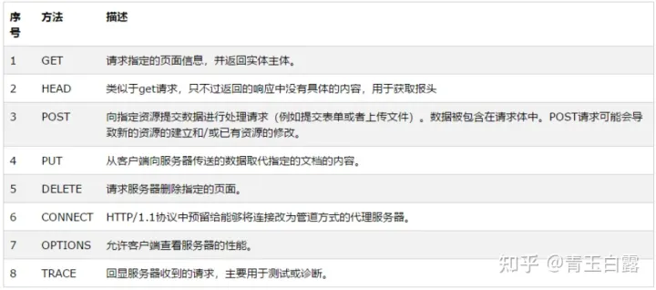

由于该项目主要涉及GET和POST，那么这两个指令有什么区别和联系呢？

简单来说，GET主要是用来获取新的网页；POST用作向服务器传递用户的表单数据，如用户名、密码、留言等等；

进一步，GET把参数包含在URL中，POST通过request body传递参数。

其实GET和POST只是HTTP定义的两种输出传输标识，他们的传输大小限制是TCP/IP协议所限制的，并且POST一般需要两次传输，强烈推荐博客：[GET/POST的区别](https://link.zhihu.com/?target=https%3A//www.cnblogs.com/logsharing/p/8448446.html)。

这里是两个GET和POST的典例：

GET


```text
GET /562f2.jpg HTTP/1.1
Host:img.mukewang.com
User-Agent:Mozilla/5.0 (Windows NT 10.0; WOW64)
AppleWebKit/537.36 (KHTML, like Gecko) Chrome/51.0.2704.106 Safari/537.36
Accept:image/webp,image/*,*/*;q=0.8
Referer:http://www.imooc.com/
Accept-Encoding:gzip, deflate, sdch
Accept-Language:zh-CN,zh;q=0.8
空行
请求数据为空
```


POST


```text
POST / HTTP1.1
Host:www.wrox.com
User-Agent:Mozilla/4.0 (compatible; MSIE 6.0; Windows NT 5.1; SV1; .NET CLR 2.0.50727; .NET CLR 3.0.04506.648; .NET CLR 3.5.21022)
Content-Type:application/x-www-form-urlencoded
Content-Length:40
Connection: Keep-Alive
空行
name=Professional%20Ajax&publisher=Wiley
```


### **HTTP处理流程**

HTTP的处理流程分为以下三个步骤：

- **连接处理：**浏览器端发出http连接请求，主线程创建http对象接收请求并将所有数据读入对应buffer，将该对象插入任务队列，等待工作线程从任务队列中取出一个任务进行处理。
- **处理报文请求**：工作线程取出任务后，调用进程处理函数，通过主、从状态机对请求报文进行解析。
- **返回响应报文：**解析完之后，生成响应报文，返回给浏览器端。

接下来依次介绍三个步骤：

### **连接处理**

在连接阶段，最重要的是**tcp连接过程和读取http的请求报文**（其实读取请求报文就是读取客户端发送的数据而已）。tcp连接过程涉及epoll内核事件创建等，详见**后续的epoll部分**。

服务器是如何实现读取http的报文的呢？首先，服务器需要对每一个**已建立连接http建立一个http的类对象**，这部分代码如下（服务器一直在运行eventloop即回环事件，因为整个服务器其实是事件驱动）：


```text
//事件回环（即服务器主线程）
void WebServer::eventLoop()
{
    ......
    while (!stop_server)
    {
        //等待所监控文件描述符上有事件的产生
        int number = epoll_wait(m_epollfd, events, MAX_EVENT_NUMBER, -1);
        if (number < 0 && errno != EINTR)
        {
            LOG_ERROR("%s", "epoll failure");
            break;
        }
        //对所有就绪事件进行处理
        for (int i = 0; i < number; i++)
        {
            int sockfd = events[i].data.fd;
            //处理新到的客户连接
            if (sockfd == m_listenfd)
            {
                bool flag = dealclinetdata();
                if (false == flag)
                    continue;
            }
            //处理异常事件
            else if (events[i].events & (EPOLLRDHUP | EPOLLHUP | EPOLLERR))
            {
                //服务器端关闭连接，移除对应的定时器
                util_timer *timer = users_timer[sockfd].timer;
                deal_timer(timer, sockfd);
            }
            //处理信号
            else if ((sockfd == m_pipefd[0]) && (events[i].events & EPOLLIN))
            {
                bool flag = dealwithsignal(timeout, stop_server);
                if (false == flag)
                    LOG_ERROR("%s", "dealclientdata failure");
            }
            //处理客户连接上接收到的数据 可读
            else if (events[i].events & EPOLLIN)
            {
                dealwithread(sockfd);
            }
            //处理客户连接上接收到的数据 可写
            else if (events[i].events & EPOLLOUT)
            {
                dealwithwrite(sockfd);
            }
        }
       ......
    }
}
```


**22行的dealclientdata（）**函数调用timer（）创建新的client客户端连接user，同时新增一个**定时事件（见后续部分）**。

完成这一系列步骤之后，服务器中就维护着一系列的客户端client连接，当其中一个客户点击网页某一按钮，生成一个请求报文并传输到服务器时，在上述**事件回环代码**中调用dealwithread（）。

该函数中将该端口事件append加入任务请求队列，等待线程池中的线程执行该任务。**根据Reactor/Proactor模式，工作线程对http请求报文数据的读取由read_once（）函数完成**，见http_conn.cpp。

read_once()函数将浏览器（客户端）端的数据读入到缓存数组，以待后续工作线程进行处理。

### **请求报文处理**

在webserver的线程池有空闲线程时，某一线程调用process（）来完成请求报文的解析以及报文相应任务。详见http_conn/process（）：


```text
//处理http报文请求与报文响应
void http_conn::process()
{
    //NO_REQUEST，表示请求不完整，需要继续接收请求数据
    HTTP_CODE read_ret = process_read();
    if (read_ret == NO_REQUEST)
    {
        //注册并监听读事件
        modfd(m_epollfd, m_sockfd, EPOLLIN, m_TRIGMode);
        return;
    }
    //调用process_write完成报文响应
    bool write_ret = process_write(read_ret);
    if (!write_ret)
    {
        close_conn();
    }
    //注册并监听写事件
    modfd(m_epollfd, m_sockfd, EPOLLOUT, m_TRIGMode);
}
```


先**介绍请求报文的处理，也就是process_read()函数**。

该函数通过while循环，对**主从状态机**进行封装，对报文的每一行进行循环处理。这里的**主状态机**，指的是process_read()函数，**从状态机**是指parse_line()函数。

从状态机负责**读取报文的一行（并对其中的\r\n进行修改为\0\0）**，主状态机负责对该行数据进行解析，**主状态机内部调用从状态机，从状态机驱动主状态机**。它们之间的关系如下图所示：

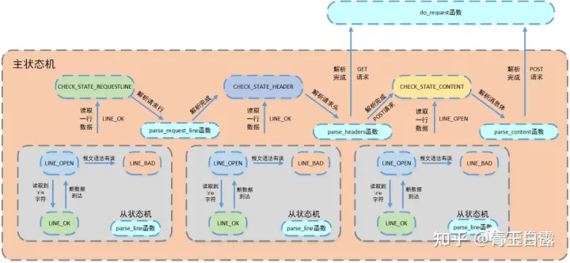

process_read()这个函数对HTTP连接和处理部分的理解**极为重要**，必须得抬出源码看看，**请在学习过程中结合源码、上述流程图来理解**：


```text
//有限状态机处理请求报文
http_conn::HTTP_CODE http_conn::process_read()
{
    //
    LINE_STATUS line_status = LINE_OK;
    HTTP_CODE ret = NO_REQUEST;
    char *text = 0;
    while ((m_check_state == CHECK_STATE_CONTENT && line_status == LINE_OK) || ((line_status = parse_line()) == LINE_OK))
    {
        text = get_line();
        m_start_line = m_checked_idx;
        LOG_INFO("%s", text);
        switch (m_check_state)
        {
        case CHECK_STATE_REQUESTLINE:
        {
            ret = parse_request_line(text);
            if (ret == BAD_REQUEST)
                return BAD_REQUEST;
            break;
        }
        case CHECK_STATE_HEADER:
        {
            ret = parse_headers(text);
            if (ret == BAD_REQUEST)
                return BAD_REQUEST;
            else if (ret == GET_REQUEST)
            {
                return do_request();
            }
            break;
        }
        case CHECK_STATE_CONTENT:
        {
            ret = parse_content(text);
            if (ret == GET_REQUEST)
                return do_request();
            line_status = LINE_OPEN;
            break;
        }
        default:
            return INTERNAL_ERROR;
        }
    }
    return NO_REQUEST;
}
```


上述代码是使用switch...case来体现**主状态机的选择**，而**主状态机的状态**是由CHECK_STATE_REQUESTLINE/HEADER/CONTENT，这三个标志来表示的：**正在解析请求行、解析请求头、解析消息体（body）**。有关判断条件和循环体的补充见下：

- 判断条件

- - 主状态机转移到CHECK_STATE_CONTENT，该条件涉及解析消息体
  - 从状态机转移到LINE_OK，该条件涉及解析请求行和请求头部
  - 两者为或关系，当条件为真则继续循环，否则退出


- 循环体

- - 从状态机读取数据
  - 调用get_line函数，通过m_start_line将从状态机读取数据间接赋给text
  - 主状态机解析text


PS：**这个部分的阅读一定得结合源码！其中涉及很多字符数组指针的加减，请仔细体会**！

主状态机初始状态是CHECK_STATE_REQUESTLINE，而后调用parse_request_line()解析请求行，获得HTTP的请求方法、目标URL以及HTTP版本号，状态变为CHECK_STATE_HEADER。

此时进入循环体之后，调用parse_headers()解析请求头部信息。先要判断是空行还是请求头，空行进一步区分POST还是GET。若是请求头，则更新长短连接状态、host等等。

注：GET和POST请求报文的区别之一是有无消息体部分。

当使用POST请求时，需要进行CHECK_STATE_CONTENT的解析，取出POST消息体中的**信息（用户名、密码）**。

参考链接：

[https://mp.weixin.qq.com/s/wAQHU-QZiRt1VACMZZjNlw](https://link.zhihu.com/?target=https%3A//mp.weixin.qq.com/s/wAQHU-QZiRt1VACMZZjNlw)

### **返回响应报文**

在完成请求报文的解析之后，明确用户想要登录/注册，需要跳转到对应的界面、添加用户名、验证用户等等，并将相应的数据写入相应报文，返回给浏览器,流程图如下：

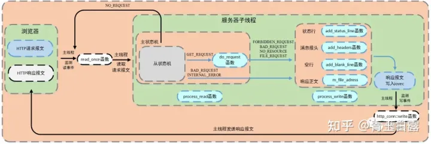

这个在process_read()中完成请求报文的解析之后，状态机会调用do_request()函数，该函数是处理功能逻辑的。该函数将网站根目录和url文件拼接，然后通过stat判断该文件属性。url，可以将其抽象成ip:port/xxx，xxx通过html文件的action属性（即请求报文）进行设置。m_url为请求报文中解析出的请求资源，以/开头，也就是x，项目中解析后的m_url有8种情况，见do_request()函数，部分代码如下：


```text
 //功能逻辑单元
http_conn::HTTP_CODE http_conn::do_request()
{
    strcpy(m_real_file, doc_root);
    int len = strlen(doc_root);
    //printf("m_url:%s\n", m_url);
    const char *p = strrchr(m_url, '/');
    //处理cgi
    if (cgi == 1 && (*(p + 1) == '2' || *(p + 1) == '3'))
    {
        //根据标志判断是登录检测还是注册检测
        char flag = m_url[1];
        char *m_url_real = (char *)malloc(sizeof(char) * 200);
        strcpy(m_url_real, "/");
        strcat(m_url_real, m_url + 2);
        strncpy(m_real_file + len, m_url_real, FILENAME_LEN - len - 1);
        free(m_url_real);

        //将用户名和密码提取出来
        //user=123&passwd=123
        char name[100], password[100];
        int i;
        for (i = 5; m_string[i] != '&'; ++i)
            name[i - 5] = m_string[i];
        name[i - 5] = '\0';

        int j = 0;
        for (i = i + 10; m_string[i] != '\0'; ++i, ++j)
            password[j] = m_string[i];
        password[j] = '\0';

        if (*(p + 1) == '3')
        {
            //如果是注册，先检测数据库中是否有重名的
            //没有重名的，进行增加数据
            ......
            if (users.find(name) == users.end())
            {
                m_lock.lock();
                int res = mysql_query(mysql, sql_insert);
                users.insert(pair<string, string>(name, password));
                m_lock.unlock();

                if (!res)
                    strcpy(m_url, "/log.html");
                else
                    strcpy(m_url, "/registerError.html");
            }
            else
                strcpy(m_url, "/registerError.html");
        }
        ......
} 
```


其中，**stat函数用于获取文件的类型、大小等信息**；mmap用于将文件等映射到内存，提高访问速度，详见[mmap原理](https://link.zhihu.com/?target=https%3A//blog.csdn.net/bbzhaohui/article/details/81665370)；iovec定义向量元素，通常，这个结构用作一个多元素的数组，详见[社长微信](https://link.zhihu.com/?target=https%3A//mp.weixin.qq.com/s/451xNaSFHxcxfKlPBV3OCg)；writev为聚集写，详见[链接](https://link.zhihu.com/?target=https%3A//www.cnblogs.com/fanweisheng/p/11138704.html)；

执行do_request()函数之后，子线程调用process_write()进行响应报文（add_status_line、add_headers等函数）的生成。在生成响应报文的过程中主要调用add_reponse()函数更新m_write_idx和m_write_buf。

值得注意的是，响应报文分为两种，一种是**请求文件的存在**，通过io向量机制iovec，声明两个iovec，第一个指向m_write_buf，第二个指向mmap的地址m_file_address ;**另一种是请求出错**，这时候只申请一个iovec，指向m_write_buf 。

其实往响应报文里写的就是服务器中html的文件数据，浏览器端对其进行解析、渲染并显示在浏览器页面上。

另外，用户登录注册的验证逻辑代码在do_request()中，通过对Mysql数据库进行查询或插入，验证、添加用户。

以上就是对注册/登录模块的详细介绍，之后分模块对该项目的线程池、日志、定时器等进行细节探究。

## **四、线程池**

这个部分着重介绍该项目的线程池实现。整体框架如下：

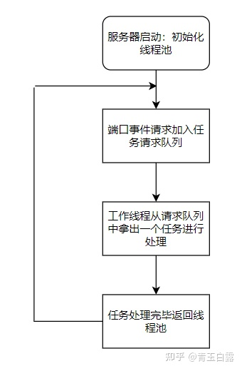

## **定义**

线程池其定义如下：


```text
template <typename T>
class threadpool
{
public:
    /*thread_number是线程池中线程的数量，max_requests是请求队列中最多允许的、等待处理的请求的数量*/
    threadpool(int actor_model, connection_pool *connPool, int thread_number = 8, int max_request = 10000);
    ~threadpool();
    bool append(T *request, int state);
    bool append_p(T *request);

private:
    /*工作线程运行的函数，它不断从工作队列中取出任务并执行之*/
    static void *worker(void *arg);//为什么要用静态成员函数呢-----class specific
    void run();

private:
    int m_thread_number;        //线程池中的线程数
    int m_max_requests;         //请求队列中允许的最大请求数
    pthread_t *m_threads;       //描述线程池的数组，其大小为m_thread_number
    std::list<T *> m_workqueue; //请求队列
    locker m_queuelocker;       //保护请求队列的互斥锁
    sem m_queuestat;            //是否有任务需要处理
    connection_pool *m_connPool;  //数据库
    int m_actor_model;          //模型切换（这个切换是指Reactor/Proactor）
};
```


注意到该线程池采用模板编程，这是为了增强其拓展性：各种任务种类都可支持。

线程池需**要预先创建一定的线程**，其中最重要的API为：


```text
#include <pthread.h>
//返回新生成的线程的id
int pthread_create 
(pthread_t *thread_tid,//新生成的线程的id         
const pthread_attr_t *attr, //指向线程属性的指针,通常设置为NULL      
void * (*start_routine) (void *), //处理线程函数的地址  
void *arg);  //start_routine()中的参数
```


函数原型中的第三个参数，**为函数指针，指向处理线程函数的地址**。该函数，**要求为静态函数**。如果处理线程函数为类成员函数时，需要将其设置为**静态成员函数(因为类的非静态成员函数有this指针，就跟void\*不匹配)**。进一步了解[请看](https://link.zhihu.com/?target=https%3A//blog.csdn.net/wushuomin/article/details/80051295)。

## **线程池创建**

项目中线程池的创建：


```text
threadpool<T>::threadpool( int actor_model, connection_pool *connPool, int thread_number, int max_requests) : m_actor_model(actor_model),m_thread_number(thread_number), m_max_requests(max_requests), m_threads(NULL),m_connPool(connPool)
{
    if (thread_number <= 0 || max_requests <= 0)
        throw std::exception();
    m_threads = new pthread_t[m_thread_number];     //pthread_t是长整型
    if (!m_threads)
        throw std::exception();
    for (int i = 0; i < thread_number; ++i)
    {
        //创建成功应该返回0，如果线程池在线程创建阶段就失败，那就应该关闭线程池了
        if (pthread_create(m_threads + i, NULL, worker, this) != 0)
        {
            delete[] m_threads;
            throw std::exception();
        }
        //主要是将线程属性更改为unjoinable，便于资源的释放，详见PS
        if (pthread_detach(m_threads[i]))
        {
            delete[] m_threads;
            throw std::exception();
        }
    }
}
```


PS:注意到创建一个线程之后需要调用pthread_detech(),原因在于： linux线程有两种状态**joinable状态和unjoinable状态。**

如果线程是joinable状态，当线程函数自己退出**都不会释放线程所占用堆栈和线程描述符（总计8K多）**。只有当调用了pthread_join，**主线程阻塞等待子线程结束**，然后回收子线程资源。

而unjoinable属性可以在pthread_create时指定，或在线程创建后在线程中pthread_detach（pthread_detach()即**主线程与子线程分离**，**子线程结束后，资源自动回收**）, 如：pthread_detach(pthread_self())，将状态改为unjoinable状态，确保资源的释放。其实简单的说就是在线程函数头加上 pthread_detach(pthread_self())的话，线程状态改变，在函数尾部直接 pthread_exit线程就会自动退出。省去了给线程擦屁股的麻烦。

## **加入请求队列**

当epoll检测到端口有事件激活时，即将该事件放入请求队列中（注意互斥），等待工作线程处理：


```text
//proactor模式下的请求入队
bool threadpool<T>::append_p(T *request)
{
    m_queuelocker.lock();
    if (m_workqueue.size() >= m_max_requests)
    {
        m_queuelocker.unlock();
        return false;
    }
    m_workqueue.push_back(request);
    m_queuelocker.unlock();
    m_queuestat.post();
    return true;
}
```


上面是Proactor模式下的任务请求入队，不知道Reactor和Proactor模式的请回到第一章、IO复用。本项目所实现的是一个基于半同步/半反应堆式的并发结构，以Proactor模式为例的工作流程如下：

- 主线程充当异步线程，负责监听所有socket上的事件
- 若有新请求到来，主线程接收之以得到新的连接socket，然后往epoll内核事件表中注册该socket上的读写事件
- 如果连接socket上有读写事件发生，主线程从socket上接收数据，并将数据封装成请求对象插入到请求队列中
- 所有**工作线程睡眠在请求队列上**，当有任务到来时，通过竞争（如互斥锁）获得任务的接管权

即是如下原理：（[图片来自](https://link.zhihu.com/?target=https%3A//blog.csdn.net/LF_2016/article/details/72794814)）

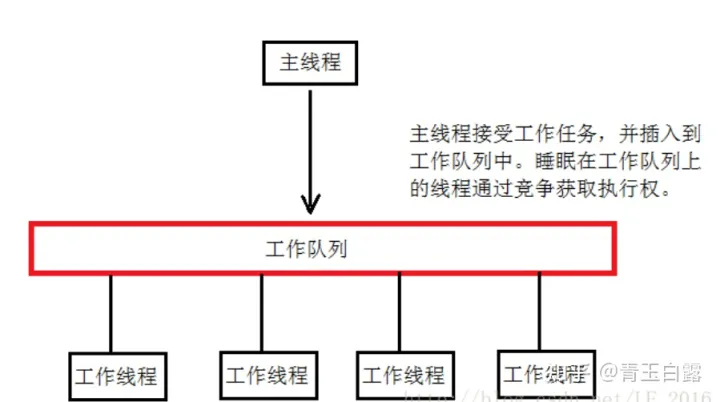

## **线程处理**

在建立线程池时，调用pthread_create指向了worker()静态成员函数，而worker()内部调用run()。


```text
//工作线程:pthread_create时就调用了它
template <typename T>
void *threadpool<T>::worker(void *arg)
{
    //调用时 *arg是this！
    //所以该操作其实是获取threadpool对象地址
    threadpool *pool = (threadpool *)arg;
    //线程池中每一个线程创建时都会调用run()，睡眠在队列中
    pool->run();
    return pool;
}
```


run()函数其实也可以看做**是一个回环事件**，一直等待m_queuestat()信号变量post，即新任务进入请求队列，这时请求队列中取出一个任务进行处理：


```text
//线程池中的所有线程都睡眠，等待请求队列中新增任务
void threadpool<T>::run()
{
    while (true)
    {
        m_queuestat.wait();
        m_queuelocker.lock();
        if (m_workqueue.empty())
        {
            m_queuelocker.unlock();
            continue;
        }
        T *request = m_workqueue.front();
        m_workqueue.pop_front();
        m_queuelocker.unlock();
        if (!request)
            continue;
//        ......线程开始进行任务处理
    }
}
```


**注：**每调用一次pthread_create就会调用一次run(),因为每个线程是相互独立的，**都睡眠在工作队列上，仅当信号变量更新才会唤醒进行任务的竞争**。


## **五、定时器**

## **原理解析**

如果一个客户端与服务器长时间连接，并且不进行数据的交互，这个连接就没有存在的意义还占据了服务器的资源。在这种情况下，服务器就需要一种手段检测无意义的连接，并对这些连接进行处理。

除了处理非活跃的连接之外，服务器还有一些定时事件，比如关闭文件描述符等。

为实现这些功能，服务器就需要为各事件分配一个定时器。

该项目使用SIGALRM信号来实现定时器，首先每一个定时事件都处于一个升序链表上，**通过alarm()函数周期性触发SIGALRM信号**，而后信号回调函数利用管道通知主循环，主循环接收到信号之后对升序链表上的定时器进行处理：若一定时间内无数据交换则关闭连接。

有关这一部分的底层API解析，建议直接阅读[我所添加的源码注释](https://link.zhihu.com/?target=https%3A//github.com/white0dew/WebServer)或者[参考社长的文章](https://link.zhihu.com/?target=https%3A//mp.weixin.qq.com/s/mmXLqh_NywhBXJvI45hchA)。

## **代码与框图**

由于定时器部分在源代码中调用比较复杂，可以结合该框图进行理解：

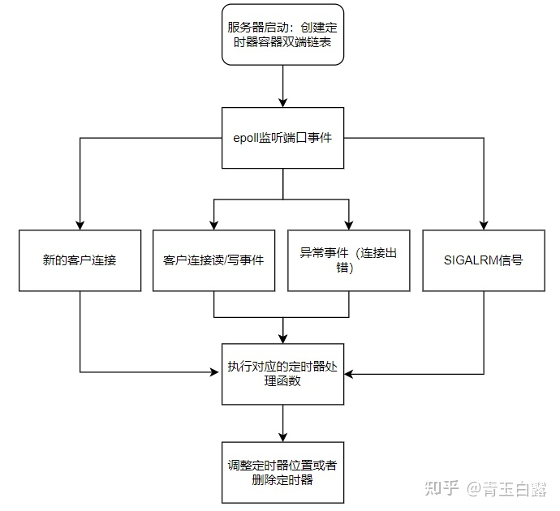

文字性叙述：

服务器首先**创建定时器容器链表**，然后用统一事件源将异常事件，读写事件和信号事件统一处理，根据不同事件的对应逻辑使用定时器。

具体的，浏览器与服务器连接时，创建该连接对应的定时器，并将该定时器添加到定时器容器链表上；

处理异常事件时，执行定时事件，服务器关闭连接，从链表上移除对应定时器；

处理定时信号时，将定时标志设置为true，以便执行定时器处理函数；

处理读/写事件时，若某连接上发生读事件或某连接给浏览器发送数据，将对应定时器向后移动，否则，执行定时事件。

## **六、日志系统**

为了记录服务器的运行状态，错误信息，访问数据的文件等，需要建立一个日志系统。本项目中，使用单例模式创建日志系统。该部分的框图如下（原图来自社长）：

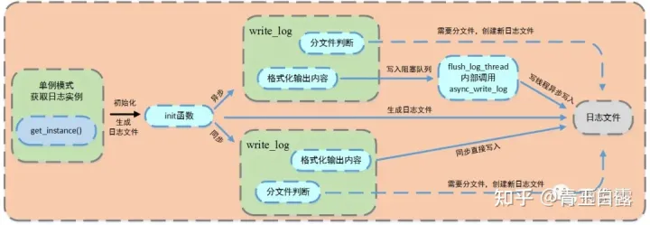

**由上图可知，该系统同步和异步两种写入方式。**

**其中异步写入方式，**将**生产者-消费者模型封装为阻塞队列**，创建一个**写线程**，工作线程将要写的内容**push进队列**，**写线程**从队列中取出内容，写入日志文件。对于同步写入方式，直接格式化输出内容，将信息写入日志文件。

**该系统可以实现按天分类，超行分类功能。**

这个部分建议直接结合源码，从log.h入手进行阅读，先查看同步写入的方式，在进行异步写入日志以及阻塞队列的阅读。

或是参考社长的：[日志系统](https://link.zhihu.com/?target=https%3A//mp.weixin.qq.com/s/IWAlPzVDkR2ZRI5iirEfCg)。

## **七、其他**

## **数据库连接池**

该项目在处理用户连接时，采用的是：每一个HTTP连接获取一个数据库连接，获取其中的用户账号密码进行对比（有点损耗资源，实际场景下肯定不是这么做的），而后再释放该数据库连接。

那为什么要创建数据库连接池呢？

数据库访问的一般流程为：当系统需要访问数据库时，先系统创建数据库连接，完成数据库操作，然后系统断开数据库连接。——从中可以看出，若系统需要频繁访问数据库，**则需要频繁创建和断开数据库连接**，而创建数据库连接是一个很耗时的操作，**也容易对数据库造成安全隐患**。

在程序初始化的时候，集中创建多个数据库连接，并把他们集中管理，**供程序使用，可以保证较快的数据库读写速度，更加安全可靠**。

其实数据库连接池跟线程池的思想基本是一致的。

在该项目中不仅实现了数据库连接池，还将数据库连接的获取与释放通过RAII机制封装，避免手动释放。

这一部分比较易懂，建议直接阅读源码。

## **封装同步类**

为便于实现同步类的RAII机制，该项目在pthread库的基础上进行了封装，实现了类似于C++11的mutex、condition_variable。

可以阅读文件夹lock中的源码进行这方面的学习。

## **参考资料**

（主要资料）社长本人的文章：

[https://github.com/qinguoyi/TinyWebServer#%E5%BA%96%E4%B8%81%E8%A7%A3%E7%89%9B](https://link.zhihu.com/?target=https%3A//github.com/qinguoyi/TinyWebServer%23%E5%BA%96%E4%B8%81%E8%A7%A3%E7%89%9B)

（力荐）一文读懂TinyWebServer：

[https://huixxi.github.io/2020/06/02/%E5%B0%8F%E7%99%BD%E8%A7%86%E8%A7%92%EF%BC%9A%E4%B8%80%E6%96%87%E8%AF%BB%E6%87%82%E7%A4%BE%E9%95%BF%E7%9A%84TinyWebServer/#more](https://link.zhihu.com/?target=https%3A//huixxi.github.io/2020/06/02/%E5%B0%8F%E7%99%BD%E8%A7%86%E8%A7%92%EF%BC%9A%E4%B8%80%E6%96%87%E8%AF%BB%E6%87%82%E7%A4%BE%E9%95%BF%E7%9A%84TinyWebServer/%23more)

[https://book.douban.com/subject/24722611/](https://link.zhihu.com/?target=https%3A//book.douban.com/subject/24722611/)

[https://baike.baidu.com/item/WEB%E6%9C%8D%E5%8A%A1%E5%99%A8/8390210?fr=aladdin](https://link.zhihu.com/?target=https%3A//baike.baidu.com/item/WEB%E6%9C%8D%E5%8A%A1%E5%99%A8/8390210%3Ffr%3Daladdin)

主流服务器对比：

[https://www.cnblogs.com/sammyliu/articles/4392269.html](https://link.zhihu.com/?target=https%3A//www.cnblogs.com/sammyliu/articles/4392269.html)

[https://blog.csdn.net/u010066903/article/details/52827297/](https://link.zhihu.com/?target=https%3A//blog.csdn.net/u010066903/article/details/52827297/)

项目地址：

[https://github.com/qinguoyi/Tin](https://link.zhihu.com/?target=https%3A//github.com/qinguoyi/TinyWebServer)