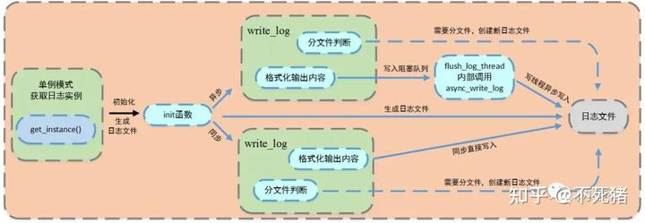

原作者以及知乎大佬都有些讲解，老规矩，放链接，然后用自己的话来说一下。

[最新版Web服务器项目详解 - 01 线程同步机制封装类mp.weixin.qq.com/s/esBsEsK45L9hipE7F6qiFg](https://link.zhihu.com/?target=https%3A//mp.weixin.qq.com/s/esBsEsK45L9hipE7F6qiFg)

以上是原作者写的公众号，详细的同时，也比较难啃，我主要从代码运行的角度解读。

整体框架


  

  

主程序的步骤：


这些函数在webserver.cpp函数中实现，效用注释得十分详细，我们也主要分几个步骤解读。

## 1、 init + log\_writer+sql\_pool+thread\_pool+trig\_mode初始化

这里的代码主要实现的初始化功能，服务器运行之初就开始实例化一些对象，直到最后服务器关闭。

### init函数

主要也是函数参数的初始化，比如一些服务器一开始就要使用的数据库账号密码等信息。

### log\_writer

是日志记录函数的初始化函数。

一共就一步：

```text
void WebServer::log_write()
{
    if (0 == m_close_log)
    {
        //初始化日志
        if (1 == m_log_write)
            Log::get_instance()->init("./ServerLog", m_close_log, 2000, 800000, 800);
        else
            Log::get_instance()->init("./ServerLog", m_close_log, 2000, 800000, 0);
    }
}
```

调用Log类的初始化函数，以单例模式（一个类只创建一个实例，提供全局访问）创建日志系统。

这里的m\_log\_write参数决定了日志的写入方式，默认是同步。

同步写入时与工作线程串行执行，会阻塞整个流程。

异步写入， 工作线程（生产者）会把内容先push进**阻塞队列（**生产者-消费者模型的封装，并发编程的模型，生产者push，消费者pop**），**由写线程（消费者）pop并写。

具体实现在log文件夹中。




**单例模式**

1、通过私有化构造函数，实现一个类只实例化一个对象；

2、使用私有静态指针变量指向类的唯一实例，并用一个公有的静态方法获取该实例。

分为懒汉模式与饿汉模式。懒汉模式，在第一次被使用时才进行初始化；饿汉模式，在程序运行时立即初始化

  

懒汉模式使用双检测锁模式，

饿汉模式在程序运行时就定义初始化了对象，不管哪个线程调用成员函数，都不过是返回对象的指针。

这里使用的是懒汉模式。

  

**阻塞队列**

封装了生产者-消费者模式，生产者push，消费者pop.

当队列为空时，从队列中获取元素的线程将会被挂起；当队列是满时，往队列里添加元素的线程将会挂起。

而在程序进程中，这几个宏定义函数，代表了写log

```text
#define LOG_INFO(format, ...) Log::get_instance()->write_log(1, format, __VA_ARGS__)
#define LOG_DEBUG(format, ...) Log::get_instance()->write_log(0, format, __VA_ARGS__)
```

### sql\_pool

数据库初始化，因为每次连接都需要访问数据库，频繁创建于断开十分耗时，所以使用数据库连接池，集中创建多个连接。连接使用信息量，访问使用互斥锁，保证多线程同步。与log\_write函数相同，其使用单例懒汉模式在初始阶段初始化，创建数据连接池。

  

### thread\_pool

线程池，就像数据库线程池解决了与数据库的反复连接， 线程池解决的是客户端与服务器的反复连接。tinywebserver实现的是半同步/半反应对线程池。

在这里的初始化就一句代码

```text
m_pool = new threadpool<http_conn>(m_actormodel, m_connPool, m_thread_num)
```

m\_actormodel：模型切换

m\_connPool:数据库连接池指针

m\_thread\_num:线程数量

我们这里的线程池处理的对象就是http类的GET与POST请求。

http类的具体实现之后会在程序运行时讲到，这里只是线程池的初始化。

thread\_pool类主线程为异步线程，负责监听fd，接受socket连接，当有socket读写的时候，就把任务插入到请求队列中，等待工作线程处理。

该类以下几个函数：

构造函数 threadpool：

线程id初始化，循环创建线程（因为是个池么），运行工作线程，线程分离。

添加任务append：

通过互斥锁保证安全，

然后添加到线程池，

```text
          m_workqueue.push_back(request)
```

通过信号量提醒有任务要处理。(sem 类型)

```text
          m_questat.post()
```

线程处理 worker

把参数转化为线程池类，调用run：

循环中：

信号量等待，互斥锁，从请求中获取任务，删除任务，解锁，取出数据库连接，处理任务，放回数据库连接。

### trig\_mode

触发模式

该项目实现了epoll（在第二节eventListen钟解释）对fd（文件描述符）的两种出发操作。：ET（边沿触发）和LT（电平触发）

LT的工作模式：当文件描述符上的事件就绪后，如果事务没有处理完成或者没有处理，那么下一次epoll会提醒应用程序。

ET的工作模式：当文件描述符上的事件就绪后，如果事务没有处理完成或者没有处理，那么下一次epoll则不会提醒应用程序，这就要求我们的应用程序在收到一次提醒后，必须将当下的数据处理完成。

在代码中的体现就是对m\_LISTENTrigmode 与 m\_CONNTrigmode 这两个参数设定为0或1，对应ET与LT模式。

之后根据这两个变量应对不同的触发。

**小结：**

这些都是些初始化的操作，包括设置变量，申请线程池等等。

  

## 2、 eventListen

主要干了三件事：

1、创建监听socket **m\_listenfd** (linux任何对象都是文件，fd为文件描述符) ， 并且初始化（bind，listen）；

2、epoll创建内核事件表**m\_epollfd,**将m\_listenfd插入事件表中；

3、创建管道**m\_pipefd,** 用于之后处理信号（定时器发送的等），并插入到m\_epollfd中。

  

这里涉及到两个定义，socket和epoll。


socket对运输层及以下层的抽象，我们写应用层的数据传输就只要管这个好了，服务器和客户端的通信可以简化成下图的样子：


就是socket的连接。

但是，这张图只是一对一的，如何连接更多的客户端呢？

所以就有了epoll， 一种I/O复用的技术，

具体实现就是，使用一个进程维护多个socket，通过一个系统调用函数从内核中获取多个事件：


  

只有三个函数：

**epoll\_create:** 创建一个指示epoll内核事件表的文件描述符，该描述符将用作其他epoll系统调用的第一个参数，size不起作用。

```text
 epoll_event events[MAX_EVENT_NUMBER];
 epollfd = epoll_create(5);
 assert(epollfd != -1);
```

**epoll\_ctl :** 用于操作内核事件表监控的文件描述符上的事件：注册、修改、删除

```text
epoll_ctl(int epfd, int op, int fd, struct epoll_event *event)
```

-   epfd：为epoll\_creat的句柄
-   op：表示动作，用3个宏来表示：

-   EPOLL\_CTL\_ADD (注册新的fd到epfd)，
-   EPOLL\_CTL\_MOD (修改已经注册的fd的监听事件)，
-   EPOLL\_CTL\_DEL (从epfd删除一个fd)；

-   event：告诉内核需要监听的事件,其类型包括：

-   EPOLLIN：表示对应的文件描述符可以读（包括对端SOCKET正常关闭）

-   EPOLLOUT：表示对应的文件描述符可以写
-   EPOLLPRI：表示对应的文件描述符有紧急的数据可读（这里应该表示有带外数据到来）
-   EPOLLERR：表示对应的文件描述符发生错误
-   EPOLLHUP：表示对应的文件描述符被挂断；
-   EPOLLET：将EPOLL设为边缘触发(Edge Triggered)模式，这是相对于水平触发(Level Triggered)而言的
-   EPOLLONESHOT：只监听一次事件，当监听完这次事件之后，如果还需要继续监听这个socket的话，需要再次把这个socket加入到EPOLL队列里

**epoll\_wait：** 用于等待所监控文件描述符上有事件的产生，返回就绪的文件描述符个数。

```text
epoll_wait(int epfd, struct epoll_event *events, int maxevents, int timeout)
```

-   events：用来存内核得到事件的集合，
-   maxevents：告之内核这个events有多大，这个maxevents的值不能大于创建epoll\_create()时的size，
-   timeout：是超时时间

-   \-1：阻塞
-   0：立即返回，非阻塞
-   \>0：指定毫秒

-   返回值：成功返回有多少文件描述符就绪，时间到时返回0，出错返回-1

这个函数主要在之后的循环过程中使用。

## 3、eventloop（）

这是一个循环，可以看作之前的都是初始化操作，最后这个就是主干。

通过上面所说的epoll\_wait（），**当有事件触发时，epoll内核事件表中的event就会赋值（比如说events\[i\].events & EPOLLIN， 就表示有写事件触发）并进入到链表中，这时epoll\_wait就能读取到该事件，并进行操作。**

1、新的客户连接， sockfd == m\_listenfd

调用accept函数， 创建cnnfd，初始化client\_data数据，设置回调函数和超时时间，绑定用户数据，将定时器添加到链表中。

2、处理异常事件， events\[i\].events & (EPOLLRDHUP | EPOLLHUP | EPOLLERR）

_//服务器端关闭连接，移除对应的定时器_

3、处理信号，(sockfd == m\_pipefd\[0\]) && (events\[i\].events & EPOLLIN)

对应之前申请的管道，管道上有了信号，（定时器发送的）

4、处理连接，events\[i\].events & EPOLLIN // events\[i\].events & EPOLLOUT

_//若监测到事件，将该事件放入请求队列_

```text
m_pool->append(users + sockfd, 0);
```

这里的m\_pool 是 之前定义的http\_conn的线程池，

users是http\_conn类的对象。

主线程主要处理的就是这一块，将任务append到线程池中，之后由工作线程完成操作。

## **4、http**

主线程append到线程池m\_pool,而工作线程，就像之前在thread\_pool中讲的那样，通过一个while循环，也一直在判断需不需要操作，当有了，就会抢互斥锁，然后执行process

```text
request->process();
```


我们现在解读的就是这个processor。

其主要流程如下图：


对于读写事件，设置m\_state，读为0， 写为1。

通过分别调用read\_once()函数 和 write（）函数。

**read\_once**读取请求报文，直到无数据可读，将这些数据读取到m\_read\_buffer中，并更新m\_read\_idx。

读取成功之后，就会调用process（）函数，其中包含process\_read和process\_write 进行报文的解析和响应：


通过一个while循环，将主从状态机进行封装，直到解析完报文，用do\_request对报文进行处理。

  

小结:

这就是一个整的流程，我写的时候是根据自己的理解，有详有略，主要针对我未来需要针对个人博客修改的地方，接下来，会在有时间的情况下（估计一个月），更新改为https等操作。

  

参考链接：

[最新版Web服务器项目详解 - 06 http连接处理（下）mp.weixin.qq.com/s/451xNaSFHxcxfKlPBV3OCg](https://link.zhihu.com/?target=https%3A//mp.weixin.qq.com/s/451xNaSFHxcxfKlPBV3OCg)

[这一年半，过的不容易！mp.weixin.qq.com/s/4HWMXZAj1aZDHr5A301d8w](https://link.zhihu.com/?target=https%3A//mp.weixin.qq.com/s/4HWMXZAj1aZDHr5A301d8w)