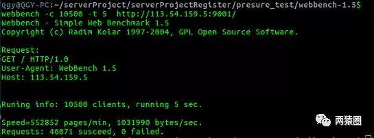
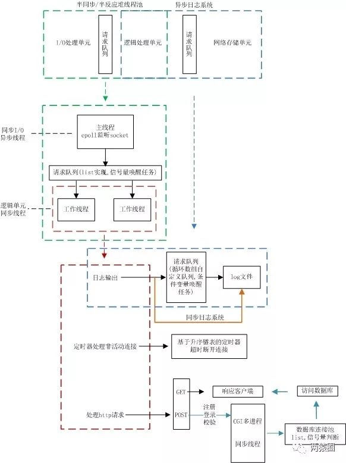

## 目录

- **00 项目概述**
- 01 线程同步机制包装类
- 02 半同步/半反应堆线程池（上）
- 03 半同步/半反应堆线程池（下）
- 04 http连接处理（上）
- 05 http连接处理（中）
- 06 http连接处理（下）
- 07 定时器处理非活动连接（上）
- 08 定时器处理非活动连接（下）
- 09 日志系统（上）
- 10 日志系统（下）
- 11 数据连接池
- 12 注册和登录校验
- 13 服务器测试
- 14 项目遇到的问题及解决方案
- 15 项目涉及的常见面试题

------

## 功能

- Linux下C++轻量级Web服务器基于C/C++语言和B/S模型

- 实现web端的注册和登录，通过数据库连接池访问服务器

- 实现同步和异步日志系统，记录服务器运行状态的功能

- 通过Webbench对服务器进行测试，可以实现上万并发连接

- - 每秒钟响应请求数：552852 pages/min
  - 每秒钟传输数据量：1031990 bytes/sec
  - 所有连接访问均成功




------

## 框架

- 项目框架主要分为I/O处理单元、逻辑处理单元和存储单元三个模块

- - I/O处理单元和逻辑处理单元对应**半同步/半反应堆线程池**
  - 逻辑处理单元和存储单元对应**数据库连接池和日志系统**

- **半同步/半反应堆线程池**将web端和服务器端建立通信

- - 实现http请求报文的处理与响应
  - 定时器完成非活动连接的处理

- **数据库连接池**避免频繁访问数据库，实现登录和校验功能

- **日志系统**实现同步和异步两种方式记录服务器运行状态




------

## 工作流程

以一个请求到来具体的处理过程介绍项目工作流程，具体包括web端和服务器建立连接，访问服务器数据库完成登录和注册，并通过定时器完成非活动连接的处理，最后服务器运行状态通过日志系统进行记录。

- web端和服务器端建立连接

- - 采用**epoll的边缘触发模式**同时监听多个文件描述符，采用**同步I/O模拟proactor模式**处理事件，主线程负责监听客户端是否发起请求
  - 当web端发起http请求时，主线程接收请求报文，然后将任务插入请求队列，由工作线程通过竞争从请求队列中获取任务
  - 通过**http类中的主从状态机**对请求报文进行分析，根据请求报文对客户端进行http响应，然后由主线程给客户端发送响应报文。

- 连接数据库

- - 单例模式创建**数据库连接池**，避免频繁建立连接，用于后续web端登录和注册校验访问服务器数据库

- 实现web端的登录和注册

- - web访问的欢迎界面为**GET请求**，登录和注册界面是**POST请求**。
  - 欢迎界面有新用户（0）和已有账号（1）两个选项，若选择新用户，会跳转注册(3)界面，注册成功或选择已有账号，跳转登录(2)界面，注册或登录失败会提示失败，成功和失败为0，1

- 同步/异步日志系统，记录服务器运行状态

- - 同步的方式下，工作线程直接写入日志文件
  - 异步会另外创建一个写线程，工作线程将要写的内容push进请求队列，通过写线程写入文件
  - 日志文件支持**按日期分类**，和**超过最大行数自动创建新文件**

- 非活动连接的处理

- - 由于非活跃连接占用了连接资源，严重影响服务器的性能，通过实现一个服务器定时器，处理这种非活跃连接，释放连接资源。
  - 利用**alarm函数周期性地触发SIGALRM信号**,该信号的信号处理函数利用管道通知主循环执行定时器链表上的定时任务.

------

## web端测试

- 测试前确认已安装MySQL数据库

  ```
  //建立yourdb库
  create database yourdb set utf8;
  
  //创建users表
  USE yourdb;
  CREATE TABLE users(
      username char(50) NULL,
      passwd char(50) NULL
  )ENGINE=InnoDB;
  
  //添加数据
  INSERT INTO users(username, passwd) VALUES('name', 'passwd');
  ```

- 修改main.c中的数据库初始化信息

  ```
  //root root为服务器数据库的登录名和密码
  connection_pool *connPool=connection_pool::GetInstance("localhost","root","root","yourdb",3306,5);
  ```

- 修改http_conn.cpp中的数据库初始化信息

  ```
  //root root为服务器数据库的登录名和密码
  connection_pool *connPool=connection_pool::GetInstance("localhost","root","root","yourdb",3306,5);
  ```

- 修改http_conn.cpp中的root路径

  ```
  const char* doc_root="/home/qgy/github/ini_tinywebserver/root";
  ```

- CGI多进程注册/登录校验

- - 打开http_conn.cpp中CGI,关闭同步线程

    ```
    380 //同步线程登录校验
    381 //#if 0
    423 //#endif
    
    425 //CGI多进程登录校验
    426 #if 0
    495 #endif
    ```

  - 修改sign.cpp中的数据库初始化信息

    ```
    //root root为服务器数据库的登录名和密码
    connection_pool *connPool=connection_pool::GetInstance("localhost","root","root","yourdb",3306,5);
    ```

  - 生成check.cgi

    ```
    make check.cgi
    ```

  - 将生成的check.cgi放到root文件夹

    ```
    cp ./check.cgi ./root
    ```

- 同步线程注册/登录校验

- - 关闭http_conn.cpp中CGI,打开同步线程

    ```
    380 //同步线程登录校验
    381 #if 0
    423 #endif
    
    425 //CGI多进程登录校验
    426 //#if 0
    495 //#endif
    ```

  - 生成server

    ```
    make server
    ```

- 启动server

  ```
  ./server port
  ```

- 浏览器端

  ```
  ip:port
  ```