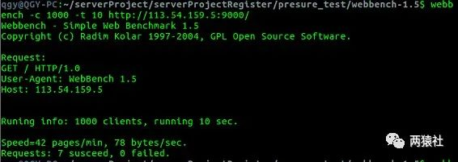
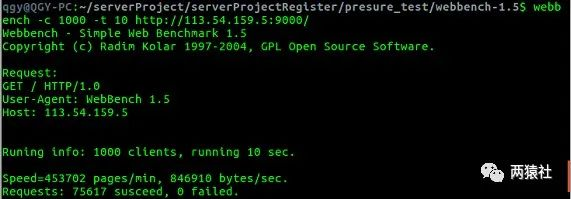

## Bug复现

使用Webbench对服务器进行压力测试，创建1000个客户端，并发访问服务器10s，正常情况下有接近8万个HTTP请求访问服务器。

结果显示仅有7个请求被成功处理，0个请求处理失败，**服务器也没有返回错误**。此时，从浏览器端访问服务器，发现该请求也不能被处理和响应，必须将服务器重启后，浏览器端才能访问正常。



------

## 排查过程

通过查询服务器运行日志，对服务器接收HTTP请求连接，HTTP处理逻辑两部分进行排查。

日志中显示，7个请求报文为:`GET / HTTP/1.0`的HTTP请求被正确处理和响应，**排除HTTP处理逻辑错误**。


因此，将**重点放在接收HTTP请求连接**部分。其中，服务器端接收HTTP请求的连接步骤为socket -> bind -> listen -> accept；客户端连接请求步骤为socket -> connect。

#### listen

```
#include<sys/socket.h>
int listen(int sockfd, int backlog)
```

- 函数功能，把一个未连接的套接字转换成一个被动套接字，指示内核应接受指向该套接字的连接请求。根据TCP状态转换图，**调用listen导致套接字从CLOSED状态转换成LISTEN状态**。

- backlog是队列的长度，内核为任何一个给定的监听套接口维护两个队列：

- - 未完成连接队列（incomplete connection queue），每个这样的 SYN 分节对应其中一项：已由某个客户发出并到达服务器，而服务器正在等待完成相应的 TCP 三次握手过程。**这些套接口处于 SYN_RCVD 状态**。
  - 已完成连接队列（completed connection queue），每个已完成 TCP 三次握手过程的客户对应其中一项。**这些套接口处于ESTABLISHED状态**。

#### connect

- 当有客户端主动连接（connect）服务器，Linux 内核就自动**完成TCP 三次握手**，该项就从未完成连接队列移到已完成连接队列的队尾，将建立好的连接自动存储到队列中，如此重复。

#### accept

- 函数功能，从处于ESTABLISHED状态的连接队列头部取出一个已经完成的连接(**三次握手之后**)。
- 如果这个队列**没有已经完成的连接，accept函数就会阻塞**，直到取出队列中已完成的用户连接为止。
- 如果，服务器不能及时调用 accept取走队列中已完成的连接，**队列满掉后，TCP就绪队列中剩下的连接都得不到处理，同时新的连接也不会到来。**

从上面的分析中可以看出，**accept**如果没有将队列中的连接取完，就绪队列中剩下的连接都得不到处理，也不能接收新请求，**这个特性与压力测试的Bug十分类似**。

------

## 定位accept

```
//对文件描述符设置非阻塞
int setnonblocking(int fd){
    int old_option=fcntl(fd,F_GETFL);
    int new_option=old_option | O_NONBLOCK;
    fcntl(fd,F_SETFL,new_option);
    return old_option;
}

//将内核事件表注册读事件，ET模式，选择开启EPOLLONESHOT
void addfd(int epollfd,int fd,bool one_shot)
{
    epoll_event event;
    event.data.fd=fd;
    event.events=EPOLLIN|EPOLLET|EPOLLRDHUP;
    if(one_shot)
        event.events|=EPOLLONESHOT;
    epoll_ctl(epollfd,EPOLL_CTL_ADD,fd,&event);
    setnonblocking(fd);
}

//创建内核事件表
epoll_event events[MAX_EVENT_NUMBER];
int epollfd=epoll_create(5);
assert(epollfd!=-1);

//将listenfd设置为ET边缘触发
addfd(epollfd,listenfd,false);

int number=epoll_wait(epollfd,events,MAX_EVENT_NUMBER,-1);

if(number<0&&errno!=EINTR)
{
    printf("epoll failure\n");
    break;
}

for(int i=0;i<number;i++)
{
    int sockfd=events[i].data.fd;

    //处理新到的客户连接
    if(sockfd==listenfd)
    {
        struct sockaddr_in client_address;
        socklen_t client_addrlength=sizeof(client_address);

        //定位accept
        //从listenfd中接收数据
        int connfd=accept(listenfd,(struct sockaddr*)&client_address,&client_addrlength);
        if(connfd<0)
        {
            printf("errno is:%d\n",errno);
            continue;
        }
        //TODO,逻辑处理
    }
}
```

分析代码发现，web端和服务器端建立连接，采用**epoll的边缘触发模式**同时监听多个文件描述符。

#### epoll的ET、LT

- LT水平触发模式

- - epoll_wait检测到文件描述符有事件发生，则将其通知给应用程序，应用程序可以不立即处理该事件。
  - 当下一次调用epoll_wait时，epoll_wait还会再次向应用程序报告此事件，直至被处理。

- ET边缘触发模式

- - epoll_wait检测到文件描述符有事件发生，则将其通知给应用程序，应用程序必须立即处理该事件。
  - **必须要一次性将数据读取完，使用非阻塞I/O，读取到出现eagain**。

从上面的定位分析，问题可能是**错误使用epoll的ET模式**。

------

## 代码分析修改

尝试将listenfd设置为LT阻塞，或者ET非阻塞模式下while包裹accept对代码进行修改，这里以ET非阻塞为例。

```
for(int i=0;i<number;i++)
{
    int sockfd=events[i].data.fd;

    //处理新到的客户连接
    if(sockfd==listenfd)
    {
        struct sockaddr_in client_address;
        socklen_t client_addrlength=sizeof(client_address);

        //从listenfd中接收数据
        //这里的代码出现使用错误
        while ((connfd = accept (listenfd, (struct sockaddr *) &remote, &addrlen)) > 0){
            if(connfd<0)
            {
                printf("errno is:%d\n",errno);
                continue;
            }
            //TODO,逻辑处理
        }
    }
}
```

将代码修改后，重新进行压力测试，问题得到解决，**服务器成功完成75617个访问请求，且没有出现任何失败的情况**。压测结果如下：



------

## 复盘总结

- Bug原因

- - established状态的连接队列backlog参数，历史上被定义为已连接队列和未连接队列两个的大小之和，大多数实现默认值为5。**当连接较少时**，队列不会变满，即使listenfd设置成ET非阻塞，不使用while一次性读取完，也**不会出现Bug**。
  - 若此时1000个客户端同时对服务器发起连接请求，连接过多会造成established 状态的连接队列变满。但accept并没有使用while一次性读取完，只读取一个。因此，连接过多导致TCP就绪队列中剩下的连接都得不到处理，同时新的连接也不会到来。

- 解决方案

- - 将listenfd设置成LT阻塞，或者ET非阻塞模式下while包裹accept即可解决问题。

该Bug的出现，本质上对epoll的ET和LT模式实践编程较少，没有深刻理解和深入应用。