main函数中

首先需要修改数据库信息，包括登录名，密码，库名

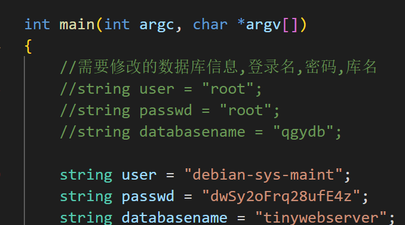

接下来是命令行的解析

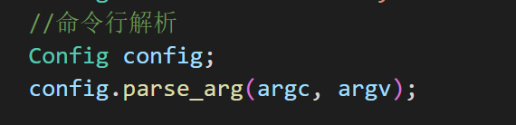


最重要的是parse_arg的解析函数，包括2个参数，argc，argv

argc默认以1开始，然后有一个参数就是加一，以空格分割，那么参数就是继续加


当程序启动时，命令行参数会以字符指针数组的形式传递给main函数。其中第一个参数是程序名，接下来的参数则是用户输入的命令行参数。在本例中，命令行参数以argv数组的形式传递给Config::parse_arg函数。

getopt函数是一个常用的C语言库函数，可以用来解析命令行参数。它的函数原型如下：

```
c++Copy code
int getopt(int argc, char *const argv[], const char *optstring);
```

其中，argc和argv是从main函数中接收到的参数，optstring是一个表示命令行参数的字符串。这个字符串由各种选项字符组成，每个选项字符表示一个命令行选项。如果选项字符后面有冒号，表示该选项需要带一个参数。

在Config::parse_arg函数中，optstring被定义为一个包含多个选项字符的字符串。例如，'p'表示"-p"选项，'l'表示"-l"选项，以此类推。

在while循环中，每次使用getopt函数获取下一个命令行参数。如果获取成功，getopt会返回当前选项字符的ASCII码，如果获取失败则返回-1。这个值被赋值给变量opt。

switch语句根据opt的值匹配对应的选项字符，然后执行相应的操作。例如，如果opt的值为'p'，则使用atoi函数将optarg转换为整数，并将结果赋值给Config类中的PORT成员变量。

在每个case语句的末尾，break语句用于跳出switch语句，继续执行while循环中的下一次迭代。

总体来说，这个函数的作用是解析命令行参数，并根据参数的类型修改Config类中对应的成员变量的值。


Webserver 服务器定义

初始化

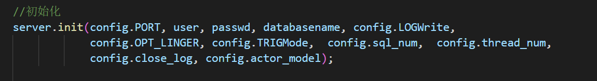

利用config文件中解析出的成员变量来初始化web服务器中的变量

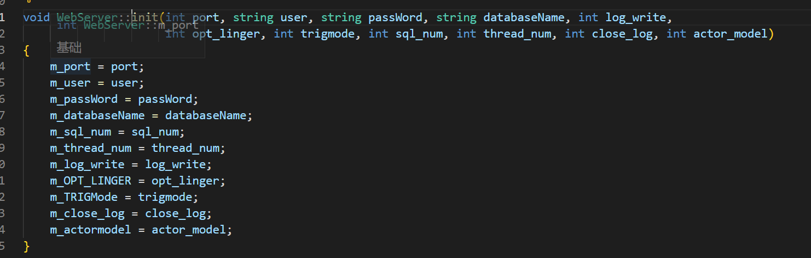

服务器日志系统


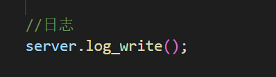

如果开启了日志，默认开启

m_close_log==0

那就初始化日志

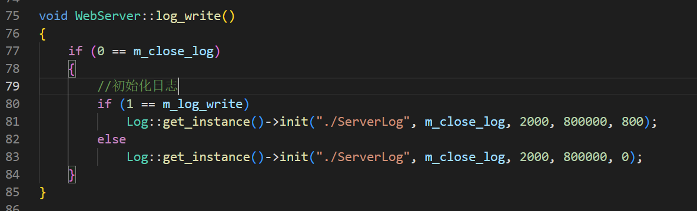

数据库池

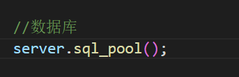

初始化数据库连接池

getInstance就是返回对象实例，还是一个静态成员变量


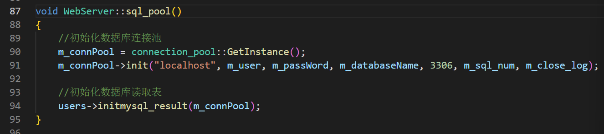


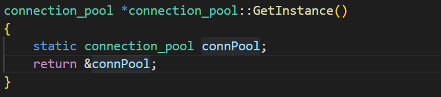

构造初始化

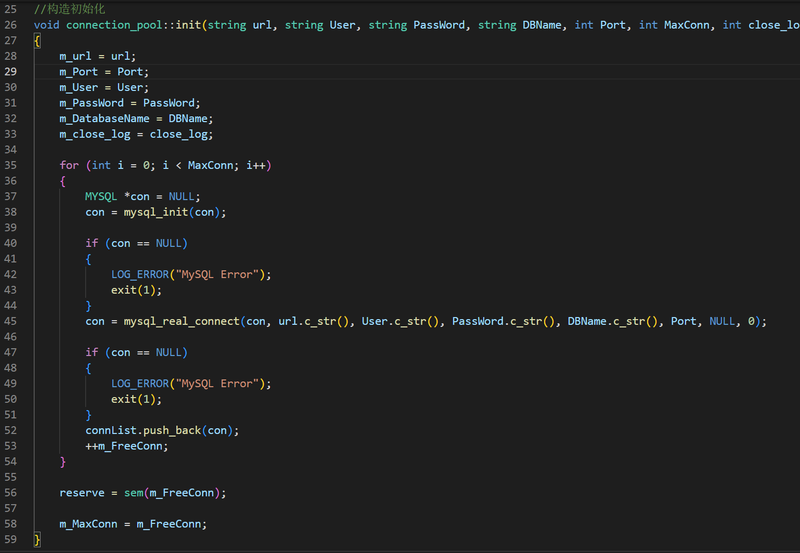

线程池初始化

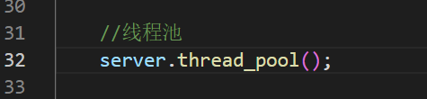

线程池实例

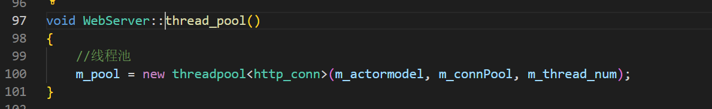

new 调用有参构造

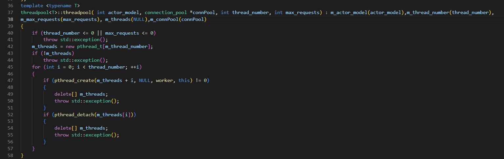


触发模式

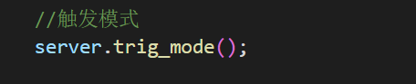


服务器触发模式的指定

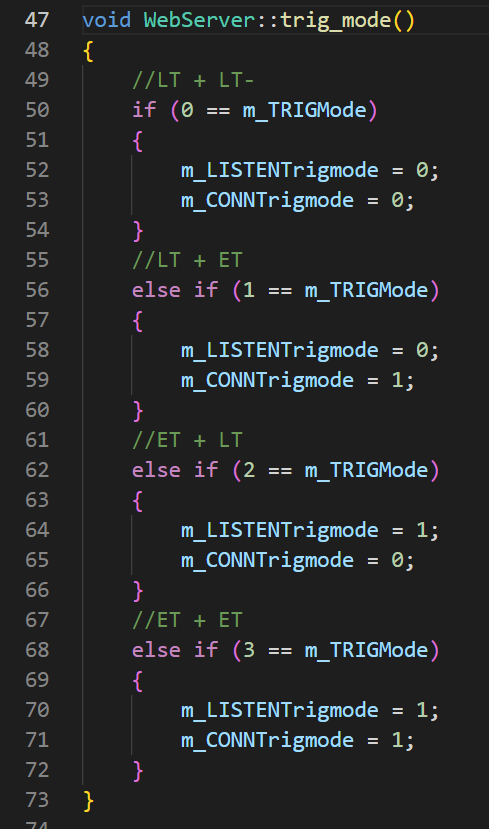


服务器监听客户端

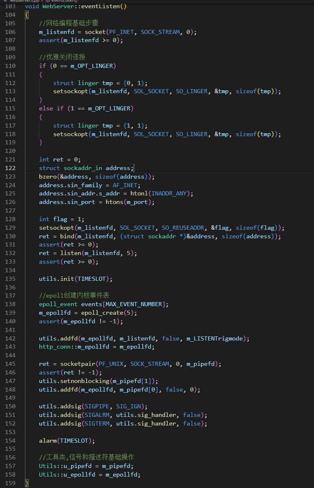


#### 运行服务器

```cpp
void WebServer::eventLoop()
{
    bool timeout = false;
    bool stop_server = false;

    while (!stop_server)
    {
        int number = epoll_wait(m_epollfd, events, MAX_EVENT_NUMBER, -1);
        if (number < 0 && errno != EINTR)
        {
            LOG_ERROR("%s", "epoll failure");
            break;
        }

        for (int i = 0; i < number; i++)
        {
            int sockfd = events[i].data.fd;

            //处理新到的客户连接
            if (sockfd == m_listenfd)
            {
                bool flag = dealclinetdata();
                if (false == flag)
                    continue;
            }
            else if (events[i].events & (EPOLLRDHUP | EPOLLHUP | EPOLLERR))
            {
                //服务器端关闭连接，移除对应的定时器
                util_timer *timer = users_timer[sockfd].timer;
                deal_timer(timer, sockfd);
            }
            //处理信号
            else if ((sockfd == m_pipefd[0]) && (events[i].events & EPOLLIN))
            {
                bool flag = dealwithsignal(timeout, stop_server);
                if (false == flag)
                    LOG_ERROR("%s", "dealclientdata failure");
            }
            //处理客户连接上接收到的数据
            else if (events[i].events & EPOLLIN)
            {
                dealwithread(sockfd);
            }
            else if (events[i].events & EPOLLOUT)
            {
                dealwithwrite(sockfd);
            }
        }
        if (timeout)
        {
            utils.timer_handler();

            LOG_INFO("%s", "timer tick");

            timeout = false;
        }
    }
}
```


最后终止


