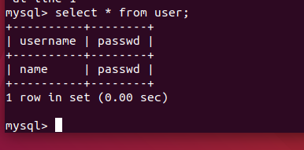
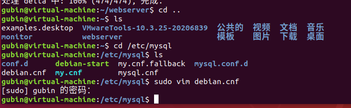

# 环境配置

**系统环境：**
ubuntu 18.04（在centos上测试了很多次，但是由于环境的问题，安装的mysql一直找不到正确的用户名和密码）
需要用到git apt-get install git`g++环境用来编译：`apt-get install build-essential


```
df -h查看系统剩余硬盘资源

```


安装完后

只花了一个G


## 下载源码

```
mkdir webserver  //创建项目目录
cd webserver
```


```
//克隆项目
git clone git@github.com:qinguoyi/TinyWebServer.git
```


## 安装数据库

**3.1安装mysql**

```bash
sudo apt-get install mysql-server
```


**3.2 进行初始化配置**

```bash
sudo mysql_secure_installation
```

**配置项较多，如下**

```
#1
VALIDATE PASSWORD PLUGIN can be used to test passwords...
Press y|Y for Yes, any other key for No: N (我的选项)
#2
Please set the password for root here...
New password: (输入密码)
Re-enter new password: (重复输入)
#3
By default, a MySQL installation has an anonymous user,
allowing anyone to log into MySQL without having to have
a user account created for them...
Remove anonymous users? (Press y|Y for Yes, any other key for No) : N (我的选项)
#4
Normally, root should only be allowed to connect from
'localhost'. This ensures that someone cannot guess at
the root password from the network...
Disallow root login remotely? (Press y|Y for Yes, any other key for No) : Y (我的选项)
#5
By default, MySQL comes with a database named 'test' that
anyone can access...
Remove test database and access to it? (Press y|Y for Yes, any other key for No) : N (我的选项)
#6
Reloading the privilege tables will ensure that all changes
made so far will take effect immediately.
Reload privilege tables now? (Press y|Y for Yes, any other key for No) : Y (我的选项)

```


**3.3检查mysql状态**

```bash
systemctl status mysql.service
```


**3.4 进入mysql**

```bash
sudo mysql -uroot -p
```


3.5 根据readme操作mysql，这里其实就是写sql语句了
分别包括创建数据库 yourdb，use相当于进入这个数据库，创建user表

	create database yourdb;
	USE yourdb;
	CREATE TABLE user(
	    username char(50) NULL,
	    passwd char(50) NULL
	)ENGINE=InnoDB;
	INSERT INTO user(username, passwd) VALUES('name', 'passwd');

```
//我的
create database mydb;
USE mydb;
CREATE TABLE user(
    username char(50) NULL,
    passwd char(50) NULL
)ENGINE=InnoDB;
INSERT INTO user(username, passwd) VALUES('name', 'passwd');
```


可以利用以下命令查看表和表的内容：

```sql
	use mydb;
	show databases; //可以查看当前的数据库
	show tables;
	select *from user;
```




## 4. 编译Tinywebserver

4.1 首先需要确认main.cpp里的数据库和你mysql数据库配置相同。
查看数据库名称和密码

```bash
	cd /etc/mysql
	sudo vim debian.cnf
```


然后打开main.cpp修改对应配置


我的



```
# Automatically generated for Debian scripts. DO NOT TOUCH!
[client]
host     = localhost
user     = debian-sys-maint
password = JXuRGeLvQO36ZaAo
socket   = /var/run/mysqld/mysqld.sock
[mysql_upgrade]
host     = localhost
user     = debian-sys-maint
password = JXuRGeLvQO36ZaAo
socket   = /var/run/mysqld/mysqld.sock

```


安装tree

```
sudo apt-get install tree
```


修改main.cpp文件


4.2 编译Tinywebserver(编译运行)

```bash
cd Tinywebserver

sh ./build.sh
```

编译时遇到的错误：**fatal error: mysql.h: No such file or directory**
解决方法：安装链接库 `apt-get install libmysqlclient-dev`


执行build.sh脚本

出现错误


确保在执行之前，你已经为 `build.sh` 文件添加了可执行权限。如果没有执行权限，你可以使用以下命令来添加权限：

```

chmod +x build.sh
```

执行上述命令后，再使用 `./build.sh` 命令即可直接执行 `build.sh` 脚本。


继续执行脚本 可以sh ./build.sh 也可以直接./build.sh


出现问题，没有找到make

安装make

sudo apt-get install make


继续执行脚本 可以sh ./build.sh 也可以直接./build.sh


出现错误

g++编译环境没有

apt-get install build-essential


```bash
./server
```

这时候命令是没有退出的，如果退出且日志里出现Mysql error大部分情况是因为数据库没连上，可以去github看一下相关问题


## 5查看效果

输入ip:9006就可以进行登录注册操作了，而且mysql数据库是动态更新的。
可以用[云服务器](https://so.csdn.net/so/search?q=云服务器&spm=1001.2101.3001.7020)公网ip加9006进行访问


# gdb调试

生成可调试的可执行文件

makefile中加 -g


make clean 

make 


### 配置launch.json文件

需要配置的是program位置

填写可执行文件的绝对路径


此时可调试


但是不要去尝试生成可执行文件

因为那样，你要去再配置vscode文件好像，这里不再叙述，后面有机会在写。


#### 可以加 -  - - 等args参数去调试。