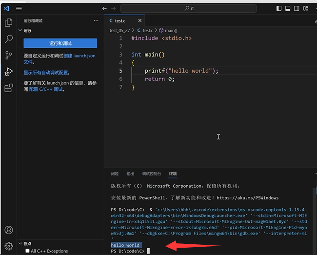

# 安装MinGW

[MinGW-w64 - for 32 and 64 bit Windows - Browse /mingw-w64/mingw-w64-release at SourceForge.net](https://sourceforge.net/projects/mingw-w64/files/mingw-w64/mingw-w64-release/)

## 一、MinGW-w64介绍

MinGW 的全称是：Minimalist GNU on Windows ，实际上是将gcc（c/c++编译器）移植到了 Windows 平台下，并且包含了 Win32API ，因此可以将源代码编译为可在 Windows 中运行的可执行程序。而且还可以使用一些 Windows 不具备的，Linux平台下的开发工具。

选择它的原因：

1.  1\. MinGW-w64 是开源软件，可以免费使用。
2.  2\. MinGW-w64 由一个活跃的开源社区在持续维护，不会过时。
3.  3\. MinGW-w64 支持最新的 C语言 标准。
4.  使用 Windows 的C语言运行库，因此编译出的程序不需要第三方 DLL ，可以直接在 Windows 下运行。

总之就是要在windows运行c/c++按就对了。可以理解为c/c++的编译器gcc的windows版。

## 二、MinGW-w64下载与安装

### 1.下载解压安装

官方下载网站：[MinGW-w64 - for 32 and 64 bit Windows download | SourceForge.net](https://sourceforge.net/projects/mingw-w64/ "MinGW-w64 - for 32 and 64 bit Windows download | SourceForge.net")


 页面向下拉，找到下一张图的位置


1.   x86\_64是指64位的操作系统，i686是指32位的操作系统（别问我为啥不是x32！）
2.  win32是开发windows系统程序的协议，posix是其他系统的协议（例如Linux、Unix、Mac OS）
3.  异常处理模型 seh（新的，仅支持64位系统），sjlj （稳定的，64位和32位都支持），    dwarf （优于sjlj的，仅支持32位系统）
4.  （谁知道Build revision是干嘛用的，评论区告诉一下，谢谢了） 


 

 


### 2、环境变量配置


  


 配置好后别忘了点击 **确认！确认！确认！**

###  3、验证配置成功


##  三、测试c程序（可有可无）


 


 （结尾：个人理解，gcc是c/c++的编译器，但是通常在 Linux 上才能用。如果要在windows上用，我们要借助MinGW使用它。在MinGW官网上，可以下载 zip 也可以下载 exe 执行文件，但是 .exe执行文件在安装时，其实是会根据你的选择去下载 zip ，而且网速不好根本下不下来，会报错，所以我们直接选择对应版本的 zip 文件下载就可以了。如有错误，还请前辈们评论区指正。）

## 四、补充

### 我个人安装的是这个版本


原因是我发现这个版本下，我可以在Linux下使用C++11 thread库，而之前好像下的win32版本，无法在Linux环境下调试，并且好像也没办法使用thread，这里的原因是我在其他博客和自己实践得出的。

# vscode配置环境

## 1.添加文件夹

### 再建一个放代码的文件夹，不要有中文

## 2.安装C/C++扩展


安装扩展，后可以重启

## 3.运行C语言文件




## 4.修改task.json文件


# vscode调试

## 1.调试，配置launch.json文件


## 2.修改launch.json

修改2处，文件和gdb位置


# 多文件运行和调试

不需要修改配置，上述同样适应于多文件

## 1.运行


## 2.调试


# 多项目管理

### 1.同样不妨碍，多文件也同样可以


# C++环境配置

### 1.点击运行，选择g++


### 补充

个人配置


```json
{
    "tasks": [
        {
            "type": "cppbuild",
            "label": "C/C++: g++.exe 生成活动文件",
            "command": "E:\\MinGW\\mingw64\\bin\\g++.exe",
            "args": [
                "-fdiagnostics-color=always",
                "-g",
                //"${file}",
                "*.cpp",
                "-o",
                "${fileDirname}\\${fileBasenameNoExtension}.exe"
            ],
            "options": {
                "cwd": "${fileDirname}"
            },
            "problemMatcher": [
                "$gcc"
            ],
            "group": {
                "kind": "build",
                "isDefault": true
            },
            "detail": "调试器生成的任务。"
        }
    ],
    "version": "2.0.0"
}
```


```json
{
    "configurations": [
        {
            "name": "(gdb) 启动",
            "type": "cppdbg",
            "request": "launch",
            "program": "${fileDirname}\\${fileBasenameNoExtension}.exe",
            "args": [],
            "stopAtEntry": false,
            "cwd": "${fileDirname}",
            "environment": [],
            "externalConsole": false,
            "MIMode": "gdb",
            //"miDebuggerPath": "/path/to/gdb",
            "miDebuggerPath": "E:\\MinGW\\mingw64\\bin\\gdb.exe", //gdb的位置
            "setupCommands": [
                {
                    "description": "为 gdb 启用整齐打印",
                    "text": "-enable-pretty-printing",
                    "ignoreFailures": true
                },
                {
                    "description": "将反汇编风格设置为 Intel",
                    "text": "-gdb-set disassembly-flavor intel",
                    "ignoreFailures": true
                }
            ]
        }
    ]
}
```

