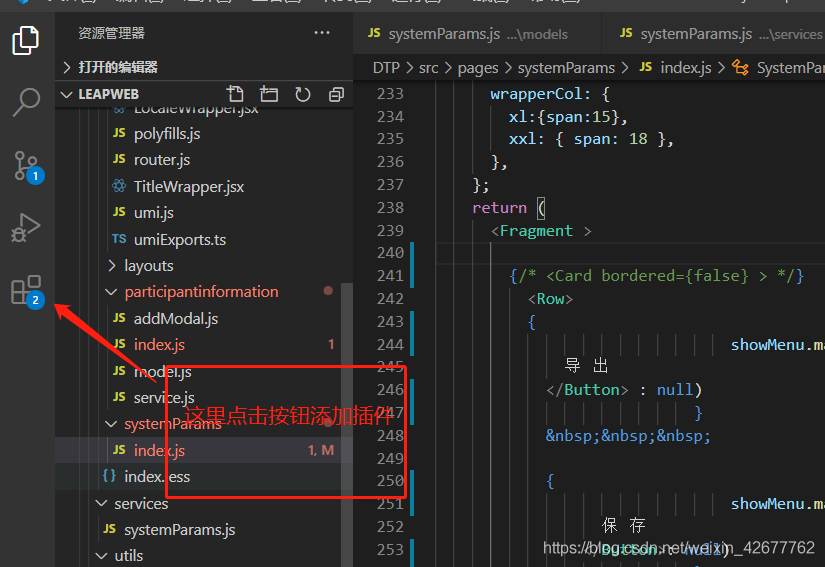
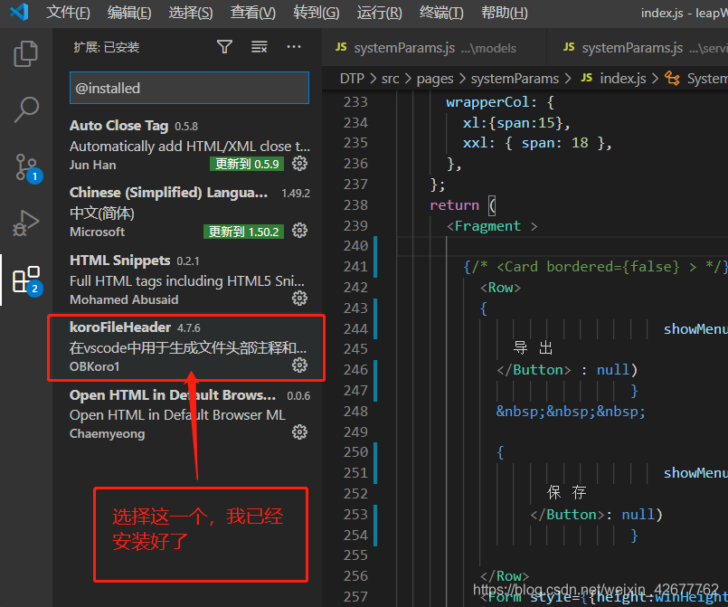
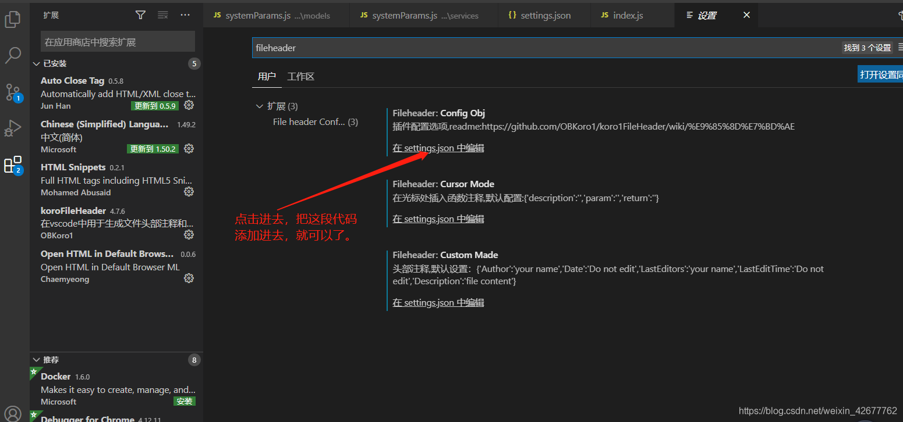
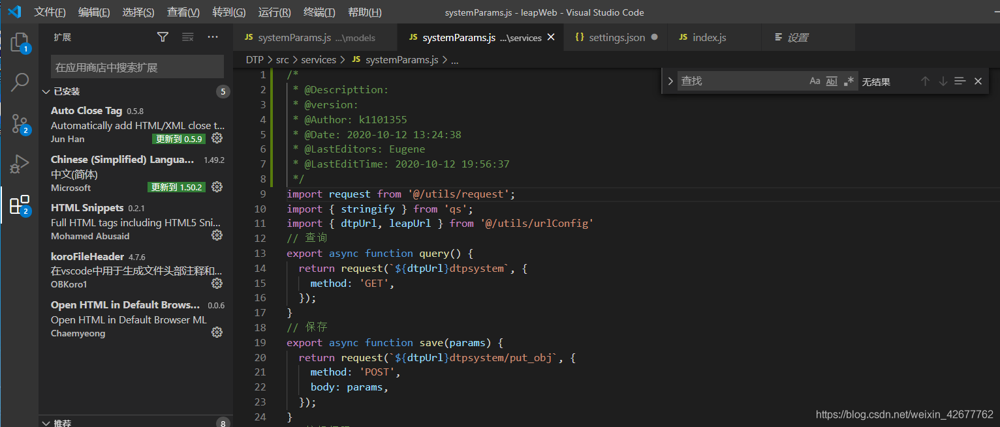
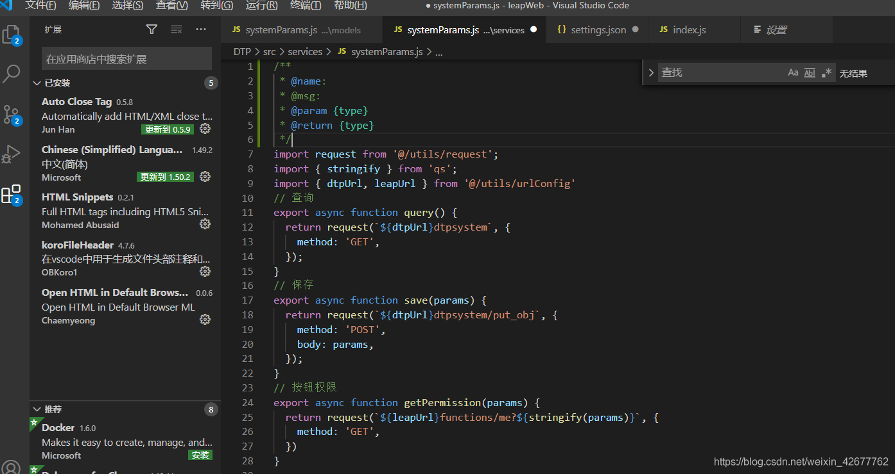
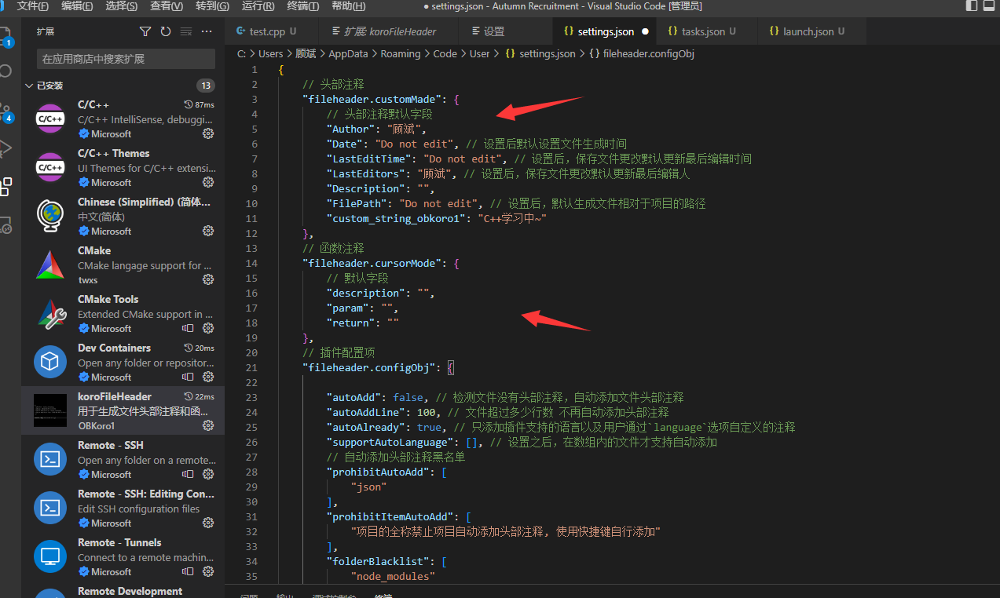

## [vscode](https://so.csdn.net/so/search?q=vscode&spm=1001.2101.3001.7020)如何添加头部注释、作者注释

Visual Studio Code是微软开发的编辑器， 目前国内使用的用的人是越来越多。那么vscode如何添加头部注释，让你的代码有很明显的标识呢？  
第一步：  
打开Visual Studio Code编辑器。找到vscode右下角那个添加插件的按钮



点击插件按钮后， 在输入框内输入fileheader回车，选择第一个。如第二图所示，点击install（安装）按钮。  
左下角选择管理—设置—输入"fileheader"—点击"在setting.json中编辑"  


把下面的代码放到json文件父对象中  


然后记得改一下你的名字，我的英文名：Eugene.tom.lee 你也可以改成例如：K1101355这样子的自己的工号。（对了，代码奉上。）

```javascript
// 文件头部注释
    "fileheader.customMade": {
        "Descripttion":"",
        "version":"",
        "Author":"Eugene",
        "Date":"Do not edit",
        "LastEditors":"Andy",
        "LastEditTime":"Do not Edit"
    },
    //函数注释
    "fileheader.cursorMode": {
        "name":"",
        "msg":"",
        "param":"",
        "return":""
    },
```

最后检查一下，发现成功了，嘻嘻。

**快捷键：ctrl + alt + i 生成头部注释**  


**快捷键：ctrl + alt + t 生成函数注释**  


# 补充个人

已安装插件


### 以后还可以再改



我这里的快捷键是

ctrl + win + i