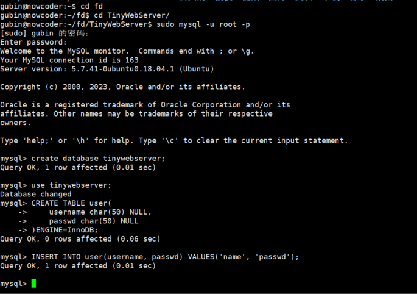
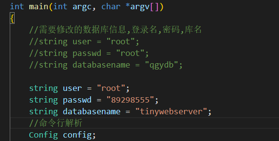
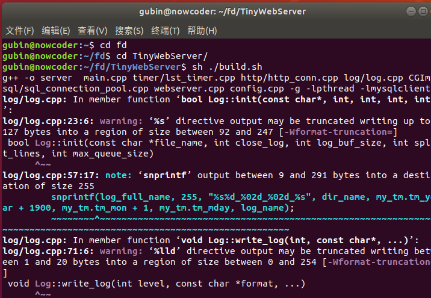
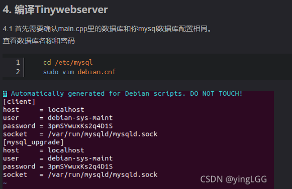
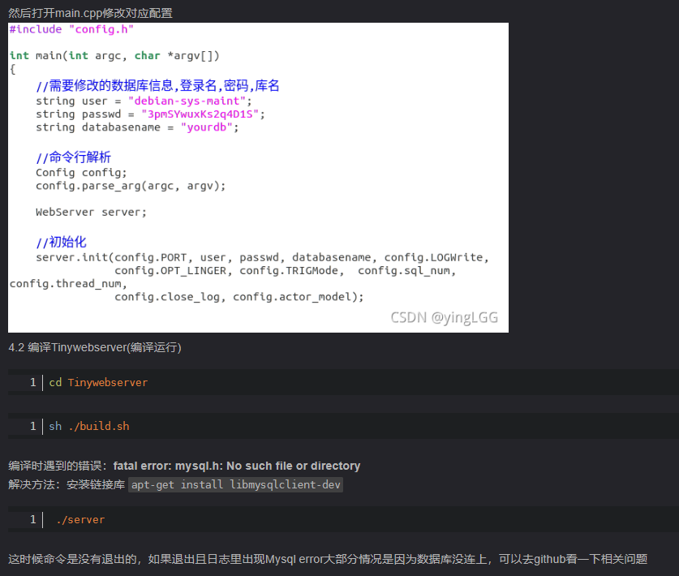
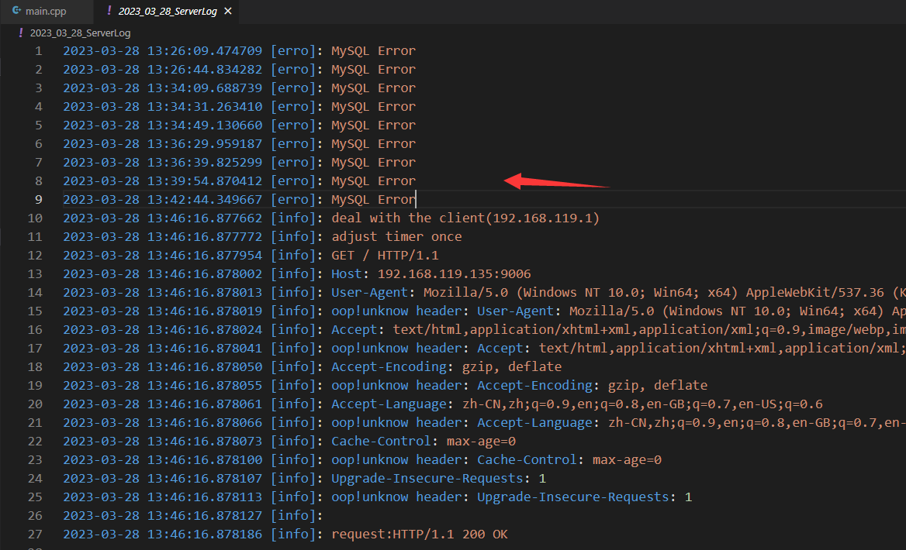
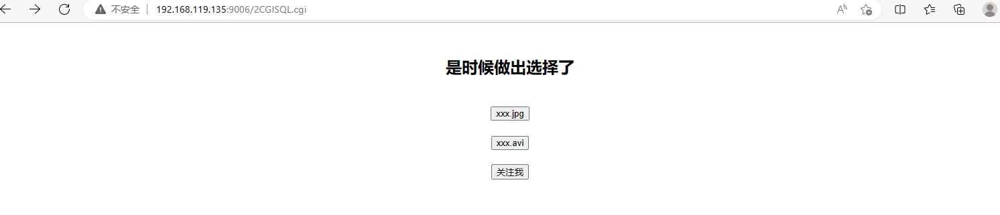
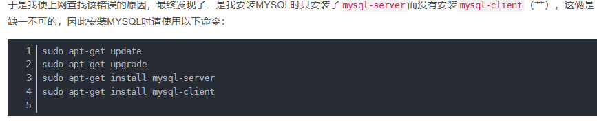

# TinyWebServer

Linux下C++轻量级Web服务器，助力初学者快速实践网络编程，搭建属于自己的服务器.

- 使用 **线程池 + 非阻塞socket + epoll(ET和LT均实现) + 事件处理(Reactor和模拟Proactor均实现)** 的并发模型
- 使用**状态机**解析HTTP请求报文，支持解析**GET和POST**请求
- 访问服务器数据库实现web端用户**注册、登录**功能，可以请求服务器**图片和视频文件**
- 实现**同步/异步日志系统**，记录服务器运行状态
- 经Webbench压力测试可以实现**上万的并发连接**数据交换


- ### 测试前确认已安装MySQL数据库

  ```
  // 建立yourdb库
  create database tinywebserver;
  
  // 创建user表
  USE tinywebserver;
  CREATE TABLE user(
      username char(50) NULL,
      passwd char(50) NULL
  )ENGINE=InnoDB;
  
  // 添加数据
  INSERT INTO user(username, passwd) VALUES('name', 'passwd');
  ```



- ### 修改main.cpp中的数据库初始化信息

  ```
  //数据库登录名,密码,库名
  string user = "root";
  string passwd = "root";
  string databasename = "yourdb";
  ```



- build

  ```
  sh ./build.sh
  ```



- 启动server

  ```
  ./server
  ```

  

- 浏览器端

  ```
  ip:9006
  ```

上网查了后发现数据库的名字和密码必须这样获取





之后就可以了，否则并没有连接上数据库



连接上去了






sudo apt-get install mysql-client