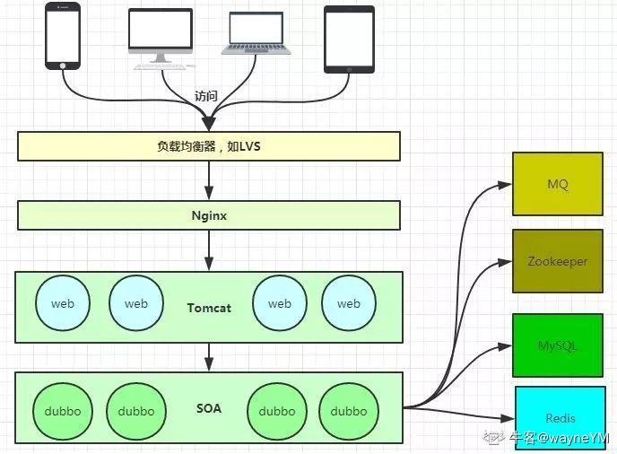

当然服务器的知识点远不及我所列出来的这些，但是对于校招生来说也差不多够用了。希望能对大家有所帮助呀！有一些问题的答案来源于互联网，有一些问题的答案是我自己写的，难免会有缺漏~提前感谢大家的指正！

在此我也想对WebServer服务器的各个知识点做一个我所理解的**重点排序**，排序标准依据知识点考察概率和知识点难度，排序越前越重要。**个人理解，仅供参考~**

1. 并发相关知识点(epoll、select)
2. 线程池(实现)，webserver工作流程(reactor和proactor异同)、压测
3. 连接池(数据库)、HTTP
4. 日志、定时器(心跳)
5. 其他零散知识点

第三篇包含的重点知识点

- 压测及相关知识
- 提升服务器性能的方法
- 当下流行的一些技术架构
- 端口与连接的相关问题
- 一些零星的补充

**完结撒花！！！！**如果对你有所帮助的话希望可以点个赞点个收藏点个关注呀！这对于我来说很重要。

**也祝愿大家拿到理想的offer！冲，功不唐捐，每一步的努力都算数。**

## 服务器压力测试

### 压测服务器的方式

Webbench是常用的web 性能压力测试工具。

- 测试处在相同硬件上，不同服务的性能以及不同硬件上同一个服务的运行状况。
- 展示服务器的两项内容：每秒钟响应请求数和每秒钟传输数据量。

### 压测基本原理

Webbench 首先 fork 出多个子进程，每个子进程都循环做 web 访问测试。子进程把访问的结果通过pipe 告诉父进程，父进程做最终的统计结果。

### 压测的瓶颈会在哪里

- io同步读
- 存进内存
- 不同项目可能会有不同的点

### 怎么验证压测瓶颈的猜测

查看系统参数

- 内存
- cpu
- 文件描述符
- 磁盘io
- 看内核态和用户态占用的cpu比率
- 火焰图

### 网络相关的一些命令

- 查看端口状态(netstat)
- 抓包(tcpdump)

### http的问题

http报文怎么检测头部和包体的间隔(两个换行)

怎么检测包体的结束(在头部有一个content-length,然后你收内容为这个长度即可)

## 进一步提升服务器性能的方向

高并发

- 线程->协程
- Nginx动静态分离

单个服务性能

- 多线程传输

> 实现原理
>
> 将源文件按长度为分为N块文件,然后开辟N个线程,每个线程传输一块,最后合并所有线线程文件.比如
> 一个文件500M我们按长度可以分5个线程传输.第一线程从0-100M,第二线程从100M-200M......最后合并5个线程文件.
>
> 实现流程
>
> 1.客户端向服务端请求文件信息(名称,长度)
> 2.客户端跟据文件长度开辟N个线程连接服务端
> 3.服务端开辟新的线程与客户端通信并传输文件
> 4.客户端将每线程数据保存到一个文件
> 5.合并所有线程文件

## 各种模型的优化方案

**这里可能需要有一定理解和基础才能看懂，看不懂就跳过就好了，未来就能看懂的嘿嘿。**

#### 同步写非阻塞模型怎么优化

异步写非阻塞(aio_read)

proactor模式

静态页面动态页面分离

增加集群服务器(多进程)

同步多线程和异步多线程区别

#### 同步多线程的瓶颈

线程数

reactor模型是同步读

#### 异步多线程的缺点

异步导致逻辑复杂

需要考虑线程间同步互斥问题。

#### 各种模式的总结

1、同步单线程模式

优点：a）实现简单。b）不用考虑线程间同步互斥问题。

缺点：a）对CPU的使用率不高（容易在进行IO操作或自身等待操作时阻塞），在多CPU时劣势更明显。b）并发性不好，在有的事件需要长时间占用CPU处理的情况下，其他事件会长时间等待得不到处理。

2、同步多线程模式

优点：a）对CPU的使用率较高，在多CPU时优势更明显。b）并发性好，各线程都能根据优先级得到执行。

缺点：a）需要考虑线程间同步互斥问题。b）实现较复杂，不同线程的业务步骤有相互依赖时，需要分解实现成状态机及事件通知驱动模式（或者轮询模式）。

3、异步多线程模式

优点：a）对CPU的使用率高，在多CPU时优势更明显。b）并发性好，各线程都能根据优先级得到执行。

缺点：a）需要考虑线程间同步互斥问题。b）实现复杂，要把所有会导致阻塞的操作转化为异步操作，另外不同线程的业务步骤有相互依赖时，需要分解实现成状态机及事件通知驱动模式（或者轮询模式）。

4、异步单线程模式

优点：a）对CPU的使用率高。b）不用考虑线程间同步互斥问题。

缺点：a）实现较复杂，要把所有会导致阻塞的操作转化为异步操作。b）并发性不好，在有的事件需要长时间占用CPU处理的情况下，其他事件会长时间等待得不到处理。c）在多CPU时不如多线程高效。

简单的说：同步实现简单但是CPU利用率低，异步实现复杂但是CPU利用率高。

单线程不用考虑互斥但是并发性、多CPU利用率低，多线程需要考虑互斥但是并发性、多CPU利用率高。

综合参考[https://blog.csdn.net/weiganyi/article/details/11142763](https://hd.nowcoder.com/link.html?target=https://blog.csdn.net/weiganyi/article/details/11142763)

# 当下流行的技术架构



## 使用多线程多进程的服务器/常见服务器

- [Apache](https://hd.nowcoder.com/link.html?target=https://baike.baidu.com/item/apache/6265)：多进程，核心模块就叫做多路处理模块(Multi-ProcessingModule，简称MPM)。
- [IIS](https://hd.nowcoder.com/link.html?target=https://blog.csdn.net/zhuchenchangk163/article/details/109454248)：多进程，应用程序池。在Web园中你可以配置此应用程序池所使用的最大工作进程数。
- [Nginx](https://hd.nowcoder.com/link.html?target=https://blog.csdn.net/m0_38110132/article/details/75126316)：多进程+多路I/O复用+epoll。
- [Tomcat](https://hd.nowcoder.com/link.html?target=https://blog.csdn.net/lilizhou2008/article/details/109153009)：多线程
- Lighttpd：多线程

# 端口与连接相关问题

## 可以多个线程监听同一个端口吗

- 可以的，比如一个tcp一个udp
- 看5元组(服务器ip 服务器端口 协议 客户端ip 客户端端口)唯一确定一个连接
- 多个tcp多个udp监听同一个端口，accept会**随机返回**
- 要打开**端口复用**

## tcp/udp可以绑定同一个端口吗(镜像问题)

tcp/udp均**不可以**两个同类的监听socket绑定在同一个端口上。

但是**可以一个tcp一个udp同时绑定一个端口。**

由上述结果可知：TCP、UDP可以同时绑定一个端口8888，但是一个端口在同一时刻不可以被TCP或者UDP绑定2次。
原因如下：

1. tcp的端口不是物理概念，仅仅是协议栈中的两个字节；
2. TCP和UDP的端口完全没有任何关系，完全有可能又有一种XXP基于IP，也有端口的概念，这是完全可能的；
3. TCP和UDP传输协议监听同一个端口后，接收数据互不影响，不冲突。因为数据接收时时根据五元组**{传输协议，源IP，目的IP，源端口，目的端口}**判断接受者的。

#### 端口复用的应该仅在这些环境下使用

1、当有一个有相同本地地址和端口的socket1处于TIME_WAIT状态时，而你启动的程序的socket2要占用该地址和端口，你的程序就要用到该选项。

2、SO_REUSEADDR允许**同一port上启动同一服务器的多个实例**(多个进程)。但**每个实例绑定的IP地址是不能相同**的。在有多块网卡或用IP Alias技术的机器可以测试这种情况。

3、SO_REUSEADDR允许**单个进程绑定相同的端口到多个socket上**，但**每个socket绑定的ip地址**不同。这和2很相似，区别请看UNPv1。

4、SO_REUSEADDR**允许完全相同的地址和端口的重复绑定。但这只用于UDP的多播，不用于TCP。**

需要注意的是，设置端口复用函数要在绑定之前调用，而且只要绑定到同一个端口的所有套接字都得设置复用：

#### socket连接的理解

如果一个程序创建了一个socket，并让其监听80端口，其实是向TCP/IP协议栈声明了其对80端口的占有。以后，所有目标是80端口的TCP数据包都会 转发给该程序（这里的程序，因为使用的是Socket编程接口，所以首先由Socket层来处理）。所谓accept函数，其实抽象的是TCP的连接建立过程。accept函数返回的新socket其实指代的是本次创建的连接，而一个连接是包括两部分信息的，一个是源IP和源端口，另一个是宿IP和宿端口。**所以，accept可以产生多个不同的socket，而这些socket里包含的宿IP和宿端口是不变的，变化的只是源IP和源端口**。这样的话，这些socket宿端口就可以都是80，而Socket层还是能根据源/宿对来准确地分辨出IP包和socket的归属关系，从而完成对TCP/IP协议的操作封装！而同时，放火墙的对IP包的处理规则也是清晰明了，不存在前面设想的种种复杂的情形。

多个服务器监听socket强行绑定到一个端口上，每次只能有一个accept得到正确的响应。

**明白socket只是对TCP/IP协议栈操作的抽象，而不是简单的映射关系，这很重要！**

## 主机上最多能保持多少个连接

这个问题在某乎上有一篇非常好的回答，不放链接了感兴趣的同学自己去搜把。作者闪客sum。根据该回答个人归纳总结如下：

连接通过5元组唯一识别**(源IP，源端口，目标IP，目标端口，协议)**。协议比如tcp，udp。只要五元组不同就是不同的socket连接。

- 申请连接时，源IP源端口可以不指定。
  - 源IP操作系统根据网卡自动选
    - **源端口自动分配**
    - 返回文件描述符用于通信

##### 瓶颈1 端口号限制

```shell
[root]# cat /proc/sys/net/ipv4/ip_local_port_range 
1024 65000
//修改范围
vim /etc/sysctl.conf
net.ipv4.ip_local_port_range = 60000 60009
```

理论端口号是16位，范围1~65535，但实际上是有限制的，并不是所有端口号都可用。如果始终向同一目标IP和同一目标端口发出连接请求，首先会遇到的是端口号限制。

此时如果不断更换目标IP和目标端口号，可以继续发出连接请求

##### 瓶颈2 文件描述符限制

linux对于文件描述符的限制有3个级别

- **系统级**：当前系统可打开的最大数量，通过 cat /proc/sys/fs/file-max 查看
- **用户级**：指定用户可打开的最大数量，通过 cat /etc/security/limits.conf 查看
- **进程级**：单个进程可打开的最大数量，通过 cat /proc/sys/fs/nr_open 查看

##### 瓶颈3 线程并发过多

**C10K问题**，当服务器连接数达到1万且每个连接都需要消耗线程资源的时候，操作系统会忙于线程上下文切换，可能会导致系统崩溃，同时建立新连接会越来越慢。需要使用**IO多路复用**技术解决这一问题。简而言之，使得一个线程可以管理多个TCP连接的资源。

##### 瓶颈4 内存

##### 瓶颈5 CPU

| 资源        | 一台Linux服务器的资源 | 一个TCP连接占用的资源 | 占满了会发生什么                |
| ----------- | --------------------- | --------------------- | ------------------------------- |
| CPU         | 看你花多少钱买的      | 看你用它干嘛          | 电脑卡死                        |
| 内存        | 看你花多少钱买的      | 取决于缓冲区大小      | OOM                             |
| 临时端口号  | ip_local_port_range   | 1                     | cannot assign requested address |
| 文件描述符  | fs.file-max           | 1                     | too many open files             |
| 进程\线程数 | ulimit -n             | 看IO模型              | 系统崩溃                        |

# 一些其他问题

## 跨域问题

跨域问题([https://blog.csdn.net/lianzhang861/article/details/84871369](https://hd.nowcoder.com/link.html?target=https://blog.csdn.net/lianzhang861/article/details/84871369))

**跨域**，指的是浏览器不能执行其他网站的脚本。它是由浏览器的同源策略造成的，是浏览器施加的安全限制。

所谓同源是指，**域名，协议，端口**均相同，只要有一个不同，就是跨域。不明白没关系，举个栗子：

[http://www.123.com/index.html](https://hd.nowcoder.com/link.html?target=http://www.123.com/index.html) 调用 [http://www.123.com/server.php](https://hd.nowcoder.com/link.html?target=http://www.123.com/server.php) （非跨域）

[http://www.123.com/index.html](https://hd.nowcoder.com/link.html?target=http://www.123.com/index.html) 调用 [http://www.456.com/server.php](https://hd.nowcoder.com/link.html?target=http://www.456.com/server.php) （主域名不同:123/456，跨域）

[http://abc.123.com/index.html](https://hd.nowcoder.com/link.html?target=http://abc.123.com/index.html) 调用 [http://def.123.com/server.php](https://hd.nowcoder.com/link.html?target=http://def.123.com/server.php) （子域名不同:abc/def，跨域）

[http://www.123.com:8080/index.html](https://hd.nowcoder.com/link.html?target=http://www.123.com/index.html) 调用 [http://www.123.com:8081/server.php](https://hd.nowcoder.com/link.html?target=http://www.123.com/server.php) （端口不同:8080/8081，跨域）

[http://www.123.com/index.html](https://hd.nowcoder.com/link.html?target=http://www.123.com/index.html) 调用 [https://www.123.com/server.php](https://hd.nowcoder.com/link.html?target=https://www.123.com/server.php) （协议不同:http/https，跨域）

请注意：localhost和127.0.0.1虽然都指向本机，但也属于跨域。

**跨域会阻止什么操作？**

浏览器是从两个方面去做这个同源策略的，一是针对接口的请求，二是针对Dom的查询

**1.阻止接口请求**比较好理解，比如用ajax从[http://192.168.100.150:8020/实验/jsonp.html页面向http://192.168.100.150:8081/zhxZone/webmana/dict/jsonp发起请求，由于两个url端口不同，所以属于跨域，在console打印台会报No](https://hd.nowcoder.com/link.html?target=http://192.168.100.150:8020/实验/jsonp.html页面向http://192.168.100.150:8081/zhxZone/webmana/dict/jsonp发起请求，由于两个url端口不同，所以属于跨域，在console打印台会报No) 'Access-Control-Allow-Origin' header is present on the requested resource

**解决方案**

**2.后台配置解决跨域**

要说前端解决跨域用jsonp最好，但我更喜欢通过配置后台设置

同样，因为我用的java，所有我只能列举java的配置方法

我用的是 maven，spring mvc

首先在pom.xml中引入依赖

## 输入一段url到看到页面发生了什么(经典问题)

1、首先，在浏览器地址栏中输入url

2、浏览器先查看**浏览器缓存**-系统缓存-路由器缓存，如果缓存中有，会直接在屏幕中显示页面内容。若没有，则跳到第三步操作。

- **浏览器缓存**：浏览器会记录DNS一段时间，因此，只是第一个地方解析DNS请求；
- **操作系统缓存：**如果在浏览器缓存中不包含这个记录，则会使系统调用操作系统，获取操作系统的记录(保存最近的DNS查询缓存)；
- **路由器缓存**：如果上述两个步骤均不能成功获取DNS记录，继续搜索路由器缓存；
- **ISP缓存：**若上述均失败，继续向ISP搜索。

3、在发送http请求前，需要**域名解析**(DNS解析)，解析获取相应的IP地址。

4、浏览器向服务器发起**tcp连接**，与浏览器建立**tcp三次握手**。

5、握手成功后，浏览器向服务器发送**http请求，请求数据包**。

6、**服务器处理收到的请**求，将数据返回至浏览器

7、**浏览器收到HTTP响应**

8、读取页面内容，**浏览器渲染，**解析html源码

9、生成Dom树、解析css样式、js交互

10、客户端和服务器交互

11、ajax查询(javascript的内容，了解即可)

## epoll补充

### EPOLLONESHOT事件(保证线程安全)

即使**可以使用 ET 模式**，一个socket 上的某个事件还是可能被触发多次。这在并发程序中就会引起一个 问题。**比如一个线程在读取完某个 socket 上的数据后开始处理这些数据，而在数据的处理过程中该 socket 上又有新数据可读（EPOLLIN 再次被触发）**，此时另外一个线程被唤醒来读取这些新的数据。于是就出现了两个线程同时操作一个 socket 的局面。一个socket连接在任一时刻都只被一个线程处理，可以使用 epoll 的 EPOLLONESHOT 事件实现。

对于注册了 EPOLLONESHOT 事件的文件描述符，**操作系统最多触发其上注册的一个可读、可写或者异常事件，且只触发一次**，**除非我们使用 epoll_ctl 函数重置该文件描述符上注册的 EPOLLONESHOT 事件**。这样，当一个线程在处理某个 socket 时，其他线程是不可能有机会操作该 socket 的。但反过来思考，注册了 EPOLLONESHOT 事件的 socket 一旦被某个线程处理完毕， **该线程就应该立即重置这个 socket 上的 EPOLLONESHOT 事件，以确保这个 socket 下一次可读时，其 EPOLLIN 事件能被触发**，进而让其他工作线程有机会继续处理这个 socket。